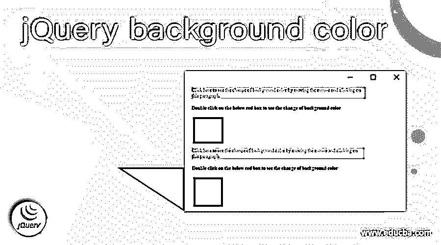
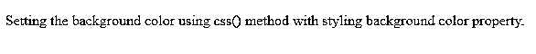
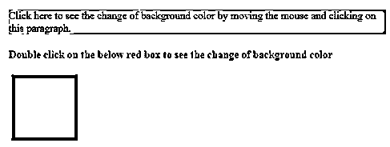
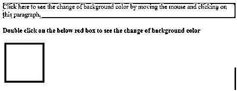
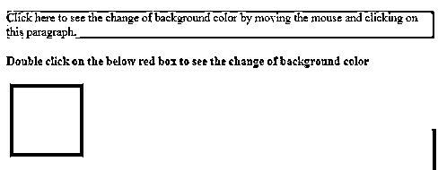

# jQuery 背景颜色

> 原文：<https://www.educba.com/jquery-background-color/>




## jQuery 背景色介绍

在 jquery 中，设置背景色或更改背景色是使用 jquery 提供的 CSS()方法的属性来完成的，因此我们可以在 CSS()方法中定义这个背景色属性。它用于设置背景颜色，或者将颜色添加到 CSS()方法中指定的背景中。通常，在 jQuery 中，背景色被定义为任何设计广告的页面的样式属性。这是通过使用 CSS()方法完成的，在该方法中，背景色属性与指定的值一起定义，并且该方法还有许多其他样式属性。

### 在 jquery 中设置背景颜色

在本文中，我们将讨论如何使用 jquery 设置任何网页的背景颜色。在 Jquery 中，设置背景色，它被认为是 CSS()方法的样式属性。一般来说，我们可以说，当我们处理 CSS 时，我们很容易设置背景颜色，这是用于设置网页背景颜色的样式属性。因此，在 jquery 中，我们也认为它本身是一个 CSS 属性，但是这个属性可以在 CSS()方法中使用，我们可以定义多个 CSS 属性来使用 jquery 设计 web 页面的样式。这个 CSS 属性可以用来设置网页中任何元素的背景颜色，比如段落、文本、文本区域等等。这个 CSS()方法将 CSS 样式属性作为参数来更改或设置当前网页的任何样式属性。

<small>网页开发、编程语言、软件测试&其他</small>

现在让我们在下面的小节中看看使用 jquery 设置背景颜色的语法和例子。

**语法:**

```
css("styling_property_name", "value");
```

**参数:**

*   Styling_property_name: CSS 是 jquery 中的一个方法，它可以使用上面称为 Styling_property_name 的参数设置背景属性作为“background-color”。
*   Value:该参数用于设置样式属性 background-color 的值，例如该属性的值可以是 RGB 颜色，例如颜色的十六进制值或颜色的名称。

jquery 的这个函数用于设置当前网页或网页上任何元素的背景颜色。因此，该方法将返回所选元素的样式属性。

现在，我们将在下一节看到一个如何在 jquery 中使用 CSS()方法设置背景颜色的示例。

### 例子

让我们讨论 jQuery 背景色的例子。

#### 示例#1

在下面的例子中，我们将背景颜色设置为蓝色。

**代码:**

```
<!DOCTYPE html>
<html>
<head>
<script src="//code.jquery.com/jquery-1.11.1.min.js"></script>
<meta charset="utf-8">
<title> Demonstration of setting background color in jquery </title>
</head>
<body>
<p> Setting the background color using css() method with styling background color property. </p>
<script>
$(document.body).css( "background", "blue" );
</script>
</body>
</html>
```

**输出:**




在上面的程序中，我们可以看到我们正在 HTML 结构中编写 jquery 代码，jquery 代码片段可以在标签的

现在我们将看到以另一种方式使用此样式属性设置鼠标功能背景颜色的另一个示例。

#### 实施例 2

**代码:**

```
<!DOCTYPE html>
<html>
<head>
<title> Demonstration of background color in jquery for web elements </title>
<script src="https://ajax.googleapis.com/ajax/libs/jquery/3.2.1/jquery.min.js"></script>
<style>
div {
width: 100px;
height: 100px;
margin: 5px;
}
</style>
<script>
$(document).ready(function(){
$("p").on({
mouseleave: function(){
$(this).css("background-color", "cyan");
},
click: function(){
$(this).css("background-color", "orange");
}
});
$( "div" ).dblclick(function() {
var color = $( this ).css( "background-color", "blue" );
});
});
</script>
</head>
<body>
<p> Click here to see the change of background color by moving the mouse and clicking on this paragraph. </p>
<h4> Double click on the below red box to see the change of background color </h4>
<div style="background-color:red;"> </div>
</body>
</html>
```

**输出:**










在上面的程序中，我们可以看到我们在一些鼠标功能上使用了背景色作为样式属性，正如我们在上面的代码中可以看到的，当我们将鼠标悬停在某个段落上并离开它时，该段落的背景色会变为“青色”，当我们只在该段落上单击一次时，该段落的背景色会变为“橙色”。我们可以通过在 CSS()方法中设置“背景色”属性来看到这些变化，鼠标的每个功能都写在文档中。ready()，我们在这里为鼠标事件发生和背景颜色改变的函数准备文档。同样，我们也创建了一个红色的框，当我们双击这个框时，这个框的背景色也变成了蓝色。在上面的截图中，我们可以看到，在第一个截图中，我们看到该段落变为青色；在第二个截图中，我们可以看到，在单击该段落后，该段落变为橙色；在第三个截图中，双击该框，该框的背景色变为蓝色。

### 结论

在本文中，我们得出结论，在 jquery 中设置任何元素或网页的背景颜色都非常简单，就像在 CSS 中一样。这个背景色是一个样式属性，在 jquery 提供的 CSS()方法中定义和声明。在本文中，我们看到了一个设置背景颜色的简单示例，然后在另一个示例中，我们看到了如何设置背景颜色或使用正确的屏幕截图更改鼠标单击事件的背景颜色。

### 推荐文章

这是一个 jQuery 背景色的指南。这里我们也讨论一下 jQuery 中的简介和如何设置背景色？以及不同的示例及其代码实现。您也可以看看以下文章，了解更多信息–

1.  [jQuery 宽度](https://www.educba.com/jquery-width/)
2.  [jQuery 当](https://www.educba.com/jquery-when/)
3.  [jQuery 承诺](https://www.educba.com/jquery-promise/)
4.  [jQuery 修剪](https://www.educba.com/jquery-trim/)


