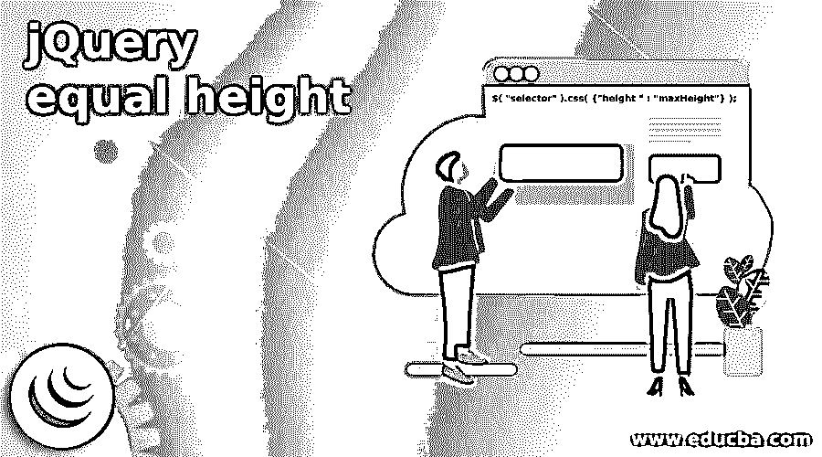
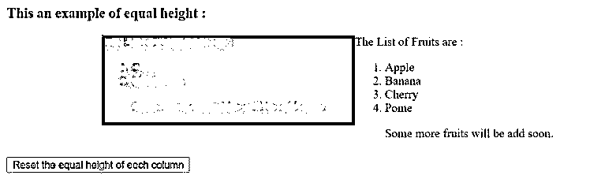
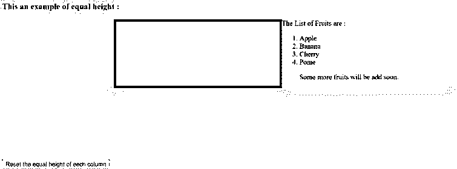

# jQuery 等高

> 原文：<https://www.educba.com/jquery-equal-height/>




## jQuery 等高简介

jQuery equal height 用于使父容器的所有子元素高度相等。它是 jQuery 中 HTML 元素的内置属性。假设我们有一个或多个块或元素将内容放在平行的列中，为了保持所有选定元素的高度完全相等，我们可以使用相等的高度。通过使用 HTML、CSS 和 JavaScripts，我们可以创建等高的列元素。我们可以在一列或多列中添加任意多的内容，但每列的高度将根据最高高度而定。

**语法:**

<small>网页开发、编程语言、软件测试&其他</small>

```
$( "selector" ).css( {"height " : "maxHeight"} );
```

在哪里，

*   **CSS():**CSS()函数用于设置或获取所选元素的一个或多个属性。
*   **height:**height 是所选元素的属性，由 maxHeight 值设置。
*   **maxHeight:**maxHeight 是为每列设置相等高度的最大高度值。

### 工作

*   jQuery equal height 将父容器的所有子元素的高度设置为相等。
*   假设我们有几个 div 元素的子元素列表，它们的高度应该相等。
*   所以我们可以用等高作为“$(“div class”)。CSS({ " height ":70 })；"，其中 css()函数设置所有选定元素的属性，因为这里的属性是 height，它设置所有选定元素的相等高度，因此所有列的相等高度都设置为 70。

### jQuery 等高示例

下面是提到的例子:

#### 示例#1

jQuery equal height 为 div 元素设置所有选定元素的相等高度的示例。

**代码:**

```
<!doctype html>
<html lang = "en">
<head>
<meta charset = "utf-8">
<title> This is an example for jQuery equal height function </title>
<script src = "https://code.jquery.com/jquery-3.5.0.js"> </script>
<style>
.container
{
width: 80%;
margin: 0 auto;
}
.col-container:after
{
content: "";
display: block;
clear: both;
}
.col
{
float: left;
width: 33.3%;
}
.c1
{
background-color: #FF0000;
}
.c2
{
background-color: #FFFF00;
}
.c3
{
background-color: #FF00FF;
}
</style>
</head>
<body>
<div class = "container">
<h3> This an example of equal height function: </h3>
<div class = "col c1">
This is a small block of div to test jQuery equal height function.
</div>
<div class = "col c2">
This is a intermediate block of div to test jQuery equal height function.
This is a intermediate block of div to test jQuery equal height function.
</div>
<div class = "col c3">
This is a big block of div to test jQuery equal height function.
This is a big block of div to test jQuery equal height function.
This is a big block of div to test jQuery equal height function.
</div>
</div>
<script>
$(document).ready(function () {
// set the all columns to the height of the tallest column by using a function
var equalHeight = function () {
//  the height of each column is reset to default calculated by browser
$('.col').css('height', 'auto');
var maxHeight = 0;
// get the maximum height
$('.col').each(function () {
if ($(this).height() > maxHeight) {
maxHeight = $(this).height();
}
});
// the maximum height is set to each height of column
$('.col').css('height', maxHeight);
};
//  equal height set on page load
equalHeight();
// equal height set when the container of these columns is resized
$('.container').resize(function () {
equalHeight();
});
});
</script>
</body>
</html>
```

**输出:**


在上面的代码中，div 元素与一些子元素一起使用。接下来，首先设置每个列的默认高度，然后找到列的最大高度，然后将最大高度设置为 div 元素的每个元素的相同高度$('。列)。css('height '，max height)；“，通过使用 div 类。结果，所有列的相等高度被设置为最大高度，正如我们在上面的输出中看到的。

#### 实施例 2

使用 flexbox 为 div 元素设置所有选定元素的相等高度的 jQuery equal height 示例。

**代码:**

```
<!doctype html>
<html lang = "en">
<head>
<meta charset = "utf-8">
<title> This is an example for jQuery equal height function </title>
<script src = "https://code.jquery.com/jquery-3.5.0.js"> </script>
<style>
.container
{
width: 80%;
margin: 0 auto;
}
.col
{
float: left;
width: 33.3%;
}
.c1
{
background-color: #FF0000;
}
.c2
{
background-color: #FFFF00;
}
</style>
</head>
<body>
<script>
function disp()
{
// the maximum height is set to each height of column
$( ".container" ).css({
"display" : "flex",
"width" : "60%"
});
$( ".col" ).css({
"flex"  : "1"
});
}
</script>
</head>
<body>
<h3> This an example of equal height : </h3>
<div class="container">
<div class = "col c1"> The List of Vegetables are :
<ol>
<li> Corn </li>
<li> Mushroom </li>
<p> Some more vegetables will be add soon. </p>
</ol>
</div>
<div class = "col c2"> The List of Fruits are :
<ol>
<li> Apple </li>
<li> Banana </li>
<li> Cherry </li>
<li> Pome  </li>
<p> Some more fruits will be add soon. </p>
</ol>
</div>
</div>
<br><br><br>
<br><br><br>
<br><br><br>
<button onclick = "disp()"> Reset the equal height of eech column </button>
</body>
</html>
```

**输出:**




**一旦我们点击按钮，输出是:**




在上面的代码中，div 元素与一些元素列表一起使用。接下来，当我们单击按钮时，css()函数使用 flexbox 为 div 元素的每个元素设置相等的高度。因此，所有列的高度都是相等的，正如我们在上面的输出中看到的。

### 结论

jQuery equal height 用于通过使用 CSS 函数使父容器的所有子元素高度完全相等。

### 推荐文章

这是一个 jQuery 等高指南。这里我们分别讨论 jQuery 等高的介绍、工作原理和实例。您也可以看看以下文章，了解更多信息–

1.  [jQuery 选择选项](https://www.educba.com/jquery-select-option/)
2.  [jQuery zindex](https://www.educba.com/jquery-zindex/)
3.  [jQuery 宽度](https://www.educba.com/jquery-width/)
4.  [jQuery id 选择器](https://www.educba.com/jquery-id-selector/)


