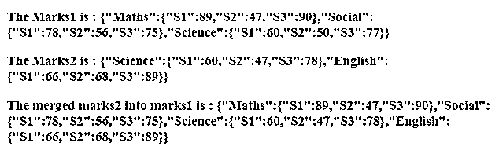
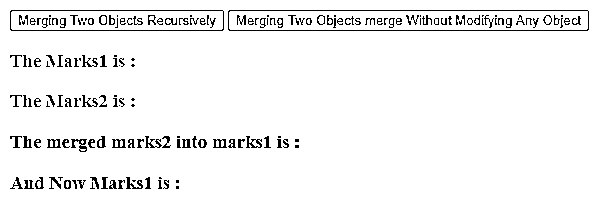
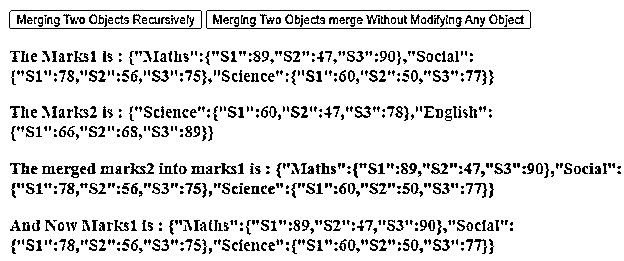

# jQuery 扩展

> 原文：<https://www.educba.com/jquery-extend/>


## jQuery 扩展简介

jQuery extend()方法用于将两个或更多对象的内容合并到第一个对象中。jQuery extend()方法是一个内置方法。有时我们需要将两个或多个对象的内容合并成单个对象或目标对象本身，所以 jQuery 为此提供了 extend()方法，总是第一个对象就是这里的目标对象。

**语法:**

<small>网页开发、编程语言、软件测试&其他</small>

```
jQuery.extend( [ deep ], target, object1 [, object N ] );
```

**参数:**

*   **deep**–这是一个可选的布尔类型参数，指定对于真值的合并变成递归。它不支持假值。
*   **target**–这是通过扩展一个或多个附加传递对象的新属性来扩展的第一个对象。
*   **对象 1–**这是一个附加对象，其属性将扩展到第一个对象中。
*   对象 N–这是第 N 个附加对象，其属性将扩展到第一个对象中。
*   **返回值**–该方法的返回值是一个扩展或合并的对象。

**注意:**在 extend()方法中，空的或未定义的参数被忽略。如果只有一个参数被传递给 extend()方法，那么目标对象被省略，jQuery 对象本身被视为目标，这样我们就可以向 jQuery 名称空间添加新函数。现在我们知道第一个参数或目标对象是由 extend()方法修改并返回的，但如果我们不想修改原始对象，那么我们可以将空对象作为目标对象传递，例如作为" $。扩展({}，dict1，dict2)”。

### jQuery extend()方法的工作原理

extend()方法接受两个或多个对象作为参数，接受的对象首先根据它们的属性进行合并，然后将合并结果存储到第一个对象中。extend()方法总是将第一个对象作为目标对象。

### jQuery extend()方法的示例

将 object2 合并到 object1 的 jQuery extend()方法示例。接下来，我们编写 HTML 代码，通过下面的示例更清楚地理解 jQuery extend()方法，其中 extend()方法用于将 Marks2 合并到 Marks1，如下所示

#### 示例#1

**代码:**

```
<!doctype html>
<html lang = "en">
<head>
<meta charset="utf-8">
<title> This is an example for jQuery extend() method </title>
<script src = "https://ajax.googleapis.com/ajax/libs/jquery/3.3.1/jquery.min.js">
</script>
</head>
<body>
<h3 id = "m1" style = "color: red" > <b> The Marks1 is : </b> </h3>
<h3 id = "m2" style = "color: red"> <b> The Marks2 is : </b> </h3>
<h3 id = "m3" style = "color: green"> <b> The merged marks2 into marks1 is : </b> </h3>
<script>
var marks1 = {
Maths: { S1 : 89, S2: 47, S3:90 },
Social: { S1 : 78, S2: 56, S3:75 },
Science: { S1 : 60, S2: 50, S3:77}
};
var marks2 = {
Science: { S1 : 60, S2: 47, S3:78 },
English: { S1 : 66, S2: 68, S3:89 }
};
$( "#m1" ).append( JSON.stringify( marks1 ));
$( "#m2" ).append( JSON.stringify( marks2 ));
//merge marks2 into marks1
$.extend( marks1, marks2 );
// if JSON.stringify not available in IE<8
$( "#m3" ).append( JSON.stringify( marks1 ));
</script>
</body>
</html>
```

**输出:**




与上面的程序一样，为科目创建了两个对象 Marks1 和 Marks2，它们各自的科目中有一些学生的分数。接下来，在程序中，通过使用 extend()方法，将两个分数合并并存储到 marks1 中，我们可以在输出中看到，对于同一科目的同一个学生，分数是从附加对象 marks2 更新的。

jQuery extend()方法示例，用于将 object2 递归合并到 object1 中，并在不修改 object1 的情况下合并 object1 和 object2

接下来，我们编写 HTML 代码来理解 jQuery extend()方法，其中 extend()方法用于递归地将标记 2 合并到标记 1 中，而不修改标记 1，如下所示

#### 实施例 2

**代码:**

```
<!doctype html>
<html lang = "en">
<head>
<meta charset="utf-8">
<title> This is an example for jQuery extend() method </title>
<script src = "https://ajax.googleapis.com/ajax/libs/jquery/3.3.1/jquery.min.js">
</script>
</head>
<body>
<button id= "btn1"> Merging Two Objects Recursively </button>
<button id= "btn2"> Merging Two Objects merge Without Modifying Any Object </button>
<h3 id = "m1" style = "color: red" > <b> The Marks1 is : </b> </h3>
<h3 id = "m2" style = "color: red"> <b> The Marks2 is : </b> </h3>
<h3 id = "m3" style = "color: green"> <b> The merged marks2 into marks1 is : </b></b></b></h3>
<h3 id = "m4" style = "color: blue" > <b> And Now Marks1 is : </b> </h3>
<script>
$(document).ready(function(){
$("#btn1").click(function(){
var marks1 = {
Maths: { S1 : 89,  S3:90 },
Social: { S1 : 78, S2: 56, S3:75 },
Science: { S1 : 60, S3:77}
};
var marks2 = {
Science: { S1 : 60, S2: 47, s4: 67 },
English: { S1 : 66,  S3:89 }
};
$( "#m1" ).append( JSON.stringify( marks1 ));
$( "#m2" ).append( JSON.stringify( marks2 ));
//merge marks2 into marks1
$.extend( true, marks1, marks2 );
// if JSON.stringify not available in IE<8
$( "#m3" ).append( JSON.stringify( marks1 ));
$( "#m4" ).append( JSON.stringify( marks1 ));
});
});
</script>
<script>
$(document).ready(function(){
$("#btn2").click(function(){
var marks1 = {
Maths: { S1 : 89, S2: 47, S3:90 },
Social: { S1 : 78, S2: 56, S3:75 },
Science: { S1 : 60, S2: 50, S3:77}
};
var marks2 = {
Science: { S1 : 60, S2: 47, S3:78 },
English: { S1 : 66, S2: 68, S3:89 }
};
$( "#m1" ).append( JSON.stringify( marks1 ));
$( "#m2" ).append( JSON.stringify( marks2 ));
//merge marks2 into marks1
$.extend( {}, marks1, marks2 );
// if JSON.stringify not available in IE<8
$( "#m3" ).append( JSON.stringify( marks1 ));
$( "#m4" ).append( JSON.stringify( marks1 ));
});
});
</script>
</body>
</html>
```

**输出:**

一旦我们点击“递归合并两个对象”按钮，输出是:




刷新并点击"合并两个对象合并而不修改任何对象"按钮，输出是:




与上面的程序一样，为科目创建了两个对象 Marks1 和 Marks2，它们各自的科目中有一些学生的分数。接下来在程序中通过点击“递归合并两个对象”按钮来递归合并标记 1 和标记 2，并且通过点击“合并两个对象合并不修改任何对象”按钮来合并标记 1 和标记 2。

### 结论

jQuery extend()方法是 jQuery 中的内置方法，用于将两个或多个对象合并到第一个对象中。

### 推荐文章

这是一个 jQuery 扩展指南。在这里，我们还将讨论 jQuery extend()方法的描述和工作方式，以及不同的示例和代码实现。您也可以看看以下文章，了解更多信息–

1.  [jQuery 查找子节点](https://www.educba.com/jquery-find-child/)
2.  [jQuery UI 可删除](https://www.educba.com/jquery-ui-droppable/)
3.  [jQuery id 选择器](https://www.educba.com/jquery-id-selector/)
4.  [JQuery attr()](https://www.educba.com/jquery-attr/)


