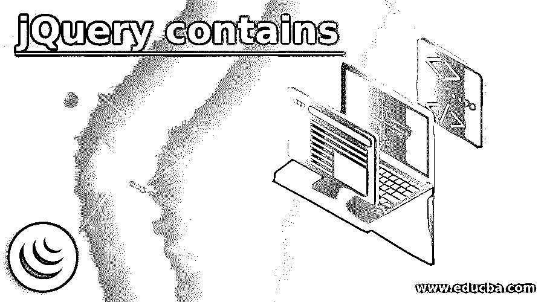
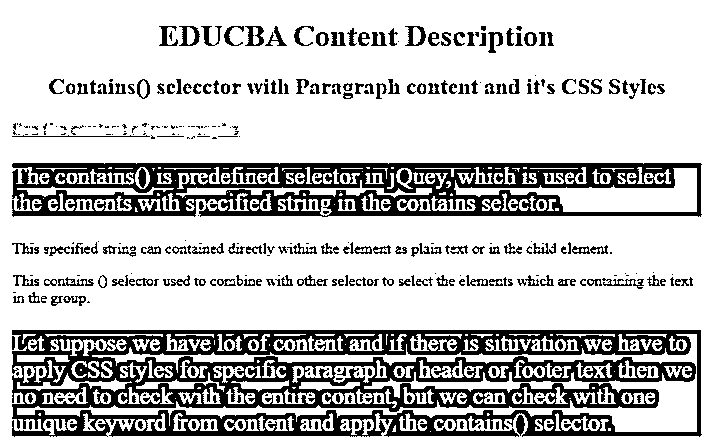
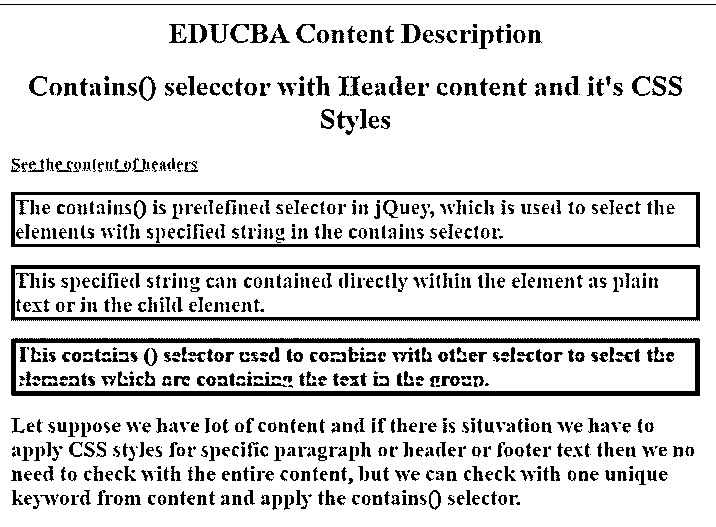
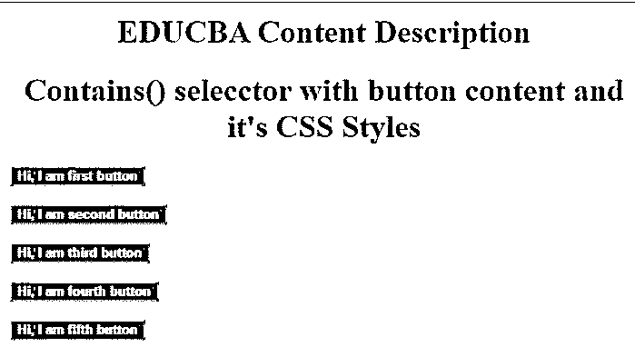

# jQuery 包含

> 原文：<https://www.educba.com/jquery-contains/>




## jQuery 容器简介

contains()是 jQuery 中预定义的选择器，用于在 contains 选择器中选择具有指定字符串的元素。这个指定的字符串以纯文本形式直接包含在元素中，或者包含在子元素中。这个 contains()选择器用于与其他选择器组合来选择包含组中文本的元素。

**Note:** The text inside the contains selector is case sensitive.

**实时示例:**假设我们有很多内容，如果我们必须对特定段落或页眉或页脚文本应用 CSS 样式，那么我们不需要检查整个内容，但我们可以从内容中选择一个唯一的关键字并应用 contains()选择器。我们可以只检查单个字符串并应用 CSS 样式，而不是检查所有内容并应用样式。

<small>网页开发、编程语言、软件测试&其他</small>

### jQuery 中的 contains()选择器是如何工作的？

JQuery 包含()选择器，可以应用于段落内容、页眉内容、页脚内容等。对内容应用任何所需的样式。

**语法:**

```
$(":contains(text)").css("apply styles here");
```

**语法解释:**

*   **接受的参数:**这个 contains()选择器只允许选择器中的单个参数，这是查找文本和应用所需样式所必需的。
*   **返回值:**如果 contains()选择器中的指定文本可用，那么它返回真布尔值并应用样式。如果 contains()选择器中没有指定的文本，那么它将返回 false 布尔值，并且不能应用样式。

注意:要使 jQuery 应用程序正常工作，我们必须将这个脚本导入 html 文件中

### 例子

下面是一些例子:

#### 示例#1

如果段落内容包含给定的单词，则对其应用 CSS 样式。

**代码:**

```
<!DOCTYPE html>
<html>
<head>
<title>jQuery :contains() Selector</title>
<!--imprting jQuery library-->
<script src=
"https://ajax.googleapis.com/ajax/libs/jquery/3.3.1/jquery.min.js">
</script>
<!--CSS Styles-->
<style>
h1,h2{
text-align:center
}
h1
{
color:blue;
}
h2
{
color:maroon;
}
h3
{
color:lightblue;
text-decoration: underline;
}
</style>
</head>
<body>
<h1 id="geeks1" style = "color:green;">EDUCBA Content Description</h1>
<h2 id="geeks2">Contains() selecctor with Paragraph content and it's CSS Styles</h2>
<h3>See the content of paragraphs</h3>
<div id="choose">
<p>The contains() is predefined selector in jQuey, which is used to select the elements with specified string in the contains selector.</p>
<p> This specified string can contained directly within the element as plain text or in the child element. </p>
<p>This contains () selector used to combine with other selector to select the elements which are containing the text in the group. </p>
<p>Let suppose we have lot of content and if there is situvation we have to apply CSS styles for specific paragraph or header or footer text then we no need to check with the entire content, but we can check with one unique keyword from content and apply the contains() selector. </p>
</div>
<!-- jQuery logic-->
<script>
$(document).ready(function(){ //performs ready action
$("p:contains(predefined)").css("background-color", "navy"); //apply background color to paragraph if it contains predefined
$("p:contains(predefined)").css("font-size", "25px"); //apply font-size to paragraph if it contains predefined
$("p:contains(predefined)").css("color","white"); //apply color to paragraph if it contains predefined
$("p:contains(suppose)").css("background-color", "blue");//apply background color to paragraph if it contains suppose
$("p:contains(suppose)").css("color","white"); //apply color to paragraph if it contains suppose
$("p:contains(suppose)").css("font-size", "25px"); //apply font size to paragraph if it contains suppose
});
</script>
</body>
</html>
```

**输出:**




**说明:**

*   正如您在上面的段落中看到的，如果在 contains 选择器中找到提供的单词，则应用 CSS 样式，如背景颜色、字体大小和文本颜色属性，而段落的其余部分不应用任何 CSS 样式。

#### 实施例 2

如果段落内容包含给定的单词，则对其应用 CSS 样式。

**代码:**

```
<!DOCTYPE html>
<html>
<head>
<title>jQuery :contains() Selector</title>
<!--imprting jQuery library-->
<script src=
"https://ajax.googleapis.com/ajax/libs/jquery/3.3.1/jquery.min.js">
</script>
<!--CSS Styles-->
<style>
h1{
text-align:center;
color:blue;
}
h3
{
color: green;
text-decoration: underline;
}
</style>
</head>
<body>
<h1 >EDUCBA Content Description</h1>
<h1 >Contains() selecctor with Header content and it's CSS Styles</h2>
<h3>See the content of headers</h3>
<div>
<h2>The contains() is predefined selector in jQuey, which is used to select the elements with specified string in the contains selector.</h2>
<h2> This specified string can contained directly within the element as plain text or in the child element. </h2>
<h2>This contains () selector used to combine with other selector to select the elements which are containing the text in the group. </h2>
<h2>Let suppose we have lot of content and if there is situation we have to apply CSS styles for specific paragraph or header or footer text then we no need to check with the entire content, but we can check with one unique keyword from content and apply the contains() selector. </h2>
</div>
<!-- jQuery logic-->
<script>
$(document).ready(function(){ //performs ready action
$("h2:contains(predefined)").css("border-style", "solid"); //apply border style to the header if it contains predefined
$("h2:contains(predefined)").css("border-color", "maroon"); //apply border color to the header if it contains predefined
$("h2:contains(predefined)").css("border-width","3px"); //apply border width to the header if it contains predefined
$("h2:contains(predefined)").css("color","green");//applytext color to the header if it contains predefined
$("h2:contains(specified)").css("border-style", "solid"); //apply border style to the header if it contains specified
$("h2:contains(specified)").css("border-color", "brown"); //apply border color to the header if it contains specified
$("h2:contains(specified)").css("border-width","4px"); //apply border width to the header if it contains specified
$("h2:contains(specified)").css("color","red");//applytext color to the header if it contains specified
$("h2:contains(group)").css("border-style", "solid"); //apply border style to the header if it contains group
$("h2:contains(group)").css("border-color", "navy"); //apply border color to the header if it contains group
$("h2:contains(group)").css("border-width","5px"); //apply border width to the header if it contains group
$("h2:contains(group)").css("color","orange");//applytext color to the header if it contains group
//does not apply CSS styles because it does not contains hello property in the any header tags
$("h2:contains(hello)").css("border-style", "solid");
$("h2:contains(hello)").css("border-color", "navy");
$("h2:contains(hello)").css("border-width","5px");
$("h2:contains(hello)").css("color","orange");
});
</script>
</body>
</html>
```

**输出:**




#### 实施例 3

如果段落内容包含给定的单词，则对其应用 CSS 样式。

**代码:**

```
<!DOCTYPE html>
<html>
<head>
<title>jQuery :contains() Selector</title>
<!--imprting jQuery library-->
<script src=
"https://ajax.googleapis.com/ajax/libs/jquery/3.3.1/jquery.min.js">
</script>
<!--CSS Styles-->
<style>
h1{
text-align:center;
color:brown;
}
</style>
</head>
<body>
<h1 >EDUCBA Content Description</h1>
<h1 >Contains() selecctor with button content and it's CSS Styles</h2>
<div>
<button>Hi, I am first button</button>
<br>
<br>
<button>Hi, I am second button</button>
<br>
<br>
<button>Hi, I am third button</button>
<br>
<br>
<button>Hi, I am fourth button</button>
<br>
<br>
<button>Hi, I am fifth button</button>
</div>
<!-- jQuery logic-->
<script>
$(document).ready(function(){ //performs ready action
$("button:contains(button)").css("color","white");//apply text color to the button if it contains button keyword
$("button:contains(button)").css("background-color","red");//apply background color to the button if it contains button keyword
$("button:contains(button)").css("font-weight","bold");//apply fnt weight to the button if it contains button keyword
});
</script>
</body>
**</html>**
```

**输出:**




### 结论

jQuery contains()选择器首先搜索提供的单词或句子，如果有任何要应用的 CSS 样式，则应用它。如果没有找到单词或句子，则不会应用任何 CSS 样式。jQuery contains()选择器内容区分大小写。

### 推荐文章

这是一个 jQuery 包含的指南。为了更好地理解，我们在这里讨论 jQuery contains 的介绍和相应的例子。您也可以看看以下文章，了解更多信息–

1.  [JQuery 最近的](https://www.educba.com/jquery-closest/)
2.  [jQuery 过滤器](https://www.educba.com/jquery-filter/)
3.  [jQuery Tooltip](https://www.educba.com/jquery-tooltip/)


