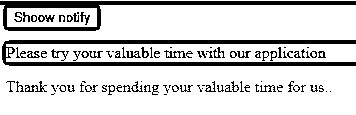
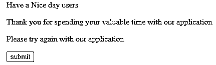

# jQuery 通知

> 原文：<https://www.educba.com/jquery-notify/>


## jQuery 通知简介

jQuery notify 是一个插件，可以用来为用户提供可定制的通知，它显示为网站的消息提示。它为通知框提供了一组独特的机会，还提供了一些平滑和轻量级的淡入淡出效果；它是一个可压缩的用户屏幕通知插件，它有无数的选项，那就是我们正在从我们这边接收“n”个弹出通知。通知警报可以是任何形状和大小，只要我们需要它，它就会出现在 UI 元素中，比如表单和动作场景。

**语法:**

<small>网页开发、编程语言、软件测试&其他</small>

jQuery 库中有许多默认的方法、特性和插件，可以从用户端与基于 web 的应用程序进行交互。在通知器中有一个插件方法，用于接收来自用户端通知以及执行该任务的一些应用程序逻辑。

```
<html>
<head>
<script src="https://code.jquery.com/jquery-3.5.0.js">
$(document).ready(function()
{
Notify("");
----some jquery based codes depends upon the requirement---
});
</script>
</head>
<body>
---some html UI elements depends upon the requirement---
</body></html>
```

以上代码是带有 jQuery 库功能的基本 HTML，带有 Notify()插件模块。这将有助于处理来自 UI 浏览器的用户通知。

### jQuery 中的 notify 是如何工作的？

jQuery 通知消息插件是警告框消息特性之一，它为整个应用程序提供了相同数量的机会。当我们添加或加载字体、附加库、启用/禁用应用程序中的某些功能时，我们会收到来自应用程序的通知警报。我们也可以用一组不同的参数来传递 notify(args)方法，我们需要用这些参数来添加这个特性和库。它也位于级联样式表下通知样式的引导选项下；的美元。notify()还设置网页上的文本或字体位置，如果是水平和垂直对齐，则根据用户端要求的设置，顶部、中间、底部和左侧、右侧和中心位置也是自定义设置，因此每当我们想从通知框中更改任何其他对齐方式的位置时，我们都应该这样做，以便重新出现。notify()将与带有不同参数区域(如$)的各种位置一起使用。notify(字符串、对象、选项)；我们还通过使用 addStyle()方法添加了其他样式，该方法用于 css 属性，它接收到添加了新样式的通知。默认对齐和设置是在框的全局和元素级别位置上定义的。

### jQuery 通知示例

以下是 jQuery notify 的不同示例:

#### 示例#1

```
<!DOCTYPE html>
<html>
<head>
<meta name="viewport" content="width=device-width, initial-scale=3">
<style>
body {
font-family: Arial, TimesNewRoman, Helvetica, sans-serif;
}
.first {
background-color: blue;
color: green;
text-decoration: none;
padding: 23px 33px;
position: center;
display: inline-block;
border-radius: 5px;
}
.demo1 {
background: violet;
}
.demo {
position: center;
top: -23px;
right: -23px;
padding: 7px 13px;
border-radius: 47%;
background-color: pink;
color: yellow;
}
</style>
<script src="https://code.jquery.com/jquery-3.5.0.js">
</script>
</head>
<body>
<script type="text/javascript">
var eg = {
isSupported:function() {
return (window.webkitNotifications != 'undefined')
},
requestPermission:function(argss) {
window.webkitNotifications.requestPermission(function() {
if (typeof(argss) == "welcome") {
argss(window.webkitNotifications.checkPermission() == 1);
}
});
},
doNotify:function(eg1,eg2,eg3,eg4,eg5,eg6,eg7) {
if (window.webkitNotifications.checkPermission() == 1) {
window.webkitNotifications.createNotification(eg1, eg2, eg3, eg4, eg5, eg6, eg7).show();
return true;
}
return false;
}
}
$(document).ready(function() {
$("#sendingnotification").click(function() {
eg.requestPermission();
alert("your notification is sent successfully");
});
$("#notification").ready(function() {
if (!eg.doNotify("http://www.google.com",
"Welcome to My Domain it’s a first example for notification jQuery",
"Have a Nice day users please keep and continue your inputs to our application")) {
alert('Thank you for spending your valuable time to our application your request is sent to our server it will be validated and get back to you with the response keep on continue your valuable time for us');
}
});
});
</script>
<h1>Your Notifications are shown on the below ...</h1>
<a href="#" class="first">
Please click me 
 7
</a>
<a href="#sendingnotification" id="sendingnotification">sendingnotification</a>
<a href="#notification" id="notification">notification</a>
</body>
</html>
```

**输出:**


在上面的例子中，我们使用了一些来自 html 和 jQuery 插件的基本通知。我们使用特定的 jQuery 方法，如 alert()，并使用 

#### 实施例 2

```
<html>
<head>
<title>Welcome To My Domain its a Second Example regarding jQuery notify() method and plugin for the web application</title>
<script src="http://ajax.googleapis.com/ajax/libs/jquery/1.11.1/jquery.min.js"></script>
<script src="notify.min.js">
onclick="$(".demo").notify("Have a Nice Day users");"
onclick="$('.demo').notify('Have a Nice Day users');"
</script>
</head>
<body style="background-color:green">
<input name="notify" class="first" type="button" value="Shoow notify" onclick="$('.demo').notify('Have a Nice Day users');"/>
<p style="background-color:violet">
Please try your valuable time with our application</p>
<div class="demo">Thank you for spending your valuable time for us..</div>
</body>
</html>
```

**输出:**




在第二个例子中，我们在脚本中使用了 notify.js。我们在点击按钮后使用了一个警告，基于这个通知，我们从用户端发送的特定请求中得到结果。

#### 实施例 3

```
<!DOCTYPE html>
<html>
<head>
<title>Welcome To My Domain its a third example for jQuery notify() plugin and methods</title>
<link type="text/css" rel="Stylesheet" href="jqwidgets/styles/jqx.base.css" />
<script type="text/javascript" src="http://ajax.googleapis.com/ajax/libs/jquery/1.11.1/jquery.min.js"></script>
<script type="text/javascript" src="jqwidgets/jqxcore.js"></script>
<script type="text/javascript" src="jqwidgets/jqxnotification.js"></script>
<script type="text/javascript">
$(document).ready(function () {
$("#demo").jqxNotification({ width: "auto", position: "center",
opacity: 1.3, autoOpen: true, autoClose: false, template: "info"
});
});
function demo() {
alert ("Thank you for spending the time with our application we will get back to you after registering your details with us");
}
</script>
</head>
<body>
<div id="demo">
Have a Nice day users
<p>Thank you for spending your valuable time with our application</p>
<p> Please try again with our application </p>
<form>
<input type = "button" value = "submit" onclick = "demo();" />
</form>
</div>
</body>
</html>
```

**输出:**




在最后一个示例中，我们使用了 jqxNotification.js 和 jqxcore.js 等 jQuery notify 插件。我们从所需的 jQuery Widgets 网站下载了这两个 js 文件，并利用了应用程序中的这些通知。就像这样，有许多通知插件和部件，我们将根据他们的需求来利用它。

### 结论

我们在 jQuery 库中使用了一组不同的插件来安装和使用基于 web 的应用程序。必需的。js 文件将从 jQuery 小部件的官方链接下载，我们从脚本中使用它。它支持所有类型的浏览器版本，所以它兼容所有版本。

### 推荐文章

这是一个 jQuery 通知指南。这里我们讨论 jQuery 中的通知的定义、语法和工作原理。和示例。您也可以看看以下文章，了解更多信息–

1.  [jQuery 选择值](https://www.educba.com/jquery-select-value/)
2.  [jQuery 可见性](https://www.educba.com/jquery-visibility/)
3.  [jQuery removeClass()](https://www.educba.com/jquery-removeclass/)
4.  [jQuery 延期](https://www.educba.com/jquery-deferred/)


