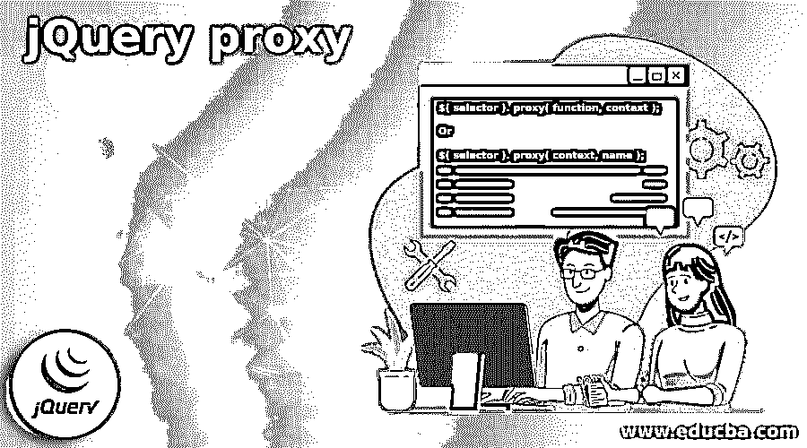
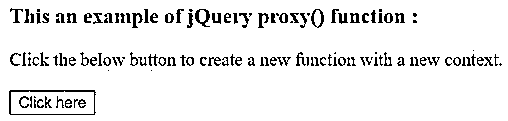
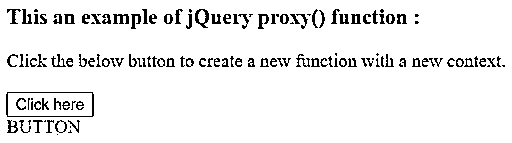
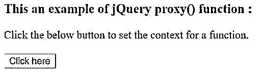
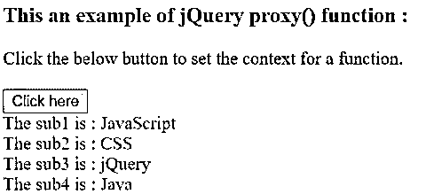
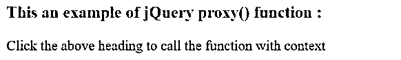
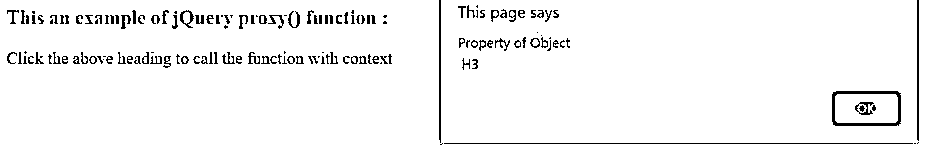

# jQuery 代理

> 原文：<https://www.educba.com/jquery-proxy/>




## jQuery 代理简介

jQuery proxy()函数接受一个现有的函数，并返回一个带有特定上下文的新函数。这个函数是 jQuery 中的内置函数。它主要用于将事件处理程序附加到上下文指向不同对象的事件上，并且如果我们绑定从 jQuery proxy()函数返回的函数，jQuery 会确保如果原始函数通过，它仍会解除绑定正确的函数。

### jQuery 代理()函数的语法

下面给出了提到的语法:

<small>网页开发、编程语言、软件测试&其他</small>

```
$( selector ). proxy( function, context );
```

或者

```
$( selector ). proxy( context, name );
```

**参数:**

*   **函数:**这不是可选参数。它指定其上下文将被更改的现有函数名。
*   **上下文:**这不是可选参数。它指定应该更改其函数上下文的对象名。
*   **名称:**这不是可选参数。它指定其上下文将被改变的函数名，该函数名应该是上下文对象的一个属性。

**返回值:**

函数的返回值是一个具有指定上下文的新函数。

### 工作

*   jQuery proxy()函数接受两个参数，第一个参数是函数的名称，第二个参数是函数的上下文。
*   假设我们有一个现有的函数 myFun()，我们希望设置或更改它的上下文。
*   所以我们可以用 jQuery proxy()函数作为“$(”按钮)。单击($。proxy(myFun，this))；"，其中 button 是作为上下文传递给 myFun()函数的选择器元素。
*   按钮选择器将根据需求在 myFun()函数中使用。

### jQuery 代理的例子

下面是提到的例子:

#### 示例#1

jQuery proxy()函数的示例，其中函数名和上下文作为参数传递。

**代码:**

```
<!doctype html>
<html lang = "en">
<head>
<meta charset = "utf-8">
<script src = "https://code.jquery.com/jquery-3.5.0.js"></script>
<title> This is an example for jQuery proxy() function </title>
<style>
.rdmore .moretext{
display: none;
}
</style>
<script>
$(document).ready(function() {
myFun = function() {
// call an existing function with a this context
$( "button" ).click( $.proxy(this.button, this));
};
myFun.prototype.button = function(e) {
$( "#d1" ).text( e.currentTarget.nodeName );
};
var i = new myFun();
});
</script>
</head>
<body>
<h3> This an example of jQuery proxy() function : </h3>
<div> Click the below button to call an existing function with a context. </div>
</br>
<button> Click here </button>
<div id = "d1" style = "color : red;"> </div>
</body>
</html>
```

**输出:**




**一旦我们点击按钮，输出是:**




在上面的代码中，单击调用 proxy()函数的按钮，将现有的函数名和上下文传递给代理函数，以创建上下文为“$(“button”)的新函数。单击($。proxy( this.button，this))；".新函数显示作为传递的元素的名称，正如我们在上面的输出中看到的。

#### 实施例 2

jQuery proxy()函数的示例，其中上下文和名称作为参数传递。

**代码:**

```
<!doctype html>
<html lang = "en">
<head>
<meta charset = "utf-8">
<script src = "https://ajax.googleapis.com/ajax/libs/jquery/3.5.1/jquery.min.js"> </script>
<title> This is an example for jQuery proxy() function </title>
<script>
$( document ).ready( function() {
var obj = { sub1 : "JavaScript" ,
sub2 : "CSS" ,
sub3 : "jQuery" ,
sub4 : "Java",
myFun : function()
{
$( "#d1" ).append("The sub1 is : " + this.sub1 + "<br> The sub2 is : " + this.sub2 + "<br> The sub3 is : " + this.sub3 + "<br> The sub4 is : " + this.sub4);
}
} ;
// set the context for a function myFun
$( "button" ).click( $.proxy( obj, "myFun" ));
});
</script>
</head>
<body>
<h3> This an example of jQuery proxy() function : </h3>
<div> Click the below button to set the context for a function. </div>
</br>
<button> Click here </button>
<div id = "d1" style = "color : red;"> </div>
</body>
</html>
```

**输出:**




**一旦我们点击按钮，输出是:**




在上面的代码中，单击它调用 proxy()函数的按钮，其中上下文和函数名被传递给代理函数，使用传递的上下文将函数的上下文设置为“$(“button”)。单击($。proxy( obj，" my fun ")；".myFun()函数显示传递的上下文(object)，我们可以在上面的输出中看到。

#### 实施例 3

jQuery proxy()函数的示例，其中函数名和上下文作为参数传递。

**代码:**

```
<!doctype html>
<html lang = "en">
<head>
<meta charset = "utf-8">
<script src = "https://ajax.googleapis.com/ajax/libs/jquery/3.5.1/jquery.min.js"> </script>
<title> This is an example for jQuery proxy() function </title>
<script>
$(document).ready(function() {
myFun = function() {
this.property = "Property of Object";
$("h3").click($.proxy(this.myClick, this));
};
myFun.prototype.myClick = function(event) {
alert(this.property + "\n " + event.currentTarget.nodeName);
};
var x = new myFun();
});
</script>
</head>
<body>
<h3 style = "color : red;"> This an example of jQuery proxy() function : </h3>
<div> Click the above heading to call the function with context </div>
</br>
</body>
</html>
```

**输出:**




**一旦我们点击按钮，输出是:**




在上面的代码中，单击它调用 proxy()函数的标题，将函数名和上下文传递给代理函数，以设置或创建一个上下文为$(“H3”)的新函数。单击($。proxy(this.myClick，this))；".myClick()函数显示传递的上下文(对象和元素名称)，正如我们在上面的输出中看到的。

### 结论

jQuery proxy()函数是一个内置函数，它接受一个现有函数，并返回一个具有特定上下文的新函数。

### 推荐文章

这是一个 jQuery 代理指南。这里我们分别讨论 jQuery proxy()函数的介绍、工作原理和实例。您也可以看看以下文章，了解更多信息–

1.  [jQuery 选择值](https://www.educba.com/jquery-select-value/)
2.  [jQuery 窗口](https://www.educba.com/jquery-window/)
3.  [jQuery 可见性](https://www.educba.com/jquery-visibility/)
4.  [jQuery 移动元素](https://www.educba.com/jquery-move-element/)


