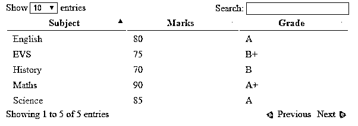
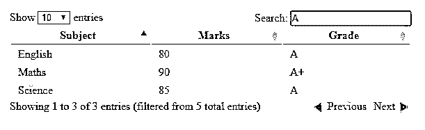
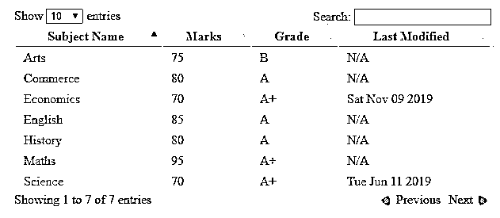
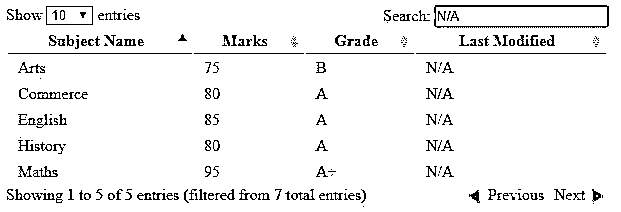
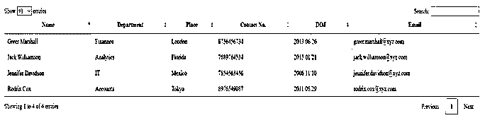

# jquery 数据表

> 原文：<https://www.educba.com/jquery-data-table/>


## jQuery 数据表简介

jQuery DataTable 是 jQuery JavaScript 库提供的一个强大而智能的 HTML 表格增强插件。这是一个高度灵活的工具，基本上是为了在表格中显示信息以及添加交互而创建的，因此，增强了 HTML 表格中数据的可访问性。jQuery DataTables 允许您创建动态数据表，同时以最少的工作量向 HTML 表添加一些高级功能，如分页、排序、排序、搜索等等。当数据量巨大时，它可以确保更好的管理。它既支持客户端处理，也支持服务器端处理。

### jQuery 数据表的实现

要使用数据表，第一步是包含 jQuery 库，因为它是一个 jQuery 插件。其次，需要包含两个额外的文件来让数据表在您的网站上运行。

<small>网页开发、编程语言、软件测试&其他</small>

*   数据表 JavaScript 文件
*   数据表 CSS 文件

首先，我们应该知道数据表可以处理各种来源的数据。它可以直接处理 HTML 表格，或者数据可以在初始化时被指定为数组，或者它也可以处理来自 AJAX 的数据。要使用 HTML 表格，基本标准是表格应该是有效的

#### 装置

安装数据表的主要步骤是在代码中包含数据表源文件。这些文件可以通过以下方式使用:

*   使用数据表中的单个文件。
*   使用下载生成器在您自己的服务器上本地安装文件。
*   使用 NPM 或鲍尔软件包管理器。

### jQuery 数据表示例

下面给出了 jQuery 数据表的例子:

#### 示例#1

下面是一个非常简单的例子来展示 jQuery 数据表的强大功能。

**代码:**

```
<html>
<head>
<link
rel="stylesheet"
type="text/css"
href="http://ajax.aspnetcdn.com/ajax/jquery.dataTables/1.9.4/css/jquery.dataTables.css"
/>
</head>
<body>
<table id="table_id">
<thead>
<tr>
<th>Subject</th>
<th>Marks</th>
<th>Grade</th>
</tr>
</thead>
<tbody>
<tr>
<td>Maths</td>
<td>90</td>
<td>A+</td>
</tr>
<tr>
<td>Science</td>
<td>85</td>
<td>A</td>
</tr>
<tr>
<td>English</td>
<td>80</td>
<td>A</td>
</tr>
<tr>
<td>EVS</td>
<td>75</td>
<td>B+</td>
</tr>
<tr>
<td>History</td>
<td>70</td>
<td>B</td>
</tr>
</tbody>
</table>
<script
type="text/javascript"
charset="utf8"
src="http://ajax.aspnetcdn.com/ajax/jQuery/jquery-1.8.2.min.js"
></script>
<script
type="text/javascript"
charset="utf8"
src="http://ajax.aspnetcdn.com/ajax/jquery.dataTables/1.9.4/jquery.dataTables.min.js"></script>
<script>
$(function() {
$("#table_id").dataTable();
});
</script>
</body>
</html>
```

**输出:**

*   我们从一个有三列的普通 HTML 表开始，然后对这个表应用了 DataTables 特性。
*   一旦整个代码得到执行，您将能够看到一个漂亮的表，如下图所示。




*   我们有从顶部搜索框过滤搜索的搜索功能，也有通过单击列名对它们进行排序的排序功能。
*   我们还在页面中包含了分页功能，您可以使用它浏览页面。




#### 实施例 2

在下面的例子中，表数据将作为 json 数组传递，而不是普通的 HTML 表。

**代码:**

```
<html>
<head>
<link
rel="stylesheet"
type="text/css"
href="http://ajax.aspnetcdn.com/ajax/jquery.dataTables/1.9.4/css/jquery.dataTables.css"
/>
</head>
<body>
<table id="table_id">
<thead>
<tr>
<th class="subj_name">Subject</th>
<th>Marks</th>
<th>Grade</th>
<th>Last Modified</th>
</tr>
</thead>
<tbody></tbody>
</table>
<script
type="text/javascript"
charset="utf8"
src="http://ajax.aspnetcdn.com/ajax/jQuery/jquery-1.8.2.min.js"
></script>
<script
type="text/javascript"
charset="utf8"
src="http://ajax.aspnetcdn.com/ajax/jquery.dataTables/1.9.4/jquery.dataTables.min.js"
></script>
<script>
$(function() {
$("#table_id").dataTable({
aaData: [
["Maths", "95", "A+", "null"],
["English", "85", "A", "null"],
["Science", "70", "A+", "2019-06-11 06:30:00"],
["History", "80", "A", "null"],
["Arts", "75", "B", "null"],
["Economics", "70", "A+", "2019-11-09 06:30:00"],
["Commerce", "80", "A", "null"]
],
aoColumnDefs: [
{
sTitle: "Subject Name",
aTargets: ["subj_name"]
},
{
aTargets: [3],
sType: "date",
mRender: function(date, type, full) {
return full[1] == "70" ? new Date(date).toDateString() : "N/A";
}
}
]
});
});
</script>
</body>
</html>
```

**输出:**

*   第一步是创建一个 HTML 表，带有所需的列标题和一个空的表体。
*   现在，下一步是将 DataTable 应用于 HTML 表，之后我们的新表将如下所示:




*   在本例中，我们也为数据表使用了搜索、排序和分页功能。




*   我们已经使用 aaData 选项在 json 数组中向表提供了数据。
*   aaColumnDefs 有一个由几个对象组成的数组，它决定了每一列在表中的呈现方式。它允许您修改表中由对象的 aTargets 属性指定的任意列。
*   aTargets 将值作为列标题、列索引或 _all 中指定的类名，以匹配所有表列。
*   当呈现特定列的每个单元格时，调用 mRender 函数。它有三个参数，数据、类型和完整的行，返回我们想要在它的位置呈现的内容。
*   “sType”属性指定列的预期类型，这有助于决定该列的值的排序方式。

#### 实施例 3

下面的例子显示了从 AJAX (array)作为数据源的 DataTables 将数据加载到一个表中。

**代码:**

```
<html>
<head>
<link
rel="stylesheet"
type="text/css"
href="https://cdn.datatables.net/1.10.20/css/jquery.dataTables.min.css"
/>
</head>
<body>
<table id="table_id" class="display" style="width:100%">
<thead>
<tr>
<th>Name</th>
<th>Department</th>
<th>Place</th>
<th>Contact No.</th>
<th>DOJ</th>
<th>Email</th>
</tr>
</thead>
</table>
<script
type="text/javascript"
charset="utf8"
src="https://code.jquery.com/jquery-3.3.1.js"
></script>
<script
type="text/javascript"
charset="utf8"
src="https://cdn.datatables.net/1.10.20/js/jquery.dataTables.min.js"
></script>
<script>
$(document).ready(function() {
$("#table_id").DataTable({
ajax: "./ajaxList.txt"
});
});
</script>
</body>
</html>
```

**AJAX: ajaxList.txt**

```
{
"data": [
[
"Jack Williamson",
"Analytics",
"Florida",
"7689764534",
"2015/01/21",
"jack.williamson@xyz.com"
],
[
"Greer Marshall",
"Finannce",
"London",
"8756456734",
"2013/06/26",
"greer.marshall@xyz.com"
],
[
"Jennifer Davidson",
"IT",
"Mexico",
"7854563456",
"2008/11/10",
"jennifer.davidson@xyz.com"
],
[
"Rodrix Cox",
"Accounts",
"Tokyo",
"8976549087",
"2011/08/29",
"rodrix.cox@xyz.com"
]
]
}
```

**输出**:

*   在这个例子中，我们将 ajax 选项设置为 [JSON 数据源地址](https://www.educba.com/what-is-json/)。
*   Table 通过使用 AJAX 加载数据，AJAX 可以在添加任何其他数据时随时自动更新。
*   然后，数据表使用列索引读取要在每列中显示的数据。




### 结论

jQuery DataTable 是一个高度可定制且功能丰富的库，可用于增强普通的 HTML 表。这个库提供了一个简单的 API 和许多配置选项，允许您从各种数据源获取数据。在本文中，我们简要讨论了数据表的一些最有用的特性，但是还有更多内容。

### 推荐文章

这是 jQuery 数据表的指南。这里我们讨论 jQuery 数据表的基本概念、不同的实现和例子。您也可以看看以下文章，了解更多信息–

1.  [jQuery mouseover()](https://www.educba.com/jquery-mouseover/)
2.  [jQuery 插件](https://www.educba.com/jquery-plugins/)
3.  [jQuery html()](https://www.educba.com/jquery-html/)
4.  [jQuery 验证](https://www.educba.com/jquery-validate/)


