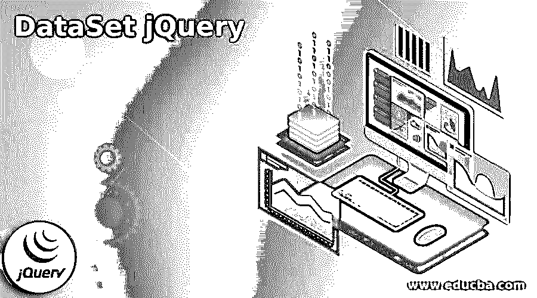
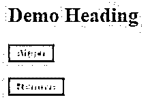

# 数据集 jQuery

> 原文：<https://www.educba.com/dataset-jquery/>




## 数据集 jQuery 简介

数据集 jQuery 用于数据存储。数据集有两种类型，一种是 PS，表示物理顺序，另一种是 PDS，表示分区数据集。物理顺序数据集类似于 windows 中的平面文件。它用于按顺序存储和检索数据。同时，PDS 是一组数据集。它类似于 windows 中的文件夹，其中有多个文件。jQuery 是最流行的 JavaScript 框架。开发 jQuery 是为了改变用 JavaScript 编写代码的方式。这是一个超级快速和简短 JavaScript 库，它还可以调整 HTML 文档，无论是遍历、事件处理、动画制作还是 Ajax 交互，以实现快速的 web 开发。

### 什么是数据集 jQuery？

*   作为人类，我们不断观察周围的世界。甚至婴儿也能观察到一些东西，比如他们最喜欢的玩具，并推断出一系列特征尺寸、颜色、形状等。通过比较这些特征，我们可以对差异和模式进行推断。科学要求我们将这些直观的观察过程提升到更深层次的仔细记录和精确。一种方法是构建数据集。
*   数据集有多种形式。下面是一个非常常用的矩形长格式数据集的基础。您可能认为这类似于电子表格。首先，我们必须记住“数据”是“数据”的复数形式。数据是关于某事物的单一信息。这意味着数据集是数据的结构化排列。这些信息所涉及的“东西”被称为观察单位。
*   观察单位由数据集中的一行表示。在整个科学学科中，观察单位有许多许多形式。例如，让我们想象一个调查数据集。在调查研究中，观察单位通常是被研究者采访的人。这意味着数据集中的一行代表一个人。我们知道人类非常复杂。而且，我们可以观察到它们的许多特征。这些特征可以被认为是变量。
*   变量是关于观察单位的东西，有可能显示变化。调查中变量的例子有年龄、性别、种族和收入。考虑一个像年龄这样的变量。我们可以给这个变量一个简单的名为“年龄”的变量但是，年龄可以通过许多方式来衡量，如年龄或类别，以及几种类型的调查问题。我们已经强调了关于一个简单但常见的数据集类型的一些事情。

### 数据集 jQuery 的示例

下面是提到的例子:

<small>网页开发、编程语言、软件测试&其他</small>

在这段代码中，我们将看到如何在 jQuery 中实现 data()方法。

**代码:**

```
<!DOCTYPE html>
<html>
<head>
<script src="https://ajax.googleapis.com/ajax/libs/jquery/3.4.1/jquery.min.js"></script>
<script>
$(document).ready(function(){
$(".button1").click(function(){
$("div").data("student", "Jack Sparrow");
alert("Student Name = " +$("div").data("student"));
});
$(".button2").click(function(){
$("div").removeData("student");
alert("Student Name = " +$("div").data("Jack Sparrow"));
});
});
</script>
<style>
.button1 {
background-color: orange;
color: white;
}
.button2 {
background-color: orange;
color: white;
}
</style>
</head>
<body>
<h2>Demo Heading</h2>
<button class="button1">Attach</button><br><br>
<button class="button2">Remove</button>
<div></div>
</body>
</html>
```

**输出:**




### jQuery 数据集方法

*   jQuery DataSet 方法为我们提供了将任意数据集与节点和 JavaScript 对象相关联的能力。这使得我们的代码更加简洁明了。还有 jQuery 1.4.3，我们可以在一般的基础上使用 dataset 方法，JavaScript 对象打开了一些非常有趣的应用程序接口。现在使用数据方法，方法调用非常方便，因为它允许您将它作为链的一部分。现在，当您使用数据方法时，您需要传递两个参数一个键和一个要存储的值。这就是我们想在这里做的。我们传递的一个键和一个值。键应该是一个字符串，该字符串的值可以是任何数据结构类型，包括函数数组和对象。
*   还有一种替代语法，可以将一个对象作为单个参数传递。所以如果我们必须在这里给出一个东西。这意味着，如果你有一个元素或锚标签，我们可以使用数据属性。
*   DataSet 方法用于存储一些带有相关元素的数据，或者获取已经存储在特定元素中的数据。所以 data 方法可以用来设置或获取一些数据。而删除数据的方法顾名思义可以用来删除存储的数据。每个 Ajax 调用在请求中都有一个参数，即数据。我们可以使用这个参数向服务器发送数据。同时要求我们可以做美元选择器点方法。这里的方法可以包含任何你从加载门发布的任何东西，你必须在数据中指定服务器的 URL。我们可以指定要发送到服务器的数据。在回调中，我们必须指定请求成功后要执行的功能。因此，要向服务器发送数据，我们必须在数据参数中指定它。
*   jQuery 也有序列化方法，在这个方法中，我们将使用序列化方法发送表单数据。为此，首先创建一个表单并指定基本文本 HTML。

### 结论

在本文中，我们看到了大量关于 jQuery 和 jQuery 数据集的信息。像什么是 jQuery 数据集，数据集 jQuery 方法，数据集 jQuery 例子等等。我们还看到了 jQuery 和 Ajax 的数据事件。jQuery 是最流行的 JavaScript 框架。它简化了 HTML 文件。如果您经常使用 JavaScript，那么您应该选择 jQuery 的增强版。会给你更好的体验。

### 推荐文章

这是数据集 jQuery 的指南。为了更好地理解，我们在这里讨论简介、示例和 jQuery 数据集方法。您也可以看看以下文章，了解更多信息–

1.  [jQuery 日历调度器](https://www.educba.com/jquery-calendar-scheduler/)
2.  [jQuery ajax 失败](https://www.educba.com/jquery-ajax-fail/)
3.  [jQuery 帖子](https://www.educba.com/jquery-post/)
4.  [jQuery 替换类](https://www.educba.com/jquery-replace-class/)


