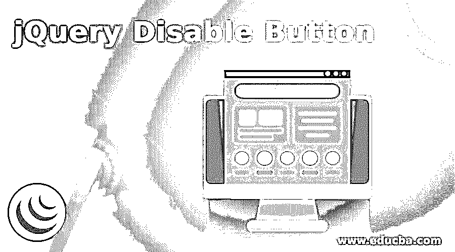
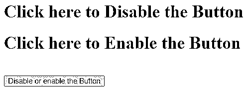
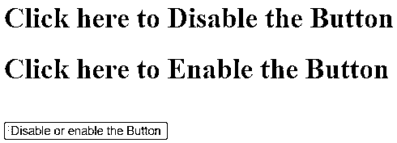
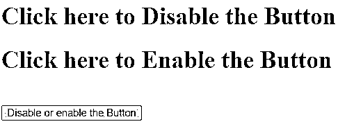
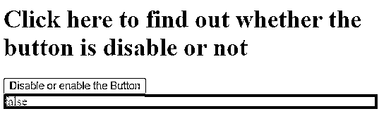
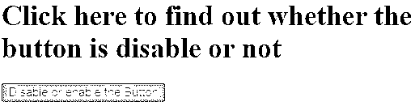
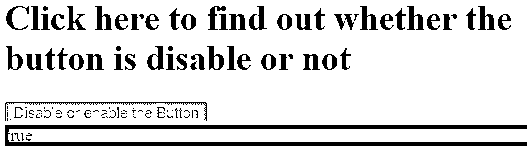
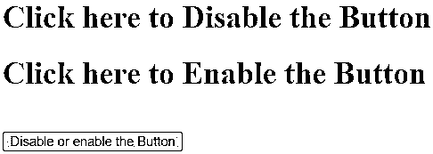
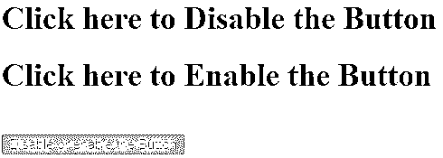

# jQuery 禁用按钮

> 原文：<https://www.educba.com/jquery-disable-button/>




## jQuery 禁用按钮简介

jQuery UI disable button 用于设置或获取按钮是否被禁用。jQuery UI disable 是 jQuery UI 库中按钮的内置属性。jQuery UI 禁用按钮的属性允许禁用按钮或检查按钮是否被禁用。禁用按钮是不可点击和不可用的，通常在浏览器中默认显示为灰色。jQuery 禁用按钮的优点是它允许基于用户交互来禁用和启用按钮。

**语法:**

<small>网页开发、编程语言、软件测试&其他</small>

根据使用目的，jQuery UI 禁用按钮有两种语法，它们是:

```
buttonObj.disabled
```

它用于返回禁用的属性。该属性的返回值是布尔值。如果按钮被禁用，则返回 true，否则返回 false。

```
buttonObj.disabled = true|false
```

它用于设置 disabled 属性。它可以有两个值 true 或 false。如果它的值设置为 true，它将禁用按钮，否则，如果它设置为 false，它将被启用。disabled 属性的默认值为 false。

### 实现 jQuery 禁用按钮的示例

接下来，我们编写 HTML 代码，通过下面的示例更清楚地理解该属性，其中 disable button 属性用于设置禁用和启用按钮，如下所示:

#### 示例#1

**代码:**

```
<!doctype html>
<html lang ="en">
<head>
<meta charset="utf-8">
<title>This is an example for jQuery UI disable button </title>
<link href="http://code.jquery.com/ui/1.10.4/themes/ui-lightness/jquery-ui.css" rel="stylesheet">
<scriptsrc="http://code.jquery.com/ui/1.10.4/jquery-ui.js"></script>
<scriptsrc="http://code.jquery.com/jquery-1.10.2.js"></script>
</script>
<script>
function disable() {
document.getElementById("btn").disabled = true;
}
function enable() {
document.getElementById("btn").disabled = false;
}
</script>
</head>
<body>
<h1 onclick ="disable()"> Click here to Disable the Button </h1>
<h1 onclick ="enable()"> Click here to Enable the Button </h1><br>
<button id ="btn"> Disable or enable the Button </button>
<br><br>
</body>
</html>
```

**输出:**




一旦我们单击标题“单击此处禁用按钮”，按钮将被禁用，如下图所示:


当我们单击标题“单击此处启用按钮”时，按钮会被启用，如下图所示




**解释:**在上面的程序中，按钮是基于用户交互来禁用或启用的，因为有两个标题来禁用和启用按钮。因此，基于对标题的点击，按钮被禁用和启用，因为在标题的相应功能中设置了禁用属性。

接下来，我们编写 HTML 代码，通过下面的示例更清楚地理解 jQuery 禁用按钮属性，其中禁用按钮属性用于检查按钮是禁用还是启用，如下所示

#### 实施例 2

**代码:**

```
<!doctype html>
<html lang ="en">
<head>
<meta charset="utf-8">
<title>This is an example for jQuery UI disable button </title>
<link href="http://code.jquery.com/ui/1.10.4/themes/ui-lightness/jquery-ui.css" rel="stylesheet">
<scriptsrc="http://code.jquery.com/ui/1.10.4/jquery-ui.js"></script>
<scriptsrc="http://code.jquery.com/jquery-1.10.2.js"></script>
</script>
<script>
function check() {
var res = document.getElementById("btn").disabled;
document.getElementById("disp").innerHTML = res;
}
</script>
</head>
<body>
<h1 onclick ="check()"> Click here to find out whether the button is disable or not </h1>
<button id ="btn"> Disable or enable the Button </button>
<div id="disp" style="background: red;"></div>
<br><br>
</body>
</html>
```

**输出:**




一旦我们单击标题“单击此处了解按钮是否被禁用”，因为它没有被禁用，所以输出是




**解释:**在上面的程序中，创建按钮是为了检查按钮是被禁用还是被启用，因为有一个标题显示按钮是否被禁用和启用，如果按钮没有被禁用，那么它将显示 false，如上面的输出所示，否则显示 false。所以根据按钮的禁用或启用它来分别显示真或假。

在上面的程序中，要禁用按钮，我们可以将第<button id="”btn”">行中的“禁用或启用按钮</button>”更改为“T2 禁用或启用按钮”,这样按钮就被禁用了，当我们运行程序时，输出将是:




当我们单击标题“单击此处了解该按钮是否被禁用”时，输出是–




接下来，我们重写 program 1 HTML 代码以理解 jQuery disable button 属性，其中禁用和启用我们将使用的 jQuery prop()方法的按钮，如下所示:

#### 实施例 3

**代码:**

```
<!doctype html>
<html lang ="en">
<head>
<meta charset="utf-8">
<title>This is an example for jQuery UI disable button </title>
<script src="https://ajax.googleapis.com/ajax/libs/jquery/3.2.1/jquery.min.js"></script>
<script>
function disable() {
$('#btn').prop('disabled', true);
}
function enable() {
$('#btn').prop('disabled', false);
}
</script>
</head>
<body>
<h1 onclick ="disable()"> Click here to Disable the Button </h1>
<h1 onclick ="enable()"> Click here to Enable the Button </h1><br>
<button id ="btn"> Disable or enable the Button </button>
<br><br>
</body>
</html>
```

**输出:**




一旦我们单击标题“单击此处禁用按钮”，按钮就会被禁用，如下图所示




当我们单击标题“单击此处启用按钮”时，按钮会被启用，如下图所示


**解释:**在上面的程序中，创建按钮是为了根据用户交互来禁用或启用按钮，再次根据对标题的单击来禁用和启用按钮，这里在程序中使用了 jQuery prop()方法。在各自的函数标题中，prop()方法设置了 disabled 属性。

### 结论

jQuery UI disabled 是 jQuery 中按钮元素的内置属性，用于设置或获取按钮是禁用还是启用。因此，使用 disabled 属性，我们可以允许用户禁用或启用按钮。

### 推荐文章

这是一个 jQuery 禁用按钮的指南。在这里，我们讨论 jQuery 禁用按钮的简要概述及其示例和代码实现。您也可以浏览我们推荐的其他文章，了解更多信息——

1.  [jQuery toggle()简介](https://www.educba.com/jquery-toggle/)
2.  [jQuery empty()(示例)](https://www.educba.com/jquery-empty/)
3.  [如何使用 jQuery insertAfter()方法？](https://www.educba.com/jquery-insertafter/)
4.  [jQuery appendTo() |参数|示例](https://www.educba.com/jquery-appendto/)


