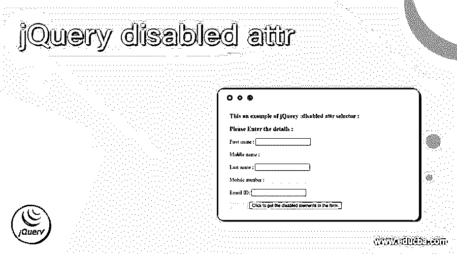
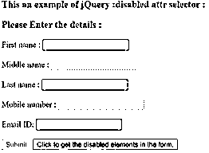
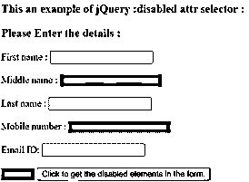
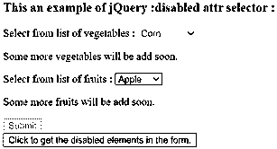
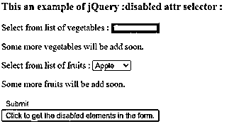
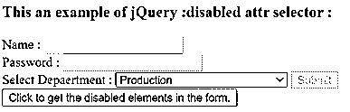
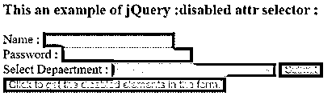

# jQuery 禁用属性

> 原文：<https://www.educba.com/jquery-disabled-attr/>




## jQuery 禁用属性简介

jQuery 禁用属性选择器用于选择所有禁用的表单元素。jQuery 禁用属性选择器是 jQuery 中的内置选择器，它也可以用作禁用 UI 元素的样式。默认情况下，所有表单元素都是启用的，如果需要禁用任何元素，我们可以使用禁用的表单来禁用它。禁用的元素不可用。支持禁用表单的 HTML 元素有 button、select、option、optgroup、input、textarea、menuitem、fieldset 和 all。如果被禁用的元素需要根据需求进一步启用，那么 JavaScript 可以删除被禁用的属性，使元素启用并再次使用它。在本主题中，我们将学习 jQuery 禁用属性。

jQuery 禁用属性选择器的语法–

<small>网页开发、编程语言、软件测试&其他</small>

```
$( ":disabled" )
```

jQuery 禁用属性选择器的语法选择所有禁用的表单元素

```
$( "*:disabled" )
```

jQuery 禁用属性选择器的语法用于选择指定的禁用表单元素

```
$( "selector : disabled" )
```

**参数—**

选择器–这是一个可选参数。它通过在选择器元素类型前面加上前缀来指定过滤器表达式或元素

**返回值-**

该选择器的返回值是支持禁用属性的 HML 选定元素。

### jQuery 禁用属性选择器的工作方式

jQuery 禁用属性选择器选择所有禁用的表单元素。假设 HTML 页面中有一个表单元素，其中包含一些禁用的表单输入元素。现在我们需要突出显示所有禁用的输入，因此我们可以将禁用的选择器用作“$(“input:disabled”)。CSS({ " background-color ":" red ")；"，用红色背景突出显示所有禁用的元素。

### jQuery 禁用属性选择器的示例

下面举几个例子

#### 示例#1

突出显示禁用表单元素的 jQuery 禁用属性选择器示例

**代码:**

```
<!doctype html>
<html lang="en">
<head>
<meta charset="utf-8">
<script src="https://code.jquery.com/jquery-3.5.0.js"></script>
<title> This is an example for jQuery :disabled attr selector </title>
</head>
<body>
<h3> This an example of jQuery :disabled attr selector : </h3>
<form action = "#myform">
<h3> Please Enter the details : </h3>
<div>
First name :     <input type = "text"> <br/> <br/>
Middle name : <input type = "text" disabled = "disabled"> <br/>  <br/>
Last name :      <input type = "text"> <br/>  <br/>
Mobile number :     <input type = "text" disabled = "disabled" > <br/>  <br/>
Email ID:      <input type = "text" > <br/> <br/>
<input type = "submit" id = "subm" disabled = "disabled">
<button> Click to get the disabled elements in the form. </button>
</div>
</form>
<script>
$(document).ready(function() {
$( "button").click(function(){
$( ":disabled" ).css({"background-color" : "red", "border" : "1px dashed black"});
});
});
</script>
</body>
</html>
```

上述代码的输出是–




一旦我们点击按钮，输出是




在上面的代码中，有一个表单包含了一些 input 元素和 submit 按钮，其中这几个 input 元素和 submit 按钮都被禁用了。接下来使用 disabled 选择器，它将表单中禁用的元素高亮显示为“$( ":disabled”)。css({"background-color" : "red "，" border" : "1px 虚线黑色" })；"，它们通过使用 CSS()函数突出显示，我们单击按钮就可以看到。

#### 实施例 2

jQuery disabled 属性选择器示例，通过为“:disabled”选择器指定前缀来突出显示特定的禁用表单元素

**代码:**

```
<!doctype html>
<html lang="en">
<head>
<meta charset="utf-8">
<script src="https://code.jquery.com/jquery-3.5.0.js"></script>
<title> This is an example for jQuery :disabled attr selector </title>
<script>
function disp()
{
$( "select:disabled" ).css({"background-color" : "red", "border" : "1px dashed black"});
}
</script>
</head>
<body>
<h3> This an example of jQuery :disabled attr selector : </h3>
<form action = "#myform">
<div>
Select from list of vegetables : <select disabled = "disabled">
<option> Corn </option>
<option> Mushroom </option>
<option> Broccoli </option  >
<option> Cucumber  </option>
</select>
<p> Some more vegetables will be add soon. </p>
Select from list of fruits : <select>
<option> Apple </option>
<option> Banana </option>
<option> Cherry </option>
<option> Pome  </option>
</select>
<p> Some more fruits will be add soon. </p>
<input type = "submit" id = "sub" disabled = "disabled">
</div>
<button onclick = "disp()"> Click to get the disabled elements in the form.  </button>
</body>
</html>
```

上述代码的输出是–




一旦我们点击“获取 p 个子节点”按钮，输出是




在上面的代码中，有一个表单包含两个选择元素和提交按钮，在这几个选项中元素和提交按钮被禁用。接下来使用 disabled 选择器，它将表单中唯一选择的禁用元素高亮显示为“$(“select:disabled”)。css({"background-color" : "red "，" border" : "1px 虚线黑色" })；"，它选择了禁用的 select 元素，并通过使用 CSS()函数突出显示，我们可以看到，只要我们单击按钮。

#### 实施例 3

jQuery 禁用属性选择器示例，通过“*”前缀突出显示所有禁用的表单元素

**代码:**

```
<!doctype html>
<html lang="en">
<head>
<meta charset="utf-8">
<script src="https://code.jquery.com/jquery-3.5.0.js"></script>
<title> This is an example for jQuery :disabled attr selector </title>
<script>
function disp()
{
$("*").prop("disabled", true);
$( "*:disabled" ).css({"background-color" : "red", "border" : "1px dashed black"});
}
</script>
</head>
<body>
<h3> This an example of jQuery :disabled attr selector : </h3>
<form action = "#myform">
<div>
Name :     <input type = "text" disabled = "disabled"> <br/>
Password :     <input type = "text" disabled = "disabled"> <br/>
Select Depaertment : <select>
<option> Production </option>
<option> Marketing </option>
<option> Research and Development </option disabled = "disabled" >
<option> Human Resource Management  </option>
</select>
<input type = "submit" id = "sub" disabled = "disabled">
</div>
<button onclick = "disp()"> Click to get the disabled elements in the form.  </button>
</body>
</html>
```

上述代码的输出是




一旦我们点击“获取 p 个子节点”按钮，输出是




在上面的代码中，有一个包含一些输入元素和提交按钮的表单，其中只有一个输入被禁用。接下来，使用 prop()函数禁用所有表单元素，然后使用 disabled 选择器，将表单中所有禁用的元素高亮显示为“$( "*:disabled”)。css({"background-color" : "red "，" border" : "1px 虚线黑色" })；"，它选择所有禁用的元素，并通过使用 CSS()函数突出显示，我们可以看到，一旦我们单击该按钮。

### 结论

jQuery 禁用属性选择器是 jQuery 中的内置选择器，用于选择所有禁用的表单元素。

### 推荐文章

这是一个 jQuery 禁用属性的指南。在这里，我们将讨论 jQuery 禁用属性选择器的工作方式，以及示例和输出。您也可以看看以下文章，了解更多信息–

1.  [jQuery removeClass()](https://www.educba.com/jquery-removeclass/)
2.  [jQuery 窗口](https://www.educba.com/jquery-window/)
3.  [jQuery 可见性](https://www.educba.com/jquery-visibility/)
4.  [jQuery 全局变量](https://www.educba.com/jquery-global-variable/)


