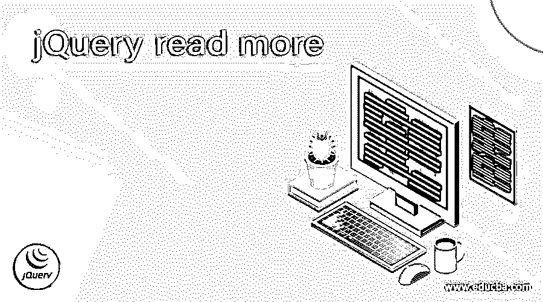
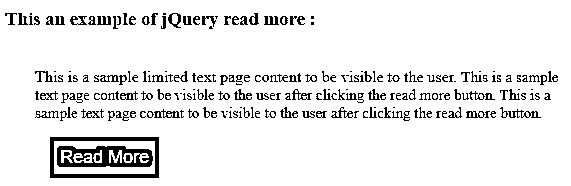
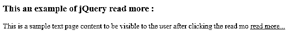
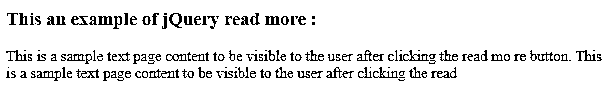

# jQuery 阅读更多

> 原文：<https://www.educba.com/jquery-read-more/>




## jQuery 简介阅读更多内容

jQuery read more 用于限制页面文本的可见性。当我们需要隐藏特定大小的页面内容，而不是显示所有文本内容时，我们可以使用“阅读更多”按钮或链接。阅读更多允许用户通过按阅读更多按钮或链接来阅读整个页面内容。而按下 read less 按钮可以用来隐藏页面内容。

**jQuery stop propagation()函数的语法—**

<small>网页开发、编程语言、软件测试&其他</small>

```
if( $( "selector" ).text() == ' Read More' )
{                $( "selector" ).text( 'Read Less' );
// code to show the full content
$( "selector" ).prev().toggle();
}
else{
$( "selector" ).text( 'Read More' );
// code to show the reduce content
$( "selector" ).prev().toggle();
}
```

**参数—**

jQuery read more 不接受任何参数。

### jQuery 的使用阅读更多信息

jQuery read more 用于显示有限的页面文本可见性。假设我们在 HTML 页面中有一个包含长文本内容的 div 元素，现在我们只需要显示一两行文本，如果用户有兴趣通过单击 read more 按钮进一步阅读，应该会显示剩余的内容。因此，我们首先只显示一行内容，然后放置“阅读更多”按钮，单击“阅读更多”按钮调用函数来显示剩余的内容，我们可以在下面的示例中看到。

### jQuery 的例子阅读更多

下面举几个例子

#### 示例#1

使用 prev()函数显示和隐藏文本内容的 jQuery read more 示例

**代码:**

```
<!doctype html>
<html lang = "en">
<head>
<meta charset = "utf-8">
<script src = "https://code.jquery.com/jquery-3.5.0.js"></script>
<title> This is an example for jQuery read more </title>
<!-- jQuery CDN -->
<script src = " https://cdnjs.cloudflare.com/ajax/libs/jquery/2.2.4/jquery.min.js"></script>
<script src = "assets/jquery.min.js"></script>
<style>
.contid {
font-size : 12px;
}
.h1 {
color : blue;
font-size : 20px;
}
section {
padding : 20px;
margin : 10px;
}
.more {
display : none;
font-size : 20px;
}
button {
margin : 15px;
padding : 10px;
border : none;
background-color : blue;
font-size : 18px;
display : block;
cursor : pointer;
color : wheat;
outline : none;
}
</style>
</head>
<body>
<script>
<!-- Script to add read more and read less -->
$(document).ready(function(){
$(".rdmore").click(function(){
$(this).siblings('.limit').toggle();
if($(this).text() == 'Read More'){
$(this).text( 'Read Less' );
$(this).prev().toggle();
}
else{
$(this).text( 'Read More' );
$(this).prev().toggle();
}
});
});
</script>
<h3> This an example of jQuery read more : </h3>

<div calss = "contid">
This is a sample limited text page content to be visible to the user.
 ..... 

This is a sample text page content to be visible to the user after clicking the read more button. This is a sample text page content to be visible to the user after clicking the read more button.

<button class = "rdmore"> Read More </button>
</div>

</body>
</html>
```

上述代码的输出是–


一旦我们点击 p 文本内容，输出是




在上面的代码中，首先显示 div 元素内容，然后使用类“more”隐藏 span 元素内容，然后显示 read more 按钮。单击“阅读更多”按钮时，通过将“显示值”属性切换为“$( this)”来显示上一个内容(span 元素)。上一页()。切换()；"，所以它显示隐藏的 span 内容，正如我们在上面的输出中看到的。

#### 实施例 2

使用字符串长度属性和 substring()函数显示隐藏文本内容的 jQuery read more 示例

**代码:**

```
<!doctype html>
<html lang = "en">
<head>
<meta charset = "utf-8">
<script src = "https://code.jquery.com/jquery-3.5.0.js"></script>
<title> This is an example for jQuery read more </title>
<!-- jQuery CDN -->
<script src = " https://cdnjs.cloudflare.com/ajax/libs/jquery/2.2.4/jquery.min.js"></script>
<script src = "assets/jquery.min.js"></script>
<style>
.rdmore .moretext{
display: none;
}
</style>
<script>
$(document).ready(function(){
var maxLength = 100;
$( ".rdmore" ).each(function(){
var str = $(this).text();
if($.trim( str ).length > maxLength){
var nstr = str.substring(0, maxLength);
var rmstr = str.substring(maxLength, $.trim( str).length);
$(this).empty().html(nstr);
$(this).append(' <a href = "javascript:void(0);" class = "readmore"> read more... </a>');
$(this).append('' + rmstr + '');
}
});
$( ".readmore" ).click(function(){
$(this).siblings( ".moretext" ).contents().unwrap();
$(this).remove();
});
});
</script>
</head>
<body>
<h3> This an example of jQuery read more : </h3>
<div class = "rdmore" style = "font-size : 15px;" >
This is a sample text page content to be visible to the user after clicking the read more button. This is a sample text page content to be visible to the user after clicking the read more button.
</div>
</body>
</html>
```

上述代码的输出是–




一旦我们点击第一段，输出是




在上面的代码中，首先通过使用 string substring()函数作为“content.substring(0，maxLength)；”来显示长度为 0 到 99 的 div 元素内容，则在单击时显示“阅读更多”链接，通过再次使用字符串 substring()函数作为“content.substring( maxLength，$来显示从 100 到结尾的剩余内容。修剪(内容)。长度)；”，所以它显示隐藏的内容，正如我们在上面的输出中看到的。

### 结论

这是一个 jQuery 阅读指南。这里我们讨论 jQuery read more 用于隐藏指定大小的页面内容，然后在单击 read more 按钮时显示隐藏的内容。您也可以阅读以下文章，了解更多信息——

1.  [jQuery 可见性](https://www.educba.com/jquery-visibility/)
2.  [jQuery 选择值](https://www.educba.com/jquery-select-value/)
3.  [jQuery 延期](https://www.educba.com/jquery-deferred/)
4.  [jQuery eq()](https://www.educba.com/jquery-eq/)


