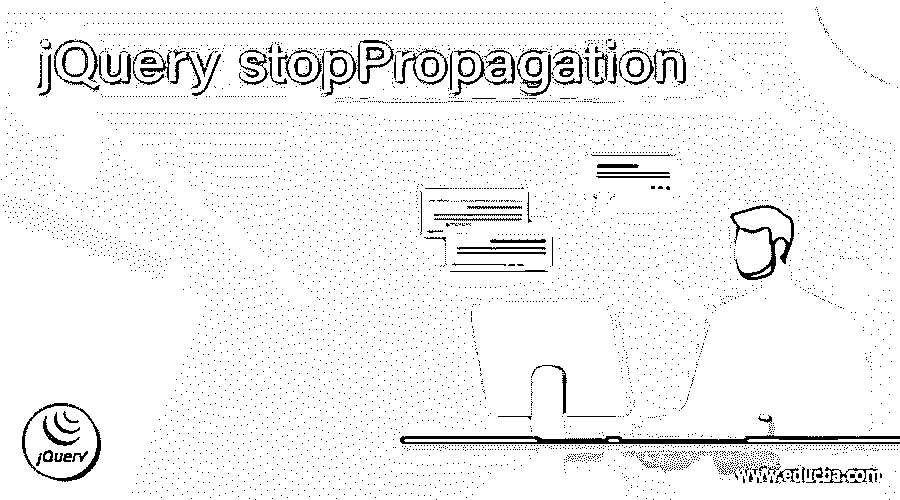
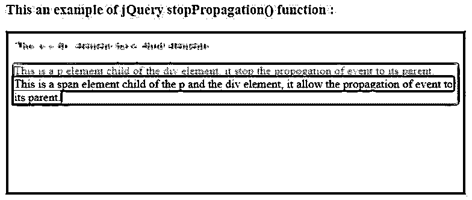
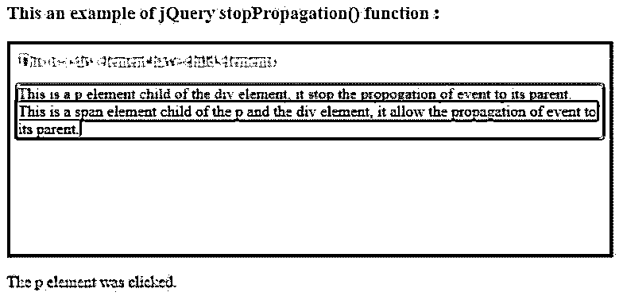
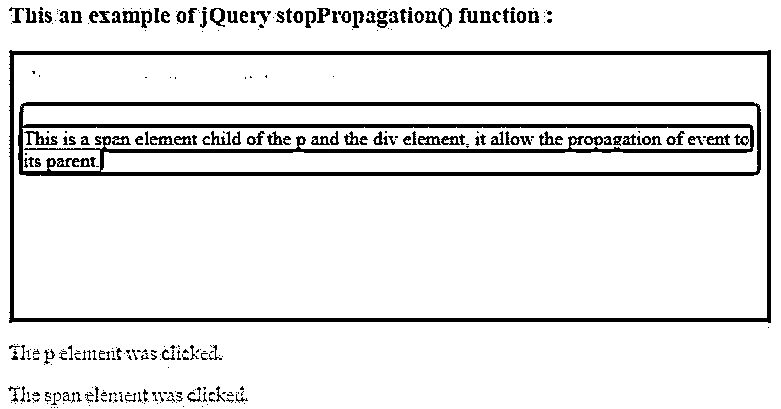
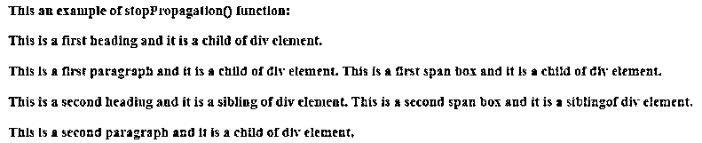
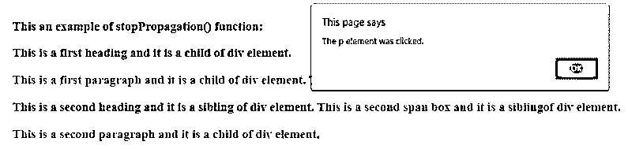
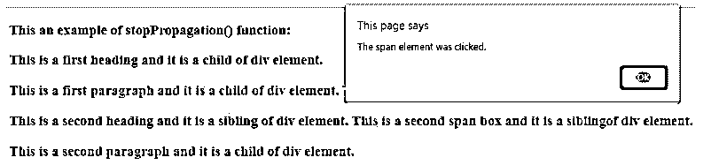
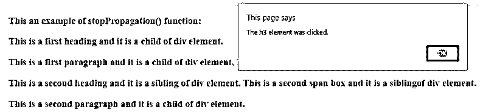
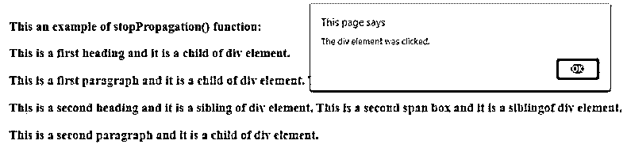

# jQuery 停止传播

> 原文：<https://www.educba.com/jquery-stoppropagation/>




## jQuery 停止传播简介

jQuery stopPropagation()函数用于停止事件向父元素的传播。jQuery stopPropagation()函数是 jQuery 中的一个事件内置函数。jQueryevent.stopPropagation 函数阻止事件在父元素的 DOM 树中传播或冒泡，并阻止为该事件执行父事件处理程序，因此不会执行任何父事件处理程序。要确定该方法是否被该事件触发的事件处理程序调用，我们可以使用 event.isPropagationStopped()函数。如果我们需要停止这种行为，我们可以使用 event.preventDefault()函数。

**jQuery stop propagation()函数的语法:**

<small>网页开发、编程语言、软件测试&其他</small>

```
event.stopPropagation();
```

**参数:**

*   event.stopPropagation()函数不接受任何参数。
*   **事件:**这不是调用 event.stopPropagation()函数的事件。它指定不应传播到父元素的事件，并阻止父元素通知此事件的触发。

**返回值:**

这个函数的返回值是上一个兄弟。

### jQuery 事件停止传播()函数的工作原理

*   jQuery prev()函数不接受任何参数。
*   假设 HTML 页面中有一个 span 元素，它的父元素是 p 和 div 元素。
*   现在，我们需要使用 event.s stopPropagation()函数作为“$(“span”)来停止 span 的任何事件向其父元素的传播。单击(function(event){ event . stop propagation()；});"，它停止将事件通知传播到 span 元素的父元素。

### jQuery 停止传播的示例

以下是 jQuery 停止传播的示例:

#### 示例#1

jQuery event.stopPropagation()函数的示例显示了事件如何传播到父元素以及如何停止事件的传播。

**代码:**

```
<!doctype html>
<html lang="en">
<head>
<meta charset="utf-8">
<script src="https://code.jquery.com/jquery-3.5.0.js"></script>
<title> This is an example for jQuery stop propagation </title>
<script>
$(document).ready(function(){
$( "p" ).click(function(event){
event.stopPropagation();
$( "#p1" ).text("The p element was clicked.");
});
$( "span" ).click(function(event){
$( "#p2" ).text("The span element was clicked.");
});
$( "div" ).click(function(){
$( "#p3" ).text("The div element was clicked.");
});
});
</script>
</head>
<body>
<h3> This an example of jQuery stopPropagation() function : </h3>
<div style = "height : 200px; width : 600px; padding : 10px; border:1px solid blue; background-color : blue;">
This is a div element have child elements.
<p style="background-color : green"> This is a p element child of the div element, it stop the propogation of event to its parent. <br>
This is a span element child of the p and the div element, it allow the propagation of event to its parent.</p></div>
</body>
</html>
<p id = "p1" style = "color : red"> </p>
<p id = "p2" style = "color : red"> </p>
<p id = "p3" style = "color : red"> </p>
</body>
</html>
```

**输出:**




**一旦我们点击了 p 文本内容，输出是:**




**一旦我们点击 span 文本内容，输出是:**




在上面的代码中，使用了“div”、“p”和“span”元素，其中“span”元素是“p”和 div 元素的子元素，“p”元素是“div”元素的子元素。如果任何事件由“span”元素触发，那么它将传播到“p”和“div”元素，类似地，如果任何事件由“p”触发，它将传播到“div”元素。接下来，使用 event.stopPropagation()函数来停止“p”元素事件向其父元素“div”元素的传播，因此，如果我们单击“p”元素内容，它只会显示“p 元素被单击”，而如果我们单击“span”元素内容，它会显示“p 元素被单击”和“span 元素被单击”。.span 事件一直传播到 p 元素，然后停止传播到“div”元素。

#### 实施例 2

jQuery event.stopPropagation()函数的示例显示了事件如何传播到父元素，以及如何使用元素的 id 停止事件的传播。

**代码:**

```
<!doctype html>
<html lang="en">
<head>
<meta charset="utf-8">
<script src="https://code.jquery.com/jquery-3.5.0.js"></script>
<title> This is an example for jQuery stop propagation </title>
<script>
$(document).ready(function(){
$( "#p1" ).click(function(event){
event.stopPropagation();
alert("The p element was clicked.");
});
$( "#span2" ).click(function(event){
alert("The span element was clicked.");
});
$( "div" ).click(function(){
alert("The div element was clicked.");
});
$( "h3" ).click(function(){
alert("The h3 element was clicked.");
});
});
</script>
</head>
<body>
<h3> This an example of stopPropagation() function: </h3>
<div id = "div1">
<h3 id = "h31" > This is a first heading and it is a child of div element.
<p id = "p1" style = "color : red" > This is a first paragraph and it is a child of div element.
 This is a first span box and it is a child of div element. </p></h3>
</div>
<div>
<h3 id = "h32"> This is a second heading and it is a sibling of div element.
 This is a second span box and it is a siblingof div element.
<p id = "p2"> This is a second paragraph and it is a child of div element. </p></h3>
</div>
<br>
</body>
</html>
```

**输出:**




**一旦我们点击第一段，输出是:**




**一旦我们点击第二个 span box，它的事件传播到它的父元素，给出输出序列如下:**










在上面的代码中，使用了" div "、" p "、" h3 "和" span "元素，其中 id 为" span2 "的" span "元素是" h3 "和 div 元素的子元素，id 为" p1 "的" p "元素是" div "元素的子元素。如果 id 为" span2 "的" span "触发了任何事件，则它会传播到" h3 "和" div "元素，同样，如果 id 为" p1 "的" p "触发了任何事件，则不会传播到" div "元素，因为 event.stopPropagation()函数用于阻止" p "元素事件传播到其父元素" div "元素，所以如果我们单击" p "元素内容，它只会显示警告消息" p 元素被单击"。.

### 结论

jQuery event.stopPropagation()函数是一个内置函数，用于停止事件向父元素的传播。

### 推荐文章

这是一个 jQuery 停止传播的指南。这里我们讨论 jQuery event.stopPropagation()函数的介绍、工作原理和例子。您也可以看看以下文章，了解更多信息–

1.  [jQuery 选择选项](https://www.educba.com/jquery-select-option/)
2.  [jQuery zindex](https://www.educba.com/jquery-zindex/)
3.  [jQuery 宽度](https://www.educba.com/jquery-width/)
4.  [jQuery id 选择器](https://www.educba.com/jquery-id-selector/)


