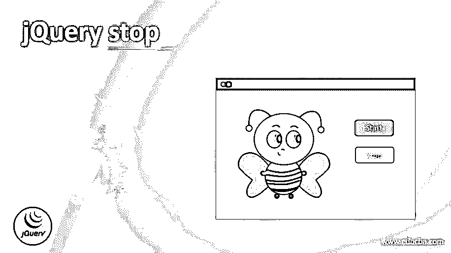
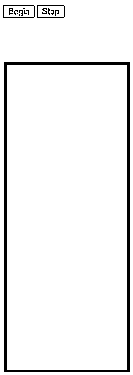
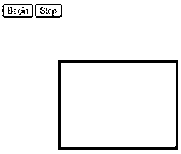
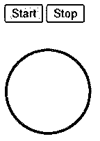
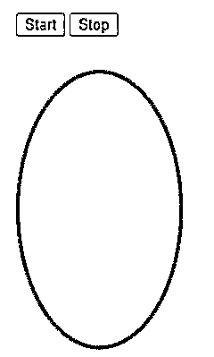

# jQuery 停止

> 原文：<https://www.educba.com/jquery-stop/>




## jQuery stop 简介

在 jQuery 中，有一个内置的 stop()方法，用于使任何选定元素的当前动画停止运行元素的动画进程。因此，可以使用内置方法 stop()来停止应用于任何元素的效果，或者使其停止与 jQuery 中的特定元素一起工作，以停止在应用此 stop()函数之前应用于元素的当前动画或效果。通常，我们可以将 jQuery stop()方法定义为内置方法，用于在动画完成之前暂停或停止任何匹配或选定元素的当前效果。

### jQuery 停止的语法

下面给出了提到的语法:

<small>网页开发、编程语言、软件测试&其他</small>

```
$(selected_element).stop(stopAll, goToEnd);
```

在 jQuery 中，stop()方法语法的定义如上所述，它应用于我们希望动画停止的选定元素，当以这种语法声明时，这些元素也称为选择器，然后它接受两个参数，例如:

*   **stopAll:** 该参数为可选参数，使用待指定的布尔值，用于指定排队的效果或动画是否也应停止。如果指定的值为 true，我们需要停止排队的动画，如果没有必要停止，则为 false。默认情况下，该参数的值为 false。
*   **goToEnd:** 该参数也是一个可选参数，它也将布尔值作为该参数的值，用于向用户指定是否应该立即完成当前元素的所有效果或动画。如果指定的值为真，它将立即完成所有动画，如果不是，则值为假。默认情况下，该值为 false。

### jQuery stop()函数如何使用示例

jQuery 中的 stop()方法是一个内置函数，用于停止当前在任何元素上运行的动画或效果，该元素作为给定 stop()函数中的选择器与指定元素相匹配。这个 stop()函数首先检查被指定为这个函数的选择器的元素。然后，它将检查是否停止所选元素的排队动画。此外，它将根据指定的布尔值检查是否需要立即停止所选元素的所有动画；否则，默认情况下，它将把它作为一个假值。它将使用 stop()函数停止当前所选元素的动画或效果。

#### 示例#1

在下面的例子中，让我们看看如何在 jQuery 中使用 stop()函数来停止所选元素的效果或动画。

**代码:**

```
<!DOCTYPE html>
<html>
<head>
<title> jQuery stop() function without parameters </title>
<script src="https://ajax.googleapis.com/ajax/libs/jquery/3.4.1/jquery.min.js"></script>
<script>
$(document).ready(function(){
$(".b1").click(function(){
var div = $("div");
div.animate({height: 150}, "slow");
div.animate({right: "+=200",left: "+=100" }, "slow");
div.queue(function(){
div.dequeue();
});
div.animate({height: 50}, "slow");
div.animate({right: "100", left: "100" }, "slow");
$(".b2").click(function(){
$("div").stop();
});
});
});
</script>
<style>
div {
width:200px;
height:1000px;
position:absolute;
left:10px;
top:100px;
background-color:blue;
}
</style>
</head>
<body>
<button class="b1"> Begin </button>
<button class="b2"> Stop </button>
<div> </div>
</body>
</html>
```

**输出:**







在上面的例子中，我们可以看到；首先，我们将设计任何形状或任何东西，以便我们可以应用动画或效果。这种动画是使用 jQuery 内置函数 animate 添加到特定元素的。在这个例子中，我们已经看到我们已经准备好文档来包含元素及其事件和动画。然后，我们在按钮元素上包含单击功能，在本例中有两个按钮，一个用于开始按钮，另一个用于停止按钮，这些按钮用于控制为元素“div”创建的动画，因为仅使用该元素，我们已经使用我们设计的属性创建了一个正方形。

在本例中，我们对“div”元素应用了 animate()函数，首先它会以慢动作使正方形向右移动，然后向左移动，每次 animate()函数应用于“div”函数时都会改变其大小，然后每当单击 stop 按钮时，对元素“div”使用 stop()函数。在这里，我们没有向 stop()函数传递任何参数，所以默认情况下，参数值将为 false。因此，上述示例的输出可以在上面的屏幕截图中看到。

#### 实施例 2

现在让我们看另一个例子，我们可以指定 stop()函数的参数。

**代码:**

```
<!DOCTYPE html>
<html>
<head>
<title> jQuery stop() function using parameters </title>
<script src=
"https://ajax.googleapis.com/ajax/libs/jquery/3.3.1/jquery.min.js">
</script>
<script>
$(document).ready(function() {
var div = $("div");
$("#start").click(function() {
div.animate({
height: 150
}, "slow");
div.animate({
width: 100
}, "slow");
div.animate({
height: 250
}, "slow");
div.animate({
width: 150
}, "slow");
});
$("#stop").click(function() {
div.stop(true, true);
});
});
</script>
<style>
div {
width: 100px;
height: 100px;
background: red;
border-radius: 50%
}
button {
margin-bottom:30px;
}
</style>
</head>
<body>
<button id="start">Start </button>
<button id="stop">Stop </button>
<div> </div>
</body>
</html>
```

**输出:**







在上面的例子中，我们可以看到它与上面的例子相似。此外，我们在“div”标签或元素中创建了一个圆形而不是正方形，我们还将动画应用于同一元素，其中该元素不会向左或向右移动，而是仅其高度和宽度会因动画而变化，这是使用“div”元素上的 animate()函数完成的。动画是慢动作，如 animate()函数中所指定的。

因此，在这里，我们对同一个元素“div”应用 stop()函数，该元素已经有一些排队的动画，我们在 stop()函数中为这两个元素指定值为“true”的两个参数，它指示哪个将根据第一个参数停止排队的动画，它将根据第二个参数立即停止动画。输出如上图截图所示。

### 结论

在本文中，我们得出结论，jQuery 提供了一个内置函数来停止运行任何选定元素的应用程序，或者提供了一个标签来停止运行应用于该选定元素的动画。在 jQuery 中，finish()函数还会停止任何匹配元素的当前正在运行的动画，这将完全删除所有排队的动画，这也不同于 stop()函数。

### 推荐文章

这是一个 jQuery stop 的指南。在这里，我们将分别讨论 jQuery stop()函数的简介和如何使用示例。您也可以看看以下文章，了解更多信息–

1.  [jQuery 选择选项](https://www.educba.com/jquery-select-option/)
2.  [jQuery zindex](https://www.educba.com/jquery-zindex/)
3.  [jQuery 宽度](https://www.educba.com/jquery-width/)
4.  [jQuery id 选择器](https://www.educba.com/jquery-id-selector/)


