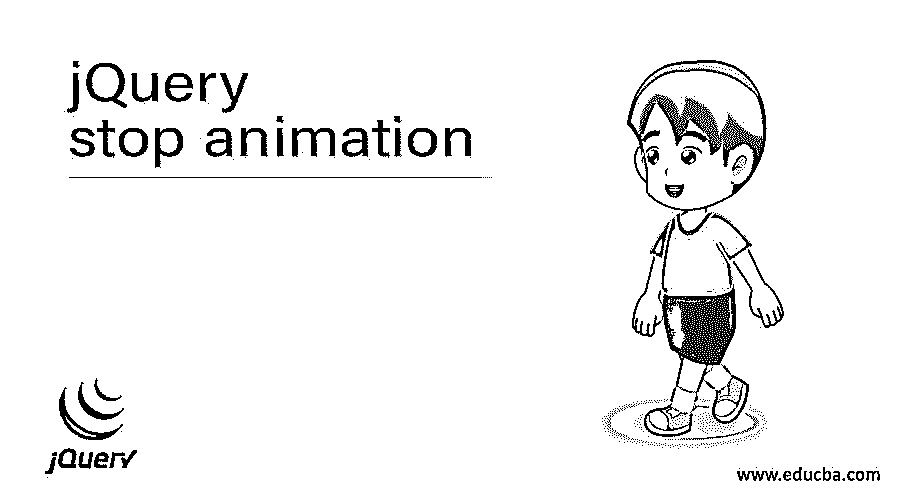
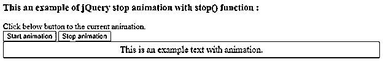
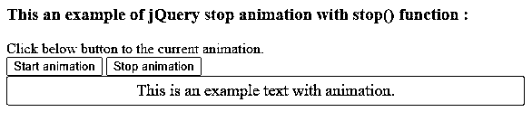
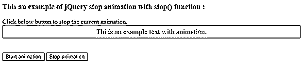
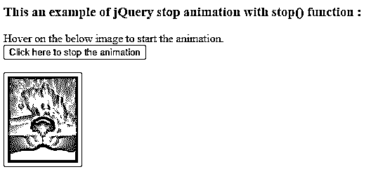
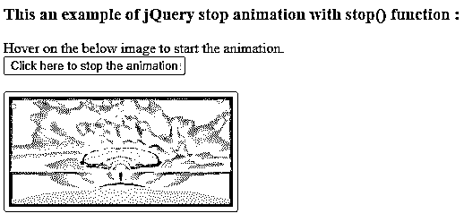

# jQuery 停止动画

> 原文：<https://www.educba.com/jquery-stop-animation/>




## jQuery 停止动画简介

jQuery stop 动画用于停止当前正在运行的选定元素的动画。jQuery stop()函数用于立即停止动画。jQuery stop()函数是 jQuery 中的内置函数。jQuery stop()函数停止动画效果函数，如淡入淡出、滑动和自定义动画。有时我们需要在动画结束前停止它，例如在同一元素上的队列动画中，如果我们必须应用多个动画函数，那么队列中的动画将不会开始，直到当前运行的动画结束。因此，在这种情况下，我们可以使用 stop()函数来停止当前正在运行的动画，以便队列中的下一个动画立即开始。

**jQuery 停止动画的语法—**

<small>网页开发、编程语言、软件测试&其他</small>

```
$(selector).stop(clearQueue, jumpToEnd);
```

**参数—**

**clear queue–**这是一个可选参数。它指定是否清除或移除所有排队的动画。它是一个布尔类型的参数，如果真值被传递，那么排队的动画将永远不会运行。默认值为 false。

**jump toend–**这是一个可选参数。它指定是否完成当前动画。它是一个布尔型参数，如果真值被传递，那么当前动画立即完成。默认值为 false。

**返回值-**

这个函数的返回值是上一个兄弟。

**jQuery stop 动画的工作原理—**

jQuery stop()函数接受两个参数。假设我们有一个 div 元素，它包含一些带有动画的文本内容。现在我们需要停止 div 元素上的所有动画，这样我们就可以使用 stop()函数作为“$(“# divid”)。停(真，真)；”，这将停止当前动画并清除动画队列。

### jQuery 停止动画示例

下面举几个例子

#### 示例#1

带有不带任何参数的 stop()函数的 jQuery stop 动画示例

**代码:**

```
<!doctype html>
<html lang="en">
<head>
<meta charset = "utf-8">
<script src = "https://code.jquery.com/jquery-3.5.0.js"></script>
<title> This is an example for jQuery stop animation  </title>
<style>
#flip {
padding : 5px;
font-size : 18px;
text-align : center;
background : yellow;
color : black;
border : solid 1px #666;
border-radius : 3px;
}
</style>
<script>
$(document).ready(function(){
$("#btn1").click(function(){
$("#flip").animate({ width: 400 }, 2000);;
});
$("#btn2").click(function(){
$("#flip").stop();
});
});
</script>
</head>
<body>
<h3> This an example of jQuery stop animation with stop() function : </h3>
<div > Click below button to the current animation.</div>
<button id = "btn1"> Start animation </button>
<button id = "btn2"> Stop animation </button>
<div id = "flip"> This is an example text with animation. </div>
</body>
</html>
```

上述代码的输出是




一旦我们点击 p 文本内容，输出是




在上面的代码中，有一个 div 元素，它的内容是动画的，当我们单击“开始动画”按钮时，它开始，当我们单击另一个按钮“停止动画”时，它停止当前动画的运行。“停止动画”按钮调用 Stop()函数作为“$(“# flip”)。stop()；"停止当前动画，正如我们在上面的输出中看到的。

#### 实施例 2

第一个参数为真的 stop()函数的 jQuery stop 动画示例

**代码:**

```
<!doctype html>
<html lang="en">
<head>
<meta charset = "utf-8">
<script src = "https://code.jquery.com/jquery-3.5.0.js"></script>
<title> This is an example for jQuery stop animation  </title>
<style>
#flip {
padding : 5px;
font-size : 18px;
text-align : center;
background : lightgreen;
color : black;
border : solid 1px #666;
border-radius : 3px;
}
</style>
<script>
$(document).ready(function(){
$("#btn1").click(function(){
$("#flip").animate( { width: 300 }, 2000);
$("#flip").animate( {height: 400 }, "slow");
$("#flip").animate( {width: 250 }, "slow");
});
$("#btn2").click(function(){
$("#flip").stop( true );
});
});
</script>
</head>
<body>
<h3> This an example of jQuery stop animation with stop() function : </h3>
<div > Click below button to stop the current animation.</div>
<div id = "flip"> Thi is an example text with animation. </div>
<br><br>
<button id = "btn1"> Start animation </button>
<button id = "btn2"> Stop animation </button>
</body>
</html>
```

上述代码的输出是–




一旦我们点击按钮，输出是


在上面的代码中，有一个 div 元素，它的内容由多个动画组成，当我们单击“开始动画”按钮时，它就会开始，当我们单击另一个按钮“停止动画”时，它会停止当前动画的运行，并从队列中清除所有动画。“停止动画”按钮调用 Stop()函数作为“$(“# flip”)。停止(真)；”停止当前动画，正如我们在上面的输出中看到的。

#### 实施例 3

第一个和第二个参数为真的 stop()函数的 jQuery stop 动画示例

**代码:**

```
<!doctype html>
<html lang="en">
<head>
<meta charset = "utf-8">
<script src = "https://code.jquery.com/jquery-3.5.0.js"></script>
<title> This is an example for jQuery stop animation  </title>
<style>
#flip {
padding : 5px;
font-size : 18px;
text-align : center;
background : lightgreen;
color : black;
border : solid 1px #666;
border-radius : 3px;
}
</style>
<script>
$(document).ready(function(){
$("#flip").hover(function(){
$("#flip").animate( {width: 250 }, "slow");
$("#flip").fadeOut();
$("#flip").animate( {height: 400 }, "slow");
});
$("#btn").click(function(){
$("#flip").stop( true );
});
});
</script>
</head>
<body>
<h3> This an example of jQuery stop animation with stop() function : </h3>
<div > Hover on the below image to start the animation.</div>
<button id = "btn"> Click here to stop the animation </button>
<br><br>

</body>
</html>
```

上述代码的输出是




当我们将鼠标悬停在图像上时，动画开始播放，然后单击按钮，输出如下




在上面的代码中，有一个由多个动画组成的 img 元素，当我们将鼠标悬停在图像上并单击按钮时，动画就会开始。当悬停在 imagd 上时，它再次开始动画。“停止动画”按钮调用 Stop()函数作为“$(“# flip”)。停止(真)；”停止当前动画，正如我们在上面的输出中看到的。

### 结论

jQuery stop()函数是一个内置函数，用于停止所选元素当前正在运行的动画。

### 推荐文章

这是一个 jQuery 停止动画的指南。这里我们讨论 jQuery stop-animation 的工作方式，以及示例和输出。您也可以看看以下文章，了解更多信息–

1.  [jQuery 可见性](https://www.educba.com/jquery-visibility/)
2.  [jQuery 日历](https://www.educba.com/jquery-calendar/)
3.  [jQuery 子选择器](https://www.educba.com/jquery-children-selector/)
4.  [jQuery 向下滚动](https://www.educba.com/jquery-scroll-down/)


