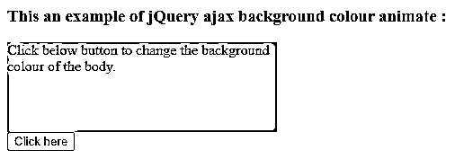
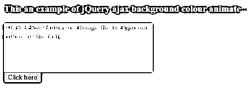
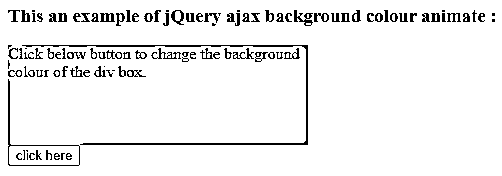
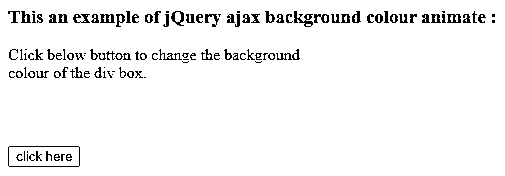
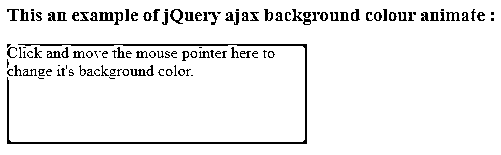
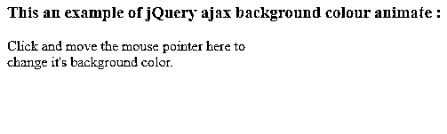
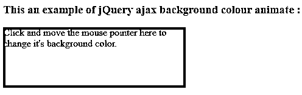

# jQuery 背景颜色动画

> 原文：<https://www.educba.com/jquery-background-color-animate/>


## jQuery 背景色动画简介

jQuery 背景色动画用于设置背景色。jQuery 背景颜色动画可以在 animate()函数的帮助下执行。jQuery animate()函数是 jQuery 中的内置函数。animate()函数用于在选定的 CSS 属性集上应用动画，因此对于背景色动画，animate()函数可以在 background color 属性上执行动画。背景色动画的语法

**带有背景色 CSS 属性的 jQuery animate()函数的语法—**

<small>网页开发、编程语言、软件测试&其他</small>

```
$("selector").animate({ backgroundColor : value });
```

**带有背景色 css 属性的 jQuery css()函数的语法–**

```
$("selector").css( "background-color", value);
```

**参数:**

*   **background color–**它指定 animate 属性来设置所选元素的背景颜色。
*   **Value–**指定为所选元素的背景设置的颜色。它是字符串值。

**返回值-**

动画功能没有任何价值。

**jQuery 背景色动画的工作–**

jQuery 背景颜色动画是在 animate()函数或 css()函数的帮助下执行的。假设我们有一个 div 元素，我们需要应用背景颜色动画效果。所以我们可以使用 animate()函数作为“$('#bid ')”。animate({ backgroundColor: "gray "，color: "white" })"，这将改变所选元素的背景颜色。

### jQuery 背景色动画示例

下面举几个例子

#### 示例#1

jQuery 背景颜色动画示例，用于改变身体的背景颜色

**代码:**

```
<!doctype html>
<html lang = "en">
<head>
<meta charset = "utf-8">
<title> This is an example for jQuery background colour animate  </title>
<link href="http://code.jquery.com/ui/1.10.4/themes/ui-lightness/jquery-ui.css" rel="stylesheet">
<script src="http://code.jquery.com/jquery-1.10.2.js"></script>
<script src="http://code.jquery.com/ui/1.10.4/jquery-ui.js"></script>
<style>
.divclass {
width : 300px;
height : 100px;
background-color : #b9c06d;
}
.myClass {
font-size: 40px; background-color: #c00; color: white;
}
</style>
<script type="text/javascript">
$(document).ready(function() {
$('#btn').click(function() {
$('#bid').animate({
backgroundColor : "gray",
color : "white"
})
})
});
</script>
</head>
<body id = bid>
<h3> This an example of jQuery ajax background colour animate : </h3>
<div  class = "divclass">
Click below button to change the background colour of the body. </div>
<button id = "btn"> Click here </button>
</body>
</html>
```

**上述代码的一个输出是-**




**一旦我们点击按钮，输出是–**




在上面的代码中，当我们点击按钮时它调用 animate()函数，该函数将通过使用代码为" $('#bid ')将页面的背景色改为灰色。animate({ backgroundColor: "gray "，color: "white"})"，我们可以在输出中看到。

#### 实施例 2

jQuery 背景色动画示例改变按钮单击时 div 元素的背景色

**代码:**

```
<!doctype html>
<html lang = "en">
<head>
<meta charset = "utf-8">
<script type = "text/javascript" src = "https://ajax.googleapis.com/ajax/libs/jquery/1.11.2/jquery.min.js">
</script>
<title> This is an example for jQuery background colour animate  </title>
<style>
.divclass {
width : 300px;
height : 100px;
background-color : #b9c06d;
}
.myClass {
font-size : 40px; background-color : #c00; color : white;
}
</style>
</head>
<body>
<h3> This an example of jQuery ajax background colour animate : </h3>
<div  id = "did" class = "divclass">
Click below button to change the background colour of the div box. </div>
<button id = "btn"> click here </button>
<script type = 'text/javascript'>
$(document).ready(function() {
$( '#btn' ).click( function() {
$( '#did' ).css( "background-color", "yellow");
})
});
</script>
</body>
</html>
```

**上述代码的一个输出是-**




**一旦我们点击按钮，输出是–**




在上面的代码中，当我们单击按钮时它调用 css()函数，该函数将通过使用代码“$('#did ')将 div 元素的背景色更改为黄色。css("背景色"，"黄色")；"正如我们在输出中看到的。

#### 实施例 3

jQuery 背景色动画示例，用于在移动、进入和退出时更改 div 元素的背景色

**代码:**

```
<!doctype html>
<html lang = "en">
<head>
<meta charset = "utf-8">
<script type = "text/javascript" src = "https://ajax.googleapis.com/ajax/libs/jquery/1.11.2/jquery.min.js">
</script>
<title> This is an example for jQuery background colour animate  </title>
<style>
.divclass {
width : 300px;
height : 100px;
background-color : #b9c06d;
}
.myClass {
font-size : 40px; background-color : #c00; color : white;
}
</style>
</head>
<body>
<h3> This an example of jQuery ajax background colour animate : </h3>
<div  id = "did" class = "divclass">
Click and move the mouse pointer here to change it's background color. </div>
<script type = 'text/javascript'>
$(document).ready(function(){
$( "#did" ).on({
mouseenter: function() {
$( this ).css( "background-color", "yellow");
},
mouseleave: function() {
$(this).css("background-color", "red");
},
});
});
</script>
</body>
</html>
```

**上述代码的一个输出是-**




**一旦我们滚动这个框，输出就是–**







在上面的代码中，当我们在 div 元素内容上移动鼠标(enter 或 leave)时，它调用 css()函数，该函数将使用与鼠标 enter " mouse enter:function(){ $(this)相同的代码将 div 元素的背景颜色更改为黄色和红色。css("背景色"，"黄色")；}”以及对于鼠标“mouseleave: function(){ $(this)。css("背景色"，"红色")；}”，正如我们在输出中看到的。

### 结论

背景色动画可以借助 animate()函数或 css()函数来实现。背景色动画用于设置所选元素的背景色。

### 推荐文章

这是一个 jQuery 背景颜色动画指南。这里我们讨论 jQuery 背景色动画的工作和例子。您也可以看看以下文章，了解更多信息–

1.  [jQuery ajax 超时](https://www.educba.com/jquery-ajax-timeout/)
2.  [jQuery ajax 上传文件](https://www.educba.com/jquery-ajax-upload-file/)
3.  [jQuery 合并](https://www.educba.com/jquery-merge/)
4.  [jQuery 窗口](https://www.educba.com/jquery-window/)


