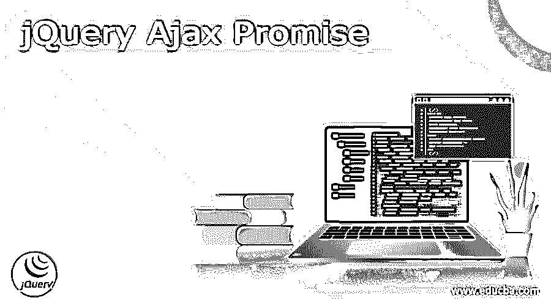
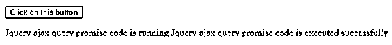
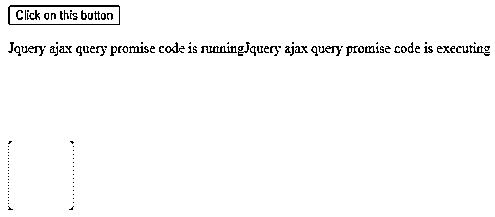
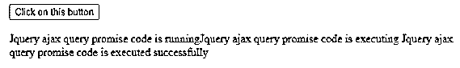
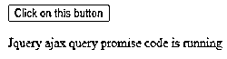
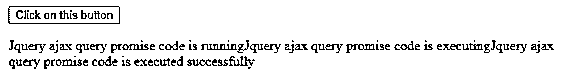

# jQuery Ajax 承诺

> 原文：<https://www.educba.com/jquery-ajax-promise/>




## jQuery Ajax Promise 的定义

jQuery ajax promise 在 jQuery 中进行 ajax 调用的实现非常简单。$.ajax()，$。get()、$getJSON()和$组成。post()都是 XHR 请求，只是用各种方式写的。它的语法是所有库中最简单的，这也是为什么开发人员比其他库更多地使用它的原因。我们可能会按顺序调用这两个函数，然后发现第二个函数不起作用。

### 什么是 jQuery Ajax Promise？

几乎所有的事情都应该用 AJAX 完成。我们可以说从数据检索和上传到获取静态文件和构建模板的一切。在我们意识到之前，我们会到处调用 AJAX。

<small>网页开发、编程语言、软件测试&其他</small>

很容易变得令人讨厌。如果我们不熟悉承诺和延期，我们的编码语法将变得混乱。

凭借其 AJAX 功能，jQuery 已经实现了承诺。简而言之，它们是工具，允许我们处理已完成的事件，对它们进行排队、链接等等。

我们需要一个承诺。这使我们能够以$无法实现的方式与 AJAX 查询进行交互。获取()。

尽管同步 HTTP 查询是可能的，但是如果我们完全采用异步操作，我们的应用程序会表现得更好。随着浏览器允许更多的并发活动，同时利用几个请求比以往任何时候都更有必要。

当我们说异步时，意味着发出请求，并且该请求最终在稍后的时间完成。关键是指定请求完成后将执行的代码。

Ajax 函数返回一个 jQuery XHR 对象。因为 jqXHR 对象包含了基本功能之外的附加功能

XMLHttpRequest 对象，它是一个超集。尽管如此，jQuery Ajax 抽象本质上只不过是一个 XMLHttpRequest 对象。

jqXHR 对象上可用的方法如下。

1)完成
2)总是
3)失败
4)然后

success、complete 和 error 方法等效于旧的 success、complete 和 error 方法。

从 jQuery 1.8 开始，hold 方法已经被弃用，取而代之的是 DAFT 接口。那么接口是最新的，并且将用于将承诺链接在一起。

如果 done 方法返回 true，则我们的请求成功完成。暂时忽略“总是”技术。

我们可能需要提出两个或更多的额外请求，每个请求都取决于前一个请求的成功与否。例如，来自一个 Web 服务调用的数据可能需要作为另一个 Web 服务调用的输入。

在第一个请求成功完成之前，我们不能进行第二个请求。这个场景提出了一个问题，因为承诺和异步开发的整个目标是为以后发生的事情做准备。

### jQuery ajax promise 如何工作？

*   当我们用 jQuery 调用服务时，默认情况下调用是异步处理的。这是最好的行动方式。当一个长时间运行的进程正在完成时，我们不希望我们的用户界面线程被阻塞。
*   从异步环境中，我们永远不能访问异步对象，反之亦然。
*   将 async 标志设置为 false 是解决此问题的一个简单且广泛使用的方法。这迫使 jQuery 在继续下一步之前等待调用完成。
*   这种等待可能会阻塞，如果我们不使用异步 JavaScript，用户将会束手无策，无法做任何事情，直到调用被解决。
*   这是因为 JavaScript 的执行是与浏览器中的其他部分线程化的，这意味着如果一段 JavaScript 在做什么，浏览器的其他部分必须等待它完成。
*   因此，回调是一种解决方案。回调是一种 JavaScript 约定，它解释了我们构建一个不立即返回结果的函数的情况。
*   如果我们需要对 ajax 脚本的失败模式进行更多的控制，我们可以保存返回的对象。when()是一个 jQuery Promise 对象，它封装了所有原始的 ajax 查询。
*   通过调用 then()或添加全面的成功/失败处理程序。ajaxObjs 是一个 ajax 设置对象的数组。
*   回调最严重的问题是什么是回调。它的特点是条件语句。
*   这个概念是，通过使用嵌套，我们可以以同步的方式处理调用，并以这种方式管理队列。

### jQuery Ajax Promise 示例

下面是 jQuery ajax 承诺的例子如下。

**代码:**

```
<!doctype html>
<html lang="en">
<head>
<meta charset="utf-8">
<title>JQuery Ajax Promise</title>
<style>
div {
height: 75px;
width: 75px;
float: Center;
margin-right: 15px;
display: none;
background-color: #080;
}
</style>
<script src="https://code.jQuery.com/jQuery-3.5.0.js"></script>
</head>
<body>
<button> Click on this button </button>
<p> JQuery ajax query promise code is running </p>
<div></div>
<div></div>
<div></div>
<div></div>
<script>
$( "button" ).on( "click", function() {
$( "p" ).append( "JQuery ajax query promise code is executing" );
$( "div" ).each(function( i ) {
$( this ).fadeIn().fadeOut( 1000 * ( i + 1 ) );
});
$( "div" ).promise().done(function() {
$( "p" ).append( " JQuery ajax query promise code is executed successfully " );
});
});
</script>
</body>
</html>
```










以下示例显示了使用 when 语句解决退货承诺，如下所示。

**代码:**

```
<!doctype html>
<html lang="en">
<head>
<meta charset="utf-8">
<title>JQuery Ajax Promise</title>
<style>
div {
height: 75px;
width: 75px;
float: Center;
margin-right: 15px;
display: none;
background-color: #080;
}
</style>
<script src="https://code.jQuery.com/jQuery-3.5.0.js"></script>
</head>
<body>
<button>Click on this button</button>
<p>JQuery ajax query promise code is running</p>
<div></div>
<div></div>
<div></div>
<div></div>
<script>
var effect = function() {
return $( "div" ).fadeIn( 800 ).delay( 1200 ).fadeOut();
};
$( "button" ).on( "click", function() {
$( "p" ).append( "JQuery ajax query promise code is executing" );
$.when( effect() ).done(function() {
$( "p" ).append( "JQuery ajax query promise code is executed successfully" );
});
});
</script>
</body>
</html>
```







### 结论

凭借其 AJAX 功能，jQuery 已经实现了承诺。简而言之，它们是工具，允许我们处理已完成的事件，对它们进行排队、链接等等。JQuery ajax promise 在 JQuery 中进行 ajax 调用的实现非常简单。

### 推荐文章

这是一个 jQuery Ajax Promise 的指南。这里我们讨论一下定义，什么是 jQuery ajax promise，jQuery Ajax Promise 是如何工作的？代码实现示例。您也可以看看以下文章，了解更多信息–

1.  [JQuery JSON 解析](https://www.educba.com/jquery-json-parse/)
2.  [jQuery 滚动](https://www.educba.com/jquery-scroll/)
3.  [jquery 获取被点击元素的 id](https://www.educba.com/jquery-get-id-of-clicked-element/)
4.  [jquery ajax url](https://www.educba.com/jquery-ajax-url/)


