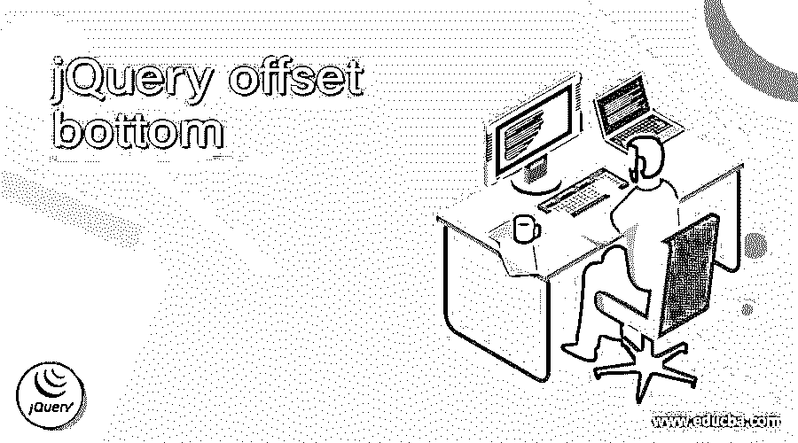
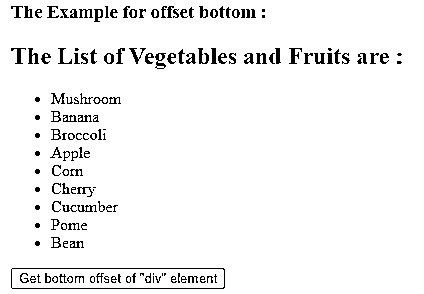
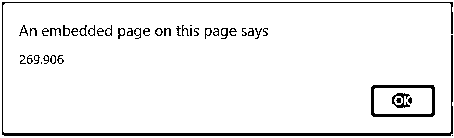
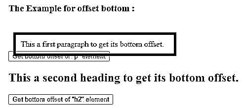
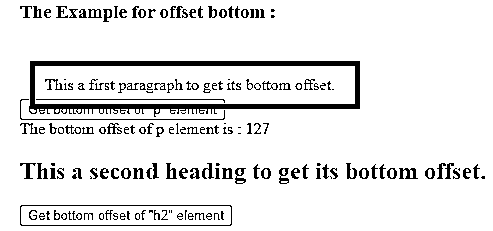
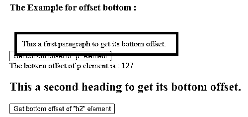
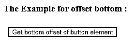
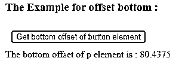

# jQuery 底部偏移量

> 原文：<https://www.educba.com/jquery-offset-bottom/>




## jQuery 偏移量底部的定义

jQuery offset bottom 用于获取所选元素相对于文档的底部坐标的偏移量。jQuery offset()函数是 jQuery 中的内置函数，通过它我们可以返回底部坐标的偏移量。jQuery offset()函数只指定了顶部和左侧的属性位置，但是在 top property 和 outerHeight()函数的帮助下，我们可以获得元素的底部位置。

**语法:**

<small>网页开发、编程语言、软件测试&其他</small>

返回偏移底部坐标的语法–

```
var offBottom = (selector).offsetTop + $(selector).outerHeight();
```

哪里-

*   **offsetTop–**offsetTop 属性返回第一个匹配的选择器的顶部偏移量。
*   **outer height()–**outer height()函数返回第一个匹配的选择器的偏移顶部的外部高度。
*   **off bottom–**off bottom 是一个变量，用于存储计算出的底部偏移量。

### jQuery 偏移底部的工作

JQuery offset bottom 返回第一个匹配的选择器或元素的底部偏移量。假设在我们的页面中有一个 div 元素，我们需要第一个 div 元素的底部偏移量，所以我们可以使用底部偏移量作为“var bottom = "div”。offsetTop + $( div)。outer height()；".offsetTop 属性给出了顶部偏移量，该偏移量加上 outerHeight()函数的返回值(计算内容+填充+边框)。

### 例子

使用 offsetTop 和 outerHeight()函数获取“div”元素底部偏移量的示例

#### 示例#1

**代码:**

```
<!doctype html>
<html lang="en">
<head>
<meta charset="utf-8">
<script src="https://code.jquery.com/jquery-3.5.0.js"></script>
<title> This is an example for jQuery offset bottom </title>
<script>
function disp()
{
function offset1(el) {
// Calculate the bottom vaue
var bottom = el.offsetTop + $(el).outerHeight();
// return bottom offset
return bottom;
}
// example use for div
var div = document.querySelector('div');
var divOffset = offset1(div);
alert(divOffset);
}
</script>
</head>
<body>
<h3> The Example for offset bottom : </h3>
<div>
<h2> The List of Vegetables and Fruits are : </h2>
<ul>
<li class = "veg" > Mushroom </li>
<li class = "fru" > Banana </li>
<li class = "veg" > Broccoli </li>
<li class = "fru" > Apple </li>
<li class = "veg" > Corn </li>
<li class = "fru" > Cherry </li>
<li class = "veg" > Cucumber </li>
<li class = "fru" > Pome </li>
<li class = "veg"> Bean </li>
</ul>
</div>
<button onclick = "disp()"> Get bottom offset of "div" element </button>
</body>
</html>
```

上述代码的输出是




一旦我们单击“获取“div”元素的底部偏移量”按钮，输出是




在上面的代码中，创建了“div”元素，单击按钮后，将为其计算底部偏移量。底部偏移量是通过使用语句“var bottom = el.offsetTop + $(el)来计算的。outer height()；"正如我们在输出中看到的那样，警报显示了计算值。

使用 offsetTop 和 outerHeight()函数基于类获取多个元素底部偏移量的示例

#### 实施例 2

**代码:**

```
<!doctype html>
<html lang="en">
<head>
<meta charset="utf-8">
<script src="https://code.jquery.com/jquery-3.5.0.js"></script>
<title> This is an example for jQuery offset bottom </title>
<style>
#test {
top: 20px;
margin: 10px;
padding: 10px;
width: 300px;
position: relative;
border: 5px solid black
}
</style>
<script>
function offset1(el) {
// Calculate the bottom vaue
var bottom = el.offsetTop + $(el).outerHeight();
// return bottom offset
return bottom;
}
function poffset()
{
// example use for p
var p = document.querySelector('p');
var divOffset = offset1(p);
$("span").text("The bottom offset of p element is : "+divOffset);
}
function h2offset()
{
// example use for h2
var h = document.querySelector('h2');
var hOffset = offset1(h);
$("div").text("The bottom offset of h2 element is : "+hOffset);
}
</script>
</head>
<body>
<h3> The Example for offset bottom : </h3>
<p id="test" > This a first paragraph to get its bottom offset. </p>
<button onclick = "poffset()"> Get bottom offset of "p" element </button>
<br>
 
<h2 > This a second heading to get its bottom offset. </h2>
<button onclick = "h2offset()"> Get bottom offset of "h2" element </button>
<div> </div>
</body>
</html>
```

上述代码的输出是–




一旦我们点击第一个按钮，输出是




一旦我们点击第二个按钮，输出是




在上面的代码中，一旦单击了相应的按钮，就会计算“p”和“h3”元素的底部偏移量。底部偏移量是通过使用语句“var bottom = el.offsetTop + $(el)来计算的。outer height()；"并显示计算值。

使用 position()和 outerHeight()函数获取“button”元素底部偏移量的 jQuery offset bottom 示例

#### 实施例 3

**代码:**

```
<!doctype html>
<html lang="en">
<head>
<meta charset="utf-8">
<script src="https://code.jquery.com/jquery-3.5.0.js"></script>
<title> This is an example for jQuery offset bottom </title>
<style>
#test {
top: 20px;
margin: 10px;
border: 5px solid black
width: 300px;
background-color: yellow;
}
</style>
<script>
function offset1(el) {
// Calculate the bottom vaue
var p = $( el ).first();
var pos = p.position();
var scrollTop = pos.top;
var bottom = scrollTop + $(el).outerHeight() ;
// return bottom offset
return bottom;
}
function boffset()
{
// example use for p
var b = document.querySelector('button');
var bOffset = offset1( b );
$("span").text("The bottom offset of p element is : " +bOffset);
}
</script>
</head>
<body>
<h3> The Example for offset bottom : </h3>
<button onclick = "boffset()" id = "test" > Get bottom offset of button element </button>
<br>
 
</body>
</html>
```

上述代码的输出是




一旦我们点击“获取按钮元素的底部偏移量”按钮，输出是




在上面的代码中，单击按钮后，将计算“button”元素的底部偏移量。使用 position 函数计算底部偏移量，该函数返回一个元素相对于另一个元素的位置。

### 结论

jQuery offset bottom 用于获取所选元素相对于文档的底部坐标的偏移量。

### 推荐文章

这是 jQuery offset bottom 的一个指南。这里我们分别讨论 jQuery offset 底层示例的描述、工作和代码实现。您也可以看看以下文章，了解更多信息–

1.  [jQuery 选择选项](https://www.educba.com/jquery-select-option/)
2.  [jQuery 背景色](https://www.educba.com/jquery-background-color/)
3.  [jQuery JSON 编码](https://www.educba.com/jquery-json-encode/)
4.  [jQuery zindex](https://www.educba.com/jquery-zindex/)


