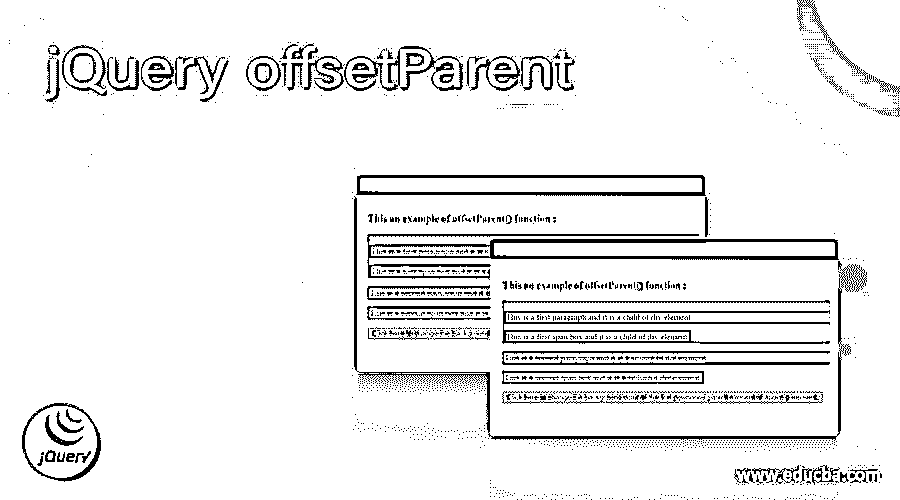
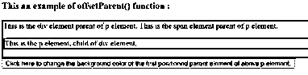
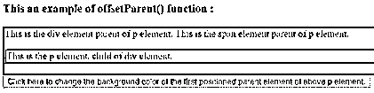
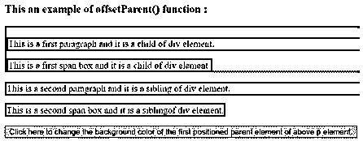
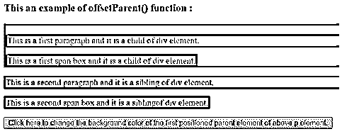
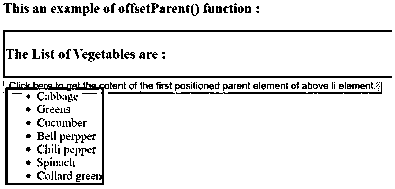
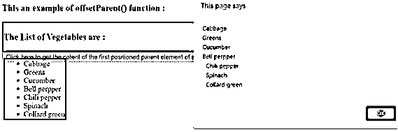

# jQuery offsetParent

> 原文：<https://www.educba.com/jquery-offsetparent/>




## jQuery offsetParent 的描述

jQuery offsetParent()函数用于获取位置最近的祖先元素。jQuery offsetParent()函数是 jQuery 中的内置函数。jQuery offsetParent()函数在 DOM 树中搜索这些元素的祖先，然后为它创建一个新的 jQuery 对象。jQuery 或 CSS position 属性(如 absolute、fixed 和 relative)可用于定位元素。

**语法:**

<small>网页开发、编程语言、软件测试&其他</small>

```
$( selector ).offsetParent();
```

**参数:**

它不需要任何参数。

返回值:

该函数的返回值是位置最近的父元素。

### jQuery offsetParent()函数如何工作？

JQuery offsetParent()函数不接受任何参数。假设我们在 HTML 页面中有一个具有相对位置属性的 div 元素，它包含一些子元素“p”和“span”。现在我们需要获得 p 元素的位置最近的父元素，所以我们可以使用 offsetParent()函数作为“$(“p”)。offset parent()；"它返回 div 及其内容。

### jQuery offsetParent()函数的示例

获取 p 元素的第一个定位的父元素的示例

#### 示例#1

```
<!doctype html>
<html lang="en">
<head>
<meta charset = "utf-8">
<script src = "https://code.jquery.com/jquery-3.5.0.js"> </script>
<title> This is an example for jQuery offsetParent( ) function </title>
<style>
#p1 {
border : 3px solid red;
}
div {
border: 3px solid blue;
position: relative;
}
</style>
<script>
function disp()
{
$( "#p1" ).offsetParent().css( "color", "red" );
}
</script>
</head>
<body>
<h3> This an example of offsetParent() function : </h3>
<div> This is the div element parent of p element.
 This is the span element parent of p element.
<p id = "p1"> This is the p element, child of div element. </p>

</div>
<button onclick = "disp()"> Click here to change the background color of the first positioned parent element of above p element. </button>
</body>
</body>
</html>
```

上述代码的输出是–




一旦我们点击按钮，输出是




在上面的代码中，有一个“p”元素，p 元素的父元素是一个“div”元素，它的 position 属性设置为 relative。接下来，当我们单击按钮时，它调用 offsetParent()函数，offsetParent()函数获取 p 元素的位置最近的父元素，即 div 元素作为“$(“# P1”)。offsetParent()。css("背景色"，"黄色")；"，并将格式样式应用于“div”元素及其内容，正如我们在上面的输出中所看到的。

jQuery offsetParent()函数的示例，用于获取多个 p 元素中第一个定位的 p 元素的父元素

#### 实施例 2

```
<!doctype html>
<html lang="en">
<head>
<meta charset = "utf-8">
<script src = "https://code.jquery.com/jquery-3.5.0.js"> </script>
<title> This is an example for jQuery offsetParent( ) function </title>
<style>
#p1, span {
border : 3px solid red;
}
div {
border: 3px solid blue;
position: relative;
}
</style>
<script>
function disp()
{ $( "#p1" ).offsetParent().css( "background-color", "yellow" );
}
</script>
</head>
<body>
<h3> This an example of offsetParent() function : </h3>
<div>
<p id= "p1"> This is a first paragraph and it is a child of div element. </p>
 This is a first span box and it is a child of div element. 
</div>
<p id= "p1"> This is a second paragraph and it is a sibling of div element. </p>
 This is a second span box and it is a siblingof div element. 
<br>
<button onclick = "disp()"> Click here to change the background color of the first positioned parent element of above p element. </button>
</body>
</html>
```

上述代码的输出是




一旦我们点击按钮，输出是




在上面的代码中，有两个“p”元素，第一个 p 元素的父元素是“div”元素，它的 position 属性设置为 relative。接下来，当我们单击按钮时，它调用 offsetParent()函数，offsetParent()函数获取 p 元素的位置最近的父元素，即 div 元素作为“$(“# P1”)。offsetParent()。css("背景色"，"黄色")；"，并将格式样式应用于“div”元素及其内容，正如我们在上面的输出中所看到的。

获取 ul 元素的第一个定位的父元素的 jQuery offsetParent()函数示例

#### 实施例 3

```
<!doctype html>
<html lang="en">
<head>
<meta charset = "utf-8">
<script src = "https://code.jquery.com/jquery-3.5.0.js"> </script>
<title> This is an example for jQuery offsetParent( ) function </title>
<style>
#p1, div {
border : 3px solid red;
}
ul {
border: 3px solid blue;
position: relative;
}
</style>
<script>
function disp()
{
var content = $( "#li1" ).offsetParent().text();
alert(content);
}
</script>
</head>
<body>
<h3> This an example of offsetParent() function : </h3>
<div>
<h3> The List of Vegetables are : </h3>
<ul>
<li id = "li1" > Cabbage </li>
<li> Greens </li>
<li> Cucumber </li>
<li> Bell perpper </li>
<li> Chili pepper </li>
<li> Spinach </li>
<li> Collard green </li>
</ul>
</div>
<button onclick = "disp()"> Click here to get the cotent of the first positioned parent element of above li element. </button>
</body>
</html>
```

上述代码的输出是–




一旦我们点击按钮，输出是




在上面的代码中，存在“li”元素，并且“li”元素的父元素是“ul”元素，其位置属性设置为 absolute。接下来，当我们单击它调用 offsetParent()函数的按钮时，offsetParent()函数将获取 li 元素中位置最近的父元素，即作为$( "#li1 ")的" ul "元素。offset parent()；”，并使用警报显示其内容，正如我们在上面的输出中看到的。

### 结论

jQuery offsetParent()函数是一个内置函数，用于获取位置最近的祖先元素。

### 推荐文章

这是一个 jQuery offsetParent 的指南。这里我们讨论 jQuery offsetParent()函数的介绍、语法、工作原理以及代码实现的例子。您也可以看看以下文章，了解更多信息–

1.  [jQuery 合并](https://www.educba.com/jquery-merge/)
2.  [jQuery 选择值](https://www.educba.com/jquery-select-value/)
3.  [jQuery ajax 超时](https://www.educba.com/jquery-ajax-timeout/)
4.  [jQuery ajax headers](https://www.educba.com/jquery-ajax-headers/)


