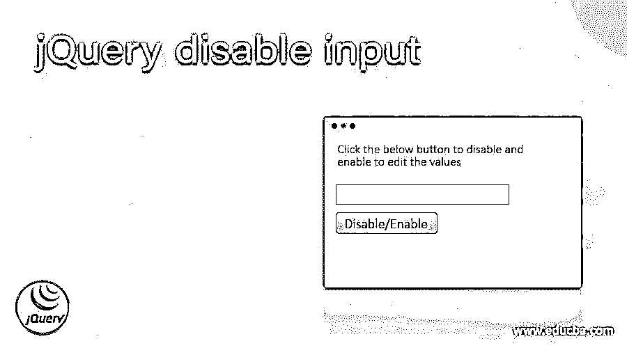
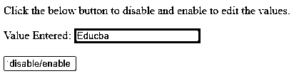
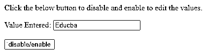
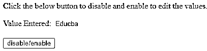
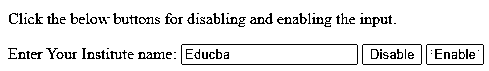

# jQuery 禁用输入

> 原文：<https://www.educba.com/jquery-disable-input/>




## jQuery 禁用输入简介

在 jQuery 中，禁用输入被定义为禁用输入字段或输入元素，这意味着对于输入任何值的任何用户，它将使输入字段变灰，这是使用 attr()函数完成的，在该函数中，我们使用“disabled”关键字以及作为 attr()函数的参数指定的禁用属性来禁用属性。一般来说，我们可以将禁用的输入声明或定义为灰显输入字段或输入元素，对于这些输入字段或输入元素，此属性被声明为禁用，以便在参数中将此输入元素禁用为 attr()函数的“disabled ”,该函数应用于任何具有给定名称的输入元素。

**语法:**

<small>网页开发、编程语言、软件测试&其他</small>

```
$(selector_name).attr('disabled', 'disabled');
```

在上面给出的语法中，指定的选择器名称是指定元素名称，该元素名称是输入字段名称或输入框元素，以及用于在 jQuery 中禁用该输入元素的 attr()函数。

**参数:**

disabled:这用于指定输入的属性以使其禁用，第二个参数是可选的，因为当我们想要禁用任何选择器标签或指定了元素名称的元素时，指定了“disabled ”,这被认为是禁用或灰化该元素的属性。类似地，如果我们想要启用这个被禁用的元素，那么我们必须使用 remove()函数从这个元素中删除在这个函数中声明的“disabled”属性。

### 如何使用 attr()和 prop()函数在 jQuery 中禁用输入字段或元素？

在 jQuery 中，为了禁用输入字段或元素，我们使用 attr()函数来禁用或灰显输入字段或输入元素。首先，在 jQuery 中，有两种方法可以禁用输入元素或输入字段，比如 prop()和 attr()函数，但是通常对于输入禁用，我们只使用 attr()函数。attr()函数首先应用于输入元素、输入字段或输入框，然后是点运算符和 attr()函数，其中有两个参数传递给该函数，这两个参数都声明为“disabled”。这是在禁用匹配或指定的元素时完成的。第二个参数是可选的，但是当我们禁用这两个参数时，这两个参数都是必须的，因为给定元素的属性在 attr()函数的第二个属性中被声明为“disabled ”,如果相同的属性用于启用这个禁用的元素，那么我们必须使用 removeAttr()函数删除第二个参数中的“disabled”属性。类似地，prop()也有“disabled”属性，这里我们声明 true 或 false 以及该属性，如果值为 true，则表示禁用，如果值为 false，则表示启用。

现在让我们用一个例子来演示在 jQuery 中使用 attr()函数禁用输入:

#### 示例#1

```
<!DOCTYPE html>
<html>
<head>
<title> Demonstration of disabling input using attr() function in jQuery </title>
<style>
.grey{
background-color:grey;
}
</style>
<script src="https://ajax.googleapis.com/ajax/libs/jquery/3.2.1/jquery.min.js"></script>
</head>
<body>
<p> Click the below button to disable and enable to edit the values. </p>
Value Entered: <input id="Int_Name" class="grey" value="Educba" disabled="disabled" />
<br>
<br>
<input type="button" id="btn" value="disable/enable" />
<script>
$(document).ready(function(){
$("#btn").click(function() {
$("#Int_Name").attr('disabled', !$("#Int_Name").attr('disabled'));
$("#Int_Name").removeClass("grey");
});
});
</script>
</body>
</html>
```

**输出:**




点击按钮后，输出如下所示




点击按钮后，输出如下所示




在上面的代码中，我们可以在 body 标记中看到，我们正在定义 input 元素及其 id 和类，以指定需要应用于该 input 元素的属性，然后我们还定义了值为“Educba”的 value，然后我们还使用 disabled 作为在 input 元素中定义的另一个选项，其值设置为“disabled ”,因为我们将该字段设置为 disabled，这意味着我们首先以灰色显示它，以表明它是灰色的，如第一个屏幕截图所示。然后，我们创建了另一个输入元素，其类型为 button，id 为“btn ”,以便在功能逻辑中进一步指定或引用该按钮变得容易，按钮名称为“disable/Enable ”,用于禁用或启用输入元素，当单击 Enable 时，它使用户编辑输入字段中的值，如果再次单击，它将禁用相同的输入字段，不允许用户编辑值。然后，在函数逻辑中引用相同的内容，我们使用 attr()函数，并为具有给定 id“Int _ Name”的输入元素指定属性为“disabled”。为了启用同一个 input 元素，我们将 removeAttr()函数指定给同一个 input 元素，该元素具有相同的 id。因此，输出如上面的截图所示。现在我们将看到另一个例子，我们使用 prop()函数来禁用 jQuery 中的输入，但是这个函数可以在 1.5 以上的版本中使用。

#### 实施例 2

```
<!DOCTYPE html>
<html>
<head>
<title> Demonstration of input disable using prop() function in jQuery </title>
</head>
<body>
<p> Click the below buttons for disabling and enabling the input. <p>
Enter Your Institute name: <input type="text" id="Inst_name">
<button id="btn_disable" > Disable </button>
<button id="btn_enable" > Enable </button>
<script src="http://code.jquery.com/jquery-1.6.2.min.js"></script>
<script>
$(document).ready(function() {
$("#btn_enable").click(function(){
$("#Inst_name").prop("disabled", false);
});
$("#btn_disable").click(function(){
$("#Inst_name").prop("disabled", true);
});
});
</script>
</body>
</html>
```

**输出:**




点击禁用按钮后-


在上面的代码中，示例与前面的代码相似，但是在这段代码中，我们使用 prop()函数代替 jQuery 中的 attr()函数来禁用和启用 input 元素。在这段代码中，唯一的区别是当我们使用 prop()函数时，该函数应用于所创建的按钮。当“disabled”是 prop()函数的另一个属性时，我们使用 true 作为偏移值，用于禁用用户在 input 元素中输入的值，同样，我们声明 false 以启用在 input 元素中输入的值。输出如上面的截图所示。

### 结论

在本文中，我们得出结论，在 jQuery 中禁用任何输入元素或输入字段都是使用 attr()或 prop()函数完成的，这些函数也用于禁用 jQuery 中除输入字段之外的任何表单元素。在 jQuery 中，相同元素的启用是通过在 attr()函数之前使用 remove 关键字从函数参数中删除“disabled”属性来完成的。

### 推荐文章

这是一个 jQuery 禁用输入的指南。在这里，我们讨论的介绍，语法，代码实现的例子。您也可以看看以下文章，了解更多信息–

1.  [jQuery 数组](https://www.educba.com/jquery-array/)
2.  [jQuery 验证错误放置](https://www.educba.com/jquery-validate-errorplacement/)
3.  [jQuery 有](https://www.educba.com/jquery-has/)
4.  [jQuery 索引](https://www.educba.com/jquery-index/)


