# jQuery 表单验证

> 原文：<https://www.educba.com/jquery-form-validation/>

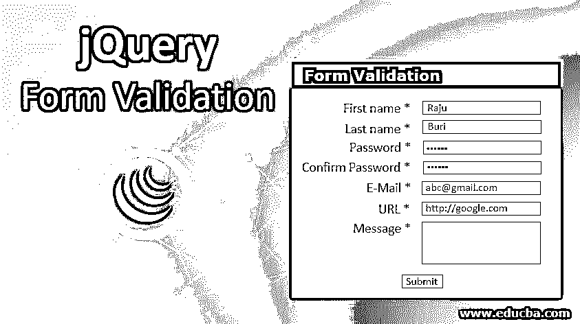


## jQuery 表单验证简介

在这个 jQuery 表单验证中，我们将创建一个基本的表单，并对表单进行验证。在我们将数据提交到数据库之前，验证表单是很重要的。在这种情况下，我们将使用带验证的 HTML 文件来验证客户端验证，然后再将其提交给服务器。

**语法:**

<small>网页开发、编程语言、软件测试&其他</small>

我们在这个程序中使用了必需的。

```
required (dependency-expression)
```

*   它是字符串类型的。它返回布尔值。它不接受任何参数。如果字段为空，它将返回 false。它将根据字段显示消息。
*   空白也被认为是有效的。
*   这适用于文本输入、选择、复选框和单选按钮。

### jQuery 表单验证是如何工作的？

我们在编写程序时必须考虑的重要事情是包含 jQuery 库和验证插件。我们应该把它们写在 HTML 文件的头部分，否则它就不起作用。用一个例子说明了工作原理。

**举例:**

这是一个表单验证的小例子。在这个表单中，我们有名字、姓氏、密码、确认密码、电子邮件、URL 和消息。在这个程序中，我已经在文件中复制了 jQuery 最新版本的代码，命名为 jquery.min.js，并在脚本 src 中使用。

*   我们可以在函数的代码中看到，我们已经使用 required 验证了名字和姓氏，password 和 confirm password 也使用 required，它的最小长度应为 5 个字符，电子邮件、URL 和消息也使用 required，对于消息，它应该显示消息“请输入消息”。
*   在样式中，我们提供了字体大小、显示、高度、宽度、空白、填充、颜色、左边距、右边距、顶部、文本对齐和其他细节，使表单看起来更好。
*   接下来，我们将输入字段设置为文本、密码和提交。

**代码**

```
<html>
<head>
<title>Form Validation</title>
<script type="text/javascript" src="jquery.min.js"></script>
<script type="text/javascript" src="https://cdn.jsdelivr.net/jquery.validation/1.15.1/jquery.validate.min.js"></script>
<script type="text/javascript">
$(document).ready(function() {
$("#formdetails").validate({
rules: {
fname: "required",
lname: "required",
email: {
required: true,
email: true
},
pwd: {
required: true,
minlength: 5
},
cpwd: {
required: true,
minlength: 5
},
url: {
url: true
},
comment: {
required: true
}
},
messages: {
comment: "Please enter a message."
}
});
});
</script>
<style type="text/css">
{ font-family: Calibri;
font-size: 12px;
line-height: 16px;
}
.submit {
margin-left: 125px;
margin-top: 10px;
}
.label {
display: block;
float: left;
width: 150px;
text-align: right;
margin-right: 5px;
}
.Details-info {
padding: 12px 0;
clear: both;
width: 800px;
}
label.error
{
width: 250px;
display: block;
float: left;
color: red;
padding-left: 10px;
}
input[type=text], textarea { width: 300px; float: left; }
textarea {
height: 100px;
}
input[type=password], textarea { width: 300px; float: left; }
</style>
</head>
<body>
<left><h1>Form Validation</h1></left>
<form id="formdetails" method="post" action="">
<div class="Details-info">First Name *<input type="text" name="fname" /></div>
<div class="Details-info">Last Name *<input type="text" name="lname" /></div>
<div class="Details-info">Password *<input type="password" name="pwd" /></div>
<div class="Details-info">Confirm Password *<input type="password" name="cpwd" /></div>
<div class="Details-info">E-Mail *<input type="text" name="email" /></div>
<div class="Details-info">URL<input type="text" name="url" /></div>
<div class="Details-info">Message *<textarea name="comment" ></textarea></div>
<div class="Details-info"><input class="submit" type="submit" value="Submit"></div>
</form>
</body>
</html>
```

**输出:**

*   运行代码后，我们可以看到如下所示的输出。

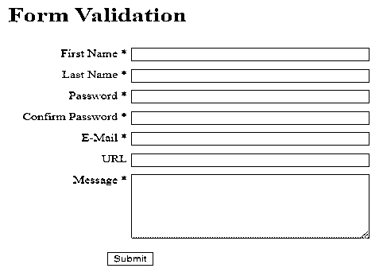


*   在输入数据之前，如果我们单击提交按钮，我们将得到如下所示的输出。

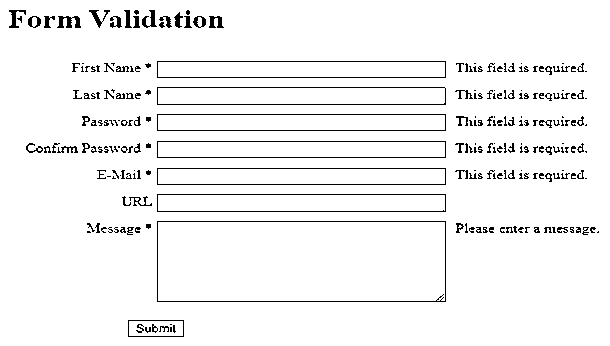


*   我们可以看到，由于我们没有输入任何数据，我们可以看到显示的消息显示此字段是必填的，请输入一条消息。
*   输入名字和姓氏后，我们可以看到如下所示的输出。

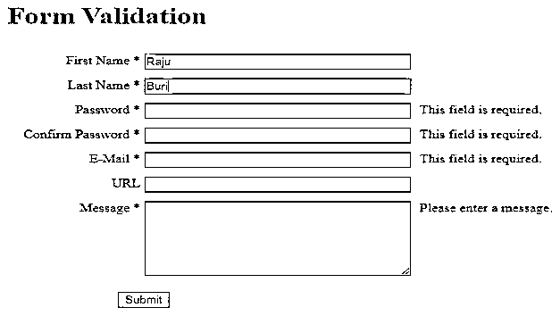


*   当我们输入名字和姓氏的数据时，我们可以看到消息没有显示。
*   对于密码，正如我们在代码中提到的，它要求最小长度为 5。如果我们输入少于 5 个字符，它将显示消息请输入至少 5 个字符。

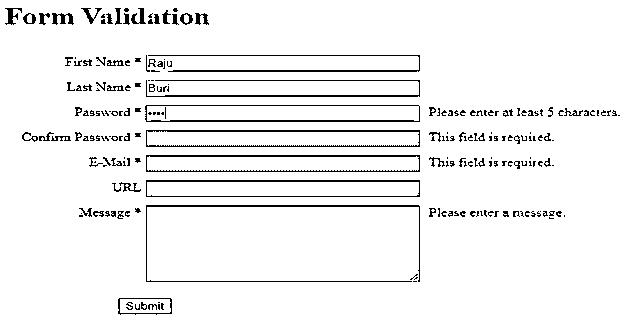


*   正如我们在上面的图像中看到的，我们只输入了 4 个字符的密码，所以它显示消息请输入至少 5 个字符。
*   确认密码也是如此，我们可以在下图中看到。

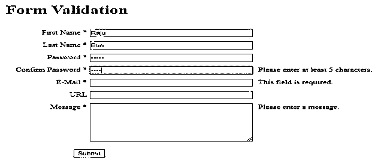


*   正如我们在下图中看到的，由于我们给了密码 5 个字符，所以没有显示消息。

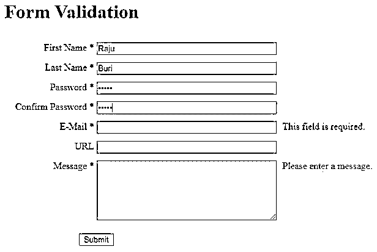


*   对于电子邮件，如果我们没有提供正确的电子邮件 id，它将显示消息请输入有效的电子邮件地址，如下所示。

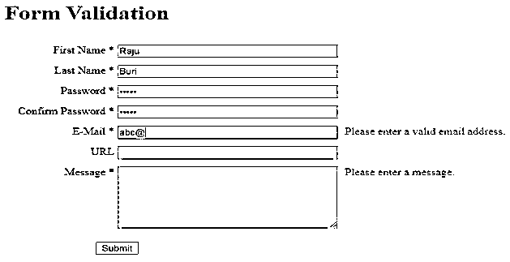


*   输入正确的电子邮件 id 后，不会显示如下图所示的消息。

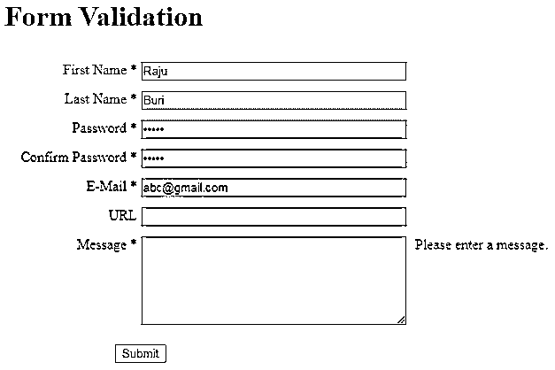


*   对于与电子邮件 id 相同的 URL，如果我们没有提供正确的 URL，它将显示消息请输入一个有效的 URL，正如我们在下图中看到的。

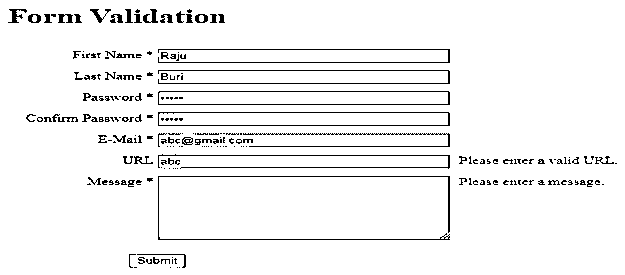


*   如果我们输入一个正确的网址，它不会显示消息，因为我们可以在下图中看到它。

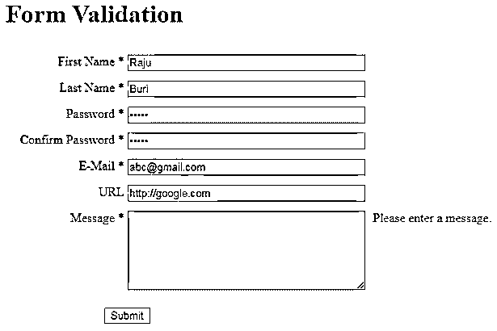


*   对于消息，如果我们不输入任何消息，它将显示消息请输入一条消息，正如我们在上面的图像中看到的。
*   当我们输入消息时，我们可以看到消息不会像下图所示那样显示。

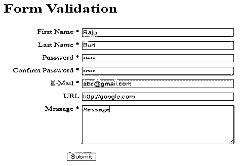


*   因此，一旦我们单击提交按钮，它将从客户端转到服务器。一旦它被提交到服务器，它将返回到正常的形式，我们可以看到它在下面的图片。

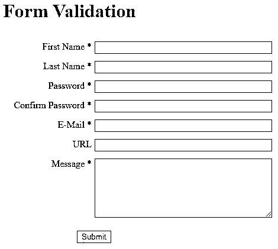


### 结论

这是一个使用 jQuery 进行验证的例子。因此，通过使用 jQuery 验证插件，不需要从基础层面编写代码。通过使用一些规则，表单中的字段将被这个插件验证。通过使用这个，它将帮助我们工作得更快，更容易。

### 推荐文章

这是一个 jQuery 表单验证指南。这里我们将讨论 jQuery 表单验证是如何工作的，并给出相应的例子。您也可以看看以下文章，了解更多信息–

1.  [jQuery unload()](https://www.educba.com/jquery-unload/)
2.  [jQuery empty()](https://www.educba.com/jquery-empty/)
3.  [jQuery Slidetoggle()](https://www.educba.com/jquery-slidetoggle/)
4.  [jQuery load()](https://www.educba.com/jquery-load/)


