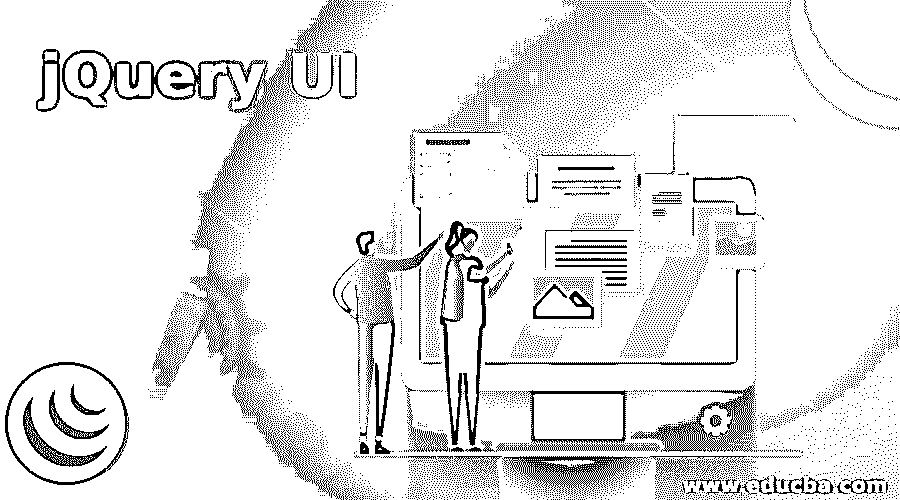
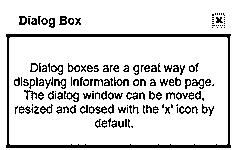

# jQuery UI

> 原文：<https://www.educba.com/jquery-ui/>




## jQuery UI 简介

jQuery UI 是一组组织良好的重要用户界面交互、动画视觉效果、小部件和主题，构建在 jQuery JS 库之上，用于开发视觉上吸引人且高度交互的 web 应用程序。它是一个开源的 jQuery JS 库，无需任何成本，维护成本非常低，功能强大，易于 web 开发。jQuery UI 使用 jQuery、CSS 和 HTML 实现各种交互和功能。

### 什么是 jQuery UI？

*   jQuery UI 是使用 jQuery、CSS 和 HTML 实现的各种用户界面交互、动画效果、小部件和主题的集合。
*   这是一个构建在 jQuery JavaScript 库之上的免费开源库。
*   jQuery UI 轻量级、快速且易于使用，是开发高度交互式 web 应用程序的最流行和最强大的 JS 库之一。

jQuery UI 分为四组:

<small>网页开发、编程语言、软件测试&其他</small>

1.  **交互:**一组插件，使用户能够与 DOM 元素交互，例如，拖放、调整大小等。
2.  **小部件:** jQuery 插件，帮助创建用户界面元素，如日期选择器、进度条、手风琴等。
3.  **Effects:** 构建在内部 jQuery effects 的基础上，它们包含一套完整的 DOM 元素自定义动画效果。
4.  **Utilities:**jQuery UI 内部使用的 Position、Widget Factory 等一组模块化工具。

### jQuery UI 的重要性

*   jQuery UI 以其丰富的特性和稳定性在 web 开发中扮演着重要的角色。
*   jQuery UI 提供的动画效果、小部件和交互特性使它成为 web 开发的理想选择。
*   jQuery UI 最重要的特点就是开源，免费使用库，可以轻松满足任何企业产品相关的各种授权需求。
*   jQuery UI 提供了广泛的浏览器支持，几乎兼容所有主流浏览器。
*   它是轻量级的，使用起来很快，可以按需加载，这有助于节省带宽，从而提高性能。
*   jQuery UI 提供了许多不同种类的主题、自定义样式规则和动画视觉效果，使 web 页面看起来更具交互性和视觉吸引力。

#### jQuery UI 的使用

使用 jQuery UI 的主要步骤是在代码中包含 jQuery UI 源文件。这些文件可以通过以下方式使用。

1.  使用 jQuery UI CDN 中的单个文件。
2.  使用下载生成器在您自己的服务器上本地安装文件。
3.  在 AMD 上使用 jQuery UI
4.  使用 jQuery UI

jQuery UI 包含许多称为小部件的小部件来维护状态，因此可能与其他 jQuery 插件的使用模式略有不同。

### 实现 jQuery UI 的示例

现在让我们看一个实现 jQueryUI 库来开发交互式网页的例子。

#### 例子

下面是一个非常简单的例子来展示 jQueryUI 的强大。

```
<!DOCTYPE html>
<head>
<title>jQuery UI Dialog Example</title>
<link
rel="stylesheet"
href="//code.jquery.com/ui/1.12.1/themes/base/jquery-ui.css"/>
<script src="https://code.jquery.com/jquery-1.12.4.js"></script>
<script src="https://code.jquery.com/ui/1.12.1/jquery-ui.js"></script>
<script>
$(function () {
$("#dialog").dialog();
});
</script>
<style>
#dialog {
width: 600px;
height: 250px;
padding-top: 20px;
padding-left: 5px;
font-size: 16px;
text-align: center;
color: maroon;
background-color: cadetblue;
}
</style>
</head>
<body>
<div id="dialog" title="Dialog Box">
<p>
Dialog boxes are a great way of displaying information on a web page.
The dialog window can be moved, resized and closed with the 'x' icon by default.
</p>
</div>
</body>
</html>
```

在上面的例子中，

```
<linkrel="stylesheet" href="//code.jquery.com/ui/1.12.1/themes/base/jquery-ui.css" />
<script src="https://code.jquery.com/jquery-1.12.4.js"></script>
<script src="https://code.jquery.com/ui/1.12.1/jquery-ui.js"></script>
```

*   上面代码中的第一行通过 CSS 添加了一个 jQuery UI 主题，使 UI 看起来更加时尚。
*   上面代码中的第二行添加了 jQuery 库。这是必需的，因为 jQuery UI 构建在这个库的基础上。
*   上面代码中的第三行添加了 jQuery UI 库，这使得 jQuery UI 特性可以在 web 页面上使用。

```
<script>
$(function () {
$("#dialog").dialog();
});
</script>
```

*   上面的代码就是写在 head 标签里面的内容。
*   这将在交互式覆盖图中打开内容。

```
<body>
<div id="dialog" title="Dialog Box">
<p>
Dialog boxes are a great way of displaying information on a web page.
The dialog window can be moved, resized and closed with the 'x' icon by default.
</p>
</div>
</body>
```

*   上述代码被添加到代码的主体部分。

**输出:**

*   当上面的代码被执行时，下面的屏幕显示。

**

** 

*   每个 jQuery UI 小部件都有一个默认配置。要将插件设置为非默认值，可以使用选项来覆盖默认设置。
*   例如，progressbar()小部件有像 disabled、max 和值这样的选项。

```
$("#progressbar").progressbar({
value: 20
});
```

*   还可以传递更多选项，每个选项用逗号分隔。

```
$("#progressbar").progressbar({
value: 20,
max:300
});
```

#### jQuery UI 的优势

下面提到的是使用 jQuery UI 的优点。

*   jQuery UI 是开源的，可以免费使用 JS 库，这使得所有用户都可以使用它，而不用担心许可成本。
*   它提供了广泛的动画效果、主题和小部件，有助于制作高度定制的交互式和用户友好的 web 应用程序。
*   jQuery UI 是一个非常稳定的库，几乎不需要维护。
*   它兼容几乎所有的浏览器。
*   稳定且易于维护。
*   jQuery UI 库通过提供健壮的小部件、交互和动画视觉效果来帮助简化 web 开发。

### 结论

在本文中，我们详细讨论了什么是 jQuery UI，它的特性、用法和优点。jQuery UI 构建在 jQuery JavaScript 库之上，提供各种交互特性、小部件和主题，使用 jQuery、HTML 实现，CSS 是用于高度交互、定制和视觉上吸引人的 web UI 开发的流行库之一。

### 推荐文章

这是一个 jQuery UI 的指南。在这里，我们讨论 jQuery UI 及其重要性、用途、优势、示例以及代码实现的简要概述。您也可以浏览我们推荐的其他文章，了解更多信息——

1.  [jQuery toggle()简介](https://www.educba.com/jquery-toggle/)
2.  [jQuery empty()(示例)](https://www.educba.com/jquery-empty/)
3.  [如何使用 jQuery insertAfter()方法？](https://www.educba.com/jquery-insertafter/)
4.  [jQuery appendTo() |参数|示例](https://www.educba.com/jquery-appendto/)


