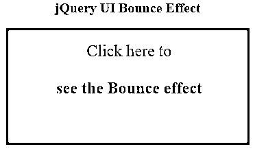
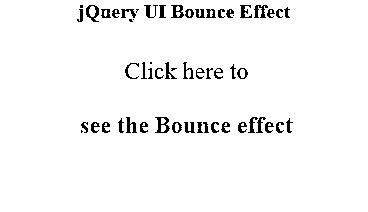
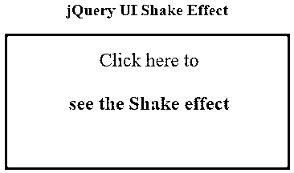
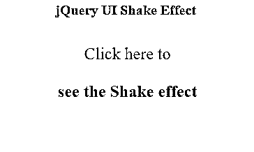
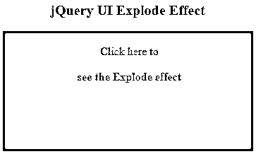
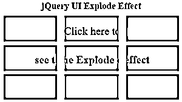
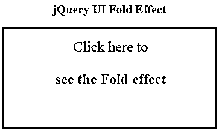
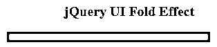
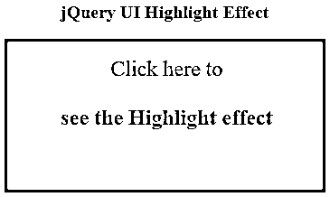
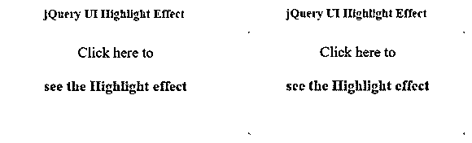

# jQuery UI 效果()

> 原文：<https://www.educba.com/jquery-ui-effect/>


## jQuery UI 效果介绍()

jQuery UI effect()方法用于将动画效果应用于任何 DOM 元素。jQuery UI 提供了这个方法来提供大量的各种动画，以创建视觉效果，使 UI 看起来对用户更有吸引力和更有趣。jQuery UI effect()方法基本上将命名的效果应用于任何元素，其中要使用的效果的名称被传递给 effect()方法。许多效果也支持显示和隐藏模式，可以使用 show()、hide()和 toggle()方法实现。

**语法:**

<small>网页开发、编程语言、软件测试&其他</small>

```
$(selector).effect(effectType[, options ] [, duration ] [, complete ]);
```

在哪里，

*   **effectType:** 这是一个字符串参数，指定用于所选元素的效果类型。
*   **选项:**这是一个对象，它指定了特定于效果的某些属性、设置和缓动，每个效果都有自己的一组选项。
*   **duration:** 这是一个 Number 或 String 类型的参数，指定动画效果发生的持续时间(毫秒)。
*   **complete:** 这里指的是一个回调方法，一旦动画完成，这个回调方法就会被调用。

### jQuery UI effect()方法是如何工作的？

jQuery UI effect()方法通过将命名的动画效果应用到选定的元素来工作。该方法管理应用于所选元素的各种动画效果，以使网页更具吸引力和交互性。

元素可以被隐藏，使之可见，摇动，使之跳动，还有更多这样的效果可以用这种方法来应用。

### 实现 jQuery UI effect()的示例

让我们看一些例子来理解 jQuery UI effect()方法的工作原理。

#### 示例#1

让我们考虑一个简单的例子来理解带有“bounce”效果类型的 effect()方法的功能。

**代码:**

```
<!DOCTYPE html>
<head>
<title>jQuery UI Effect Example</title>
<link
href="https://code.jquery.com/ui/1.10.4/themes/ui-lightness/jquery-ui.css"
rel="stylesheet"
/>
<script src="https://code.jquery.com/jquery-1.12.4.js"></script>
<script src="https://code.jquery.com/ui/1.12.1/jquery-ui.js"></script>
<script>
$(document).ready(function () {
$("#box-div").click(function () {
$("#box-div ").effect(
"bounce",
{
times: 5,
distance: 100,
},
2000,
function () {
$(this).css("background", "yellow");
}
);
});
});
</script>
<style>
#box-div {
width: 350px;
height: 150px;
padding-top: 20px;
padding-left: 5px;
font-size: 24px;
text-align: center;
color: maroon;
background-color: cadetblue;
}
</style>
</head>
<body>
<center>
<b style="font-size: 20px;">jQuery UI Bounce Effect</b>
<br /><br />
<div id="box-div">
Click here to<br /><br /><b>see the Bounce effect</b>
</div>
</center>
</body>
</html>
```

**输出:**

*   执行上述代码时，屏幕显示如下。




*   现在，当您单击盒子时，您将看到反弹效果，其中盒子将在垂直或水平方向上出现反弹，并且一旦动画完成，盒子的颜色将发生变化，指示效果完成。




#### 实施例 2

以下示例说明了 effect()方法在“shake”效果类型中的用法。

**代码:**

```
<!DOCTYPE html>
<head>
<title>jQuery UI Effect Example</title>
<link
href="https://code.jquery.com/ui/1.10.4/themes/ui-lightness/jquery-ui.css"
rel="stylesheet"
/>
<script src="https://code.jquery.com/jquery-1.12.4.js"></script>
<script src="https://code.jquery.com/ui/1.12.1/jquery-ui.js"></script>
<script>
$(document).ready(function () {
$("#box-div").click(function () {
$("#box-div ").effect(
"shake",
{
times: 5,
distance: 100,
},
2000,
function () {
$(this).css("background", "yellow");
}
);
});
});
</script>
<style>
#box-div {
width: 350px;
height: 150px;
padding-top: 20px;
padding-left: 5px;
font-size: 24px;
text-align: center;
color: maroon;
background-color: cadetblue;
}
</style>
</head>
<body>
<center>
<b style="font-size: 20px;">jQuery UI Shake Effect</b>
<br /><br />
&lt;div id="box-div">
Click here to<br /><br /><b>see the Shake effect</b>
</div>
</center>
</body>
</html>
```

**输出:**

*   执行上述代码时，屏幕显示如下。




*   当这个盒子被点击时，它开始水平或垂直地前后摇晃。
*   动画效果完成后，方框的颜色会发生变化，如下图所示。




#### 实施例 3

以下示例说明了 effect()方法与“explode”效果类型的用法。

**代码:**

```
<!DOCTYPE html>
<head>
<title>jQuery UI Effect Example</title>
<link
href="https://code.jquery.com/ui/1.10.4/themes/ui-lightness/jquery-ui.css"
rel="stylesheet"
/>
<script src="https://code.jquery.com/jquery-1.12.4.js"></script>
<script src="https://code.jquery.com/ui/1.12.1/jquery-ui.js"></script>
<script>
$(document).ready(function () {
$("#box-div").click(function () {
$("#box-div ").effect({
effect: "explode",
easing: "easeInExpo",
pieces: 9,
duration: 1500
});
});
});
</script>
<style>
#box-div {
width: 350px;
height: 150px;
padding-top: 20px;
padding-left: 5px;
text-align: center;
color: maroon;
background-color: cadetblue;
}
</style>
</head>
<body>
<center>
<b style="font-size: 20px;">jQuery UI Explode Effect</b>
<br /><br />
<div id="box-div">
Click here to<br /><br /><b>see the Explode effect</b>
</div>
</center>
</body>
</html>
```

**输出:**

*   当上面的代码被执行时，下面的屏幕显示。




*   一旦该框被点击，爆炸动画效果开始。
*   可以看到元素框分裂成多个部分(在本例中是 9 个),并在径向上移动，就像从页面中爆炸出来一样，如下所示。




#### 实施例 4

以下示例说明了 effect()方法与“fold”效果类型的用法。

**代码:**

```
<!DOCTYPE html>
<head>
<title>jQuery UI Effect Example</title>
<link
href="https://code.jquery.com/ui/1.10.4/themes/ui-lightness/jquery-ui.css"
rel="stylesheet"
/>
<script src="https://code.jquery.com/jquery-1.12.4.js"></script>
<script src="https://code.jquery.com/ui/1.12.1/jquery-ui.js"></script>
<script>
$(document).ready(function () {
$("#box-div").click(function () {
$("#box-div ").effect({
effect: "fold",
easing: "easeInExpo",
duration: 3000
});
});
});
</script>
<style>
#box-div {
width: 350px;
height: 150px;
padding-top: 20px;
padding-left: 5px;
font-size: 24px;
text-align: center;
color: maroon;
background-color: cadetblue;
}
</style>
</head>
<body>
<center>
<b style="font-size: 20px;">jQuery UI Fold Effect</b>
<br /><br />
<div id="box-div">
Click here to<br /><br /><b>see the Fold effect</b>
</div>
</center>
</body>
</html>
```

**输出**

*   当上面的代码被执行时，下面的屏幕显示。




*   单击该框后，折叠动画效果开始，相对的边界向内或向外调整，并对其他边界集重复相同的操作。




#### 实施例 5

以下示例说明了 effect()方法与“highlight”效果类型的用法。

**代码:**

```
<!DOCTYPE html>
<head>
<title>jQuery UI Effect Example</title>
<link
href="https://code.jquery.com/ui/1.10.4/themes/ui-lightness/jquery-ui.css"
rel="stylesheet"
/>
<script src="https://code.jquery.com/jquery-1.12.4.js"></script>
<script src="https://code.jquery.com/ui/1.12.1/jquery-ui.js"></script>
<script>
$(document).ready(function () {
$("#box-div").click(function () {
$("#box-div ").effect({
effect: "highlight",
duration: 3000
});
});
});
</script>
<style>
#box-div {
width: 350px;
height: 150px;
padding-top: 20px;
padding-left: 5px;
font-size: 24px;
text-align: center;
color: maroon;
background-color: cadetblue;
}
</style>
</head>
<body>
<center>
<b style="font-size: 20px;">jQuery UI Highlight Effect</b>
<br /><br />
<div id="box-div">
Click here to<br /><br /><b>see the Highlight effect</b>
</div>
</center>
</body>
</html>
```

**输出:**

*   当上面的代码被执行时，下面的屏幕显示。




*   点击方框后，高亮效果开始，通过瞬间改变背景颜色来显示方框，如下所示。




### 结论

*   jQuery UI effect()方法可用于通过使用 jQuery effects 使 HTML 或 DOM 元素与各种其他动画一起显示、隐藏和淡入淡出，从而使 web 页面在视觉上更具吸引力和交互性。
*   这个方法基本上是将一个命名的动画效果应用到任何元素上。

### 推荐文章

这是 jQuery UI effect()的指南。在这里，我们讨论 jQuery UI effect()及其示例和代码实现的简要概述。您也可以浏览我们推荐的其他文章，了解更多信息——

1.  [jQuery toggle()简介](https://www.educba.com/jquery-toggle/)
2.  [jQuery empty()(示例)](https://www.educba.com/jquery-empty/)
3.  [如何使用 jQuery insertAfter()方法？](https://www.educba.com/jquery-insertafter/)
4.  [jQuery appendTo() |参数|示例](https://www.educba.com/jquery-appendto/)


