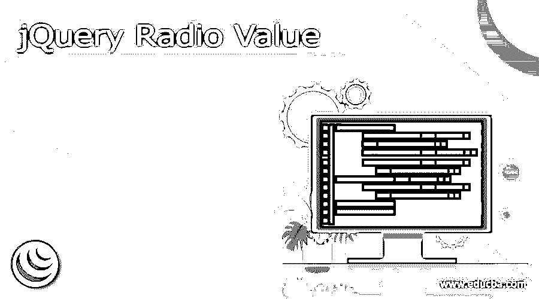
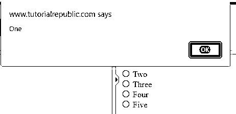
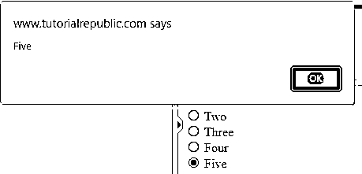
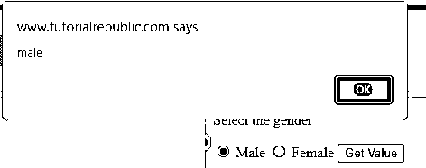
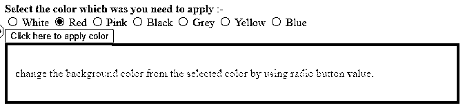
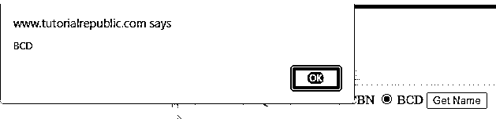

# jQuery 单选值

> 原文：<https://www.educba.com/jquery-radio-value/>




## jQuery 无线电值简介

jQuery radio 值是通过使用选中的选择器和 Val 方法获得的。要获取匹配无线电组件的值，请使用 Val 方法。如果没有选择任何选项，它将产生一个未定义的值。checked CSS 伪类选择器表示任何选中的单选按钮，可用于访问选定的单选按钮。有了 jQuery 和普通的 JavaScript，我们可以做很多不同的事情。

*   为了确定在表单中选择了哪个单选按钮，我们必须首先获得所需的输入组，其中包括作为选项的输入类型，然后使用 val 方法来访问这个选择的值。此处返回当前所选选项的名称。
*   使用选择器输入选择所提供表单中选项类型输入的所有输入组。

### 如何获取 jQuery 单选值？

*   通过修改输入类型的 checked 属性，有两种方法可以动态改变当前选中的单选按钮。
*   复选框、单选按钮和选择元素选项与选中的选择器一起工作。此外，选定的选择器可用于仅获得选择元素的选定选项。
*   对于 jQuery 中的点击或更改事件，我们有时需要访问单选按钮的选定值。
*   这是一个次要的细节，但是我们使用类或 id 来访问 jQuery 中所选单选按钮的值。我们实际上总是需要在表单中使用一个男性/女性单选按钮。
*   当使用单选按钮时，我们很少需要通过单击或修改 javascript 事件来检索选中的单选按钮值。
*   另一方面，他们不会认为这是一种有压力的责任。获取单选按钮的选定值。
*   使用选中的选择器选择所有选中的复选框、单选按钮和元素选项。
*   Val 方法检索输入项的值，如单选按钮、select 元素或 textarea 元素。Val 方法不需要任何参数。
*   以下示例通过使用选定的单选按钮显示了警报值。

**代码—**

<small>网页开发、编程语言、软件测试&其他</small>

```
<!DOCTYPE html>
<html>
<head>
<form>
<div>
<input type = "radio" name = "Number" value = "One" id = "Yellow">
<label> One </label>
</div>
<div>
<input type = "radio" name = "Number" value = "Two" id = "Pink">
<label> Two </label>
</div>
<div>
<input type = "radio" name = "Number" value = "Three" id ="White">
<label> Three </label>
</div>
<div>
<input type = "radio" name = "Number" value = "Four" id = "Blue">
<label> Four </label>
</div>
<div>
<input type = "radio" name = "Number" value = "Five" id = "Black">
<label> Five </label>
</div>
</form>
<script>
$('input[name="Number"]').on("click", function() {
var Number = $('input[name = "Number"]:checked').val();
alert(Number);
});
</script>
</head>
<body>
</body>
</html>
```







*   在上面的例子中，我们使用了五个单选按钮，通过点击每个单选按钮来提醒它。此外，我们使用了 checked selector 方法从指定的单选按钮中选择值。
*   我们已经在脚本部分编写了检查选择器方法代码。我们在定义单选按钮时使用了输入类型作为单选按钮。
*   下面的示例显示了当单击指定的按钮时，警告所选单选按钮的值。

**代码—**

```
<!DOCTYPE html>
<html>
<head>
<p> Select the gender </p>
<input type = "radio" name="gender" value = "male">
<label>Male</label>
<input type = "radio" name = "gender" value = "female">
<label> Female </label>
<input type = "button" value = "Get Value">
<script>
$(document).ready(function() {
$("input[type = 'button']").click(function() {
var gender = $("input[name = 'gender']:checked").val();
alert(gender);
});
});
</script>
</head>
<body>
</body>
</html>
```




*   在上面的例子中，我们使用了两个单选按钮来提醒指定单选按钮的值。此外，我们使用 Val 方法从指定的单选按钮中选择值。
*   我们已经在脚本部分编写了 Val 方法代码。此外，在定义单选按钮时，我们将输入类型用作单选按钮。
*   下面的例子显示了使用单选按钮值改变背景颜色。

**代码—**

```
<!DOCTYPE html>
<html>
<head>
<form>
<div class="form-group">
<label> <strong> Select the color which was you need to apply </strong>:-</label> <br>
<label> <input type = "radio" name="color" value = "White"> White </label>
<label> <input type = "radio" name="color" value = "Red"> Red </label>
<label> <input type = "radio" name="color" value = "Pink"> Pink </label>
<label> <input type = "radio" name="color" value = "Black"> Black </label>
<label> <input type = "radio" name="color" value = "Grey"> Grey </label>
<label> <input type = "radio" name="color" value = "Yellow"> Yellow </label>
<label> <input type = "radio" name="color" value = "Blue"> Blue </label>
</div>
<div class="form-group text-center">
<button class="btn" type="button">Click here to apply color</button>
</div>
</form>
<div id='div' style='padding:35px 15px;'> change the background color from the selected color by using radio button value. </div>
<script type="text/javascript">
$('.btn').click(function() {
var value = $('input[name="color"]:checked').val();
$('#div').css('background', value)
});
</script>
</head>
<body>
</body>
</html>
```




*   在上面的例子中，我们使用了六个单选按钮来改变颜色。此外，我们使用 Val 方法从指定的单选按钮中选择单选按钮。
*   以下示例显示了从值列表中选择的值。

**代码—**

```
<!DOCTYPE html>
<html>
<head>
<title> Get the value </title>
<script src = "https://ajax.googleapis.com/ajax/libs/jQuery/3.5.1/jQuery.min.js">
</script>
</head>
<body>
<input type = "radio" name = "Name" class = "Names" value = "ABC"> ABC
<input type = "radio" name = "Name" class = "Names" value = "PQR"> PQR
<input type = "radio" name = "Name" class = "Names" value = "XYZ"> XYZ
<input type = "radio" name = "Name" class = "Names" value = "CBN"> CBN
<input type = "radio" name = "Name" class = "Names" value = "BCD"> BCD
<button> Get Name </button>
<script type = "text/javascript">
$("button").click(function()
{
var val = $(".Names:checked").val();
alert(val);
});
</script>
</body>
</html>
```




### 结论

复选框、单选按钮和选择元素选项与选中的选择器一起使用。选定的选择器只能获得选择元素的选定选项。JQuery radio 值是通过使用选中的选择器和 Val 方法获得的。要获取匹配无线电组件的值，请使用 Val 方法。

### 推荐文章

这是一个 jQuery Radio 值的指南。这里我们讨论如何获得 jQuery radio 值以及代码和输出。您也可以阅读以下文章，了解更多信息——

1.  [jQuery mouseup()](https://www.educba.com/jquery-mouseup/)
2.  [jQuery 数组推送](https://www.educba.com/jquery-array-push/)
3.  [jQuery Ajax 同步](https://www.educba.com/jquery-ajax-synchronous/)
4.  [Settimeout jQuery](https://www.educba.com/settimeout-jquery/)


