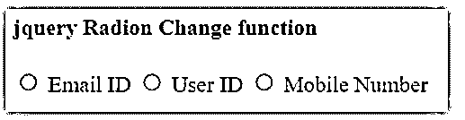
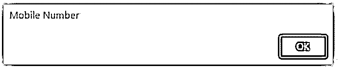
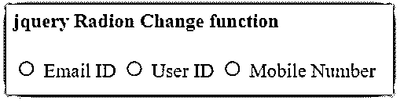
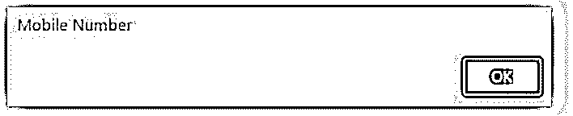
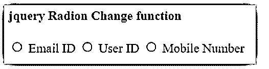
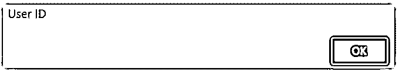
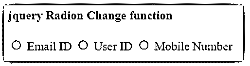
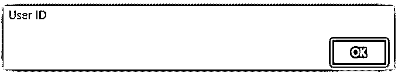
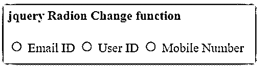
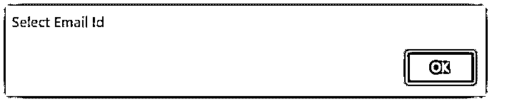

# jQuery 无线电更改

> 原文：<https://www.educba.com/jquery-radio-change/>


## jQuery 电台变更简介

当存在两个或更多互斥选项的列表并且用户必须选择一个选项时，使用 jQuery 单选按钮更改事件。单选按钮更改事件适用于单击未选中的单选按钮将取消选择列表中先前选中的任何其他按钮。当使用 jquery 技术更改单选按钮的值和信息时，就会发生单选按钮更改事件。radio change 方法或者触发 change 事件，或者连接单选按钮以在发生 change 事件时执行。

### jQuery 单选按钮变化概述

html 表单中包含单选类型的输入元素。表单输入元素手动选择特定的按钮。如果要使用事件函数更改单选按钮的值，请使用事件和函数。当您可以选择单选按钮时，将触发 change 事件。

<small>网页开发、编程语言、软件测试&其他</small>

**语法:**

下面显示了单选按钮的功能语法，用于单选按钮的更改。

```
<form id = "radio_box">
<input type = "radio" id = "email" name = "contcts" value = "Email ID">
<label for = "email"> Email ID </label>
</form>
```

无线电更改语法如下所示:

```
<script>
$(document).ready(function(){
$('#radio_box').change(function(){
selected_value = $("input[name='contacts']:checked").val();
alert(selected_value);
});
</script>
```

**说明:**

*   change()方法用于在单击单选按钮后显示所需的功能或显示所需的数据。
*   输入标签元素包括一个用于用户交互的单选按钮。

### 如何使用 jQuery Radio Change？

以下步骤用于在网页中创建电台变更功能。

*   **步骤 1:** 在 html 文件的 head 部分使用在线链接或文件。

```
<script src="https://ajax.googleapis.com/ajax/libs/jquery/3.6.0/jquery.min.js"></script>
```

*   **步骤 2:** 使用表单创建一个单选按钮。

```
<form id = "radio_box"> Write form elements along with Radio button. </form>
```

*   **第三步:**用它的值创建一个单选按钮。

```
<input type = "radio" id = "mobile" name = "contacts" value = "Mobile Number" onchange = "alert(this.value)">
<label for = "mobile"> Mobile Number </label>
```

*   **步骤 4:** 将所有单选按钮的名称相似地放入，以应用单选按钮更改功能。
*   **步骤 5:** 在 head 部分或 body 部分使用脚本标签。
*   **第六步:**使用 jquery 文档函数。
*   **第 7 步:**在收音机更换功能内应用收音机更换功能。

```
$('#radio_box').change(function(){
selected_value = $("input[name = 'contacts']:checked").val();
alert(selected_value);
});
```

*   该步骤有助于操作收音机更换功能。您可以使用直接输入标记，也可以使用元素的类或 id。

### jQuery Radio 检测到了这种变化

单选按钮更改检测使用 jquery 脚本标记中的 change()方法。

单选按钮中需要一些事件和元素。

*   为用户交互创建单选按钮类型的输入标记。
*   所有无线电类型都要求在输入标记中有一个相似的名称。
*   使用带有警报值的“onchange”元素。

**代码:**

```
<!DOCTYPE html>
<html>
<head>
<script src="https://ajax.googleapis.com/ajax/libs/jquery/3.6.0/jquery.min.js"></script>
</head>
<body>
<form id="radio_box">
<input type = "radio" id = "mobile" name = "contacts" value = "Mobile Number">
<label for = "mobile"> Mobile Number </label>
</form>
<script>
$(document).ready(function(){
$('#radio_box').change(function(){
selected_value = $("input[name='contacts']:checked").val();
alert(selected_value);
});
});
</script>
</body>
</html>
```

### jQuery 单选按钮更改的示例

下面是提到的例子:

#### 示例#1

基本无线电更改示例和输出如下所示。

**代码:**

```
<!DOCTYPE html>
<html>
<head>
<script src="https://ajax.googleapis.com/ajax/libs/jquery/3.6.0/jquery.min.js"></script>
</head>
<body>
<h4> jquery Radion Change function </h4>
<form id="radio_box">
<input type = "radio" id = "email" name = "contacts" value = "Email ID" onchange = "alert(this.value)">
<label for = "email"> Email ID </label>
<input type = "radio" id = "user" name = "contacts" value = "User ID" onchange = "alert(this.value)">
<label for = "user"> User ID </label>
<input type = "radio" id = "mobile" name = "contacts" value = "Mobile Number" onchange = "alert(this.value)">
<label for = "mobile"> Mobile Number </label>
</form>
<script>
$(document).ready(function(){
$("input").change();
});
</script>
</body>
</html>
```

**输出:**







#### 实施例 2

带有变量和警告框的单选按钮更改示例。

**代码:**

```
<!DOCTYPE html>
<html>
<head>
<script src="https://ajax.googleapis.com/ajax/libs/jquery/3.6.0/jquery.min.js"></script>
</head>
<body>
<h4> jquery Radion Change function </h4>
<form id="radio_box">
<input type = "radio" id = "email" name = "contacts" value = "Email ID">
<label for = "email"> Email ID </label>
<input type = "radio" id = "user" name = "contacts" value = "User ID>
<label for = "user"> User ID </label>
<input type = "radio" id = "mobile" name = "contacts" value = "Mobile Number">
<label for = "mobile"> Mobile Number </label>
</form>
<script>
$(document).ready(function(){
$('#radio_box').change(function(){
selected_value = $("input[name='contacts']:checked").val();
alert(selected_value);
});
});
</script>
</body>
</html>
```

**输出:**







#### 实施例 3

没有变量和警告框的单选按钮更改示例。

**代码:**

```
<!DOCTYPE html>
<html>
<head>
<script src="https://ajax.googleapis.com/ajax/libs/jquery/3.6.0/jquery.min.js"></script>
</head>
<body>
<h4> jquery Radion Change function </h4>
<form id="radio_box">
<input type = "radio" id = "email" name = "contacts" value = "Email ID">
<label for = "email"> Email ID </label>
<input type = "radio" id = "user" name = "contacts" value = "User ID>
<label for = "user"> User ID </label>
<input type = "radio" id = "mobile" name = "contacts" value = "Mobile Number">
<label for = "mobile"> Mobile Number </label>
</form>
<script>
$(document).ready(function(){
$('#radio_box').change(function(){
alert($("input[name='contacts']:checked").val());
});
});
</script>
</body>
</html>
```

**输出:**







#### 实施例 4

显示输出值的单选按钮更改示例。

**代码:**

```
<!DOCTYPE html>
<html>
<head>
<script src="https://ajax.googleapis.com/ajax/libs/jquery/3.6.0/jquery.min.js"></script>
</head>
<body>
<h4> jquery Radion Change function </h4>
<form id="radio_box">
<input type = "radio" id = "email" name = "contacts" value = "Email ID">
<label for = "email"> Email ID </label>
<input type = "radio" id = "user" name = "contacts" value = "User ID">
<label for = "user"> User ID </label>
<input type = "radio" id = "mobile" name = "contacts" value = "Mobile Number">
<label for = "mobile"> Mobile Number </label>
</form>
<script>
$(document).ready(function(){
$('#radio_box').change(function(){
selected_value = $("input[name='contacts']:checked").val();
document.write(selected_value);
});
});
</script>
</body>
</html>
```

**输出:**







#### 实施例 5

具有“if else”条件的单选按钮更改示例。

**代码:**

```
<!DOCTYPE html>
<html>
<head>
<script src="https://ajax.googleapis.com/ajax/libs/jquery/3.6.0/jquery.min.js"></script>
</head>
<body>
<h4> jquery Radion Change function </h4>
<form id="radio_box">
<input type = "radio" id = "email" name = "contacts" value = "Email ID">
<label for = "email"> Email ID </label>
<input type = "radio" id = "user" name = "contacts" value = "User ID">
<label for = "user"> User ID </label>
<input type = "radio" id = "mobile" name = "contacts" value = "Mobile Number">
<label for = "mobile"> Mobile Number </label>
</form>
<script>
$(document).ready(function(){
$('input[type=radio][name=contacts]').change(function(){
if (this.value == "Email ID") {
alert("Select Email Id");
}else if (this.value == "User ID") {
alert("Select User Id");
}
else if (this.value == "Mobile Number") {
alert("Select Mobile Number");
}
});
});
</script>
</body>
</html>
```

**输出:**







### 结论

单选按钮更改功能用于检测单选按钮值的更改。此功能用于用户与网页表单的交互。它使用更改功能从多个选项中选择一个值。

### 推荐文章

这是一个 jQuery 电台变化的指南。这里我们分别讨论介绍、使用方法和例子。您也可以看看以下文章，了解更多信息–

1.  [jquery 滚动到元素](https://www.educba.com/jquery-scroll-to-element/)
2.  [jQuery hasAttribute()](https://www.educba.com/jquery-hasattribute/)
3.  [jQuery 父母](https://www.educba.com/jquery-parents/)
4.  [jQuery 星级](https://www.educba.com/jquery-star-rating/)


