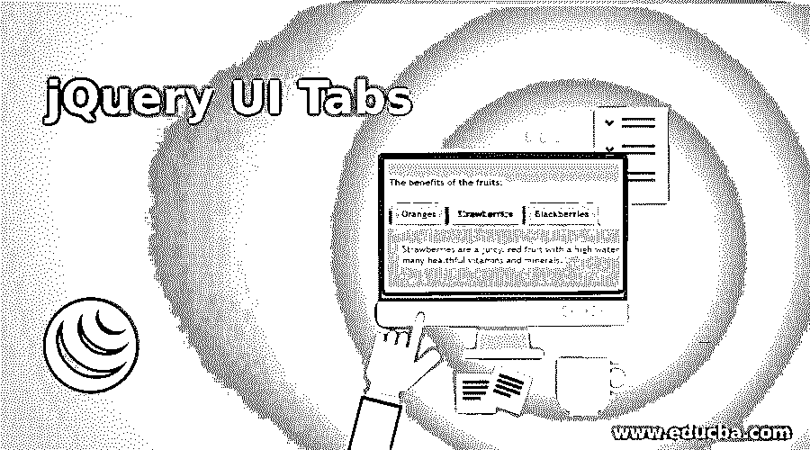
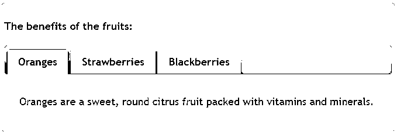
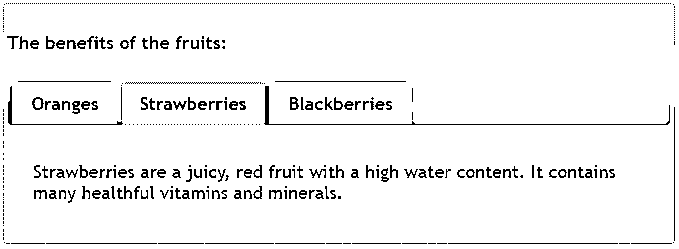
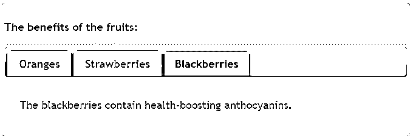
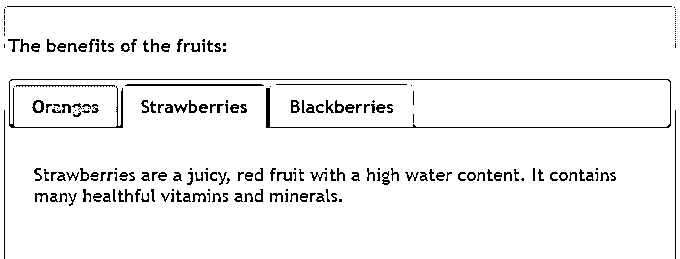
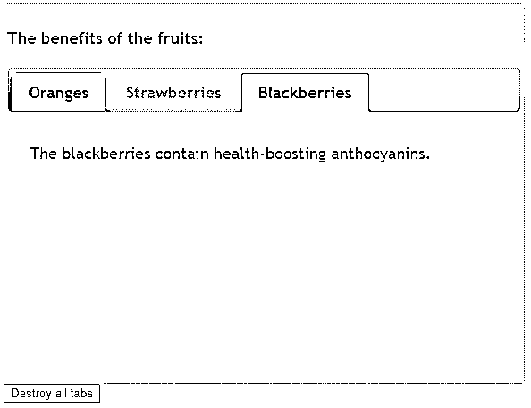
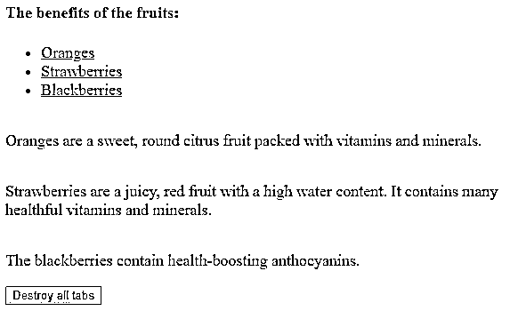

# jQuery UI 选项卡

> 原文：<https://www.educba.com/jquery-ui-tabs/>




## jQuery UI 选项卡简介

jQuery UI Tabs()方法可用于创建选项卡小部件，这些小部件用于在单独的部分显示内容。选项卡的目的是对内容集进行逻辑分组，并在它们之间进行翻转。要定义标签，标签应该在

*   (list), and enclose the element marked with 

### 语法和参数

有两种方法可以使用 tabs()方法:

<small>网页开发、编程语言、软件测试&其他</small>

**语法#1:**

```
$(selector, context).tabs (options)
```

这是第一个方法，它将特定的 HTML 元素声明为选项卡。options 参数指定选项卡的外观和行为。如果选项不止一个，则可以使用此方法，并且每个选项应使用逗号分隔，如下所示:

```
object. $(selector, context).tabs({opt1 : value1, opt2 : value2 ... });
```

**语法#2:**

```
$(selector, context).tabs ( "action", params )
```

这是将 html 元素声明为按钮并在选项卡上执行操作的第二种方法。要执行的操作以字符串形式传递，如禁用、选择、添加或移除选项卡。

**参数:**

**1。选项:**在第一个方法$(选择器，上下文)。按钮(选项)，它只接受一个选项参数。我们可以为该选项使用的可能值列表如下

*   **活动:**指定当前活动的标签或面板。它的默认值是 0。
*   **可折叠:**如果将此选项设置为 TRUE，它允许在单击时取消选择活动标签，并且所有内容面板都隐藏起来。它的默认值是 false。
*   **Disabled:** 指定要禁用的页签，用数组表示被禁用的索引页签，例如 array [0，1]禁用前两个页签。它的默认值是 false。
*   **事件:**指定触发标签页显示内容面板的事件。它的默认值是“点击”。
*   **heightStyle:** 指定控制标签页及其面板的高度。它的默认值是“内容”。
*   **隐藏:**指定面板的动画隐藏。它的默认值是 null。
*   **show:** 指定显示面板的动画。它的默认值是 NULL。

**2。动作:**在第二个方法$(选择器，上下文)中。tabs ( "action "，params)，它接受两个参数，action 和 params。action 参数指定了要在该按钮上执行的操作。该操作的可能值为–

*   **破坏:**破坏或移除 tab 元素的功能，回到原来的状态。它不接受任何参数。
*   **禁用:**用于禁用所有页签的功能。它不接受任何参数。
*   **disable(index):** 用于禁用索引指定的特定页签的功能。
*   **增加:**用于增加新的页签。
*   **选择:**用于激活标签页。
*   **删除:**用于删除一个页签。
*   **length:** 用于获取 widget 中选项卡的数量。
*   **启用:**用于启用所有页签的功能。它不接受任何参数。
*   **enable(index):** 用于启用索引指定的特定页签的功能。
*   **load(index):** 用于重新加载索引指定的特定页签的内容。
*   **option(optName):** 用于获取指定选项的值，作为 optName，是一个字符串。
*   **选项:**用于获取当前包含键值对的对象。
*   **option(optName，value):** 用于设置传递 optName 的 tab 选项。
*   **选项(Options):** 用于以选项-值对映射的形式设置一个或多个页签选项。
*   **url:** 用于改变远程页签的 url。
*   **rotate:** 用于让选项卡小工具在选项卡间循环。
*   **abort:** 用于中止所有活动的 Ajax 请求。
*   **widget:** 用于获取包含 tab 元素的对象。它不接受任何参数。

### jQuery UI 选项卡的示例()

接下来，我们编写 html 代码，通过下面的示例更清楚地理解 jQuery tabs()方法，其中 tabs()方法用于创建选项卡，而不向其传递任何参数，如下所示

#### 示例#1

**代码:**

```
<!doctype html>
<html lang="en">
<head>
<meta charset="utf-8">
<title>This is an example for tabs() method</title>
<link href="https://code.jquery.com/ui/1.10.4/themes/ui-lightness/jquery-ui.css" rel="stylesheet">
<script src="https://code.jquery.com/jquery-1.10.2.js"></script>
<script src="https://code.jquery.com/ui/1.10.4/jquery-ui.js"></script>
<style>
#t1{font-size: 18px;}
.ui-widget-header {
background:lightred;
color: lightyblue;
border: 1px solid #b9cd6d;
font-weight: bold;
}
</style>
<script>
$(function() {
$( "#t1" ).tabs();
});
</script>
</head>
<body>
<div id="t1">
<h4>The benefits of the fruits:</h4>
<ul>
<li><a href="#t2">Oranges</a></li>
<li><a href="#t3">Strawberries</a></li>
<li><a href="#t4">Blackberries</a></li>
</ul>
<div id="t2">
<p>Oranges are a sweet, round citrus fruit packed with vitamins and minerals.</p>
</div>
<div id="t3">
<p>Strawberries are a juicy, red fruit with a high water content. It contains many healthful vitamins and minerals.</p>
</div>
<div id="t4">
<p>The blackberries contain health-boosting anthocyanins.</p>
</div>
</div>
</body>
</html>
```

**输出:**










接下来，我们编写 html 代码来理解 jQuery tabs()方法，其中 tabs()方法使用隐藏、高度样式、活动和可折叠等选项，如下所示

#### 实施例 2

**代码:**

```
<!doctype html>
<html lang="en">
<head>
<meta charset="utf-8">
<title>This is an example for tabs() method</title>
<link href="https://code.jquery.com/ui/1.10.4/themes/ui-lightness/jquery-ui.css" rel="stylesheet">
<script src="https://code.jquery.com/jquery-1.10.2.js"></script>
<script src="https://code.jquery.com/ui/1.10.4/jquery-ui.js"></script>
<style>
#t1{font-size: 18px;}
.ui-widget-header {
background:lightred;
color: lightyblue;
border: 1px solid #b9cd6d;
font-weight: bold;
}
</style>
<script>
$(function() {
$( "#t1").tabs({
heightStyle:"fill",
hide:"slideUp",
active : 1,
collapsible:true,
event:"mouseover"
});
});
</script>
</head>
<body>
<div id="t1">
<h4>The benefits of the fruits:</h4>
<ul>
<li><a href="#t2">Oranges</a></li>
<li><a href="#t3">Strawberries</a></li>
<li><a href="#t4">Blackberries</a></li>
</ul>
<div id="t2">
<p>Oranges are a sweet, round citrus fruit packed with vitamins and minerals.</p>
</div>
<div id="t3">
<p>Strawberries are a juicy, red fruit with a high water content. It contains many healthful vitamins and minerals.</p>
</div>
<div id="t4">
<p>The blackberries contain health-boosting anthocyanins.</p>
</div>
</div>
</body>
</html>
```

**输出:**




接下来，我们编写 html 代码来理解 jQuery tabs()方法，其中 tabs()方法使用像 disable 和 destroy 这样的操作，如下所示

#### 实施例 3

**代码:**

```
<!doctype html>
<html lang="en">
<head>
<meta charset="utf-8">
<title>This is an example for tabs() method</title>
<link href="https://code.jquery.com/ui/1.10.4/themes/ui-lightness/jquery-ui.css" rel="stylesheet">
<script src="https://code.jquery.com/jquery-1.10.2.js"></script>
<script src="https://code.jquery.com/ui/1.10.4/jquery-ui.js"></script>
<style>
#t1{font-size: 18px;}
.ui-widget-header {
background:lightred;
color: lightyblue;
border: 1px solid #b9cd6d;
font-weight: bold;
}
</style>
<script>
$(function() {
$( "#t1").tabs({
heightStyle:"fill",
hide:"slideUp"
});
$("#t1").tabs("disable", 1);
$("#dtabs").click(function() {
$("#t1").tabs("destroy");
});
});
</script>
</head>
<body>
<div id="t1">
<h4>The benefits of the fruits:</h4>
<ul>
<li><a href="#t2">Oranges</a></li>
<li><a href="#t3">Strawberries</a></li>
<li><a href="#t4">Blackberries</a></li>
</ul>
<div id="t2">
<p>Oranges are a sweet, round citrus fruit packed with vitamins and minerals.</p>
</div>
<div id="t3">
<p>Strawberries are a juicy, red fruit with a high water content. It contains many healthful vitamins and minerals.</p>
</div>
<div id="t4">
<p>The blackberries contain health-boosting anthocyanins.</p>
</div>
</div>
<button type="button" id="dtabs">Destroy all tabs</button>
</body>
</html>
```

**输出:**




当我们点击“销毁所有标签”按钮时，输出是:'




### 推荐文章

这是 jQuery UI 标签的指南。在这里，我们还讨论了语法和参数，以及不同的例子和代码实现。您也可以看看以下文章，了解更多信息–

1.  [jQuery Tooltip](https://www.educba.com/jquery-tooltip/)
2.  [jQuery mouseleave()](https://www.educba.com/jquery-mouseleave/)
3.  [jQuery 过滤器](https://www.educba.com/jquery-filter/) 
4.  [jQuery hasClass()](https://www.educba.com/jquery-hasclass/)


