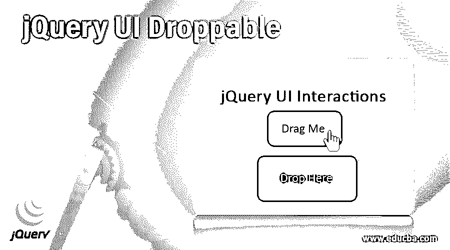
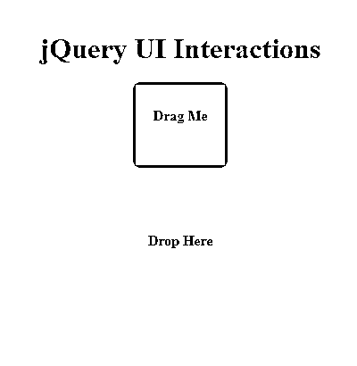
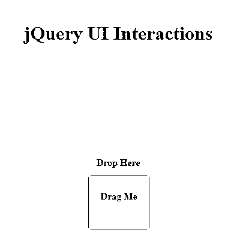
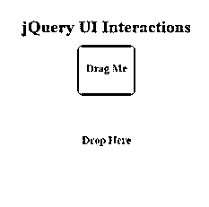
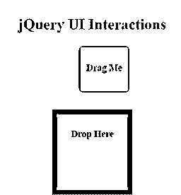
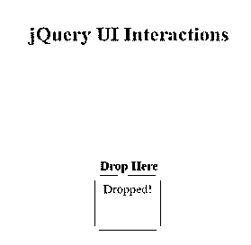
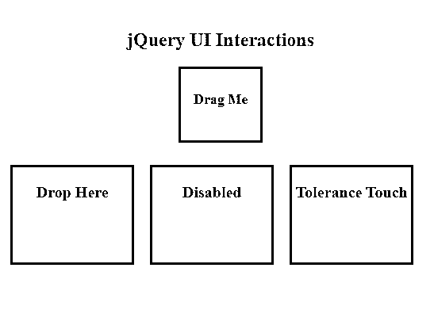
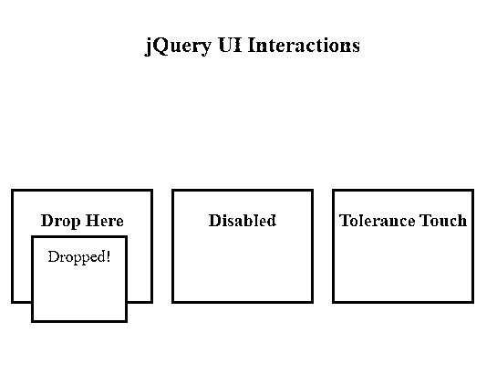
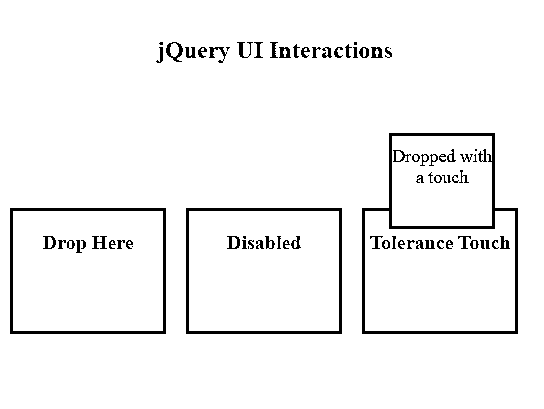

# jQuery UI 可删除

> 原文：<https://www.educba.com/jquery-ui-droppable/>




## jQuery UI Droppable 简介

jQuery UI drop able 是 jQuery UI 交互特性之一，总是与 jQuery UI Draggable 交互(用鼠标点击可拖动的对象并将其放到指定的目标上)一起发生，通过 jQuery UI drop able()方法实现。有助于为可拖动对象创建目标区域，并允许将它们放在那些指定的目标上，然后发生一些动作，因为 drop able()方法创建一个 drop able 事件，每当可拖动对象放在 drop able(目标区域)上时触发该事件，然后使用 drop event 回调向 drop able 添加一些功能，指示已发生放下。

**语法**

<small>网页开发、编程语言、软件测试&其他</small>

有两种形式可以使用 droppable()方法

**1。**第一种方法指定 DOM 元素可以用作可以放下其他 DOM 元素的目标。

```
$(selector, context).droppable(options)
```

**其中**

*   **选项:**参数指定要删除的 DOM 元素的行为。

```
$(selector, context).droppable({option1: value1, option2: value2……})
```

可以通过用逗号分隔来提供一个或多个选项。

此方法可使用的不同选项有接受、容差、范围等。

**2。**第二种方法用于对可删除的元素执行操作。

```
$(selector, context).droppable("action", params)
```

可以与该方法一起使用的一些动作有 accept、addClass、disabled 等。

### jQuery UI Droppable 函数是如何工作的？

*   jQuery UI 可拖放交互总是与 jQuery UI 可拖动交互结合使用。
*   它为要拖放的拖动对象创建目标。
*   这种交互是使用 drop table()方法实现的，该方法创建一个 drop table 事件，并使用处理函数添加所需的功能。

### 例子

下面是提到的例子:

#### 示例#1

让我们考虑一个非常简单的例子来理解如何在没有参数传递给 drop table()方法的情况下创建可丢弃的交互。

**代码:**

```
<!DOCTYPE html>
<html lang="en">
<head>
<title>jQuery UI Droppable</title>
<script src="https://code.jquery.com/jquery-1.10.1.min.js"></script>
<script src="https://code.jquery.com/jquery-1.12.4.js"></script>
<script src="https://code.jquery.com/ui/1.12.1/jquery-ui.js"></script>
<script>
$(function () {
$("#drag").draggable();
$("#drop").droppable();
});
</script>
<style>
#divstyle {
width: 400px;
height: 400px;
padding-top: 20px;
padding-left: 5px;
text-align: center;
background-color: cadetblue;
}
#drag {
width: 100px;
height: 80px;
background: yellow;
text-align: center;
padding-top: 10px;
}
#drop {
width: 150px;
height: 150px;
margin-top: 50px;
background: yellowgreen;
text-align: center;
padding-top: 10px;
}
</style>
</head>
<body>
<div id="divstyle">
<center>
<h1>jQuery UI Interactions</h1>
<div id="drag">
<p><strong>Drag Me</strong></p>
</div>
<div id="drop">
<p><strong>Drop Here</strong></p>
</div&gt
</center>
</div>
</body>
</html>
```

**输出**

*   执行上述代码时，屏幕显示如下。
*   这里，使用 div 元素上的 drop table()方法创建可丢弃的交互，而不传递任何参数。




*   这里，我们指定了一个目标区域，可拖动元素将被放置在该区域中




#### 实施例 2

下面的例子演示了 jQuery UI 可拖放交互，使用选项 activate 和 deactivate 来突出显示 drop 元素。

**代码:**

```
<!DOCTYPE html>
<html lang="en">
<head>
<title>jQuery UI Droppable</title>
<script src="https://code.jquery.com/jquery-1.10.1.min.js"></script>
<script src="https://code.jquery.com/jquery-1.12.4.js"></script>
<script src="https://code.jquery.com/ui/1.12.1/jquery-ui.js"></script>
<script>
$(function () {
$("#drag").draggable();
$("#drop").droppable({
drop: function () {
$("#drag").text("Dropped!");
},
activate: function () {
$("#drop").css({
border: "10px solid black",
backgroundColor: "grey",
});
},
deactivate: function () {
$("#drop").css("border", "").css("background-color", "");
},
});
});
</script>
<style>
#divstyle {
width: 400px;
height: 400px;
padding-top: 20px;
padding-left: 5px;
text-align: center;
background-color: cadetblue;
}
#drag {
width: 100px;
height: 80px;
background: yellow;
text-align: center;
padding-top: 10px;
font-size: 20px;
}
#drop {
width: 150px;
height: 150px;
margin-top: 50px;
background: yellowgreen;
text-align: center;
padding-top: 10px;
font-size: 20px;
}
</style>
</head>
<body>
<div id="divstyle">
<center>
<h1>jQuery UI Interactions</h1>
<div id="drag">
<p><strong>Drag Me</strong></p>
</div>
<div id="drop">
<p><strong>Drop Here</strong></p>
</div>
</center>
</div>
</body>
</html>
```

**输出**

*   当上面的代码被执行时，下面的屏幕显示。
*   在这个例子中，我们试图通过传递选项**激活**和**停用**来创建 jQuery UI 可拖放交互。




*   如下所示，当可拖动元素开始被拖动时，我们试图突出显示拖放目标。







*   这里，droppable 元素触发事件激活，相关的处理函数使用 CSS 方法来应用 CSS 样式。
*   一旦可拖动对象被放到目标区域，事件 deactivates 就会移除 CSS 样式。
*   使用 drop 事件和 text 方法，可拖动元素的文本内容在该元素被放下后会发生变化。

#### 实施例 3

下面是一个示例，通过使用选项 disabled 和 tolerance 演示了 jQuery UI 可拖放交互。

**代码:**

```
<!DOCTYPE html>
<html lang="en">
<head>
<title>jQuery UI Droppable</title>
<script src="https://code.jquery.com/jquery-1.10.1.min.js"></script>
<script src="https://code.jquery.com/jquery-1.12.4.js"></script>
<script src="https://code.jquery.com/ui/1.12.1/jquery-ui.js"></script>
<script>
$(function () {
$("#drag").draggable();
$("#drop1").droppable({
drop: function (event, ui) {
$("#drag").text("Dropped!");
}
});
$( "#drop2" ).droppable({
disabled : "true",
drop: function( event, ui ) {
$("#drag").text("Dropped!");
}
});
$( "#drop3" ).droppable({
tolerance: 'touch',
drop: function( event, ui ) {
$("#drag").text("Dropped with a touch");
}
});
});
</script>
<style>
#divstyle {
width: 550px;
height: 400px;
padding-top: 20px;
padding-left: 5px;
text-align: center;
background-color: cadetblue;
}
#drag {
width: 100px;
height: 80px;
background: yellow;
text-align: center;
padding-top: 10px;
font-size: 18px;
border: solid brown;
}
#drop1,
#drop2,
#drop3 {
width: 150px;
height: 120px;
background: yellowgreen;
float: left;
margin: 10px;
font-size: 20px;
border: solid black;
}
</style>
</head>
<body>
<div id="divstyle">
<center>
<h2>jQuery UI Interactions</h2>
<div id="drag">
<p><strong>Drag Me</strong></p>
</div>
<br>
<div id="drop1">
<p><strong>Drop Here</strong></p>
</div>
<div id="drop2">
<p><strong>Disabled</strong></p>
</div>
<div id="drop3">
<p><strong>Tolerance Touch</strong></p>
</div>
</div>
</center>
</body>
</html>
```

**输出**

*   当上面的代码被执行时，下面的屏幕显示。
*   在这个例子中，我们使用了另外两个选项，disabled 和 tolerance 与 droppable()




*   对于第一个拖放元素，可拖动元素的文本内容在被拖放时会发生变化。
*   对于第二个 drop 元素，设置为“true”的“disabled”选项将禁用它。




*   对于第三个 drop 元素，一旦可拖动元素接触到 drop 元素的边缘，可拖动元素的文本内容就会改变。




### 结论

在本文中，我们讨论了 jQuery UI 可拖放交互，它允许用户为要拖放的可拖动对象创建一个目标拖放区。这种交互总是与 jQuery UI 可拖动交互结合使用。

### 推荐文章

这是一个关于 jQuery UI Droppable 的指南。在这里，我们讨论了 jQuery UI Droppable 的介绍，语法，它是如何工作的编程例子。您也可以浏览我们的其他相关文章，了解更多信息——

1.  [jQuery UI 标签页](https://www.educba.com/jquery-ui-tabs/)
2.  [jQuery Ajax 方法](https://www.educba.com/jquery-ajax-methods/)
3.  [jQuery prop( )](https://www.educba.com/jquery-prop/)
4.  [jQuery wrap()](https://www.educba.com/jquery-wrap/)


