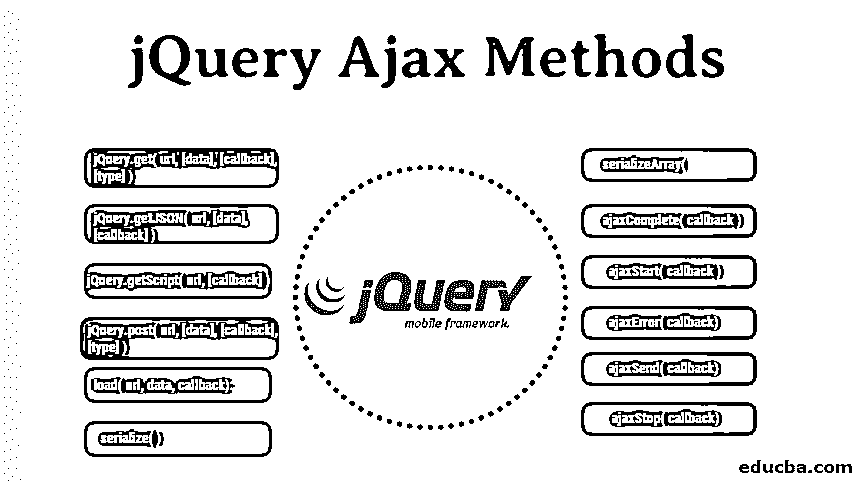

# jQuery Ajax 方法

> 原文：<https://www.educba.com/jquery-ajax-methods/>




## jQuery Ajax 方法概述

让我们首先分发 jQuery 和 ajax 这两个词，并了解它们的字面意思。JQuery 是一个非常轻量级的 javascript 库，它只告诉我们少写多做。但是在来 jQuery 之前，你必须了解 html、 [CSS、javascript](https://www.educba.com/css-vs-javascript/) 的基础知识。jQuery 的主要任务是让开发人员能够轻松地在浏览器上用很少的时间呈现 Javascript。简而言之，我们可以说 jQuery 使用 jQuery 方法将一大行 javascript 代码变成了一行代码。jQuery 还简化了复杂的 javascript 代码、dom 操作和 ajax 调用。

### jQuery Ajax 方法的特性

jQuery 提供了以下特性，如下所示:

<small>网页开发、编程语言、软件测试&其他</small>

*   HTML 事件方法
*   CSS 操作
*   DOM/HTML 操作
*   创建交互式、快速动态网页应用的网页开发技术
*   效果和动画
*   公用事业

我想现在你已经对 jQuery 有了很多基本的了解，所以让我们来看看 AJAX 的含义。 [Ajax 代表异步 javascript](https://www.educba.com/what-is-ajax/) 和 XML(扩展标记语言)。Ajax 是创建动态网页最简单、最容易的方法。Ajax 只是告诉我们不用刷新网页就可以交换数据。这意味着我们可以在不刷新页面的情况下与服务器交换少量数据，或者换句话说，我们可以说 ajax 在不重新加载页面的情况下更新网页。在经典网页中，如果他们想与服务器交换数据或更新网页，他们需要重新加载整个页面。简而言之，让我们讨论一下它是如何工作的。

基本上，每当事件发生时，浏览器都会创建一个 XMLHttpRequest 对象，并向服务器发送一个 HttpRequest。然后，服务器处理这个 HTTPRequest 并创建一个响应，然后将数据发送回浏览器。现在，浏览器使用 javascript 处理返回的数据并更新页面内容。

所以在理解了这两个术语之后，现在是时候讨论这个话题了。那么什么是 jQuery ajax 呢？jQuery 提供了许多帮助 ajax 服务器端更新网页的方法。jQuery ajax 的语法是 jQuery.ajax( url [，settings ]) **，**其中 url 是发送请求的字符串。该设置是普通对象的类型。jQuery ajax 方法只是为 jQuery 中的 ajax 提供了一些有价值的功能。ajax 有一个 url 和一个选项，如下所示:

```
$.ajax(url);
```

```
$.ajax(url,[options]);
```

这里的 url 是一种字符串类型，通过它我们可以发送和接收数据，选项是 ajax 请求配置。jQuery ajax 中有许多选项可用。

我们来讨论其中的一些。

1.  **Accepts:** 它告诉服务器它将接受什么样的响应。
2.  **Async:** 如果我们想要同步发送数据，我们必须将它设置为 false，因为在默认情况下，数据是异步发送或接收的。
3.  **BeforeSend:** 表示在发送 ajax 请求之前，需要执行一个回调函数。
4.  **缓存:**默认为真。浏览器缓存通过布尔值显示。
5.  **完成**:请求完成后，需要执行一个回调函数。
6.  **contentType** :默认内容类型为“application/x-www-form-urlencoded；charset=UTF-8 "。
7.  **跨域**:布尔值表示处理的请求是否跨域。
8.  **数据:**数据是需要发送到服务器的数组、字符串、g 或者对象的形式。
9.  **数据类型:**它是你期望服务器返回的数据类型。
10.  **错误:**表示请求失败时需要执行一个[回调函数](https://www.educba.com/callback-function-in-jquery/)。
11.  **全局:**默认为真。它给出是否激活全局请求的布尔响应。
12.  **Headers:** 一个对象需要和请求一起发送。
13.  **ifModified:** 如果请求与上一次更新后的请求不同，则只有响应有效。
14.  **isLocal:** 它允许当前或现在的开发环境被识别为
15.  **Jsonp:** 在 Jsonp 请求中，它覆盖回调函数。
16.  **jsonpCallback:** 它是一种字符串类型，在回调函数的名称中包含一个 jsonprequest。
17.  它包含一个 mime 类型来覆盖 xmlhttprequest。
18.  **密码:**用于 http 认证请求。
19.  **processData:** 默认情况下为 true，只给出布尔型响应，即分配给 Data 选项的数据是否应该转换为查询字符串。
20.  **statusCode:** 是一个数值型的 http 请求代码，根据对应的代码响应进行响应。
21.  **成功:**如果 httprequest 已经成功，那么应该只执行回调函数。
22.  **超时:**是响应的超时值，以毫秒为单位。
23.  **类型:**是类似 GET、PUT、POST 的 httprequest 的类型。默认情况下，它是 GET。
24.  **url:** 包含需要发送数据的 url 的字符串。
25.  **用户名**:也用于 XMLHTTP 认证请求。
26.  **Xhr:** 创建 xmlhttprequest 对象的回调函数。
27.  **xhrFields:** 是 fieldName-fieldValue 的一对集合值。

### jQuery Ajax 的方法

现在让我们讨论一些 jQuery ajax 方法及其语法和例子。下面是提到的 jQuery 方法。

#### 1.jQuery.get( url，[数据]、[回调]、[类型])

这个方法帮助我们使用 GET HTTP 请求从服务器加载数据。该方法还返回 XMLHttpRequest 对象。

*   **url—**是包含 url 的字符串，数据通过 URL 发送。
*   **Data—**这是可选参数，包含发送到服务器的键和值对。
*   **Callback** 也是可选参数，表示 ajax 请求成功时要执行的函数。
*   **Type—**也是可选参数，返回回调函数后的数据类型，如 html、xml、json、text、jsonp。

**举例:**

```
$(document).ready(function() {
$("#driver2").click(function(event){
$.get(
"result.php",
{ name: "Zara2" },
function(data) {
$('#stage2').html(data);
}
);
});
});
```

#### 2.jQuery.getJSON( url，[数据]，[回调])

这个方法通过 GET HTTP 请求从服务器加载 json 数据。

*   **url–**它是包含 url 的字符串，数据通过该 URL 发送。
*   **Data—**这是可选参数，包含发送到服务器的键和值对。
*   **Callback** 也是可选参数，表示 ajax 请求成功时要执行的函数。

**举例:**

```
$(document).ready(function() {
$("#driver2").click(function(event){
$.getJSON('result.json', function(jd) {
$('#stage2').html('<p> Name: ' + jd.name + '</p>');
$('#stage2').append('<p>Age : ' + jd.age+ '</p>');
$('#stage2').append('<p> Sex: ' + jd.sex+ '</p>');
});
});
});
```

#### 3.jQuery.getScript( url 回调)

该方法通过 HTTP GET 请求加载并执行 javascript 文件。

*   **url–**它是包含 url 的字符串，数据通过该 URL 发送。
*   **Callback** 也是可选参数，表示 ajax 请求成功时要执行的函数。

**举例:**

```
$(document).ready(function() {
$("#driver2").click(function(event){
$.getScript('result.js', function(jd) {
// Call custom function defined in script
CheckJS();
});
});
});
```

#### 4.jQuery.post( url，[数据]、[回调]、[类型])

该方法使用 HTTP POST 请求加载网页。

*   **url—**是包含 url 的字符串，数据通过 URL 发送。
*   **Data—**这是可选参数，包含发送到服务器的键和值对。
*   **Callback** 也是可选参数，表示 ajax 请求成功时要执行的函数。
*   **Type—**也是可选参数，返回回调函数后的数据类型，如 html、xml、json、text、jsonp。

**举例:**

```
$(document).ready(function() {
$("#driver2").click(function(event){
$.post(
"result.php",
{ name: "Zara" },
function(data) {
$('#stage2').html(data);
}
);
});
});
```

#### 5.加载(url、数据、回调)

该方法从服务器加载数据或对象，并将成功请求后返回的 html 替换为匹配的元素。

*   **url–**它是包含 url 的字符串，数据通过该 URL 发送。
*   **Data—**这是可选参数，包含发送到服务器的键和值对。
*   **Callback** 也是可选参数，表示 ajax 请求成功时要执行的函数。

**举例:**

```
$(document).ready(function() {
$("#drive2r").click(function(event){
$('#stage2').load('result.html');
});
});
```

#### 6.序列化( )

此方法有助于将一组输入元素序列化为一组数据数组。这个 jQuery ajax 方法中没有参数。比如说-

```
$(document).ready(function() {
$("#driver2").click(function(event){
$.post(
"/jquery/serialize.php",
$("#testform1").serialize(),
function(data) {
$('#stage2').html(data);
}
);
var str = $("#testform1").serialize();
$("#stage3").text(str);
});
});
```

#### 7.serializeArray()

此方法的功能与 serialize 方法相同；唯一的区别是它返回 json 数据结构。这个方法也没有任何参数。比如说-

```
$(document).ready(function() {
$("#driver2").click(function(event){
$.post(
"/jquery/serialize.php",
$("#testform1").serializeArray(),
function(data) {
$('#stage2').html(data);
}
);
var fields = $("#testform1").serializeArray();
$("#stage3").empty();
jQuery.each(fields, function(i, field){
$("#stage3").append(field.value + " ");
});
});
});
```

#### 8.ajaxComplete(回调)

这个方法在回调函数成功执行时缝合一个函数。

*   **Callback** 也是可选参数，表示 ajax 请求成功时要执行的函数。

**举例:**

```
$(document).ready(function() {
$("#driver2").click(function(event){
$('#stage2').load('result.html');
});
$(document).ajaxComplete(function(event, request, settings){
$("#stage3").html("<h1>Request Complete.</h1>");
});
});
```

#### 9.ajaxStart(回调)

这个方法附加了一个在 ajax 请求开始之前执行的函数。

*   **Callback** 也是可选参数，表示 ajax 请求成功时要执行的函数。

**举例:**

```
$(document).ready(function() {
/* Global variable */
var count = 2;
$("#driver2").click(function(event){
$('#stage2').load('result.html');
});
/* Gets called when the request starts */
$(document).ajaxStart(function(){
count++;
$("#stage3").html("<h1>Starts, Count :" + count + "</h1>");
});
/* Gets called when request complete */
$(document).ajaxComplete(function(event,request,set){
count++;
$("#stage4").html("<h1>Completes,Count:" + count + "</h1>");
});
});
```

#### 10\. ajaxError( callback)

这个方法附加了一个每当 ajax 请求失败时执行的函数。这也是一种 ajax 事件。

*   **Callback** 也是可选参数，表示 ajax 请求成功时要执行的函数。

**举例:**

```
$(document).ready(function() {
$("#driver2").click(function(event){
/* Assume result.text does not exist. */
$('#stage12').load('https://cdn.educba.com/jquery/result.text');
});
$(document).ajaxError(function(event, request, settings ){
$("#stage22").html("<h1>Error in front page.</h1>");
});
});
```

#### 11.ajaxSend(回调)

这个方法在 ajax 请求发送后立即调用一个函数。这也是一个 ajax 事件。

*   **Callback** 也是可选参数，表示 ajax 请求成功时要执行的函数。

**举例:**

```
$(document).ready(function() {
var count = 0;
$("#drive2r").click(function(event){
$('#stage1').load('result.html');
});
$(document).ajaxStart(function(){
count++;
$("#stage12").html("<h1>Starts, Count :" + count + "</h1>");
});
$(document).ajaxSend(function(evt, req, set){
count++;
$("#stage23").html("<h1>Sends, Count :" + count + "</h1>");
$("#stage23").append("<h1>URL :" + set.url  + "</h1>");
});
$(document).ajaxComplete(function(event,request,settings){
count++;
$("#stage33").html("<h1>Completes, Count :" + count + "</h1>");
});
});
```

#### 12.ajaxStop(回调)

这个方法附加了一个在 ajax 请求结束后立即执行的函数。

*   **Callback** 也是可选参数，表示 ajax 请求成功时要执行的函数。

**举例:**

```
$(document).ready(function() {
var count = 0;
$("#driver2").click(function(event){
$('#stage1').load('result.html');
});
$(document).ajaxStart(function(){
count++;
$("#stage12").html("<h1>Starts, Count :" + count + "</h1>");
});
$(document).ajaxSend(function(evt, req, set){
count++;
$("#stage22").html("<h1>Sends, Count :" + count + "</h1>");
$("#stage22").append("<h1>URL :" + set.url  + "</h1>");
});
$(document).ajaxComplete(function(event,request,settings){
count++;
$("#stage3").html("<h1>Completes, Count :" + count + "</h1>");
});
$(document).ajaxStop(function(event,request,settings){
count++;
$("#stage44").html("<h1>Stops, Count :" + count + "</h1>");
});
});
```

#### 13.ajaxSuccess(回调)

这个方法在 ajax 请求成功完成后调用一个函数。

*   **Callback** 也是可选参数，表示 ajax 请求成功时要执行的函数。

**举例:**

```
$(document).ready(function() {
var count = 2;
$("#driver2").click(function(event){
$('#stage2').load('result.html');
});
$(document).ajaxStart(function(){
count++;
$("#stage12").html("<h1>Starts, Count :" + count + "</h1>");
});
$(document).ajaxSend(function(evt, req, set){
count++;
$("#stage22").html("<h1>Sends, Count :" + count + "</h1>");
$("#stage22").append("<h1>URL :" + set.url  + "</h1>");
});
$(document).ajaxComplete(function(event,request,settings){
count++;
$("#stage32").html("<h1>Completes,Count:" + count + "</h1>");
});
$(document).ajaxStop(function(event,request,settings){
count++;
$("#stage42").html("<h1>Stops, Count :" + count + "</h1>");
});
$(document).ajaxSuccess(function(event,request,settings){
count++;
$("#stage52").html("<h1>Success,Count :" + count + "</h1>");
});
});
```

现在让我们来看看 jQuery ajax 方法的重要性，如下所示:

*   它是跨浏览器兼容的，支持几乎所有的浏览器。
*   这是更新网页内容时使用的最简单的方法，无需重新加载页面。
*   它有能力发送 POST 和 GET 请求。
*   它能够加载 html、json、xml 或脚本。

### 推荐文章

这是 jQuery Ajax 方法的指南。在这里我们讨论一些 jQuery Ajax 的基本概念和语法，并举例说明。您也可以查看以下数据分析课程，了解更多信息——

1.  [jQuery 方法](https://www.educba.com/jquery-methods/)
2.  [jQuery 备选方案](https://www.educba.com/jquery-alternatives/)
3.  [Cheatsheet JQuery](https://www.educba.com/cheat-sheet-jquery/)
4.  [jQuery querySelector](https://www.educba.com/jquery-queryselector/)


