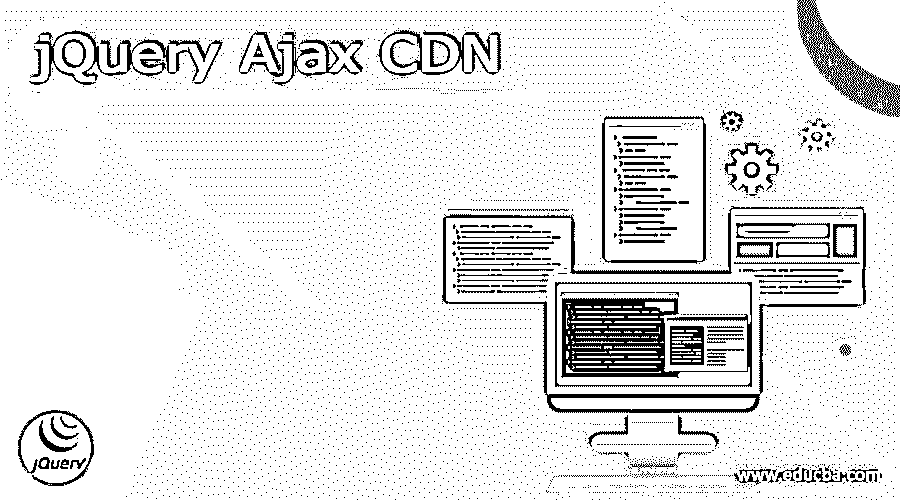
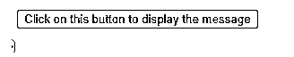
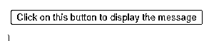

# jQuery Ajax CDN

> 原文：<https://www.educba.com/jquery-ajax-cdn/>




## jQuery Ajax CDN 的定义

jQuery ajax CDN 像 jQuery 一样提供流行的第三方 JavaScript 库；它将允许我们快速地将它们集成到我们的 Web 应用程序中。向我们的页面添加一个指向 ajax 网站的脚本标记，开始利用 jQuery，jQuery 托管在这个 CDN 上。如果我们不想自己下载和托管 jQuery，我们可以使用 CDN(内容交付网络)来获取 jQuery。

### 什么是 jQuery Ajax CDN？

*   通过使用 CDN，我们可以显著提高 Ajax 应用程序的性能。CDN 的资料缓存在世界各地的服务器上。
*   如果我们需要交付使用安全套接字层的网页，CDN 支持 SSL。
*   下面列出的第三方脚本库已经上传到 CDN，并授权给我们。被图书馆所有者。

1) jQuery
2) jQuery 用户界面
3)jQuery Mobile
4)jQuery 验证
5) jQuery 循环
6) jQuery 数据表插件。

<small>网页开发、编程语言、软件测试&其他</small>

*   微软 Ajax CDN 还包括下面列出的库，它们是微软上传的。

①ASP.NET 的阿贾克斯

2)ASP.NET MVC 的 JavaScript 文件

3)ASP.NET 信号的 JavaScript 文件

*   微软不拥有任何托管在 CDN 上的第三方库。相反，这些库是由库的版权所有者许可的。
*   因为这些不是微软的库，微软不为这个 CDN 上的第三方库提供任何担保或知识产权许可。因此，任何下载和使用这些库的权利都是由版权所有者单独授予的。
*   CDN 以前使用 Microsoft 域名；但是，现在它已被替换为 aspnetCDN。
*   这一调整提高了性能，因为当浏览器访问 Microsoft 域时，来自该域的 cookies 会随每个请求一起通过网络发送。
*   CDN 还包含 jQuery 脚本的缩小版；如果 CDN 不可用，就从本地获取 jQuery。
*   如果 CDN 不可用，我们可以添加引用 CDN 的元素，以允许我们的页面默认从网站上的本地路径加载 jQuery。
*   CDN 中也提供了 jQuery UI 库。我们可以在我们的 ASP.NET 应用程序中使用 jQuery UI 库来创建各种小部件和效果。

### jQuery ajax CDN 怎么用？

*   内容交付网络(CDN)是代理服务器的全球网络，允许用户从多个位置查看缓存的信息。它包含图片、CSS 和 javascript 文件等。
*   CDN 的主要目标是缩短最终用户和网站托管服务器之间的物理距离。因此，渲染材质所需的时间和加载速度都有所提高。
*   JQuery 是一个强大的 JavaScript 库，它使得在我们的站点上使用 JavaScript 更加容易。不幸的是，从我们的服务器下载 jQuery 库需要时间并增加了延迟，但是如果我们不想自己托管它，理想的方法是使用 CDN。
*   我们现在要做的就是在代码中包含这个脚本。然后，我们可以使用谷歌或微软的 jQuery 来包含它。

下面是使用 Google CDN 包含 jQuery 的代码，如下所示。

**代码:**

```
<head>
<script src = "https://ajax.googleapis.com/ajax/libs/jQuery/3.3.1/jQuery.min.js">
</script>
</head>
```

下面是通过使用 Microsoft CDN 来包含 jQuery 的代码，如下所示。

**代码:**

```
<head>
<script src = "https://ajax.aspnetCDN.com/ajax/jQuery/jQuery-3.3.1.min.js"></script>
</script>
</head>
```

*   当我们使用 jQuery CDN 时，我们实现了两个目标，即通过 CDN 而不是我们的网站加载 jQuery 文件，并且降低了我们网站的负载。
*   cdn 交付 jQuery 比我们的服务器更快。此外，因为 cdn 是为了速度而构建的，所以它们向距离最近的用户提供 jQuery。
*   cdn 使用数据服务器和负载平衡算法来确保 jQuery 得到快速服务。
*   这个服务器网络分布在多个物理和网络位置，能够快速、安全地响应最终用户对在线内容和媒体交付的请求。
*   虽然 CDN 不托管内容，也不能完全取代传统的网络托管，但它可以帮助在网络边缘缓存内容，提高网站速度。
*   内容交付网络(CDN)提供商是一家允许企业向全世界的最终客户提供内容的公司。cdn 加快了页面加载时间，并提供了各种其他优势。
*   Web 程序员可以使用 cdn 来托管他们的 jQuery 库，以获得更快的访问速度和增强的性能。
*   幸运的是，jQuery 已经托管在微软和谷歌的 cdn 上。所以现在，我们要做的就是引用服务器上托管的 jQuery 库。

### jQuery ajax CDN 示例

下面的例子展示了使用微软 CDN 的 jQuery ajax:

**代码:**

```
<!DOCTYPE html>
<html >
<head>
<title> JQuery Ajax CDN </title>
</head>
<body>
<button id = "btn"> Click on this button to display the message </button>
<div id = "message" style = "display:none">
<h1> jQuery ajax by using Microsoft CDN </h1>
</div>
<script src = "https://ajax.aspnetCDN.com/ajax/jQuery/jQuery-1.9.0.min.js"></script>
<script>
(window.jQuery || document.write('<script src = "https://cdn.educba.com/scripts/jQuery-1.9.0.min.js"><\/script>'));
</script>
<script>
function domReady () {
$('#btn').click( showMessage );
}
function showMessage () {
$('#message').fadeIn ('slow');
}
$(domReady);
</script>
</body>
</html>
```




下面的例子展示了使用 Google CDN 的 jQuery ajax:

**代码:**

```
<!DOCTYPE html>
<html >
<head>
<title> JQuery Ajax CDN </title>
</head>
<body>
<button id = "btn"> Click on this button to display the message </button>
<div id = "message" style = "display:none">
<h1> jQuery ajax by using Google CDN </h1>
</div>
<script src = " https://ajax.googleapis.com/ajax/libs/jQuery/3.3.1/jQuery.min.js "></script>
<script>
(window.jQuery || document.write ('<script src = "https://cdn.educba.com/scripts/jQuery-1.9.0.min.js"><\/script>'));
</script>
<script>
function domReady ()
{
$('#btn').click( showMessage );
}
function showMessage ()
{
$('#message').fadeIn ('slow');
}
$(domReady);
</script>
</body>
</html>
```




### 结论

jQuery ajax CDN 提供了像 jQuery 这样流行的第三方 JavaScript 库。内容交付网络(CDN)提供商是一家允许企业向全世界的最终客户提供内容的公司。JQuery ajax CDNs 加快了页面加载速度，并提供了许多其他优势。

### 推荐文章

这是一个 jQuery Ajax CDN 的指南。这里我们讨论一下定义，什么是 jQuery ajax CDN，以及如何用例子和代码实现来使用 jQuery Ajax CDN。您也可以看看以下文章，了解更多信息–

1.  [jQuery 数组推送](https://www.educba.com/jquery-array-push/)
2.  [Settimeout jQuery](https://www.educba.com/settimeout-jquery/)
3.  [jQuery 插入元素](https://www.educba.com/jquery-insert-element/)
4.  [jQuery Ajax 同步](https://www.educba.com/jquery-ajax-synchronous/)


