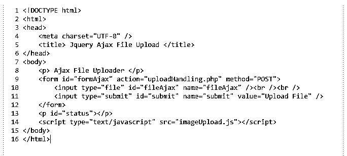
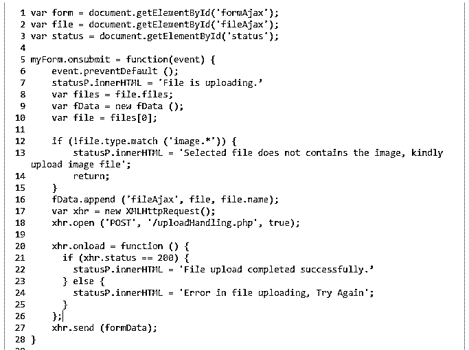
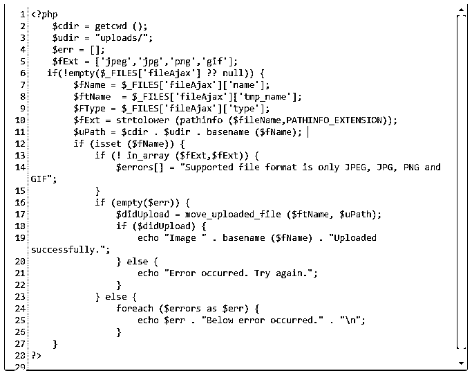
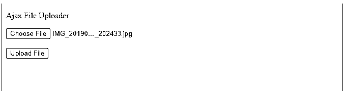

# jQuery Ajax 文件上传

> 原文：<https://www.educba.com/jquery-ajax-file-upload/>


## jQuery Ajax 文件上传简介

jQuery ajax 文件上传是将文件从本地计算机上传到服务器的过程。当我们在浏览器中选择一个文件并单击 submit 按钮时，浏览器会从我们的本地机器中复制该文件并将其发送到服务器，然后服务器会将其保存到指定的位置。为了异步上传文件，我们可以利用 ajax 和 jQuery。

### jQuery Ajax 文件上传

*   对于开发人员来说，上传文件很困难，但是使用 Ajax 上传文件更容易，也非常简单。
*   Ajax 和浏览器支持的进步使得文件上传变得更加容易。HTML5 上传程序提供了快速的解决方案，但是不安全，并且与所有浏览器都不兼容。
*   在使用 jQuery ajax 上传文件时，我们使用了如下两个函数。
*   FormData()-这个函数用于创建一个新的表单数据对象。
*   move uploaded file()–此功能用于重新定位上传的文件。
*   由于较差的客户端设施，该等式需要服务器端组件来处理传入的数据流。
*   在客户端，HTML5 文件输入表单元素很有帮助。然而，开发人员在实现 Ajax 和 JavaScript 文件上传时，给他们的程序增加了不必要的复杂性。
*   当开发人员使用众所周知的框架如 jQuery 来创建文件上传时，他们引入了不必要的复杂性。
*   对于开发人员来说，使用纯 JavaScript 并避免使用繁重的库和框架是执行 Ajax 文件上传最容易和最简单的方法。
*   JQuery ajax 文件上传项目分为三个主要部分。
*   新文件 API 中的 FileReader 对象、XMLHttpRequest 中的 FormData 对象、文件输入元素中的多个属性
*   众多元素允许用户选择多个文件进行上传。
*   对于不支持 FormData 或 FileReader 的旧浏览器，上传行为将退回到正常的非 AJAX 文件上传。
*   由于大量必要的代码和耗时的工作，使用 AJAX 技术上传文件可能会令人生畏。

### 如何将图像上传到 jQuery ajax 文件

*   通过五个简单的步骤，我们可以使用 JavaScript 通过 Ajax 将文件上传到服务器。
*   在客户端浏览器中呈现的网页必须包含 HTML5 输入表单元素。
*   必须编写一个 JavaScript 方法来开始基于 Ajax 的异步文件上传。
*   服务器上必须存在一个组件来处理文件上载并在本地保留资源。
*   服务器必须用一个表明 JavaScript 文件上传成功的状态码来响应浏览器。同样，客户机的浏览器必须用一个基于 Ajax 的状态代码来响应，显示文件已经成功上传。
*   首先，我们需要一个表单和一个预览图片容器。做一个 index.html 档案。我们需要在根目录下创建一个 index.html 文件。
*   创建 index.html 文件后，默认的浏览按钮现在必须用 CSS 隐藏。然后在 css 目录中创建 style.css 文件。
*   我们需要 JavaScript 代码来处理浏览按钮和预览图片的默认功能。发送带有文件的 ajax 请求非常容易。
*   在编写 PHP 代码之前，我们必须创建一个新表来保存上传的图像。

### 如何创建 jQuery ajax 文件？

下面的步骤显示了如何创建 jQuery ajax 文件，如下所示。

<small>网页开发、编程语言、软件测试&其他</small>

#### 创建 HTML 表单

在创建了名为 ajax_jQuery_upload 的文件夹后，创建一个名为 index.html 的新文件名，包含下面的代码。

**代码:**

```
<!DOCTYPE html>
<html>
<head>
<meta charset="UTF-8" />
<title> JQuery Ajax File Upload </title>
</head>
<body>
<p> Ajax File Uploader </p>
<form id="formAjax" action="uploadHandling.php" method="POST">
<input type = "file" id = "fileAjax" name = "fileAjax" />  <br /> <br />
<input type = "submit" id = "submit" name = "submit" value = "Upload File" />
</form>
<p id = "status"> </p>
<script type = "text/javascript" src = "imageUpload.js">
</script>
</body>
</html>
```




*   动作表单将访问者引导到一个处理图像文件上传的 PHP 脚本。POST 是向服务器传输数据的协议。
*   在这种情况下，我们不需要指定 enctype 属性，因为它只用于文本输入管理。

#### 创建 ajax 脚本

创建 index.html 文件后，下一步是创建一个名为 imageUpload.js 的 ajax 脚本文件，如下所示。

**代码:**

```
var form = document.getElementById('formAjax');
var file = document.getElementById('fileAjax');
var status = document.getElementById('status');
myForm.onsubmit = function(event)
{
event.preventDefault ();
statusP.innerHTML = 'File is uploading.’
var files = file.files;
var fData = new fData ();
var file = files[0];
if (!file.type.match ('image.*')) {
statusP.innerHTML = 'Selected file does not contains the image, kindly upload image file';
return;  }
fData.append ('fileAjax', file, file.name);
var xhr = new XMLHttpRequest();
xhr.open ('POST', '/uploadHandling.php', true);
xhr.onload = function () {
if (xhr.status == 200) {
statusP.innerHTML = 'File upload completed successfully.’
} else {
statusP.innerHTML = 'Error in file uploading, Try Again';
}    };
xhr.send (formData);
}
```




**设置服务器 php 脚本，用于接受来自 ajax 请求的数据**

在这一步创建了 ajax 脚本之后，我们正在创建一个 php 脚本，用于接受来自 ajax 请求的数据。

**代码:**

```
<?php
$cdir = getcwd ();
$udir = "uploads/";
$err = [];
$fExt = ['jpeg','jpg','png','gif'];
if(!empty($_FILES['fileAjax'] ?? null))
{
$fName = $_FILES['fileAjax']['name'];
$ftName  = $_FILES['fileAjax']['tmp_name'];
$FType = $_FILES['fileAjax']['type'];
$fExt = strtolower (pathinfo ($fileName,PATHINFO_EXTENSION));
$uPath = $cdir . $udir . basename ($fName);
if (isset ($fName))
{
if (! in_array ($fExt,$fExt)) {
$errors[] = "Supported file format is only JPEG, JPG, PNG and GIF";
}
if (empty($err)) {
$didUpload = move_uploaded_file ($ftName, $uPath);
if ($didUpload) {
echo "Image " . basename ($fName) . "Uploaded successfully.";
} else
{
echo "Error occurred. Try again.";
}
} else
{
foreach ($errors as $err) {
echo $err . "Below error occurred." . "\n";
}
}
?>
```




**在浏览器上测试 ajax 图片上传器。**

在这一步中，我们在浏览器上测试 ajax 图像上传程序。




### 结论

在使用 jQuery ajax 上传文件时，我们需要遵循五个步骤。1)创建 XMLHttpRequest 的实例。2)使用 XMLHttpRequest 对象设置各种处理程序。3)创建后端以从 AJAX 请求中获取数据。4)表单必须经过验证。5)建立有效的观众反馈回路。

### 推荐文章

这是一个 jQuery Ajax 文件上传指南。这里我们讨论如何创建一个 jQuery ajax 文件以及代码和输出。您也可以阅读以下文章，了解更多信息——

1.  [jQuery 数组推送](https://www.educba.com/jquery-array-push/)
2.  [jQuery 滚动平滑](https://www.educba.com/jquery-scroll-smooth/)
3.  [数据集 jQuery](https://www.educba.com/dataset-jquery/)
4.  [jquery ajax async false](https://www.educba.com/jquery-ajax-async-false/)


