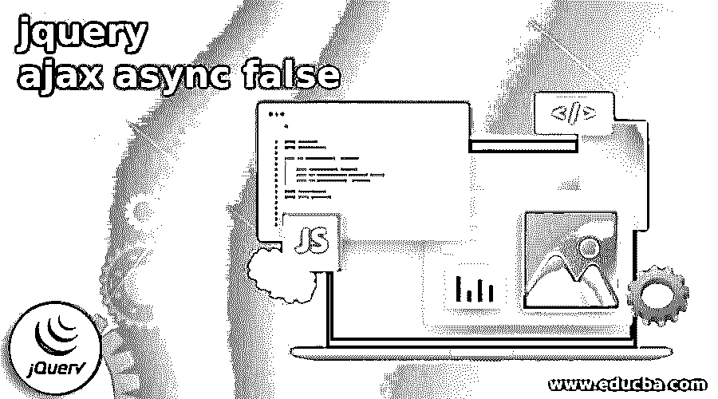

# jquery ajax 异步 false

> 原文：<https://www.educba.com/jquery-ajax-async-false/>




## jQuery Ajax Async False 简介

jQuery Ajax Async False 是 jQuery 的一个函数，如果我们将 Async 设置为 False，这意味着第一条语句必须在调用下一条语句之前完成。如果我们将 async 请求设置为 true，那么不管前一条语句是否完成，下一条语句都将开始执行。异步 JavaScript 是该语言最重要的部分之一，因为它控制着我们如何执行需要一些时间才能完成的任务，比如从数据库或 API 请求数据。如果您正在开发一个真正的 JavaScript 应用程序，那么您将在某个时候使用异步代码来做这些事情。

### 在 AJAX 中使用异步 False 和异步 True

当您觉得以一种特定的方式(比如同步或异步调用)执行服务调用时，这种方法是可靠的。根据您的代码，那时异步请求将非常有用。在此之后，您必须声明和定义代码和 AJAX 调用，使异步选项为真，然后它将异步运行。嗯，这与性能无关。当你想在浏览器传递给其他代码之前完成它，那么你必须设置异步请求为假。

<small>网页开发、编程语言、软件测试&其他</small>

当 async 请求设置为 false 时，将进行同步调用。当异步请求设置为真时，将进行异步调用。AJAX 默认调用异步调用，如果你设置它为假，那么它就不是异步调用，而是异步调用。

如果你可以同时做几件事，那么异步是最好的方法之一，它们不应该是相互依赖的。如果你觉得，首先要完成继续加载之前，下一件事你应该使用同步，但请记住，这个选项是鄙视，以避免同步的错误。

### 异步假和异步真的区别

这里我们讨论 jquery ajax async false。

| **异步假** | **异步真** |
| Async False 表示在响应到来之前不会进入下一步。 | 默认情况下，Async 为 true。这意味着这个过程将在 jQuery AJAX 中继续，而不需要等待请求。 |
| 当您觉得 ajax 请求需要在浏览器传递给其他代码之前完成时，您应该将它设置为 false:

```
<script>
// ...
$.ajax(... async: false ...);
$.ajax(...);
</script>
```

 | 当需要 ajax 请求继续传递给其他代码时，可以将 async 设置为 true:

```
$.ajax({
url: "file.php",
type: "POST",
async: true,
success: function(data) {
// .....
}
});
```

 |
| 默认情况下，所有请求都是异步发送的(即默认设置为 true)。要获取同步请求，请将 async 设置为 false。 | 默认情况下，所有请求都是异步发送的(即默认设置为 true)。这意味着你不需要做任何事情。 |

### AJAX 请求中的异步错误

AJAX 代表异步 Javascript 和 XML。这个 XML 部分是我们正在检索的数据。AJAX 请求基本上只允许我们与服务器通信。我们可以发出一个 HTTP 请求来检索数据，而不需要从服务器上重新加载页面，然后我们可以在代码中使用它。这种行为在网上随处可见。举个简单的例子，每当你在查看一个交互式地图时，你可以在上面放大或缩小或绘制旅程，这可能会使用 AJAX HTTP 请求来更新国旗上的花的地图，而不必刷新页面。

虽然现在你可能会使用 JSON，这是一种更适合 Javascript 和 XML 的数据格式。很多时候，你会发出一个 web 请求，或者我们会发出一个 API 请求，或者可能是一个数据库请求。对你的数据库请求看起来应该很快就填满了，但即使数据库在 AWS 或你正在使用的任何其他主机的同一个网络上。他们可能需要一毫秒或更长时间来连接，然后再恢复。所以，如果你要调用它，或者把它当作一个局部变量，你总是会遇到麻烦。

### jQuery AJAX 异步错误示例

**同步调用的例子**

```
<script type="text/javascript" src="http://ajax.googleapis.com/ajax/libs/jquery/1.8.3/jquery.min.js"></script>
<script type="text/javascript">
function ShowCurrentTime() {
$.ajax({
async: false,
type: "POST",
url: "Default.aspx/GetCurrentTime",
data: '{name: "Mudassar" }',
contentType: "application/json; charset=utf-8",
dataType: "json",
success: function (response) {
alert(response.d);
}
});
}
</script>
```

在 jQuery AJAX 调用过程中出现以下错误。

主线程上的同步请求由于其对客户端体验的破坏性影响而受到轻视。

以下屏幕截图显示了 Mozilla Firefox 控制台中记录的错误。

### 异步调用的示例

```
<script type="text/javascript" src="http://ajax.googleapis.com/ajax/libs/jquery/1.8.3/jquery.min.js"></script>
<script type="text/javascript">
function ShowCurrentTime() {
$.ajax({
async: true,
type: "POST",
url: "Default.aspx/GetCurrentTime",
data: '{name: "Mudassar" }',
contentType: "application/json; charset=utf-8",
dataType: "json",
success: function (response) {
alert(response.d);
}
});
}
</script>
```

下列范例不会在进行非同步呼叫时封锁页面。

### 结论

在本文中，我们已经介绍了很多关于 jQUery AJAX async false 的信息，比如，什么是 jQuery AJAX async false。默认情况下调用 Async true，否则如果我们想在前一条语句完成后执行下一条语句，我们必须调用 async false。何时使用异步 false 或异步 true。异步调用和同步调用的区别。如何在不同类型的 AJAX 中请求同步错误？异步调用和同步调用的例子，它们的好处，以及如果我们在工作中遇到错误，如何消除其中的错误。我希望这篇文章对你有多方面的帮助。

### 推荐文章

这是一个 jquery ajax async false 的指南。这里我们讨论在 AJAX 中何时使用异步 False 和异步 True，以及它们之间的区别。您也可以看看以下文章，了解更多信息–

1.  [jQuery ajax 失败](https://www.educba.com/jquery-ajax-fail/)
2.  [jQuery 队列](https://www.educba.com/jquery-queue/)
3.  [jQuery keycode](https://www.educba.com/jquery-keycode/)
4.  [jQuery Ajax 异步](https://www.educba.com/jquery-ajax-async/)


