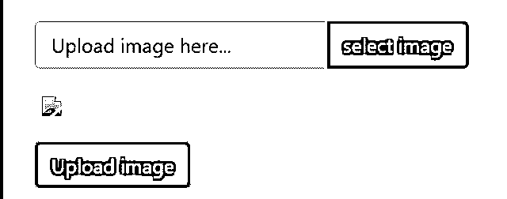

# jQuery Ajax 图片上传

> 原文：<https://www.educba.com/jquery-ajax-image-upload/>


## 查询 Ajax 图片上传简介

*   jQuery Ajax 图片上传是一个使用 jQuery 语言上传图片的程序。这是一个使用 Ajax 系统将图像上传到数据库的 web 应用程序。
*   使用 jQuery 语言和 Ajax 服务器将输入文件和图像插入服务器。此操作有助于在服务器中插入和保存图像文件，并与 web 应用程序进行交互。
*   它是一个 web 应用程序，使用前端技术对数据库中的图像文件进行操作。图像上传程序使用 jQuery Ajax 技术操作图像格式的数据库文件，以便用户和网页进行交互。

### jQuery Ajax 图片上传概述

*   使用 JQuery Ajax 方法为上传图像创建以下文件和文件夹。
*   引导文件、CSS 文件和 JQuery 文件包含在输入表单的“index.html”文件中。
*   创建一个表单，用于在数据库中上传图像。
*   您可以使用文本类型的输入标签。默认情况下，此文本类型被禁用。
*   该表单创建一个按钮来从设备中选择图像。
*   之后，文件创建另一个按钮，将图像文件上传到数据库。

```
<div class = "container-fluide">
<div>
<div id = "messages"></div>
<form method = "post" id = "imagesforform" enctype = "multipart/form-data" onSubmit = "return false;">
<div class = "form-group">
<input type = "file" name = "file" class = "file">
<div class = "input-group"> <input type = "text" class = "form-control" disabled placeholder = "Upload image here…" id = "inputfile">
<div class = "input-group-append">
<button type = "button" class = "browses btn btn-danger"> select image </button>
</div>
</div>
</div>
<div class = "form-group">

</div>
<div class = "form-group">
<input type = "submit" name = "submit" value = "Upload image" class = "btn btn-primary">
</div>
</form>
</div>
</div>
```

*   创建一个 CSS 文件，并使用属性及其值。
*   在“index.html”文件中创建脚本标记，并使用 jQuery 代码在服务器中上传文件。
*   jQuery 创建一个函数，使用 click 属性将图像上传到数据库。
*   您可以使用 jQuery 语言创建变量、函数以及其他方法和操作。

```
$(document).on("click", ".browses", function() { var inputfile = $(this)
.parent() .parent() .parent()
.find(".inputfile");
inputfile.trigger("click");
});
$('input[type="file"]').change(function(e) {
var inputfileName = e.target.files[0].name;
$("#inputfile").val(inputfileName);
var reader = new FileReader();
reader.onload = function(e) {
document.getElementById("previews").src = e.target.result;
};
reader.readAsDataURL(this.files[0]);
});
```

*   Ajax 服务器正在向服务器发送文件请求。

```
$(document).ready(function(e) {
$("#imagesforform").on("submit", function() {
$("#messages").html('<div class="alert alert-primary">
Please wait...!</div>');
$.ajax({
type: "POST",
url: "ajax/action.ajax.php",
data: new FormData(this),
contentType: false,
cache: false,
processData: false, false
success: function(data) {
if (data == 1 || parseInt(data) == 1) {
$("#messages").html(
'<div class="alert alert-info"> image updated successfully. </div>'
);
} else {
$("#messages").html(
'<div class = "alert alert-info"> Extension try with JPG, PNG, JPEG, GIF.</div>'
);
}
},
error: function(data) {
$("#messages").html(
'<div class="alert alert-danger">There is something wrong with image upload. </div>'
);
}
});
});
});
```

*   PHP 和数据库功能需要服务器上上传的图像。
*   您可以使用 JQuery ajax 方法与数据库和 web 应用程序进行交互。

### jQuery Ajax 图片上传

*   您可以创建文件 index.html，并将 jQuery 和 ajax 代码与输入表单放在一起。

文件名:index.html

```
<!doctype html>
<html lang = "en-US" xmlns:fb = "https://www.facebook.com/2008/fbml" xmlns:addthis = "https://www.addthis.com/help/api-spec" prefix="og: http://ogp.me/ns#" class = "no-js">
<head>
<meta charset = "UTF-8">
<meta name = "viewport" content = "width = device-width, initial-scale = 1, shrink-to-fit = no">
<title> upload image file using JQuery AJAX </title>
<link rel = "shortcut icon" href = "https://learncodeweb.com/demo/favicon.ico">
<link rel = "stylesheet" href = "https://stackpath.bootstrapcdn.com/bootstrap/4.2.1/css/bootstrap.min.css" integrity = "sha384-GJzZqFGwb1QTTN6wy59ffF1BuGJpLSa9DkKMp0DgiMDm4iYMj70gZWKYbI706tWS" crossorigin = "anonymous">
<link rel = "stylesheet" href="https://use.fontawesome.com/releases/v5.6.3/css/all.css" integrity = "sha384-UHRtZLI+pbxtHCWp1t77Bi1L4ZtiqrqD80Kn4Z8NTSRyMA2Fd33n5dQ8lWUE00s/" crossorigin = "anonymous">
</head>
<body>
<div class = "container-fluide">
<div>
<div id = "messages"></div>
<form method = "post" id = "imagesforform" enctype = "multipart/form-data" onSubmit = "return false;">
<div class = "form-group">
<input type = "file" name = "file" class = "file">
<div class = "input-group"> <input type = "text" class = "form-control" disabled placeholder = "Upload image here…" id = "inputfile">
<div class = "input-group-append">
<button type = "button" class = "browses btn btn-danger"> select image </button>
</div>
</div>
</div>
<div class = "form-group">

</div>
<div class = "form-group">
<input type = "submit" name = "submit" value = "Upload image" class ="btn btn-primary">
</div>
</form>
</div>
</div>
<script src = "https://code.jQuery.com/jQuery-3.2.1.min.js"> </script>
<script src = "https://cdnjs.cloudflare.com/ajax/libs/popper.js/1.14.6/umd/popper.min.js"> </script>
<script src = "https://stackpath.bootstrapcdn.com/bootstrap/4.2.1/js/bootstrap.min.js">
</script>
<script>
$(document).on("click", ".browses", function() { var inputfile = $(this)
.parent() .parent() .parent()
.find(".inputfile");
inputfile.trigger("click");
});
$('input[type = "file"]').change(function(e) {
var inputfileName = e.target.files[0].name;
$("#inputfile").val(inputfileName);
var reader = new FileReader();
reader.onload = function(e) {
document.getElementById("previews").src = e.target.result;
};
reader.readAsDataURL(this.files[0]);
});
$(document).ready(function(e) {
$("#imagesforform").on("submit", function() {
$("#messages").html('<div class = "alert alert-primary">
Please wait...!</div>');
$.ajax({
type: "POST",
url: "ajax/action.ajax.php", data: new FormData(this),
contentType: false, cache: false,
processData: false, false
success: function(data) { if (data == 1 || parseInt(data) == 1) {
$("#messages").html(
'<div class="alert alert-info"> image updated successfully. </div>'
);
} else {
$("#messages").html(
'<div class="alert alert-info">Extension not good only try with JPG, PNG, JPEG, GIF.</div>'
);
}
},
error: function(data) {
$("#messages").html(
'<div class="alert alert-danger"><i class="fa fa-exclamation-triangle"></i> There is something wrong.</div>'
);
}
});
});
});
</script>
</body>
</html>
```

**初始页面的输出**

<small>网页开发、编程语言、软件测试&其他</small>




**描述:**

*   在这里，您可以看到为服务器上传图像的表单。
*   该表单使用 HTML、JQUERY 和 AJAX 技术创建。

**上传图像后的输出**


**描述:**

*   通过“输入”标签选择图像后，点击“上传图像”按钮。您会从输入表单中得到一个回复。
*   输入标签显示了文本类型标签中的图像名称。
*   图像显示在网页的表单或标签之后。

### 结论

jQuery Ajax 图片上传创建了一个有吸引力的、用户友好的带有图片文件的 web 应用程序。这个函数可以很容易地与用户交互，并以较少的代码上传图像。

### 推荐文章

这是一个 jQuery Ajax 图片上传指南。为了更好地理解，我们在这里讨论定义、概述、代码实现示例。您也可以看看以下文章，了解更多信息–

1.  [jQuery 连接](https://www.educba.com/jquery-join/)
2.  [jQuery 队列](https://www.educba.com/jquery-queue/)
3.  [jQuery json stringify](https://www.educba.com/jquery-json-stringify/)
4.  [jQuery 帖子](https://www.educba.com/jquery-post/)


