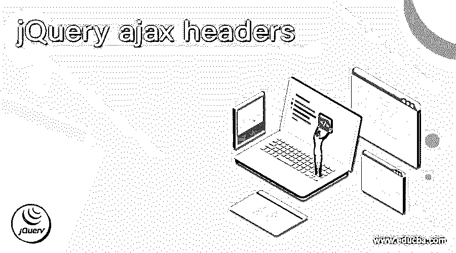
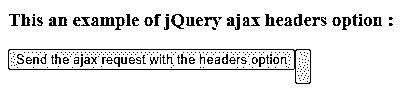
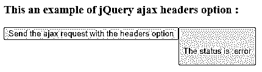
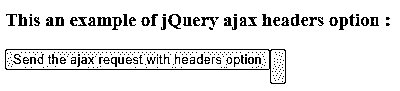
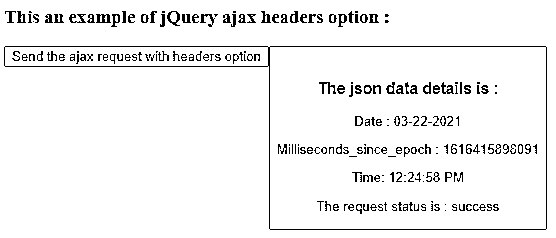

# jQuery ajax 标题

> 原文：<https://www.educba.com/jquery-ajax-headers/>




## jQuery ajax 头介绍

jQuery ajax 头用于指定从服务器返回的响应类型。jQuery ajax hear 选项是一个内置选项，传递给 jQuery 中的 ajax()函数。头是使用 XMLHttpRequest 对象随 ajax 请求一起发送的附加键值对。通过使用 ajax()函数向服务器发送异步 HTTP 请求，并包含向服务器描述它接受哪种响应的报头。我们还可以使用 beforeSend 回调函数来设置标题属性或覆盖标题属性。

**jQuery Ajax headers 选项的语法—**

<small>网页开发、编程语言、软件测试&其他</small>

```
$.ajax({ headers : { key : value }});
```

**用 beforeSend 回调函数设置或覆盖 jQuery ajax headers 选项的语法—**

```
$.ajax({beforeSend: function (jqXHR, settings) { jqXHR.setRequestHeader(key, value) );}});
```

**参数—**

*   **头:{ key:value }**–这是一个可选选项。它指定当 ajax()向服务器发送请求时，它可以从服务器接受什么类型的响应。默认值是{}。它是 PlainObject 类型，包含键值对。可能的关键字是“接受”、“接受编码”、“连接”、“接受语言”、“主机”、“Cookie”、“用户代理”、“订单号”和所有。值指定该键的特定值。
*   **before send**–这是一个可选功能。它设置或覆盖指定它可以从服务器接受什么类型的响应。它接受 jqXHR 和设置参数，修改 jqXHR 对象，并在 setRequestHeader 函数的帮助下添加自定义头。

**返回值-**

ajax headers 选项不返回任何值。

### ajax 标题选项的工作方式

jQuery ajax headers 选项通过键-值对传递给 ajax()函数，以指定可以从服务器接受什么类型的响应。假设我们必须执行异步 HTTP Post 请求，将数据提交给服务器，并将数据头作为授权发送给服务器。所以我们可以使用带有 headers 选项的 ajax()函数作为“$。Ajax({ headers:{ ' Authorization ':' Basic '+btoa(' my user:mypswd ')}，url :'/jquery/submitData '，类型:" POST "，内容类型:" application/json "，数据:{ myData: "Sample data。" } });"，其中第一个参数是发送用户名和密码以验证用户身份的头。如果用户认证成功，数据提交给服务器，并向用户发送响应。

### jQuery ajax headers 选项示例

下面举几个例子

#### 示例#1

jQuery ajax headers 选项示例，通过使用带有标题的 ajax()函数来获取数据

**代码:**

```
<!doctype html>
<html lang = "en">
<head>
<meta charset = "utf-8">
<script type = "text/javascript" src = "https://ajax.googleapis.com/ajax/libs/jquery/1.11.2/jquery.min.js">
</script>
<title> This is an example for jQuery ajax headers option </title>
</head>
<body>
<h3> This an example of jQuery ajax headers option : </h3>
<button id = "Btn" > Send the ajax request with the headers option <button/>
<br>
<p id = "p1" style = "color : red"> </p>
<script type = "text/javascript">
$(document).ready( function () {
$('#Btn').click( function(){
// url from where we want to get the data
var ajxReq = $.ajax( { url : 'http://time.jsontest.com',
contentType : 'application/json',
dataType : 'json',
headers: {"Accepts": "text/plain; charset=utf-8"}
});
ajxReq.success( function ( data, status, jqXhr ) {
$( '#p1' ).append( '<h3> The json data details is : </h3>');
$( '#p1' ).append( '<p> Date : ' + data.date + '</p>');
$( '#p1' ).append( '<p> Milliseconds_since_epoch : ' + data.milliseconds_since_epoch + '</p>');
$( '#p1' ).append ('<p> Time: ' + data.time + '</p>');
$( '#p1' ).append( '<p> The request status is : ' + status + '</p>');
});
ajxReq.error( function ( jqXhr, textStatus, errorMessage ) {
$( "p" ).append( "The status is :" +textStatus);
});
});
});
</script>
</body>
</html>
```

上述代码的输出是–




一旦我们点击按钮，输出是




在上面的代码中，当我们单击按钮时，ajax()函数将调用向服务器发送 HTTP 请求以获取数据。第一个参数提到了从中获取数据的 URL，并且 headers 选项指定了什么类型的响应将接受“headers:{ " Accepts ":" text/plain；charset=utf-8"} "。接下来，接收到的数据是 JSON 类型的，但是头以纯文本的形式提到了 accept 类型，所以响应不能被接受，状态显示为错误，我们可以在上面的输出中看到。

#### 实施例 2

重写上面的 jQuery ajax headers 选项示例，通过使用带有 acceptable response headers 选项的 ajax()函数获取数据

**代码:**

```
<!doctype html>
<html lang = "en">
<head>
<meta charset = "utf-8">
<script type = "text/javascript" src = "https://ajax.googleapis.com/ajax/libs/jquery/1.11.2/jquery.min.js">
</script>
<title> This is an example for jQuery ajax headers option </title>
</head>
<body>
<h3> This an example of jQuery ajax headers option : </h3>
<button id = "Btn" > Send the ajax request with headers option <button/>
<br>
<p id = "p1" style = "color : red"> </p>
<script type = "text/javascript">
$(document).ready( function () {
$('#Btn').click( function(){
// url from where we want to get the data
var ajxReq = $.ajax( { url : 'http://time.jsontest.com',
contentType : 'application/json',
dataType : 'json',
headers: {"Accept": "application/json"}
});
ajxReq.success( function ( data, status, jqXhr ) {
$( '#p1' ).append( '<h3> The json data details is : </h3>');
$( '#p1' ).append( '<p> Date : ' + data.date + '</p>');
$( '#p1' ).append( '<p> Milliseconds_since_epoch : ' + data.milliseconds_since_epoch + '</p>');
$( '#p1' ).append ('<p> Time: ' + data.time + '</p>');
$( '#p1' ).append( '<p> The request status is : ' + status + '</p>');
});
ajxReq.error( function ( jqXhr, textStatus, errorMessage ) {
$( "p" ).append( "The status is : " + textStatus);
});
});
});
</script>
</body>
</html>
```

上述代码的输出是–




一旦我们点击按钮，输出是




在上面的代码中，ajax()函数包含相同的 URL，从中可以获取 JSON 数据，还包含 headers 选项“headers:{ " Accepts ":" application/JSON " }”，这与服务器的响应相匹配，因此现在可以接受响应，并显示接收到的数据，我们可以在上面的输出中看到。

### 结论

jQuery ajax header 选项是 jQuery 中的一个内置选项，用于指定从服务器返回的响应类型。

### 推荐文章

这是一个 jQuery ajax 头的指南。在这里，我们讨论了 ajax headers 选项的工作原理、示例以及代码和输出。您也可以看看以下文章，了解更多信息–

1.  [jQuery 可见性](https://www.educba.com/jquery-visibility/)
2.  [jQuery 延期](https://www.educba.com/jquery-deferred/)
3.  [jQuery 移动元素](https://www.educba.com/jquery-move-element/)
4.  [jQuery grep](https://www.educba.com/jquery-grep/)


