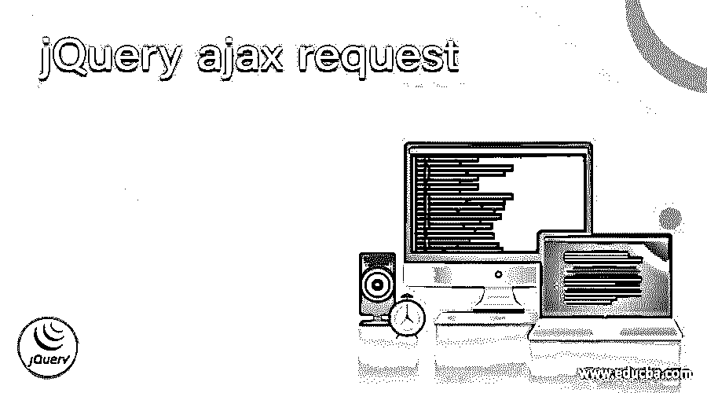
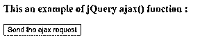
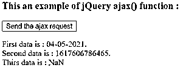

# jQuery ajax 请求

> 原文：<https://www.educba.com/jquery-ajax-request/>




## jQuery ajax 请求简介

jQuery ajax 请求用于通过 HTTP GET 请求发送或获取服务器数据。jQuery ajax 请求可以在 ajax()函数的帮助下执行。jQuery ajax()函数是 jQuery 中的内置函数。ajax()函数用于执行对服务器的异步 HTTP 请求，它还允许异步发送或获取数据，而无需重新加载网页，这使得它很快。JQuery 为开发 web 应用程序提供了广泛的 AJAX 函数。

**jQuery Ajax()函数的语法—**

<small>网页开发、编程语言、软件测试&其他</small>

```
$.ajax({name : value, name : value, .. });
```

### 因素

该函数接受 ajax 请求的名称-值对参数。可以传递给该函数的可能名称和值如下所示

*   **async**–它是一个布尔类型。它指定默认情况下异步处理请求。对于同步请求，我们可以将其值设置为 false。其默认值为 true。
*   **数据**–指定发送到服务器的数据。它的值可以是数组、字符串或 JSON 对象。
*   **before send(xhr)**–这是一个函数。它用于添加自定义标题或覆盖，以指定它可以从服务器接受什么类型的响应。它接受两个参数:jqXHR 和 settings 它修改 jqXHR 对象，并在 setRequestHeader 函数的帮助下添加自定义头。
*   **完成(xhr，status)**–这是一个函数。它在请求完成时运行。它接受两个参数 xhr 和 status。“成功”、“未修改”、“错误”、“无内容”等都可以是状态。
*   **缓存**–它是一个布尔类型。它指定浏览器是否缓存所请求的页面。通过将该值设置为 false，浏览器将不再缓存页面。默认值为 true。
*   **url**–它指定请求被发送到的位置或 URL，以获取数据。当前页面是默认值。
*   **content type**–它指定当 ajax()向服务器发送请求时，向服务器发送什么类型的数据。默认值为“application/x-www-form-urlencoded”。它是布尔或字符串数据类型。contenttype 的可能字符串类型值是“文本/html”、“文本/普通”、“应用程序/jar”、“图像/png”、“多部分/表单数据”、“图像/gif”、“音频/mp3”、“应用程序/json”和所有。默认的布尔类型值为 false。false 值告诉 jQuery 不要设置任何内容类型头。
*   **type**–用于指定 HTTP 请求发送的类型，如 GET、POST 和 PUT。默认值是 GET。
*   **数据类型**–它指定了服务器应该返回的数据类型。
*   **if modified**–它是一个布尔类型。如果自最后一个报头以来响应已经改变，则请求成功。默认值为 false。
*   **script charset**–仅当“脚本”传输用于指定请求的字符集时使用。
*   **用户名**–指定执行 HTTP 访问认证请求的用户名。
*   **密码**–指定执行 HTTP 访问认证请求的密码。
*   **process data**–这是一个布尔类型。它指定请求中包含的数据是否需要转换为查询字符串。默认值为 true。
*   **success(result，status，xhr)**–这是一个回调函数，只有当请求成功时才会被调用。它接受三个参数。
*   **error(xhr，status，error)**–这是一个函数，接受三个参数；它在请求失败时运行。
*   **超时**–它指定了请求应该等待自动终止的毫秒数。如果该值设置为 0，则意味着没有超时。
*   **jsonpCallback**–是字符串类型；它为 jsonp 请求指定回调函数的名称。
*   **jsonp**–是一个字符串值。它指定在 jsonp 请求中，它覆盖回调函数的名称。
*   xhr–它指定了一个用于创建 XMLHttpRequest 对象的函数。
*   **全局**–它是一个布尔类型。它指定是否触发一个全局 AJAX 事件处理程序。默认值为 true。
*   **繁体**——是布尔型；如果值设置为 true，这意味着我们可以使用传统样式的 param 序列化。
*   **dataFilter(data，type)**–这是一个回调函数，它接受两个参数。它处理 XMLHttpRequest 的原始响应数据。

### ajax()函数的工作原理

jQuery ajax()函数接受名称-值对参数。假设我们必须执行异步 HTTP Post 请求并将数据提交给服务器。数据发送的类型是 JSON 类型，需要指定给服务器。所以我们可以使用带有 contenttype 选项的 ajax()函数作为“$。ajax( '/jquery/submitData '，{ type : "POST "，contenttype : "application/json "，data : { myData: "Sample data。" } });"，其中第一个参数是数据将提交到的 URL。因此，指定内容类型的数据提交给服务器。

### jQuery ajax()函数的例子

使用 ajax get()函数从指定的 URL 获取数据的 jQuery ajax get()函数示例

**代码:**

```
<!doctype html>
<html lang = "en">
<head>
<meta charset = "utf-8">
<script type = "text/javascript" src = "https://ajax.googleapis.com/ajax/libs/jquery/1.11.2/jquery.min.js">
</script>
<title> This is an example for jQuery ajax() function </title>
</head>
<body>
<h3> This an example of jQuery ajax() function : </h3>
<button id = "Btn" > Send the ajax request </button>
<br>
<p style = "color : red"> </p>
<script type = "text/javascript">
$(document).ready( function () {
$('#Btn').click( function(){
// url from where we want to get the data
var ajxReq = $.ajax( 'http://time.jsontest.com', {
contentType : 'application/json',
dataType : 'json',
timeout : 600
});
ajxReq.success( function ( data, status, jqXhr ) {
$( "p" ).append( "First data is : " + data.date  + ".<br> Second data is : " + data.milliseconds_since_epoch  + ".<br> Thirs data is : " + + data.time );
});
ajxReq.error( function ( jqXhr, textStatus, errorMessage ) {
$( "p" ).append( "Error message is : " + errorMessage);
});
});
});
</script>
</body>
</html>
```

**上述代码的一个输出是-**




**一旦我们点击按钮，输出是–**




在上面的代码中，当我们单击按钮时，ajax()函数将调用，它将 HTTP GET 请求发送到服务器以获取数据。第一个参数提到了从哪里获取数据的 URL 第二个参数 contenttype 指定向服务器发送什么类型的数据，第三个参数 datatype 指定期望从服务器得到的响应，第四个参数提到请求的超时，第五个参数提到 success()如果请求成功则运行，第六个参数提到 error()如果请求失败则运行。

### 结论

jQuery ajax()函数是 jQuery 中的一个内置函数，用于发送 ajax 请求，以使用 HTTP GET 请求发送或获取服务器的数据。

### 推荐文章

这是一个 jQuery ajax 请求的指南。在这里，我们将讨论 ajax()函数的工作方式，以及示例和输出。您也可以看看以下文章，了解更多信息–

1.  [jQuery prev](https://www.educba.com/jquery-prev/)
2.  [jQuery 包含](https://www.educba.com/jquery-contains/)
3.  [jQuery 有](https://www.educba.com/jquery-has/)
4.  [jQuery 合并](https://www.educba.com/jquery-merge/)


