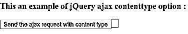
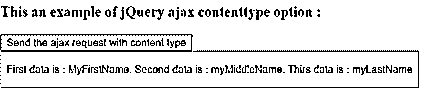
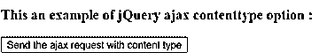
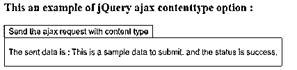

# jQuery ajax 内容类型

> 原文：<https://www.educba.com/jquery-ajax-contenttype/>


## jQuery ajax contenttype 简介

jQuery ajax contenttype 用于指定发送到服务器的数据的类型。jQuery ajax contenttype 选项是一个内置选项，传递给 jQuery 中的 ajax()函数。contenttype 选项也称为 MIME(多用途互联网邮件扩展)类型，它包括一个 HTTP 头，该头指定关于我们要发送到服务器的数据类型的信息。ajax()函数用于执行对服务器的异步 HTTP 请求，通过使用 contenttype 选项，它向服务器描述正在发送什么数据以及期望处理什么数据。

**语法—**

<small>网页开发、编程语言、软件测试&其他</small>

```
$.ajax( { contenttype : value } );
```

**参数—**

contenttype-这是一个可选选项。它指定当 ajax()向服务器发送请求时，向服务器发送什么类型的数据。默认值为“application/x-www-form-urlencoded”。它是布尔或字符串数据类型。contenttype 的可能字符串类型值是“文本/html”、“文本/普通”、“应用程序/jar”、“图像/png”、“多部分/表单数据”、“图像/gif”、“音频/mp3”、“应用程序/json”和所有。默认的布尔类型值为 false。false 值告诉 jQuery 不要设置任何内容类型头。

**返回值-**

ajax 内容类型选项不返回任何值。

### ajax 内容类型选项的工作原理

jQuery ajax contenttype 选项被传递给 ajax()函数，其值用于指定发送给服务器的数据类型。假设我们必须执行异步 HTTP Post 请求并将数据提交给服务器。数据发送的类型是 JSON 类型，需要指定给服务器。所以我们可以使用带有 contenttype 选项的 ajax()函数作为“$。ajax( '/jquery/submitData '，{ type : "POST "，contenttype : "application/json "，data : { myData: "Sample data。" } });"，其中第一个参数是数据将提交到的 URL。因此，指定内容类型的数据提交给服务器。

### jQuery ajax contenttype 选项的示例

下面举几个例子

#### 示例#1

使用 ajax()函数和 content type“application/JSON”获取数据的 jQuery ajax contenttype 选项示例-

**代码:**

```
<!doctype html>
<html lang = "en">
<head>
<meta charset = "utf-8">
<script type = "text/javascript" src = "https://ajax.googleapis.com/ajax/libs/jquery/1.11.2/jquery.min.js">
</script>
<title> This is an example for jQuery ajax contenttype option </title>
</head>
<body>
<h3> This an example of jQuery ajax contenttype option : </h3>
<button id = "Btn" > Send the ajax request with content type <button/>
<p style = "color : red"> </p>
<script type = "text/javascript">
$(document).ready( function () {
$('#Btn').click( function(){
// url from where we want to get the data
var ajxReq = $.ajax( '/jquery/getjsondata', {
contentType : 'application/json',
dataType : 'json',
timeout : 600
});
ajxReq.success( function ( data, status, jqXhr ) {
$( "p" ).append( "First data is: "+data.firstName + ". Second data is: " + data.middleName + ". Thirs data is: " + data.lastName);
});
ajxReq.error( function ( jqXhr, textStatus, errorMessage ) {
$( "p" ).append( "Error message is: " + errorMessage);
});
});
});
</script>
</body>
</html>
```

上述代码的输出是–




一旦我们点击按钮，输出是




在上面的代码中，当我们单击按钮时，ajax()函数将调用向服务器发送 HTTP 请求以获取数据。第一个参数提到了从中获取数据的 URL，并且 contenttype 选项指定了什么类型的数据应该是“contentType : 'application/json '，”。接下来，我们可以在上面的输出中看到接收到的数据。

#### 实施例 2

使用 ajax()函数和 contenttype " text/plain "提交数据的 jQuery ajax contenttype 选项示例-

**代码:**

```
<!doctype html>
<html lang="en">
<head>
<meta charset = "utf-8">
<script type = "text/javascript"
src = "https://ajax.googleapis.com/ajax/libs/jquery/1.11.2/jquery.min.js">
</script>
<title> This is an example for jQuery ajax contenttype option </title>
</head>
<body>
<h3> This an example of jQuery ajax contenttype option : </h3>
<button id = "b1" > Send the ajax request with content type <button/>
<p id = "p1" style = "color : red"></p>
<script type="text/javascript" >
$(document).ready(function () {
$( "#b1" ).click( function(){
// url to which we want to submit the data.
$.ajax( '/jquery/submitData', {
type : "POST",
contenttype : "text/plain",
// submit this data
data : { myData: "This is a sample data to submit." },
success : function ( data, status, xhr) {
$( "#p1" ).text( "The sent data is : " + data + " and the status is " + status + "." ); },
error : function ( jqXhr, textStatus, errorMessage ) {
$( "#p1" ).text( ' The error message is : ' + errorMessage );
}
});
});
});
</script>
</body>
</html>
```

上述代码的输出是




一旦我们点击“获取 p 个子节点”按钮，输出是




在上面的代码中，当我们单击按钮时，ajax()函数将调用向服务器发送 HTTP POST 请求以提交数据。第一个参数提到了数据提交到的 URL，contenttype 选项还指定了什么类型的数据以“content type:“text/plain”、”的形式发送。接下来，正如我们在上面的输出中所看到的，发送的数据将与其状态一起显示。

### 结论

jQuery ajax contenttype 选项是 jQuery 中的内置选项，用于指定发送到服务器的数据类型。

### 推荐文章

这是 jQuery ajax contenttype 的指南。在这里，我们将讨论 ajax contenttype 选项的工作，以及示例和输出。您也可以阅读以下文章，了解更多信息——

1.  [jQuery 窗口](https://www.educba.com/jquery-window/)
2.  [jQuery eq()](https://www.educba.com/jquery-eq/)
3.  [jQuery 内容](https://www.educba.com/jquery-contents/)
4.  [jQuery 全局变量](https://www.educba.com/jquery-global-variable/)


