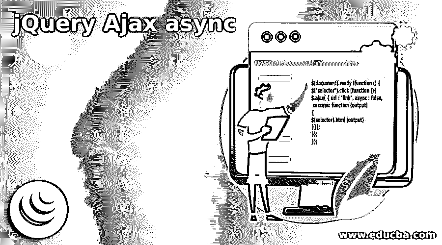
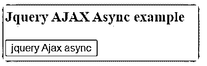
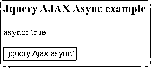
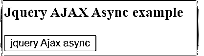
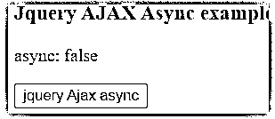
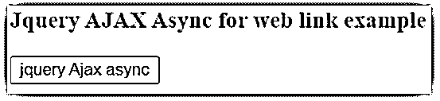

# jQuery Ajax 异步

> 原文：<https://www.educba.com/jquery-ajax-async/>




## jQuery Ajax 异步简介

jQuery Ajax async 正在处理元素中的异步 HTTP 请求。它是一个不间断地向服务器发送请求的过程。发送 HTTP 请求而不等待响应是一种异步方法。这是一个在服务器上工作的功能，除了根据请求进行关联之外，没有其他关联。它使用 HTTP 向服务器发送请求，但不需要任何服务器的响应。决定多个请求是否完成是一个布尔条件。它是 ajax()方法内部的一个参数。它正在处理异步 HTTP 请求。

### jQuery Ajax 异步的语法

下面给出了提到的语法:

<small>网页开发、编程语言、软件测试&其他</small>

jQuery Ajax 异步使用 Ajax 方法。

```
$.ajax( { url , parameter : value })
```

ajax 方法可以使用唯一的参数。

```
$.ajax( { parameter : value, parameter : value })
```

它用于布尔条件。

*   变得真实

```
async: true
```

*   变成假的

```
async: false
```

方法内部使用了参数。

```
$.ajax( { url : "link", async : true})
```

或者

```
$.ajax( { url : "link", async : false })
```

**语法解释:**

*   用于发送 HTTP 服务器请求的 url。
*   async 是一个用于多个请求的参数。

jQuery Ajax 异步语法如下。

```
$(document).ready (function () {
$("selector").click (function (){
$.ajax( { url : "link", async : false, success: function (output)
{
$(selector).html (output)
}});
});
});
```

**语法解释:**

*   ajax 方法用于包含 URL 请求和参数。
*   jQuery 函数内部使用了一个参数。

### jQuery 中 Ajax 异步函数是如何工作的？

HTML 页面是通过带有。html 扩展。

**举例:**

**代码:**

```
jQueryAsync.html
```

jQuery 文件放在主体部分的 jQueryAsync.html 文件中。

链接需要下载 jQuery 库或者使用 jQuery CDN 版本链接。

*   从 jQuery.com 下载 jQuery 的最新开发版本或产品版本。
*   用户可以通过 jQuery 库在 web 应用程序中使用离线 jQuery。
*   HTML 页面中的 jQuery 版本。

jQuery 链接如下:

```
<script src = "https://ajax.googleapis.com/ajax/libs/jQuery/3.5.1/jQuery.min.js">
</script>
```

*   用户可以通过 jQuery CDN 版本链接在 web 应用程序中使用在线 jQuery。

```
<script> write a jQuery Ajax async code here… </script>
<script>
$(document).ready(function(){
$("#async").click(function(){
$.ajax({url: "https://www.w3schools.com/jQuery/ajax_ajax.asp", async: true, success: function(output){
$("p").html(output);
}});
});
});
</script>
```

jQuery 脚本标记中语法的使用。

*   变得真实

```
async: true,
```

“async: true”是发送 HTTP 请求而不等待另一个服务器的请求完成。

*   变成假的

```
async: false,
```

“async: true”在等待完成其他服务器请求时发送 HTTP 请求。

在网页的主体部分写一段 HTML 代码。

```
<body>
<div id = "ajax">
<h3> JQuery AJAX Async example </h3>
</div>
<input type = "button" value = "jQuery Ajax async" id = "async" />
</body>
```

结合职能的工作程序。

```
<!DOCTYPE html>
<html>
<head>
<title> Ajax async example copy </title>
<script src = "https://ajax.googleapis.com/ajax/libs/jQuery/3.5.1/jQuery.min.js">
</script>
<script>
$(document).ready(function(){
$("#async").click(function(){
$.ajax({url : "jQuery.txt",
async: true,
success : function(output)
{
$("#div").html(output);
}
});
});
});
</script>
</head>
<body>
<div id = "ajax">
<h3> JQuery AJAX Async example </h3>
</div>
<input type = "button" value = "jQuery Ajax async" id = "async" />
</body>
</html>
```

### jQuery Ajax 异步示例

下面是提到的例子:

#### 示例#1

下面是一个真实的例子。

**代码:**

```
<!DOCTYPE html>
<html>
<head>
<meta content = "text/html; charset = utf-8" http-equiv = "Content-Type">
<meta content = "utf-8" http-equiv = "encoding">
<title> Ajax async example copy </title>
<script src = "https://ajax.googleapis.com/ajax/libs/jQuery/3.5.1/jQuery.min.js">
</script>
<script>
$(document).ready (function () {
$("#async").click (function () {
$.ajax({ url : "jQuery.txt",
async: true,
success: function (output){
$("#ajax").html (output);
}
});
});
});
</script>
</head>
<body>
<h3> JQuery AJAX Async example </h3>
<div id = "ajax">
</div>
<input type = "button" value = "jQuery Ajax async" id = "async" />
</body>
</html>
```

**输出:**

**按钮点击前:**




**按钮点击后:**




#### 实施例 2

下面是一个错误的例子。

**代码:**

```
<!DOCTYPE html>
<html>
<head>
<meta content = "text/html; charset = utf-8" http-equiv = "Content-Type">
<meta content = "utf-8" http-equiv = "encoding">
<title> AJax async example copy </title>
<script src = "https://ajax.googleapis.com/ajax/libs/jQuery/3.5.1/jQuery.min.js">
</script>
<script>
$(document).ready (function (){
$("#async").click (function (){
$.ajax({url : "jQuery.txt",
async: false,
success: function (output){
$("#ajax").html (output);
}
});
});
});
</script>
</head>
<body>
<h3> JQuery AJAX Async example </h3>
<div id = "ajax">
</div>
<input type = "button" value = "jQuery Ajax async" id = "async" />
</body>
</html>
```

**输出:**

**按钮点击前:**




**按钮点击后:**




#### 实施例 3

下面是一个使用 weblink 的例子。

**代码:**

```
<html>
<head>
<meta content = "text/html; charset = utf-8" http-equiv = "Content-Type">
<meta content = "utf-8" http-equiv = "encoding">
<title> Ajax async example copy </title>
<script src="https://ajax.googleapis.com/ajax/libs/jQuery/3.5.1/jQuery.min.js">
</script>
<script>
$(document).ready (function () {
$("#async").click (function () {
$.ajax({url: "https://www.google.com",
async: true,
success: function(output){
$("#div").html (output);
}
});
});
});
</script>
</head>
<body>
<div id = "ajax">
<h3> JQuery AJAX Async for web link example </h3>
</div>
<input type = "button" value = "jQuery Ajax async" id = "async" />
</body>
</html>
```

**输出:**




### 结论

它提供了简单和用户友好的网络应用交互。这有助于在不中断接收者的情况下获得多个 web 请求。这个函数为用户和开发者节省了时间和内存。它使网络应用程序更加优雅、吸引人和快捷。

### 推荐文章

这是一个 jQuery Ajax 异步指南。这里我们讨论引言；jQuery 中的 ajax 异步函数是如何工作的？和示例。您也可以看看以下文章，了解更多信息–

1.  [jQuery 选择选项](https://www.educba.com/jquery-select-option/)
2.  [jQuery zindex](https://www.educba.com/jquery-zindex/)
3.  [jQuery 宽度](https://www.educba.com/jquery-width/)
4.  [jQuery id 选择器](https://www.educba.com/jquery-id-selector/)


