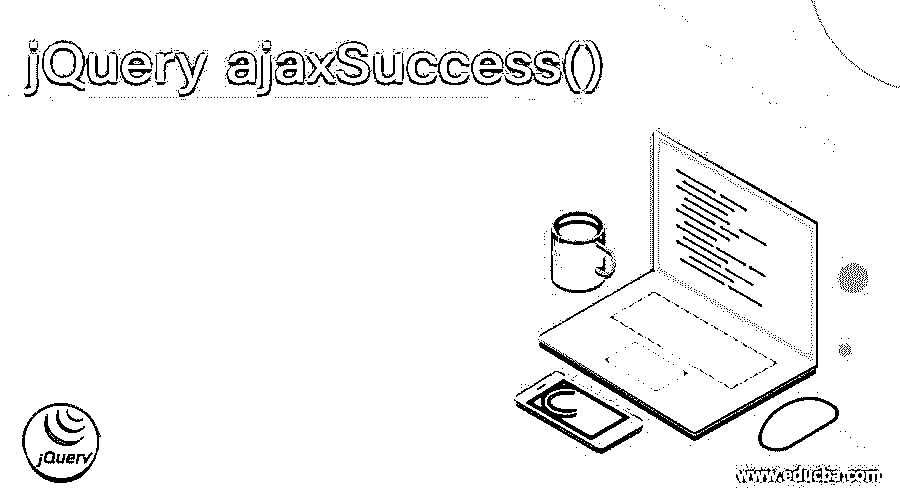
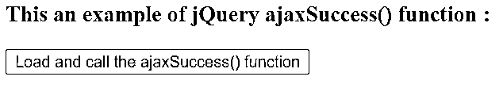
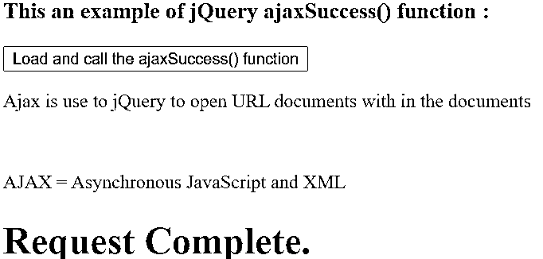
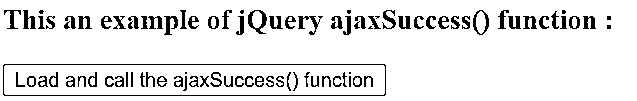
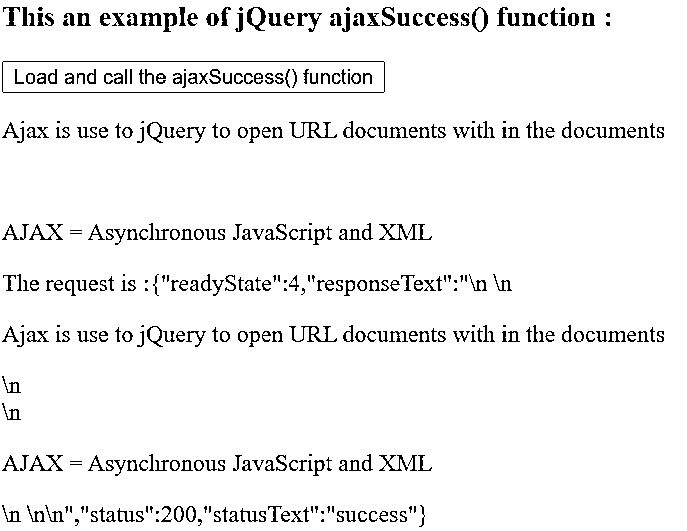

# jquery ajaxsuccess()

> 原文：<https://www.educba.com/jquery-ajaxsuccess/>




## jQuery ajaxSuccess()简介

jQuery ajax success 是一个 ajax 事件，只有在请求成功时才会被调用。AJAX success 是一个全局事件，它在文档上触发调用处理函数，该函数可能正在监听。ajax 成功可以借助 ajax success()函数来执行。jQuery ajaxSuccess()函数是 jQuery 中的内置函数。请求完成不成功时调用 ajaxSuccess()函数指定的函数，与 ajaxComplete()函数不一样。

jQuery ajaxSuccess()函数的语法–

<small>网页开发、编程语言、软件测试&其他</small>

```
$(document).ajaxSuccess(function(event, xhr, options));
```

**参数—**

**函数(event，xhr，options):** 这不是可选参数。它指定了回调函数，当发送的请求成功完成时将执行该函数；它接受三个参数 event、xhr 和 options。event 参数表示事件对象。参数 xhr 表示 XMLHttpRequest 对象。最后一个参数选项表示 ajax 请求中使用的选项。

**返回值-**

这个函数的返回值是 XMLHttpRequest 对象。

### ajaxSuccess()函数的工作原理

jQuery ajaxSuccess()函数接受三个参数。假设我们必须执行异步 HTTP GET 请求来从服务器加载数据，并在请求完成时(未成功完成)调用函数来显示一些消息以通知请求已完成。所以我们可以使用 ajaxSuccess()函数作为$( document)。ajaxSuccess ( function(event，request，settings) { $( "#p2 ")。html( "

# )请求完成。

”；});”，在请求成功完成时显示消息“请求完成”。

### jQuery ajaxSuccess()函数的示例

jQuery ajaxSuccess()函数示例，使用 ajax 请求从指定位置加载数据，并在成功完成请求时显示通知消息–

#### 示例#1

**代码:**

```
<!doctype html>
<html lang = "en">
<head>
<meta charset = "utf-8">
<script type = "text/javascript"
src = "https://ajax.googleapis.com/ajax/libs/jquery/2.1.3/jquery.min.js">
</script>
<title> This is an example for jQuery ajaxSuccess() function </title>
</head>
<body>
<h3> This an example of jQuery ajaxSuccess() function : </h3>
<button id = "btn" > Load and call the ajaxSuccess() function </button>
<br>
<p id = "p1" style = "color : red"> </p>
<p id = "p2" style = "color : red"> </p>
<script type = "text/javascript" language = "javascript">
$( document ).ready( function() {
$( "#btn" ).click( function( event )
{
$( '#p1' ).load( "ajaxfile.html" );
});
$( document ).ajaxSuccess( function( event, request, settings ) {
$( "#p2" ).html( "<h1>Request Complete.</h1>" );
});
});
</script>
</body>
</html>
```

**输出:**




一旦我们点击“加载并调用 ajaxSuccess()函数”按钮，输出是




在上面的代码中，当我们单击按钮时，load()函数将调用，该函数向服务器发送 ajax 请求以获取数据。load()函数从服务器加载数据，并将加载的数据放到所选的元素中。load()函数参数用文件名提到了从哪里获取数据的位置。请求成功完成后，ajaxSuccess()函数将通知消息显示为$(document)。ajaxSuccess( function(event，request，settings) { $("#p2 ")。html( "

# )请求完成。

”；});".因此，一旦 ajax 请求成功完成,“请求完成”。”消息将会显示出来，正如我们在上面的输出中所看到的。

重写上面的 jQuery ajaxSuccess()函数示例，通过使用来自指定位置的 ajax 请求来加载数据，并在成功完成请求后，显示请求信息

#### 实施例 2

**代码:**

```
<!doctype html>
<html lang = "en">
<head>
<meta charset = "utf-8">
<script type = "text/javascript"
src = "https://ajax.googleapis.com/ajax/libs/jquery/2.1.3/jquery.min.js">
</script>
<title> This is an example for jQuery ajaxSuccess() function </title>
</head>
<body>
<h3> This an example of jQuery ajaxSuccess() function : </h3>
<button id = "btn" > Load and call the ajaxSuccess() function </button>
<br>
<p id = "p1" style = "color : red"> </p>
<p id = "p2" style = "color : red"> </p>
<script type = "text/javascript" language = "javascript">
$( document ).ready( function() {
$( "#btn" ).click( function( event )
{
$( '#p1' ).load( "ajaxfile.html" );
});
$( document ).ajaxSuccess( function( event, request, settings ) {
$( "#p2" ).html( "The request is :" + JSON.stringify( request) );
});
});
</script>
</body>
</html>
```

**输出:**




一旦我们点击“加载并调用 ajaxsuccess()函数”按钮，输出是




在上面的代码中，当我们单击按钮时，load()函数将调用，它将 ajax 请求发送到服务器以获取数据。load()函数从服务器加载数据，并将加载的数据放到所选的元素中。load()函数参数用数据中的文件名提到了位置。在请求成功完成后，ajaxSuccess()函数显示请求信息，比如请求是否成功，请求是什么，请求的状态以及所有的信息。ajaxSuccess( function(event，request，settings) { $("#p2 ")。html("请求为:"+JSON . stringify(request))；});".因此，一旦 ajax 请求成功完成，就会显示请求信息；正如我们在上面的输出中看到的，请求没有成功。

### 结论

jQuery ajaxSuccess()函数是 jQuery 中的一个内置函数，用于指定 ajax 请求仅成功完成时要运行的处理函数。而 ajaxComplete()函数运行请求是否成功完成。

### 推荐文章

这是 jQuery ajaxSuccess()的指南。这里我们讨论 jQuery ajaxSuccess()的工作原理和示例。您也可以看看以下文章，了解更多信息–

1.  [发送前 jQuery ajax】](https://www.educba.com/jquery-ajax-beforesend/)
2.  [jQuery ajax headers](https://www.educba.com/jquery-ajax-headers/)
3.  [jQuery ajax 超时](https://www.educba.com/jquery-ajax-timeout/)


