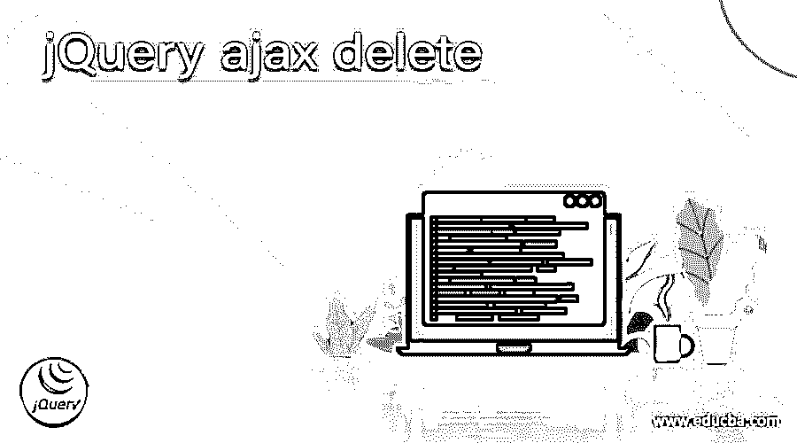
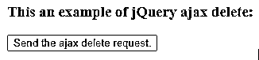
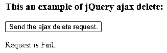
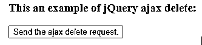
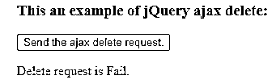

# jQuery ajax 删除

> 原文：<https://www.educba.com/jquery-ajax-delete/>




## jQuery ajax 删除的定义

jQuery ajax delete 用于从服务器上删除资源。jQuery ajax 删除请求作为 type 选项的值传递给 ajax()函数。jQuery 类型选项是一个内置选项，传递给 jQuery 中的 ajax()函数。ajax()函数用于执行对服务器的异步 HTTP 请求，并通过使用类型选项的 delete 值向服务器描述要删除的特定数据。get()函数和 post()函数分别可用于 get 和 post 请求，但是对于 delete 请求，没有这样的函数可用。

**jQuery Ajax 删除的语法—**

<small>网页开发、编程语言、软件测试&其他</small>

```
$.ajax({type : 'DELETE'});
```

**参数—**

*   类型–这是一个选项。它用于指定发送的异步 HTTP 请求的类型。类型选项的可能值为 GET、POST、PUT 和 DELETE。默认值是 GET，它发送 GET 请求。
*   返回值 ajax 类型选项不返回值。

### ajax 删除请求的工作方式

jQuery ajax 删除请求通过 type 选项值传递给 ajax()函数，以指定向服务器发送什么类型的请求。假设我们必须执行异步 HTTP 删除请求，以删除服务器上可用的数据。所以我们可以使用类型选项为“$”的 ajax()函数。ajax( 'http://time.jsontest.com '，{ type:" DELETE })；"，其中第一个参数是要删除的数据的 URL。所以，如果请求成功意味着指定的数据将被删除。

### jQuery ajax 删除请求示例

jQuery ajax delete 示例使用带有 type 选项的 ajax()函数删除数据。

#### 示例#1

```
<!doctype html>
<html lang = "en">
<head>
<meta charset = "utf-8">
<script type = "text/javascript" src = "https://ajax.googleapis.com/ajax/libs/jquery/1.11.2/jquery.min.js">
</script>
<title> This is an example for jQuery ajax delete </title>
</head>
<body>
<h3> This an example of jQuery ajax delete: </h3>
<button id = "Btn" > Send the ajax delete request. </button>
<br>
<p style = "color : red"> </p>
<script type = "text/javascript">
$(document).ready( function () {
$('#Btn').click( function(){
// url of the data that is to be delete
var ajxReq = $.ajax( 'http://time.jsontest.com', {
type : 'DELETE'
});
ajxReq.success( function ( data, status, jqXhr ) {
$( "p" ).append( "Request is Success." );
});
ajxReq.error( function ( jqXhr, textStatus, errorMessage ) {
$( "p" ).append( "Request is Fail.");
});
});
});
</script>
</body>
</html>
```

上述代码的输出是–




一旦我们点击按钮，输出是




在上面的代码中，当我们单击按钮时，ajax()函数将调用向服务器发送 HTTP 请求来删除数据。第一个参数提到要删除的数据的 URL，然后使用 XMLHttpRequest 对象(ajax()函数的返回对象)上的 success()回调函数来显示删除请求成功时的通知消息，还使用 XMLHttpRequest 对象(ajax()函数的返回对象)上的 error()函数来显示删除请求失败时的通知消息。ajax 删除请求由代码“$”发送。ajax( 'http://time.jsontest.com '，{ type:' DELETE ' })；".接下来，删除请求是否成功将通过消息通知，正如我们在上面的输出中看到的。
jQuery ajax delete 示例使用带有类型选项的 Ajax()函数删除数据

#### 实施例 2

```
<!doctype html>
<html lang = "en">
<head>
<meta charset = "utf-8">
<script type = "text/javascript" src = "https://ajax.googleapis.com/ajax/libs/jquery/1.11.2/jquery.min.js">
</script>
<title> This is an example for jQuery ajax delete </title>
</head>
<body>
<h3> This an example of jQuery ajax delete: </h3>
<button id = "Btn" > Send the ajax delete request. </button>
<br>
<p style = "color : red"> </p>
<script type = "text/javascript">
$(document).ready( function () {
$('#Btn').click( function(){
// url of the data to be delete
var ajxReq = $.ajax( {
url : 'http://time.jsontest.com',
type : 'DELETE',
success : function ( data ) {
$( "p" ).append( "Delete request is Success." );
},
error : function ( jqXhr, textStatus, errorMessage ) {
$( "p" ).append( "Delete request is Fail.");
}
});
});
});
</script>
</body>
</html>
```

上述代码的输出是




一旦我们点击“获取 p 个子节点”按钮，输出是




在上面的代码中，当我们单击按钮时，ajax()函数将调用向服务器发送 HTTP 请求来删除数据。第一个参数提到要删除的数据的 URL，然后使用 success()回调函数显示删除请求成功时的通知消息，还使用 error()回调函数显示删除请求失败时的通知消息。ajax 删除请求由代码“$”发送。ajax('http://time.jsontest.com '，{ type:' DELETE ' })；".接下来，删除请求是否成功将通过消息通知，正如我们在上面的输出中看到的。

### 结论

jQuery ajax 删除请求用于向服务器发送删除请求，以删除指定 URL 上的一些可用数据。像 get()函数和 post()函数一样，删除请求没有这样的函数。ajax 删除请求被指定为 type 选项的一个值。

### 推荐文章

这是一个 jQuery ajax 删除指南。在这里，我们用例子讨论 ajax 删除请求的定义、语法和工作方式。您也可以看看以下文章，了解更多信息–

1.  [jQuery 点击 preventDefault](https://www.educba.com/jquery-click-preventdefault/)
2.  [jQuery 未定义](https://www.educba.com/jquery-undefined/)
3.  [jQuery replaceAll](https://www.educba.com/jquery-replaceall/)
4.  [jQuery scrollLeft](https://www.educba.com/jquery-scrollleft/)


