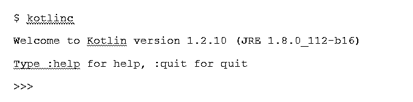
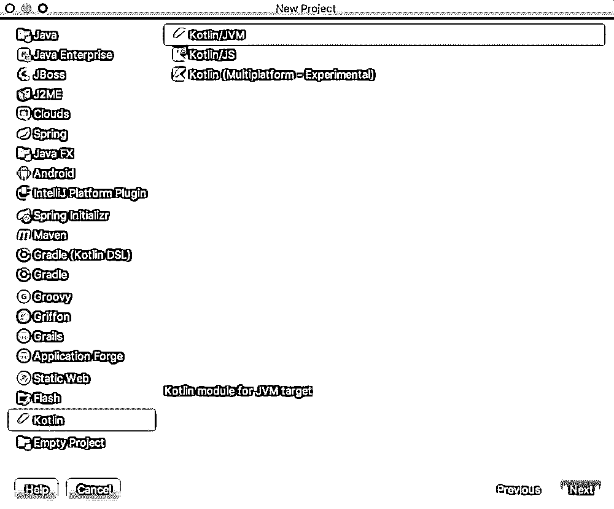
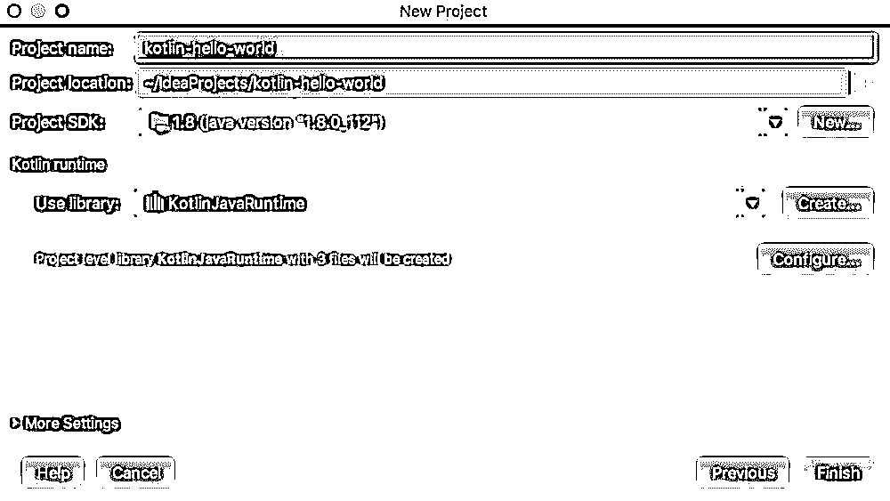
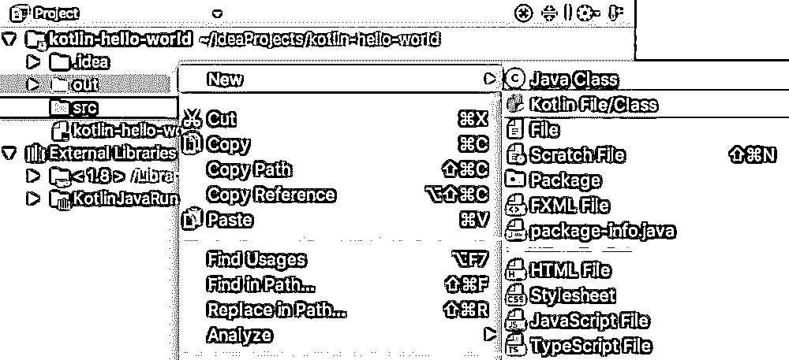
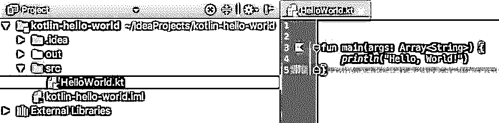
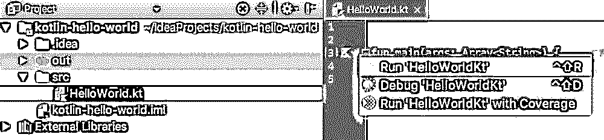
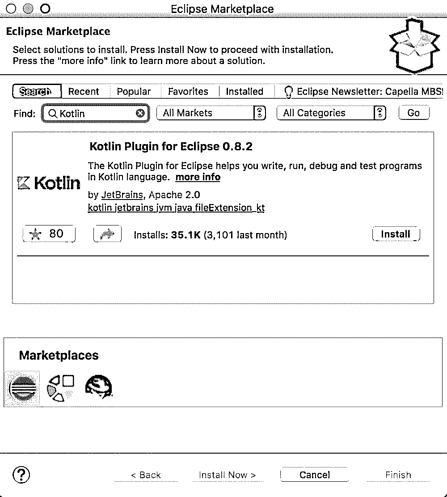
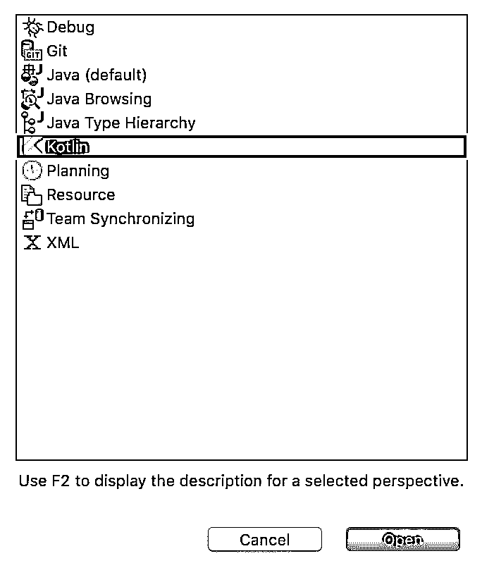
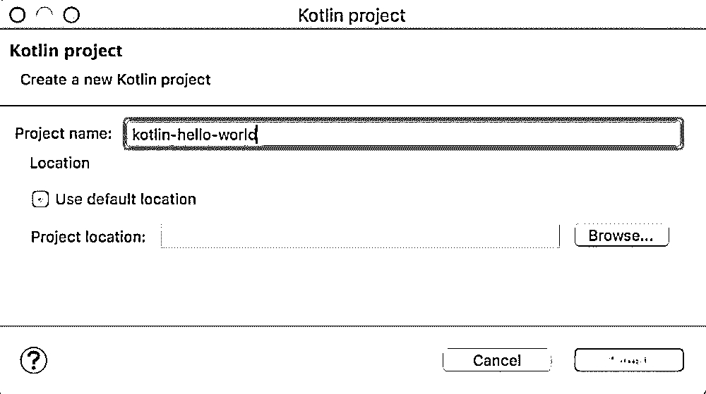
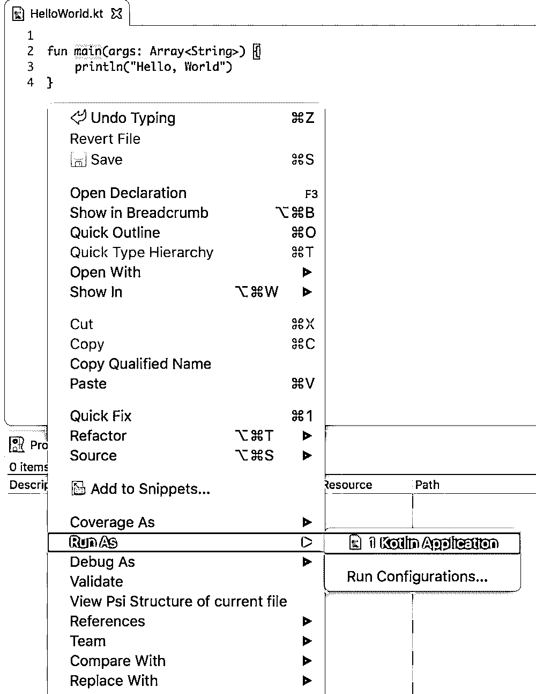

# 安装 Kotlin

> 原文：<https://www.educba.com/install-kotlin/>

## 安装 Kotlin 简介

下面的文章 Install Kotlin 提供了安装 Kotlin 的概要。如今，Kotlin 已经成为 Android 应用程序开发者最青睐的编程语言。Kotlin 是由 Jetbrains 开发和创建的，Jetbrains 是一家著名的公司，它创建了一流的 ide，即 PyCharm、IntelliJ IDEA、ReSharper 等等。Kotlin 编程语言在 [Java 虚拟机](https://www.educba.com/what-is-jvm/) (JVM)上运行，也可以汇编成机器码或 JavaScript 代码。让我们看看在我们的系统上设置 Kotlin 编程语言的方法和步骤。

### 先决条件

要继续学习 Kotlin，您应该具备编程语言 Java 的基础知识。在任何编程环境中拥有实践经验以及理解编程语言的基本概念都是很有帮助的。

<small>网页开发、编程语言、软件测试&其他</small>

### 设置 Kotlin

Kotlin 可以通过多种方式进行设置。我们可以为 Kotlin 安装一个编译器，然后从命令行执行程序，也可以安装 Kotlin，并将其设置在任何 IDE 中，如 [Eclipse 或 IntelliJ](https://www.educba.com/eclipse-vs-intellij/) 。让我们分别看看所有这些方式。

1.  设置 Kotlin 语言的编译器
2.  在 IntelliJ 中安装 Kotlin 语言
3.  在 Eclipse 中安装 Kotlin 语言

#### 1)为 Kotlin 安装编译器

1.  打开 Github，打开“Kotlin 发布”页面
2.  从“Kotlin 发行版”页面转到资产部分，下载最新版本的 Kotlin 编译器。它将以 zip 文件的形式提供。
3.  下载文件后，将文件解压缩到我们可以写入的文件夹中。
4.  用 Kotlin 编译器的 bin 位置更新 PATH 变量。例如 D:\Kotlin-compiler\bin
5.  要检查 Kotlin 编译器是否已正确安装，我们可以在命令行中运行命令“kotlinc ”,以获得如下“欢迎使用 Kotlin”消息。

    

6.  要在 Kotlin 中运行一个程序，我们需要从我们选择的任何首选编辑器中创建一个名为 demo.kt 的文本文件。让文件如下所示:

`fun main(args: Array<String>) {
println("First program!")
*}*` 

保存文件后，我们可以在命令行中运行以下命令来执行 [Kotlin](https://www.educba.com/kotlin-string/) 程序。

$ kotlinc demo.kt

你知道吗

第一个节目！

#### 2)安装 Kotlin 并用 IntelliJ 进行设置

我们需要在系统中安装最新版本的 IDE IntelliJ。除此之外，我们不需要为 IntelliJ 安装任何单独的插件，因为 Kotlin 恰好与 IntelliJ 版本打包在一起。让我们看看在 IntelliJ 中运行 Kotlin 程序的步骤。

1.  从欢迎屏幕或菜单选项“文件→新建→项目”中选择“创建新项目”选项。在出现的屏幕中，我们需要从左侧选择“Kotlin ”,然后从右侧选项中选择“Kotlin/JVM”。

    

2.  单击 next，我们会看到一个页面，在这个页面中，我们需要说明项目的名称、位置，并在名为 Project SDK 的字段中选择 Java version (1.6+)。输入详细信息后，我们可以单击 Finish 创建我们的新项目。

    

3.  下一步是生成一个新的 Kotlin 文件。这可以通过右键单击 src 文件夹并选择选项 New → Kotlin File/Class 来完成。

    

4.  将出现一个询问文件名的对话框。让我们将文件命名为 HelloWorld.kt，并在文件中编写一条打印语句。

    

5.  保存完程序后，我们可以通过右键单击我们的文件并选择 run 选项来运行它，或者通过单击程序的 main()方法旁边的小 Kotlinlogo 来运行它。

    

#### 3)安装 Kotlin 并用 Eclipse 进行设置

我们要求在我们的系统中下载最新版本的 Eclipse。一旦我们完成了 Eclipse 的安装，我们就可以按照下面的步骤来设置 Kotlin。

1.  在 Eclipse 中，我们在帮助部分有一个 Eclipse Marketplace。打开后，我们需要搜索关键字“Kotlin”并从中安装 Kotlin 插件。

    

2.  安装完成后，重启我们的 Eclipse 是必不可少的。
3.  Eclipse 重启后，我们需要检查插件是否安装正确。为此，我们转向科特林的视角。这可以通过在 Eclipse 窗口→透视图→打开透视图→其他中执行以下菜单选项来完成。a 形框架打开，Kotlin 显示为预期选项。选择 Kotlin，然后单击打开按钮切换到 Kotlin 的透视图。

    

4.  下一步是创建一个 Kotlin 项目。这可以通过执行以下菜单选项文件→新建→ Kotlin 项目来完成。出现一个窗口，我们需要在其中输入项目名称。

    

5.  单击 Finish，创建一个新的 Kotlin 项目。现在，我们将右键单击 src 文件夹并创建一个新文件。新建→ Kotlin 文件。

    

6.  创建文件并在文件中添加一小段打印代码后，我们可以右键单击源文件并选择 Run As → Kotlin 应用程序选项来执行程序。

### 结论

在本文中，我们已经看到了在我们的系统上设置 Kotlin 的三种不同的方法，我们可以采用任何一种方便的方法。如果出现问题或需求变更，我们可以随时轻松地切换到另一种方法来使用 Kotlin！

### 推荐文章

这是安装 Kotlin 的指南。这里我们分别讨论什么是安装 Kotlin，先决条件和设置 Kotlin。您也可以浏览我们推荐的其他文章，了解更多信息——

1.  [安装硒 IDE](https://www.educba.com/install-selenium-ide/)
2.  [安装立方仪表板](https://www.educba.com/install-kubernetes-dashboard/)
3.  [科特林算子](https://www.educba.com/kotlin-operators/)
4.  [科特林函数](https://www.educba.com/kotlin-functions/)

