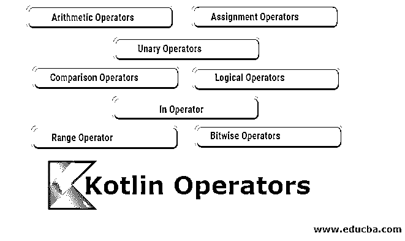

# 科特林算子

> 原文：<https://www.educba.com/kotlin-operators/>

## 科特林算子简介

下面的文章提供了 Kotlin 中最常用的操作符的概要。运算符基本上是用来对操作数执行特定运算的特殊符号。例如(-)运算符用于执行两个操作数之间的减法。

**举例:**

<small>网页开发、编程语言、软件测试&其他</small>

67 -7=60

Kotlin 中的运算符，这里 67 和 7 是操作数，而–是运算符。

下面给出了提到的不同类型:

#### 1.算术运算符

算术运算符是用于执行基本算术计算的运算符，如减法、加法、乘法和除法等。在 Kotlin simple 中 a + b 被解释为 a.plus(b)是一个函数调用。

| **操作员** | **意为** | **例子** |
| + | 添加两个操作数 | a + b |
| – | 从左操作数中减去右操作数 | 一个 b |
| * | 将两个操作数相乘 | a * b |
| / | 将左操作数除以右操作数 | a / b |
| % | 模数–返回两个数相除的余数 | a % b(从 1.1 版起已弃用) |

**举例:**

**代码:**

`package com.examples
fun main (args : Array <String>)
{
var num1 = 64
var num2 = 32
val answer : double
answer = num1 +num2
println (“sum = $answer”)  // sum = 96
answer = num1 - num2
println (“diff = $answer”)     // diff = 32
answer =num1 * num2
println ( “mult = $answer”)  // mult = 2048
answer = num1 / num2
println ( “div = $answer”)  // div = 2
answer = num1 % num2
println (“mod = $answer”)  // mod = 0
}`

**注意:** +运算符在与字符串一起使用时，也用于字符串串联。

**举例:**

**代码:**

`package com.examples
fun main (args : Array <String>)
{
val fname = “Laxman” val lname = “das”
val full_name = fname + “ “ + lname println (full_name)          // Laxman das
}`

#### 2.赋值运算符

赋值运算符用于给变量赋值。左侧评估后的值被分配给右侧的变量。

除了基本的=赋值操作符，Kotlin 还提供了大量的赋值操作符，如下所述:

| **操作员** | **例子** | **相当于** |
| + = | a+=b | a=a+b |
| -= | a-=b | a=a-b |
| *= | a*=b | a=a*b |
| /= | a/=b | a=a/b |
| %= | a%=b | a=a%b |

**举例:**

**代码:**

`package com.examples
fun main (args : Array <String>)
{
var number1 = 22 var number2 = 20 number1 + = 10 number2 % = 3
println (“Result1 = $number1”)    // Result1 = 32 println (“Result2 = $number2”)    // Result2 = 2
}`

#### 3.一元运算符

一元运算符是只对单个操作数起作用的运算符。增量(++)和减量(—)运算符是 x = x+1 和 x = x–1 的快捷方式

| **操作员** | **例子** | **相当于** |
| + | +a | +(一个值) |
| – | ［构成动植物的古名或拉丁化的现代名］ | –(一个值) |
| ! | !一 | 不是(倒置) |
| ++ | ++a | a=a+1 |

| — | –答 | a=a-1 |

**举例:**

**代码:**

`package com.examples
fun main (args : Array <String>)
{
var a = 5 var b = 10 var c = 15
negation = -a increment = ++b dec = c--
println (“Negation = $negation”)      // Negation = -5 println (“Increment = $increment”)    // Increment = 11 println (“Decrement = $dec”) // Decrement = 15
}`

增量和减量运算符可以用在变量的前后，但两者的含义不同。如果在变量名前使用了递增或递减运算符，那么在对该变量进行任何其他操作之前，该变量的值将首先被更改。如果在变量名后使用递增或递减运算符，则在对该变量进行其他运算后，其值会发生变化。

在上面的例子中，b 的值首先增加 1，然后赋给变量“increment”，而 c 的值首先赋给变量 dec，然后减 1。

#### 4.比较运算符

比较运算符用于比较这两个值。这些操作符大多与 if-else 一起使用，用于比较后执行特定的流。

| **操作员** | **意为** | **表情** |
| > | 大于 | a > b |
| < | 不到 | a < b |
| >= | 大于等于 | a >= b |
| <= | 小于等于 | a <= b |

**举例:**

**代码:**

`fun main (args : Array <String>)
{
var num1 = 20 var num2 = 30
if (num1 > num2)
{
println (“greater number is $num1”)
}
else
{
println (“greater number is $num2”)     //greater number is 30
}
}`

#### 5.相等和不相等运算符

Kotlin 提供了一组逻辑操作符，这些相等和不相等操作符根据比较结果返回一个布尔值。这些操作符在程序逻辑流中扮演着重要的角色，它们比较这些值，并根据这些值移动到程序流。

| **操作员** | **意为** | **表情** |
| != | 不等于 | 答！= b |
| == | 它等于 | a ==b |

**举例:**

**代码:**

`fun main (args : Array <String>)
{
var a = 3
var b = 6
println (a==b)     //false println (a!=b)                           // true
}`

#### 6.逻辑运算符

Kotlin 提供了下面提到的 3 个逻辑操作符，它们返回布尔值 true 或 false。

| **操作员** | **意为** | **表情** |
| && | 如果所有值都为真，则为真 | a && b(意思是 a 和 b) |
| &#124;&#124; | 如果任一值为真，则为真 | a &#124;&#124; b(意为 a 或 b) |
| ! | 如果值为假，则为真！ | a(意思不是 a) |

**举例:**

**代码:**

`fun main (args : Array <String>)
{
var a = 20 var b = 4 var c = -8
val answer : Boolean
answer = (a>b) || (b<c) println (“answer is $answer)  // answer is true
}`

#### 7.In 运算符

在 Kotlin 语言中，In 运算符用于检查集合中是否存在给定的对象。

| **操作员** | **意为** | **表情** |
| 在 | 是收藏 b 中的一件礼物 | b 中的 a |
| 不在 | 集合 b 中不存在 a 吗 | 答！在 b |

**举例:**

**代码:**

`fun main (args : Array <String>)
{
val array = intArrayOf(10, 20, 30 ,40) If (20 in array)
{
println (“yes 20 is present in array”)       // yes 20 is present in array
}
else
{
println (“no 20 is not present in array”)
}
}`

#### 8.距离操作手

Kotlin 使用 range 运算符创建一个数值范围。这个运算符在处理循环时非常有用。如果值是连续的，就没有必要定义每个值；最好使用快捷方式并定义指定最低和最高值的范围。

| **操作员** | **意为** | **表情** |
| **。.** | 如果 I 在从 a 到 b 的范围内 | 对于(我在一个…b) |

**举例:**

**代码:**

`fun main (args : Array <String>)
{
for (i in 1..10)
{
println (“value of i is $i”)     // value of i is 1
}                                         //value of i is 2 till value of i is 10
}`

#### 9.索引存取运算符

索引访问运算符用于访问数组中特定索引处的任何值。在 Kotlin 中，数组从索引 0 开始。

| **操作员** | **意为** |
| a [i] | 获取数组“a”中索引“I”处的值 |
| a [i] = b | 在数组“a”的“I”索引处设置值 b |

**举例:**

`fun main (args : Array <String>)
{
val array = intArrayOf(10, 20, 30, 40, 50) var value = array[1] println(“value at index 1 is $value”)         //value at index 1 is 20
array[1] = 90
println (“recent value at index 1 is $array[1]”)  //recent value at index 1 is 90
}`

#### 10.按位运算符

像其他编程语言一样，例如 C、C++、Java，Kotlin 没有任何按位运算符。它有各种用于位运算的函数。

| **功能** | **意为** |
| 感觉神经性听力丧失 | 带符号左移 |
| share 分享 | 有符号右移 |
| 引导 | 无符号右移 |
| 和 | 按位 and |
| 或者 | 按位或 |
| 异或运算 | 按位异或 |
| （同 Inventor）发明者 | 逐位反转 |

**举例:**

**代码:**

`fun main (args : Array <String>)
{
var a = 12 var b = 10
val result1 : Int val result2 : Int
result1 = a and b result2 = a or b
println (“final result of and operation is $result1”)  // final result of and operation is 8
Println (“final result of or operation is $result2”)  // final result of or operation is 14
}`

### 推荐文章

这是 Kotlin 操作员的指南。这里我们讨论 kotlin 中使用的不同操作符及其示例。您也可以浏览我们推荐的其他文章，了解更多信息——

1.  [kot Lin 是什么？](https://www.educba.com/what-is-kotlin/)
2.  [R 运算符](https://www.educba.com/r-operators/)
3.  [科特林面试问题](https://www.educba.com/kotlin-interview-questions/)
4.  [安装 Kotlin](https://www.educba.com/install-kotlin/)

