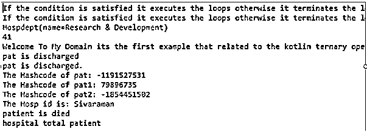
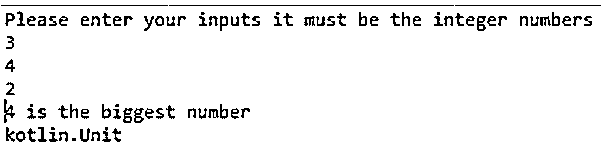

# 科特林三元

> 原文：<https://www.educba.com/kotlin-ternary/>


## 科特林三进制简介

三元是运算符，但在科特林语言中，它不存在；可以使用 if-else 语句来代替该运算符。它返回的值可以根据特定的条件，这是完全一样的工作像三元运算符，如果条件本身读取代码行，可以更兼容，然后三元，使 kotlin 使用多个 if 语句像嵌套-if，if-else-if 梯形表达式的基础上，这个表达式。它将返回值，因为语句中使用了多个条件。任何条件为假，它将退出循环。

**语法:**

<small>网页开发、编程语言、软件测试&其他</small>

在 Kotlin 语言中有许多默认的类，方法、变量、操作符和其他条件语句都被用来构建应用程序。每件事背后都有一个独立的逻辑来实现时间。像这样，三元是运算符，但在 kotlin 语言中没有使用；相反，我们可以通过使用 if-else 语句本身来实现这一点。

```
fun main()
{
var variable name1:datatype;
var variable name2:datatype;
var variable name3:datatype;
if(variable name1)variable name2 else variable name3 //ternary operator used in this line now kotlin does not support this line
if variable name1 ? variable name2 : variable name3
{
----some codes which based on the above conditions----
}
else
{
---it exists the if loop and execute the else statement
}
}
```

以上代码是使用 if-else 表达式实现三元运算符的基本语法。

### Kotlin 中三元运算符是如何工作的？

三元运算符通常不适用于 kotlin 语言；它使用三个操作数。并且这些操作数后面跟有可以用“？”来诊断的特定条件运算符，如果条件为假，将根据要执行的表达式条件语句来计算最终输出结果。我们还可以使用 when 关键字及其 also 表达式来验证条件，因为当它是伪三元运算符时，很容易读取和检查条件，如果它为真，它将执行循环条件；否则，它存在循环。在这种情况下，代码是简单的，直截了当的，易于阅读，为变量值赋值。我们使用另一种类型的操作符，如 Elvis 操作符，来检查 when 和 if 语句条件。通常，编程语言使用和控制语句来控制它基于某些条件的执行程序的流程。像“if”是条件表达式之一，它有许多类型，如 if 表达式、if-else 表达式、if-else-if 梯形表达式、嵌套 if 表达式等。对于每种类型的 if 块都有不同的语法，并且根据条件调用操作符和操作数。

#### 示例#1

```
sealed class Hospital
data class DSK(val id: Int) : Hospital()
data class Appolo(val id1: Int) : Hospital()
data class Hosp(val name: String, val id: Int)
infix fun <T : Any> Boolean.yes(checkcondition1: T): T? = if (this) checkcondition1 else null
infix fun <T : Any> T?.no(checkcondition2: T): T = this ?: checkcondition2
fun main() {
run {
val first = true
val out = first yes "If condition is satisfied it return true!" no "else it will return false!"
println("If the condition is satisfied it executes the loops otherwise it terminates the loop($first): $out")
}
run {
val first = false
val out = first yes "True!" no "False!"
println("If the condition is satisfied it executes the loops otherwise it terminates the loop($first): $out")
}
data class Hospdept(val name: String)
{
var patientid: Int = 0;
}
val op=Hospdept("Research & Development")
op.patientid = 41
println(op.toString());
println(op.patientid);
println("Welcome To My Domain its the first example that related to the kotlin ternary operator")
val pat = Hosp("Sivaraman", 31)
val pat1 = Hosp("Siva", 32)
val pat2 = Hosp("Raman", 29)
if (pat.equals(pat1) == true)
println("pat is still in hospital.")
else
println("pat is discharged")
if (pat.equals(pat2) == true)
println("pat is in hospital")
else
println("pat is discharged.")
println("The Hashcode of pat: ${pat.hashCode()}")
println("The Hashcode of pat1: ${pat1.hashCode()}")
println("The Hashcode of pat2: ${pat2.hashCode()}")
val id=pat.component1()
println("The Hosp id is: $id")
fun patdetails()
{
val listss:List<Hospital> = listOf(DSK(17),Appolo(2021), Appolo(2021))
println("Welcome To My Domain is the first example that related to the Kotlin ternary operator ")
val mapss = HashMap<Int, String>()
mapss.put(1, "siva")
mapss.put(2, "raman")
mapss.put(3, "arun")
mapss.put(4, "kumar")
mapss.put(5, "dhanajay kumar prasad")
mapss.put(6, "arul")
mapss.put(7, "devendran redim kumar tharun")
mapss.put(8, "daisy sran kumar yadav")
mapss.put(9, "Alan nirmal williamson")
mapss.put(10, "varadhaman vishal jain")
println(mapss)
}
val list = listOf("id", "id1", "op")
if (id !in 0..list.lastIndex) {
println("patient is died")
}
if (list.size !in list.indices) {
println("hospital total patient")
}
}
```

**输出:**




在第一个示例中，我们通过 if-else 语句使用了一些实时示例，如医院、患者总数、部门详细信息。

#### 实施例 2

```
fun main() {
val inpnum = -103
if(inpnum<0)
println("Thank you users the mentioned input number is negative")
else if (inpnum>0 && inpnum<10)
println("The mentioned input number is single digit so you are not entered the double and more digits")
else if (inpnum>=10 && inpnum <100)
println("You entered the input number is double digit the single and more than two digit numbers are not accepted")
else
println("The mentioned input number is three digit numbers it will not accept single, double and more than three digit numbers")
}
```

**输出:**


在第二个示例中，我们使用 if-else 表达式计算输入数字包含负数、单位数、多位数。

#### 实施例 3

```
import java.util.Scanner
fun main(args: Array<String>) {
val inp = Scanner(System.`in`)
print("Please enter your inputs it must be the integer numbers ")
var inp1 = inp.nextInt()
var inp2 = inp.nextInt()
var inp3 = inp.nextInt()
var outp = if ( inp1 > inp2) {
if (inp1 > inp3) {
println("$inp1 is the biggest number")
}
else {
println("$inp3 is the biggest number")
}
}
else if( inp2 > inp3){
println("$inp2 is the biggest number")
}
else{
println("$inp3 is the biggest number")
}
println(outp)
}
```

**输出:**




在最后一个例子中，我们使用了一些基本的计算方法，比如使用 if 语句找到序列的最大值。

### 结论

在 kotlin 中，我们讨论了类似三元的运算符，但遗憾的是，kotlin 不接受这种运算符。因为 kotlin 语言中的 if-else 表达式 if，while 是条件表达式，所以它将根据条件管理操作数。所以三进制对于程序员来说是不适用的，也是不可用的。

### 推荐文章

这是一个科特林三元指南。这里我们讨论一下 Kotlin 中三元运算符的介绍、语法、工作原理。代码实现示例。您也可以看看以下文章，了解更多信息–

1.  [科特林开关](https://www.educba.com/kotlin-switch/)
2.  [科特林 kclass](https://www.educba.com/kotlin-kclass/)
3.  [科特林内嵌函数](https://www.educba.com/kotlin-inline-function/)
4.  [科特林收藏馆](https://www.educba.com/kotlin-collections/)


