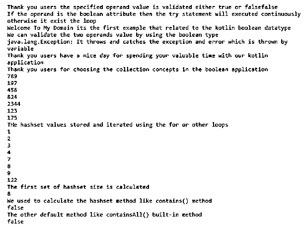
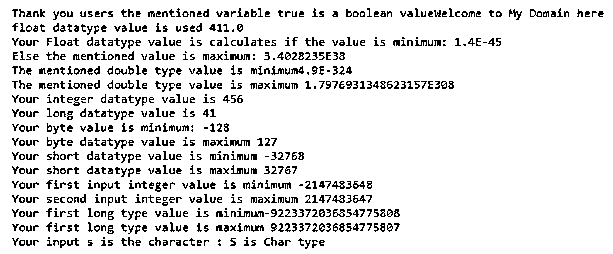

# 科特林布尔

> 原文：<https://www.educba.com/kotlin-boolean/>


## 科特林布尔函数简介

在 kotlin 中，boolean 是仅支持 true 或 false 值的数据类型之一，它支持所有其他操作符，如关系操作符，只能使用 boolean 值生成它打印并验证控制台屏幕上的值，它还在指定条件下比较不同的对象索引值是可变的，如果满足条件，它将根据依赖关系执行循环计算程序代码 将按照指定的顺序执行对象比较，如果对象相等，则返回 true 语句，否则将返回负值。

**语法:**

<small>网页开发、编程语言、软件测试&其他</small>

在 kotlin 编程中，语言数据类型是声明和利用值的最重要的数据类型。像布尔值一样，它也是一种数据类型，它也被认为是原始数据类型，只满足真或假语句。

```
fun main()
{
var variable : Boolean ?= null;
if (variable == true){
----some logics---
}
if(variable == false)
{
---some logic codes---
}
}
```

上述代码是用于验证布尔条件的基本语法，并且它满足被编码功能淹没的所有编程逻辑和循环依赖性。

### boolean 在 Kotlin 中是如何工作的？

基本上，kotlin 是强大的，它也是处理表达式的每个变量的静态类型编程语言，它是可用于编译编程语言的类型。因此，kotlin 类型是值的极限类型，可用于保存变量值及其表达式，以产生这些值和运算所支持的极限运算。有时静态类型有助于在编译时检测错误，它不支持数据类型之间的隐式转换。大多数情况下，我们不使用变量的显式数据类型，这可能会干扰 kotlin 类型推理来确定数据类型。布尔类将包装原始类型布尔对象的值，它包含单个字段数据类型。此外，该类还提供了许多默认方法，用于将布尔类型转换为其他数据类型，如字符串等。我们也可以将其他类型的字符串转换为布尔型，作为一些常量和内置方法来验证布尔型语句。每当我们在其他区域调用该方法时，布尔对象都会将默认值参数分配给该方法。

#### 示例#1

```
open class first {
open fun demo1() {
println("Welcome To My Domain its the first example that related to the kotlin boolean datatype")
}
}
abstract class second : first() {
override abstract fun demo1()
}
class Third: second(){
override fun demo1() {
println("We can validate the two operands value by using the boolean type")
}
}
fun main() {
try{
val vars: Boolean
vars = false
println("Thank you users the specified operand value is validated either true or false"+"$vars")
println("If the operand is the boolean attribute then the try statement will executed continuously otherwise it exist the loop")
throw Exception("It throws and catches the exception and error which is thrown by variable")
println("Your exceptions are printed")
}
catch(e: Exception){
val new = first()
new.demo1()
val th = Third()
th.demo1()
println(e)
}
finally{
println("Thank you users have a nice day for spending your valuable time with our kotlin application")
}
var hs = HashSet<Int>(8)
hs.add(123)
hs.add(456)
hs.add(789)
hs.add(175)
hs.add(197)
hs.add(824)
hs.add(456)
hs.add(2344)
println("Thank you users for choosing the collection concepts in the boolean application")
for (s in hs){
println(s)
}
var new1: HashSet<Int> = hashSetOf<Int>(1,4,3,2,7,8,9,122)
val new2 = setOf(3,6,9,12)
println("THe hashset values stored and iterated using the for or other loops")
for (x in new1){
println(x)
}
println("The first set of hashset size is calculated")
println(new1.size)
println("We used to calculate the hashset method like contains() method")
println(new1.contains(13))
println("The other default method like containsAll() built-in method")
println(new1.containsAll(new2))
}
```

**输出:**




在上面的例子中，我们使用了布尔以及 hashset 集合和它们的默认方法。

#### 实施例 2

```
fun main() {
if (true is Boolean){
print("Thank you users the mentioned variable true is a boolean value")
}
var varfloat = 411F
println("Welcome to My Domain here float datatype value is used ${varfloat}")
var p: Float = Float.MIN_VALUE
var p2: Float = Float.MAX_VALUE
println("Your Float datatype value is calculates if the value is minimum: " +p)
println("Else the mentioned value is maximum: " + p2)
var dou1: Double = Double.MIN_VALUE
var dou2: Double = Double.MAX_VALUE
println("The mentioned double type value is minimum" + dou1)
println("The mentioned double type value is maximum " + dou2)
var inp = 456
var lng = 41L
println("Your integer datatype value is ${inp}")
println("Your long datatype value is ${lng}")
var by1: Byte = Byte.MIN_VALUE
var by2: Byte = Byte.MAX_VALUE
println("Your byte value is minimum: " +by1)
println("Your byte datatype value is maximum " +by2)
var sh1: Short = Short.MIN_VALUE
var sh2: Short = Short.MAX_VALUE
println("Your short datatype value is minimum " +sh1)
println("Your short datatype value is maximum " +sh2)
var in1: Int = Int.MIN_VALUE
var in2: Int = Int.MAX_VALUE
println("Your first input integer value is minimum " +in1)
println("Your second input integer value is maximum " +in2)
var log1: Long = Long.MIN_VALUE
var log2: Long = Long.MAX_VALUE
println("Your first long type value is minimum" +log1)
println("Your first long type value is maximum " +log2)
var ch: Char = 'S'
println("Your input s is the character : $ch is Char type")
}
```

**输出:**




在第二个例子中，我们使用了 boolean 和另一个带有一些基本声明的数据类型。

#### 实施例 3

```
fun main() {
var inp1 ="July"
var inp2 = "June"
println(inp2)
val month: Boolean
month=true
if ( month==false) {
println("Thank you users this month is $inp1")
}
if (month==true) {
println("Thank you users sorry this month is $inp2")
}
}
```

**输出:**


在最后一个示例中，我们使用了两个字符串类型的变量，并使用 if 条件和布尔语句来验证值。

### 结论

在 kotlin 语言中，boolean 数据类型是最主要的，它可以与其他具有不同数据类型(如 integer、string 等)的操作数一起进行验证。它只支持 true 和 false 语句，如果满足输入条件，它将执行循环条件，否则它将退出循环。

### 推荐文章

这是一本科特林布尔的指南。在这里，我们讨论了 Kotlin 中的介绍、语法、布尔如何工作？代码实现示例。您也可以看看以下文章，了解更多信息–

1.  [科特林群比](https://www.educba.com/kotlin-groupby/)
2.  [科特林减少](https://www.educba.com/kotlin-reduce/)
3.  [科特林开关](https://www.educba.com/kotlin-switch/)
4.  [科特林 kclass](https://www.educba.com/kotlin-kclass/)


