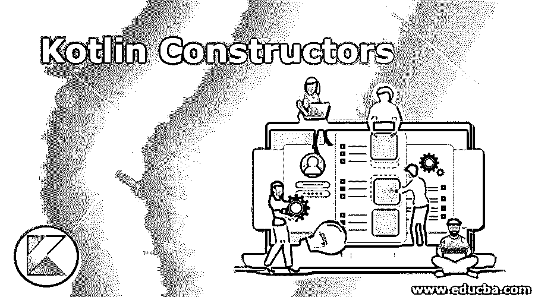
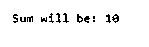
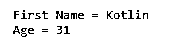
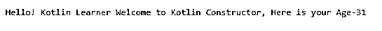
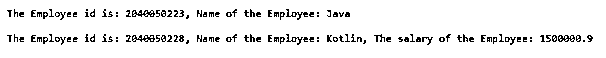
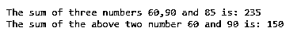

# 科特林构造函数

> 原文：<https://www.educba.com/kotlin-constructors/>

## Kotlin 构造函数简介

构造函数是一种特殊的成员函数，当生成一个类对象主要是为了初始化变量或属性时，就会调用它。一个类需要一个构造函数，如果我们没有声明一个构造函数，那么编译器就会创建一个默认的构造函数。

### Kotlin 构造函数的类型

有两种类型的构造函数:

<small>网页开发、编程语言、软件测试&其他</small>

1.  **主构造函数:**这是一种简洁的初始化类的方法。
2.  **二级构造器:**它允许你放附加的初始化逻辑。

一个 Kotlin 类只能有一个主构造函数，以及一个或多个辅助构造函数。主构建器初始化该类，同时使用辅助构建器初始化该类并添加一些额外的逻辑。

### Kotlin 构造函数的实现示例

以下是 Kotlin 构造函数的示例:

#### 示例# 1–主要构造函数

使用 Constructor 关键字在类头中初始化主构造函数。这是一个使用主构造函数的程序。

**代码:**

`fun main(args: Array<String>)
{
val add = Add (3,7)
println("Sum will be: ${add.c}")
}
//now the Primary constructor will be used
class Add constructor(a: Int, b:Int)
{
var c = a+b;
}`

**输出:**

**解释:**如果我们为类创建 add 对象，那么值 3 和 7 将传递给构造函数。
3 构造函数参数 a 和 b 分别用参数 3 和 7 初始化。向量区域设置 c 包括变量的数量。在初选中，我们使用${add.c}来访问承包商的属性。

#### 实施例 2

主构造函数和初始化程序块。主构造函数的语法受到限制，不能包含任何代码。因此，为了插入初始化代码，initializer 块与 init 一起使用，例如:

**代码:**

`fun main(args: Array<String>) {
val person1 = NAme("kotlin", 31)
}
class NAme(fName: String, yourAge: Int) {
valnewName: String
var age: Int
// initializer block – This block initialize the code written in the constructor
init {
newName= fName.capitalize()
age = yourAge
println("First Name = $newName")
println("Age = $age")
}
}`

**输出:**

**解释:**在上面的程序中，我们在创建 person1 对象时，在分别接受 kotlin 和 31 值的括号中使用了两个参数 Name 和 your age。然而，在没有像 var 和 val 那样初始化的情况下使用了 Name 和 personAgeare，它们也不是 Person 类的属性。

此外，有一个名为 uppercase 的函数可以将字符值从小写转换为大写。

#### 示例# 3–二级构造器

如前所述，科特林将有一个或两个侧建设者。次级构造函数允许变量的初始化，也允许类被赋予任何基本原理。它们以构造函数的关键字为前缀。

Kotlin 允许创建一个或多个二级建造者的职业。这个二级构建器是使用关键字“构造器”生成的。每当你想在 Kotlin 中创建多个构建器，或者每当你想在主构建器中包含更多的逻辑时，它都是必需的，但你不能这样做，因为其他类可以调用主构造函数。下面是一个例子:

**代码:**

`fun main(args: Array<String>) {
valZambo = Zambo ("Kotlin Learner ", 31)
print("${Zambo.message}"+"${ Zambo.firstName}"+
"Welcome to Kotlin Constructor, Here is your Age-${ Zambo.age}")
}
class Zambo (valfirstName: String, var age: Int) {
val message: String  = "Hello! "
constructor(name : String , age :Int ,message :String):this(name,age) {
}
}`

**输出:**

**解释:**在上面的程序中，值是在 Zambo 下声明的，然后在代码中使用，代码通过连接代码中的不同变量和值来打印输出。

#### 实施例 4

让我们再看几个 Kotlin 中主构造函数和次构造函数的例子:

**代码:**

`fun main(args: Array<String>) {
employeeID(2040050223, "Java")
employeeID(2040050228,"Kotlin",1500000.9)
}
class employeeID {
constructor (NEWemp_id :Int, NEWemp_name: String ) {
var id: Int = NEWemp_id
var name: String = NEWemp_name
print("The Employee id is: $id, ")
println("Name of the Employee: $name")
println()
}
constructor (NEWemp_id :Int, NEWemp_name: String ,NEWemp_salary : Double) {
var id: Int = NEWemp_id
var name: String = NEWemp_name
varsalary : Double = NEWemp_salary
print("The Employee id is: $id, ")
print("Name of the Employee: $name, ")
println("The salary of the Employee: $salary")
}
}`

**输出:**

**解释:**上面的程序使用两个雇员 id 和构造函数来获取详细信息，如雇员姓名、雇员 id 和其中一个雇员的工资。

#### 实施例 5

**代码:**

`//main function – This defines the main function
fun main(args: Array<String>)
{
Add(60,90)
}
class Add {
// calling another secondary using this
constructor(a:Int, b:Int) : this(a,b,85) {
varsumoftwo = a + b
println("The sum of the above two number 60 and 90 is: $sumoftwo ")
}
// this executes first
constructor(a:Int, b:Int, c:Int) {
varsumofthree= a + b + c
println("The sum of three numbers 60,90 and 85 is: $sumofthree ")
}
}`

**输出:**

**解释:**上面的程序解释了构造函数内部构造函数的使用，这里我们有两个构造函数，它们在第一个构造函数中输入两个数相加的值，另一个在第二个构造函数中给出三个数的值。上面的程序还解释了在 Kotlin 构造函数中初始化是分开进行的，初始化后的值可以通过调用函数在另一个构造函数中重用。

### 结论

在上面的文章中，我们讨论并学习了 Kotlin 构造函数和各种创建构造函数的方法，以及主构造函数和次构造函数的不同用法。根据您的用途，您还可以以不同的方式使用构造函数，因为主代码是在构造函数内部编写的，值是在以后初始化的。我们还了解到，主构造函数使用 init 块来执行变量和值的初始化，而对于次构造函数，则必须以不同的形式调用主构造函数。

### 推荐文章

这是一个 Kotlin 构造函数的指南。在这里，我们讨论 Kotlin 构造函数及其示例的介绍，以及代码实现和输出。您也可以浏览我们推荐的其他文章，了解更多信息——

1.  [科特林算子](https://www.educba.com/kotlin-operators/)
2.  [科特林函数](https://www.educba.com/kotlin-functions/)
3.  [锅炉 vs 斯威夫特](https://www.educba.com/kotlin-vs-swift/)
4.  [科特林面试问题](https://www.educba.com/kotlin-interview-questions/)

