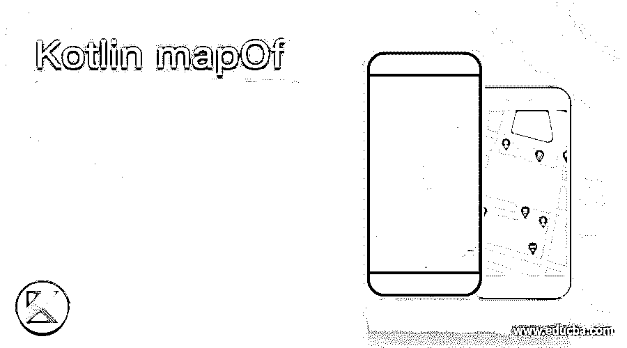
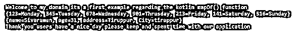
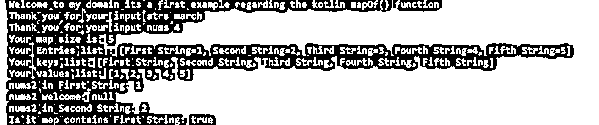
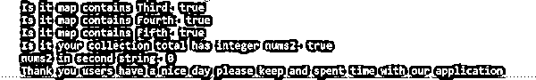

# 科特林·马普夫

> 原文：<https://www.educba.com/kotlin-mapof/>




## 科特林·马普夫简介

kotlin mapOf 被定义为函数，它是 util 集合之一，它在接口下表示，它接受用户定义类型的键和值，基于键的映射值正在处理，能够在特定键的帮助下存储和检索值，它还从标准库中分离和过滤键和值映射函数，标准库通过从映射中返回键和值 使用 filter()函数，我们可以过滤映射键和值，如果假设多个对具有相同的键，则键的值来自这些对中的最后一个。

**语法:**

<small>网页开发、编程语言、软件测试&其他</small>

在 kotlin 语言中，我们使用了许多默认的关键字、函数和其他基于用户需求的默认类。mapOf()方法是必须创建的不可变映射之一，它是一个只读格式的映射，保存带有键值对的数据。

```
fun main(args:Array<String>)
{
val variablename=mapOf(key, values)
---some kotlin programming logic codes depends upon the requirement---
}
```

以上代码是在 kotlin 应用程序中使用 mapOf()方法的基本语法。我们也可以在 kotlin 默认包的帮助下实现应用程序。

### Kotlin 中 mapOf()函数是如何工作的？

mapOf()方法有助于创建只读格式和对列表中具有指定数据内容的映射值，其中第一个索引值位于键格式上，第二个索引格式位于值上。通常，映射是集合中的一个，它可以查看成对的对象，它基于不可变的映射，可以是只读格式，它还会查找映射大小，它有许多对，可以通过属性大小和默认方法(如 count()和 size()方法)来确定。这些方法用于计算字符数，并且它已经计算了这些条目的大小，这些条目是键和值，还有一些其他默认方法，如 contains 和从 mapOf()方法获取值，这有助于通过使用 forEach()循环来迭代值。用于创建包含新条目值的新映射的映射接口不会改变原始映射。如果我们想通过使用像 put()方法这样的默认方法将映射条目添加到原始映射中，则需要将用户输入条目插入到内存中。对于数组，我们可以通过使用索引来获取值，索引必须是整数数据类型，并且所有索引都必须是顺序的。

#### 示例#1

```
package one;
enum class First(val exampl: Boolean = true){
Monday,
Tuesday,
Wednesday,
Thrusday,
Friday,
Saturday,
Sunday;
companion object{
fun demo(obj: First): Boolean {
return obj.name.compareTo("Tuesday") == 0 || obj.name.compareTo("Friday") == 0
}
}
}
fun demos(fr: First) {
when(fr) {
First.Monday -> println("Monday")
First.Tuesday->println("Tuesday")
First.Wednesday -> println("Wednesday")
First.Thrusday -> println("Thrusday")
First.Friday -> println("Friday")
First.Saturday -> println("Saturday")
First.Sunday ->println("Sunday")
}
}
fun main() {
println("Welcome to my domain its a first example regarding the kotlin mapOf() function")
val frs = mapOf(123 to "Monday", 345 to "Tuesday", 678 to "Wednesday",901 to "Thrusday",213 to "Friday",141 to "Saturday",516 to "Sunday")
println(frs)
val sec = mapOf("name" to "Sivaraman", "age" to "31", "address" to "Tiruppur", "City" to "tiruppur")
println(sec)
println("Thank you users have a nice day please keep and spent time with our application")
}
```

**输出:**




在上面的例子中，我们使用了 enum 概念，在使用了 mapOf()方法之后，通过 main 方法调用了值。

#### 实施例 2

```
package one;
fun main() {
println("Welcome to my domain its a first example regarding the kotlin mapOf() function")
val second = mapOf("january" to 1, "february" to 2, "march" to 3,
"april" to 4 , "may" to 5, "june" to 6, "july" to 7, "august" to 8, "september" to 9, "october" to 10, "november" to 11, "december" to 12)
var strs = "march"
if (second.containsKey(strs)) {
println("Thank you for your input strs $strs")
} else {
println("Please enter the input in string characters strs $strs")
}
val nums = 4
if (second.containsValue(nums)) {
println("Thank you for your input nums $nums")
} else {
println("Please enter the input in number format $nums")
}
val nums2 = mapOf<String, Int>("First String" to 1, "Second String" to 2, "Third String" to 3, "Fourth String" to 4,"Fifth String" to 5)
println("Your map size is: ${nums2.size}")
println("Your Entries list : ${nums2.entries}")
println("Your keys list: ${nums2.keys}")
println("Your values list: ${nums2.values}")
println("nums2 in First String: ${nums2.get("First String")}")
println("nums2 welcome: ${nums2["users"]}")
println("nums2 in Second String: ${nums2.getValue("Second String")}")
println("Is it map contains First String: ${nums2.containsKey("First String")}")
println("Is it map contains Third: ${nums2.contains("Third String")}")
println("Is it map contains Fourth: ${"Fourth String" in nums2}")
println("Is it map contains Fifth: ${"Fifth String" in nums2}")
println("Is it your collection total has integer nums2: ${nums2.containsValue(3)}")
println("nums2 in second string: ${nums2.getOrDefault("second input strings",0)}")
println("Thank you users have a nice day please keep and spent time with our application")
}
```

**输出:**







第二个例子我们可以在 mapOf()方法上注册后使用条件语句来验证用户输入。

#### 实施例 3

```
package one;
fun main() {
println("Welcome to my domain its a third example regarding the kotlin mapOf() function")
val third = HashMap<String, Int>()
third["Employee ID"] = 123
third["Employee PinCode"] = 600063
third["Employee Mobile"] = 822023
for ((k, v) in third) {
println("Thank you users your inputs are $k = $v")
}
val news = mapOf("EmployeeID" to 456, "Employee PinCode" to 654332, "Employee Mobile" to 98654)
println("Thank you users your Entries list are: " + news.entries)
println("Your input Keys are:" + news.keys)
println("Your input Values are:" + news.values)
println("Thank you users have a nice day please keep and spent time with our application")
}
```

**输出:**


最后一个例子中，我们额外使用了散列映射概念，并使用与 mapOf()方法相同的方法存储了雇员的详细信息。

### 结论

在 kotlin 语言中，我们使用了许多不同的包，其中包含了具有默认方法的类。例如，mapOf()是带有 util 集合包的 map 接口下的默认方法之一，用于存储键-值对上的用户输入，它是一个不可变的方法，所以我们不能更改它。

### 推荐文章

这是科特林地图的指南。这里我们讨论一下简介，语法，以及在 Kotlin 中 mapOf()函数是如何工作的？举例说明。您也可以看看以下文章，了解更多信息–

1.  [科特林范围](https://www.educba.com/kotlin-range/)
2.  [科特林循环](https://www.educba.com/kotlin-loops/)
3.  [科特林构造函数](https://www.educba.com/kotlin-constructors/)
4.  [科特林琴弦](https://www.educba.com/kotlin-string/)


