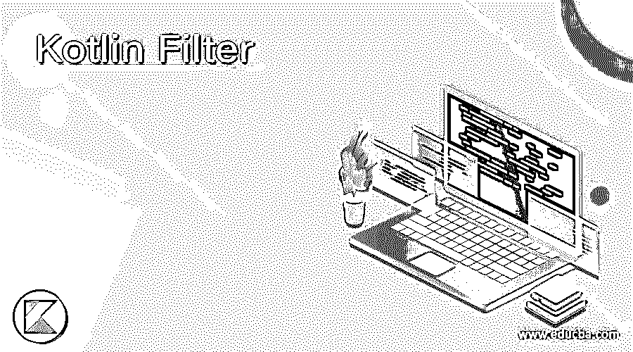
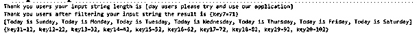
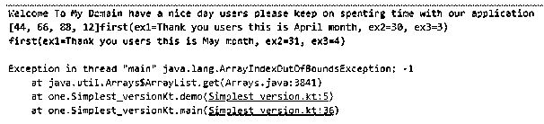
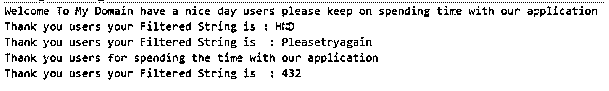

# 科特林过滤器

> 原文：<https://www.educba.com/kotlin-filter/>




## 科特林滤波器简介

kotlin filter()是默认方法之一，用于突出处理列表中集合数据的任务，它将返回包含与列表相关联的所有元素的元素。它必须与提到的谓词值匹配。它可以是任何类型，如函数接口的布尔条件。使用基于索引的概念存储和检索值。索引位置将作为两个不同的参数传递。它还支持正值和负值条件。

**语法:**

<small>网页开发、编程语言、软件测试&其他</small>

在 kotlin 语言中，所有对象类型的超类型是根和父类，这与 java 语言更相似。就像 filter()是 kotlin 预定义方法之一一样，它可以用普通谓词过滤，并返回一些匹配的集合元素。

```
fun main()
{
val vars1 : collections like map()
val vars2=vars1.filter{ --- some input conditions depends upon the requirement---}
---some kotlin logics depends upon the requirement---
}
```

上述代码是在默认包(如集合和其他 util 包)上使用 filter()方法的基本语法。

### Kotlin 中的 filter 函数是如何工作的？

kotlin 过滤器函数用于根据预测数据创建单独的列表作为新列表。当我们过滤用户数据时，通过使用允许我们用不同的数组累积过滤器数据的输出的函数来调用结果。因此，我们利用 filterTo()方法的帮助，为已经声明并初始化到内存中的可变数组的可变列表复制数据。当我们使用过滤器选项时，它允许我们将几个集合组合起来，形成具有单个和累积集合数据的过滤器。

在过滤数据的同时，该函数还允许我们用不同的数组累积过滤器的输出结果。如果数组包含空元素，它会将它们过滤为单个和累积的集合数据。过滤方法的有益组合是 filterNotNull 和 filterNotNullTo 这两个方法，它们只想过滤掉列表堆栈中的空元素。谓词还遵循 lambda 表达式，这些表达式可以与元素及其索引位置组合在一起。因为 filter 函数表示的谓词是参数的布尔值格式。

#### 示例#1

```
package one;
fun main(args: Array<String>)
{
val news = listOf("Welcome","To","My","Domain","Have", "a", "nice", "day users please try and use our application")
val eg=listOf("Today is Sunday","Today is Monday", "Today is Tuesday", "Today is Wednesday", "Today is Thursday", "Today is Friday", "Today is Saturday")
val news1 = news.filter { it.length > 7 }
println("Thank you users your input string length is $news1")
val news2 = mapOf("key1" to 11, "key2" to 21,
"key3" to 31, "key4" to 41, "key5" to 51, "key6" to 61, "key7" to 71, "key8" to 81, "key9" to 91, "key10" to 101 )
val news3 = news2.filter { (key, value) ->
key.endsWith("7") && value > 19}
println("Thank you users after filtering your input string the result is $news3")
val news4= eg.filter{ it.length > 9}
println(news4)
val news5 = mapOf("key11" to 12, "key12" to 22,
"key13" to 32, "key14" to 42, "key15" to 52, "key16" to 62, "key17" to 72, "key18" to 82, "key19" to 92, "key20" to 102 )
val news6= news5.filter {(key,value) ->key.endsWith("9") && value > 29}
println(news5)
}
```

**输出:**




在上面的例子中，我们可以过滤列表中的字符串值，并在控制台上打印出来。

#### 实施例 2

```
package one;
data class first(val ex1: String, val ex2: Int, val ex3: Int)
fun demo(eg : List<first>,vars3: Int) : first?{
if(vars3 == 2) return null
return eg[vars3]
}
fun main(args: Array<String>)
{
println("Welcome To My Domain have a nice day users please keep on spenting time with our application")
val eg1 = listOf(11,22,33,44,55,66,77,88,99,54, 12,22,33)
val eg2 = listOf(44,66,88,10,12)
val eg3 = eg1.filter { eg2.contains(it) }
print(eg3)
val results =
listOf(
first("Thank you users this is January month", 31, 0),
first("Thank you users this is February month", 28, 1),
first("Thank you users this is March month", 31, 2),
first("Thank you users this is April month", 30, 3),
first("Thank you users this is May month", 31, 4),
first("Thank you users this is June month", 30, 5),
first("Thank you users this is July month",31, 6),
first("Thank you users this is August month",30, 7),
first("Thank you users this is September month",31, 8),
first("Thank you users this is October month",31, 9),
first("Thank you users this is November month",30, 10),
first("Thank you users this is December month",31, 11)
)
val demo1 = results.indexOfFirst { it.ex1 == "Thank you users this is April month" && it.ex2 == 30 }
val demo2 = results.indexOfFirst { it.ex1 == "Thank you users this is May month" && it.ex2 == 31 }
val demo3 = results.indexOfFirst { it.ex1 == "Thank you users this is August month" && it.ex2 == 31 }
println(demo(results,demo1))
println(demo(results,demo2))
println(demo(results,demo3))
println("Thank you users for spending the time with our application")
}
```

**输出:**




在第二个示例中，我们可以过滤两个列表中的公共值，我们可以使用基于索引的条件过滤月总天数，并在控制台上打印出来。

#### 实施例 3

```
package one;
fun main(args: Array<String>)
{
println("Welcome To My Domain have a nice day users please keep on spending time with our application")
val str1 = "Have a Nice Day users"
val result = str1.filter({ it -> it.isUpperCase() })
println("Thank you users your Filtered String is : " + result)
val str2 = "Please try again"
val result2 = str2.filter({ it -> it.isLetter() })
println("Thank you users your Filtered String is : " + result2)
println("Thank you users for spending the time with our application")
val str3 = "Thank you for 432spenting the time"
val result3 = str3.filter({ it -> it.isDigit() })
println("Thank you users your Filtered String is : " + result3)
}
```

**输出:**




在最后一个例子中，我们可以使用 filter()方法过滤和计算字符串变量中的高位字符。

### 结论

总之，part kotlin 过滤器是收集方法之一，它的值是迭代的，并使用语句验证条件。在这里，我们可以根据从内存列表中取出的值来整理用户输入条件。在此之前，它检查过滤器条件，然后在后端节点上验证和处理它。

### 推荐文章

这是科特林过滤器指南。这里我们讨论一下 Kotlin 中的简介、语法以及过滤函数是如何工作的？举例说明。您也可以看看以下文章，了解更多信息–

1.  [科特林范围](https://www.educba.com/kotlin-range/)
2.  [科特林循环](https://www.educba.com/kotlin-loops/)
3.  [科特林构造函数](https://www.educba.com/kotlin-constructors/)
4.  [科特林琴弦](https://www.educba.com/kotlin-string/)


