# 科特林山脉

> 原文：<https://www.educba.com/kotlin-range/>

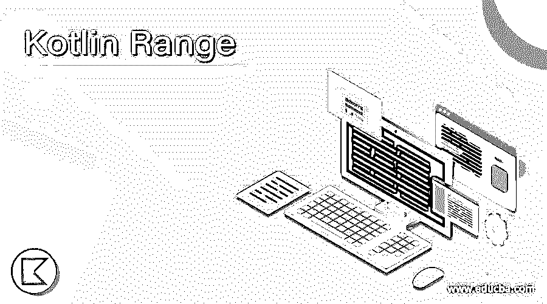

## 科特林系列简介

在 kotlin 中，范围被定义为从起始值到结束值的间隔。它主要用于打印特定范围的数字。在 kotlin 中，使用 range 可以很容易地打印出我们想要的特定范围内的数字，这减少了行数，使代码更加可靠。它考虑等于或大于起始值且小于或等于结束值的值。在本文中，我们将讨论这个范围函数及其用法。

**语法:**

<small>网页开发、编程语言、软件测试&其他</small>

在 kotlin 中，我们可以使用运算符(..)由 in 来补充，如

`for(variable in start value..end value)`

这里起始值定义了范围的第一个值，结束值定义了范围的最后一个数字。

### kotlin 中如何使用 range？

在这一节中，我们将讨论在 kotlin 中使用 range 的各种方法。

#### 例 1。这里我们写了一个程序，使用 range 打印从 1 到 10 的数字

**代码:**

`fun main(args: Array<String>)
{
println("Print number from 1 to 10")
for(x in 1..10)
{
println(x)
}
}`

**输出:**

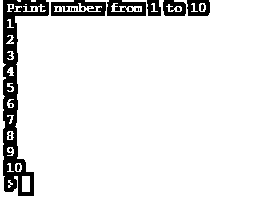

这里我们使用 x 变量来存储数字，因为我们想要打印从 1 到 10 的数字，我们将起始值定义为 1，将结束值定义为 10。

#### 例 2。这里我们写了一个程序，使用 range 打印从 a 到 k 的字母

**代码:**

`fun main(args: Array<String>)
{
println("Print alphabet from a to k")
for(x in 'a'..'k')
{
println(x)
}
}`

**输出:**

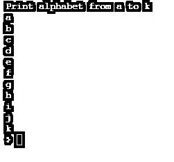

这里我们使用了 x 变量来存储字母表，因为我们想打印从 a 到 k 的字母表，我们定义了起始值为 a，结束值为 ask。

#### 实施例 3

在某些情况下，我们希望以相反的方式打印数字或字母。在下面的例子中，我们尝试使用与例 1 和例 2 中相同的方法以相反的方式打印数字和字母，但是相同的概念并不适用，因为起始值必须小于结束值。如果我们尝试这样做，它将运行程序，但不会打印任何东西。

**代码:**

`fun main(args: Array<String>)
{
println("Print numbers from 10 to 1")
for(x in 10..1)
{
println(x)
}
}`

**输出:**

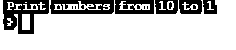

由于起始值大于结束值，输出将不会打印任何内容

**代码:**

`fun main(args: Array<String>)
{
println("Print alphabet from k to a")
for(x in 'k'..'a')
{
println(x)
}
}`

**输出:**

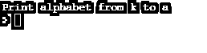

由于起始值大于结束值，输出将不会打印任何内容

**使用下降法**

正如我们在示例 3 中看到的，输出中没有任何内容。为了解决上述问题，使用 downTo()方法以相反的方式打印数字或字母。

#### 例 1。使用 downTo 方法打印从 10 到 1 的数字的程序

**代码:**

`fun main(args: Array<String>)
{
println("Print numbers from 10 to 1")
for(x in 10 downTo 1)
{
println(x)
}
}`

**输出:**

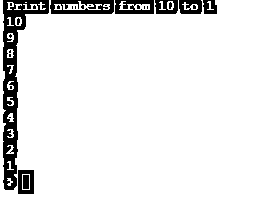

#### 例 2。使用 downTo 方法打印从 k 到 a 的字母的程序

**代码:**

`fun main(args: Array<String>)
{
println("Print alphabet from k to a")
for(x in 'k' downTo 'a')
{
println(x)
}
}`

**输出:**

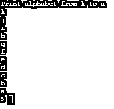

**使用 until 方法**

直到使用一种方法来打印除最后一个元素之外的特定范围内的值。它从开始值到结束值减 1 迭代范围。

#### 示例#1:使用 until 方法打印 1 到 9 的数字的程序

**代码:**

`fun main(args: Array<String>)
{
println("Print numbers from 1 to 9")
for(x in 1 until 10)
{
println(x)
}
}`

**输出:**

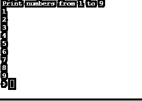

在这里，我们编写了一个程序，使用 until 方法打印从 1 到 9 的数字。因为我们想要打印从 1 到 9 的数字，并且直到该方法排除最后一个元素，所以我们将起始值定义为 1，将结束值定义为 10

**使用 rangeTo 方法**

rangeTo 方法用于按升序从起始值到结束值打印值。在这里，我们编写了一个程序来打印从 0 到 7 的数字，如下所示。

**代码:**

`fun main(args: Array<String>)
{
println("Print numbers from 0 to 7")
for(x in 0.rangeTo(7))
{
println(x)
}
}`

**输出:**

`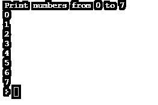

` 

**使用步进法。**

step 方法用于返回给定步长值区间内的范围值。

#### 示例#1

**代码:**

`fun main(args: Array<String>)
{
println("Print numbers using step 2")
for(x in 1..20 step 2)
{
println(x)
}
println("Print numbers using step 5")
for(x in 1..20 step 5)
{
println(x)
}
}`

**输出:**

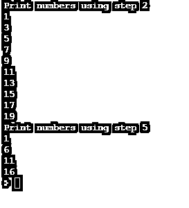

在这里，我们编写了一个程序，使用 1 到 20 范围的步骤 2 值和 1 到 20 范围的步骤 5 值打印数字。在输出中，您可以看到，在前半部分，数字使用 2 个间隔 s 打印，在后半部分，数字使用 5 个间隔打印。

#### 实施例 2

在这里，我们编写了一个程序，使用一个间隔以相反的方式打印数字。

**代码:**

`fun main(args: Array<String>)
{
println("Print numbers using step 2")
for(x in 20 downTo 1 step 2)
{
println(x)
}
println("Print numbers using step 5")
for(x in 20 downTo 1 step 5)
{
println(x)
}
}`

**输出:**

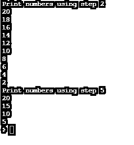

**使用反向方法**

reversed 方法用于按给定范围的相反顺序打印值。在这里，我们编写了一个程序，以逆序打印从 1 到 7 的数字。

**代码:**

`fun main(args: Array<String>)
{
var y = 1..7
println("Print numbers using reversed")
for(x in y.reversed())
{
println(x)
}
}`

**输出:**

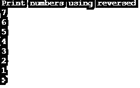

### 结论

这里我们已经用例子讨论了范围运算符。我们还通过示例讨论了向下、直到、步进和反向的各种范围方法。

### 推荐文章

这是科特林山脉的指南。这里我们讨论一下入门，如何在 kotlin 中使用 range？示例分别用代码实现。您也可以看看以下文章，了解更多信息–

1.  [科特林构造函数](https://www.educba.com/kotlin-constructors/)
2.  [科特林琴弦](https://www.educba.com/kotlin-string/)
3.  [安装 Kotlin](https://www.educba.com/install-kotlin/)
4.  [科特林函数](https://www.educba.com/kotlin-functions/)

