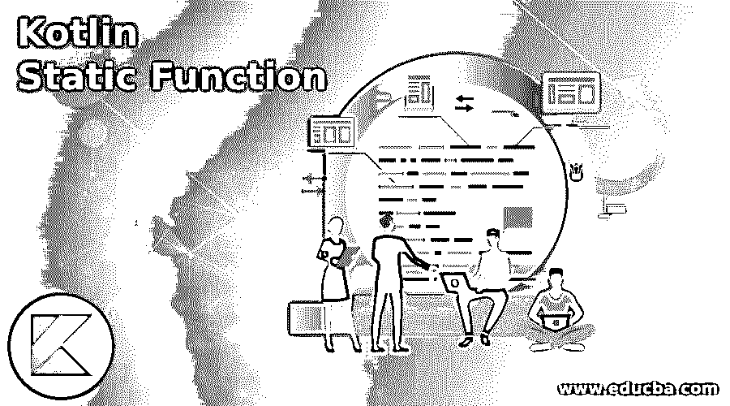
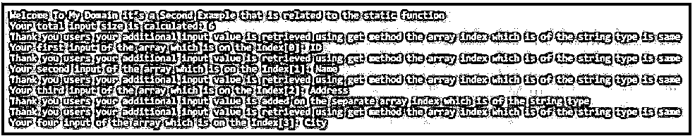
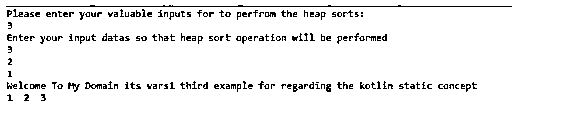

# 科特林静态函数

> 原文：<https://www.educba.com/kotlin-static-function/>

## Kotlin 静态函数简介

kotlin 静态函数是内置函数之一，它是用类中的一些静态成员设计的；它建议我们应该在它调用的方法上使用包和它们的级别，它用在函数的返回类型中，无论何时初始化它都不能改变，如果它是静态的，它也调用其他方法，否则它会显示异常，静态是用很多方法定义的，就像我们直接使用的那样，在伴随对象内部，创建实例并在对象内部调用它。

**语法:**

<small>网页开发、编程语言、软件测试&其他</small>

我们使用了 kotlin 库中使用的 n 个方法、变量和关键字。此外，java 概念是在 kotlin 库上实现的。像 static 一样，它也是实现 kotlin 应用程序关键字、变量和函数之一。

`package name;
class name{
companion object{
@JvmStatic
fun name(){
---some kotlin codes depends upon the requirement—
}
}
fun demo() // example method name
{
---some codes—
}
StaticFunctions.demo() // calling static function with method name
StaticFunctions.Companion.demo() // calling static function using companion along with method name`

以上代码是在 kotlin 代码上使用静态函数的不同方式。

### Kotlin 中静态函数是如何工作的？

*   我们可以通过使用伴随标识符来实现 kotlin 中的静态功能。静态关键字、变量和函数也将返回函数值，这取决于特定方法上声明的类型。我们也可以使用静态方法的功能，同时将方法放入对象块中，然后我们可以从类中调用方法。我们可以将声明并由静态方法使用的 kotlin 类转换为包级方法。
*   所有的 kotlin 代码都被创建并保存在。kt 格式，这样特定的方法和它们的属性就可以包含在其中，而不需要创建和使用这些类。@JvmStatic 是用于生成函数版本模型的注释，它更多地用于合适的 java 调用程序和具有默认方法的类中。这些注释用于在应用程序中将要实现的方法和类中添加函数的行为。
*   静态函数主要通过三种方式实现，比如我们声明类和方法；之后，我们可以通过使用 StaticFunctions.method name()调用具体的方法。另一种方法是使用伴随标识符或名称，并使用@JvmStatic 方法。此外，我们使用了静态函数。Companion.methodname()，用于在应用程序中实现静态方法的逻辑。

### Kotlin 静态函数示例

以下是 Kotlin 静态函数的示例:

#### 示例#1

**代码:**

`class first {
val vars = "Welcome to My Domain It’s a Nice Day Users This is the First Example regarding the static function used in the Kotlin language"
inner class second {
fun demo() = vars
}
}
class sub {
companion object {
@JvmStatic
fun vars() : Int = 1234
}
}
fun main(args: Array<String>) {
sub.vars()
val first = first()
println("This is the First Example and first input regarding the static function: ${first.second().demo()}")
println("Have a Nice Day Users Please try again")
val eg = first().second()
println("This variable which denoted and declares the inner side of the inputs on the static function ${eg.demo()}")
println("Thank you for spending and creating the Kotlin application regarding the static functionality")
}`

**输出:**

在上面的例子中，我们在实现继承概念的静态函数时使用了一些基础知识，继承概念可以与伴随对象相关联。

#### 实施例 2

**代码:**

`object StaticFunctions {
@JvmStatic
fun demo() {
println("Welcome To My Domain it’s a Second Example that is related to the static function")
}
class second(vararg example: String) {
private val vars = example.toMutableList()
val size get() = vars.size
fun addElement(vars3: String) {
vars += vars3
println("Thank you users your additional input value is added on the separate array index which is of the string type")
}
fun get(vars1: Int): String {
println("Thank you users your additional input value is retrieved using get method the array index which is of the string type is same")
return vars.get(vars1)
}
}
}
fun main() {
StaticFunctions.demo()
val vars2 = StaticFunctions.second("ID", "Name", "Address", "City", "PinCode", "Country")
println("Your total input size is calculated: ${vars2.size}")
println("Your first input of the array which is on the Index[0]: ${vars2.get(0)}")
println("Your second input of the array which is on the Index[1]: ${vars2.get(1)}")
println("Your third input of the array which is on the Index[2]: ${vars2.get(2)}")
vars2.addElement("Area")
println("Your four input of the array which is on the Index[3]: ${vars2.get(3)}")
}`

**输出:**

在第二个示例中，我们使用的数组索引概念来编写具有静态函数概念的应用程序。这里我们使用了 object StaticFunctions 和@JvmStatic 注释来添加数组列表中的元素。

#### 实施例 3

**代码:**

`package one;
class Third {
companion object {
const val Example = "Welcomeusers"
}
fun demo() = Example;
var vars2 = 0;
fun demo4(i: Int): Int {
return 3 * i
}
fun demo5(i: Int): Int {
return 3 * i + 1
}
fun demo2(vars1: Array<Int>, i: Int, j: Int) {
var temp = vars1[i] vars1[i] = vars1[j] vars1[j] = temp
}
fun demo3(vars1: Array<Int>, i: Int) {
var eg = demo4(i);
var eg1 = demo5(i);
var eg2: Int;
if ((eg <= vars2 - 1) && (vars1[eg] > vars1[i])) {
eg2 = eg;
} else
eg2 = i
if ((eg1 <= vars2 - 1) && (vars1[eg1] > vars1[eg])) {
eg2 = eg1
}
if (eg2 != i) {
demo2(vars1, i, eg2);
demo3(vars1, eg2);
}
}
fun demo1(vars1: Array<Int>) {
vars2 = vars1.size
for (i in vars2 / 2 downTo 0) {
demo3(vars1, i)
}
}
fun demo(vars1: Array<Int>) {
demo1(vars1)
for (i in vars1.size - 1 downTo 1) {
demo2(vars1, i, 0)
vars2 = vars2 - 1
demo3(vars1, 0)
}
}
}
fun main(arg: Array<String>) {
println("Please enter your valuable inputs for to perfrom the heap sorts:")
var vars = readLine()!!.toInt()
println("Enter your input datas so that heap sort operation will be performed ")
var vars1 = Array(vars, { 0 })
for (i in 0 until vars)
vars1[i] = readLine()!!.toInt()
var c = Third();
c.demo(vars1)
println("Welcome To My Domain its vars1 third example for regarding the kotlin static concept")
for (i in 0 until vars)
print("${vars1[i]} ")
}`

**输出:**

在最后一个例子中，我们使用静态函数编写堆排序代码。这里，我们使用了的一个伴随对象来实现静态函数，以创建堆排序逻辑。

### 结论

在 kotlin 语言中，static 是实现 kotlin 应用程序的主要和默认关键字变量和函数之一。这里静态值不能改变，而且，这个概念和 java 语言是一样的。伴随对象是在 kotlin 语言上实现静态功能的方法。

### 推荐文章

这是 Kotlin 静态函数的指南。这里我们讨论一下入门，Kotlin 中静态函数是如何工作的？和示例。您也可以看看以下文章，了解更多信息–

1.  [科特林范围](https://www.educba.com/kotlin-range/)
2.  [科特林循环](https://www.educba.com/kotlin-loops/)
3.  [科特林构造函数](https://www.educba.com/kotlin-constructors/)
4.  [马尔可夫逻辑网络](https://www.educba.com/markov-logic-network/)

