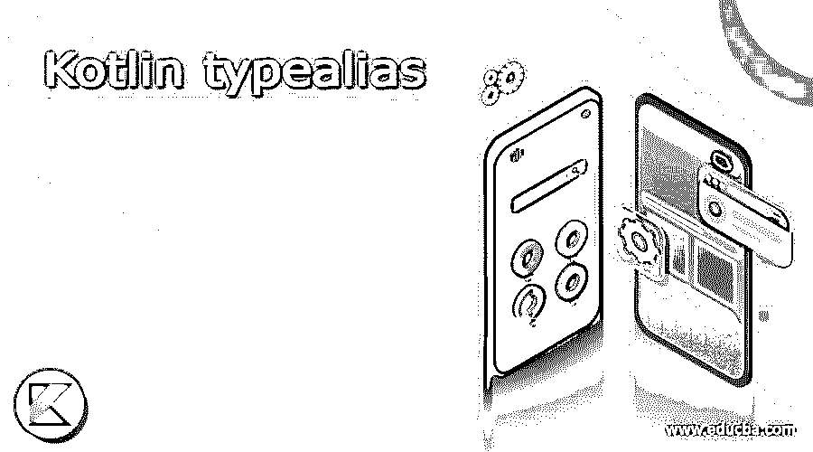
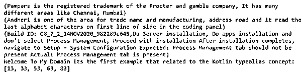
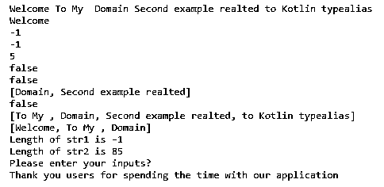
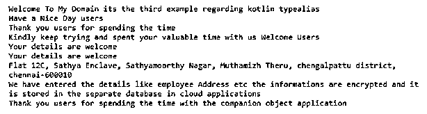

# 科特林类型别名

> 原文：<https://www.educba.com/kotlin-typealias/>




## Kotlin typealias 简介

在 kotlin 中，typealias 是更改现有名称的功能和概念之一，它提供了新名称，因此它来自于现有类型的替代方式，以反映这些更改。此外，读取代码，它主要支持字符串类型的数据，数据可能太长，我们可以声明一个新的较短的名称，而不是现有的。它不支持新类型，也没有引入新类型，编译器会将数据从一种类型转换为另一种类型的 typealias 谓词<t>。</t>

**语法:**

<small>网页开发、编程语言、软件测试&其他</small>

kotlin 语言支持许多不同的特性，如类、方法和关键字来实现应用程序。与 typealias 类似，这是一个概念和功能，用于根据 kotlin 代码创建新名称，而不是现有名称。

```
typealias name = Pair<datatype1, dataype2> //Pair is one of the data class type and it is used to store the two values as the paarmeter
typealias name1<T>=(T) -> datatype3
fun main()
{
--some logic codes depends on the requirement---
}
```

上面的代码是在 kotlin 代码中使用 typealias 的基本语法。我们可以在任何地方使用编程语法，比如类、方法和其他定义的变量。

### typealias 在 Kotlin 中是如何工作的？

typealias 是用于更改现有名称的概念和关键字，它将被替换为将被视为数据类型的任何类型的新名称。当我们使用 typeAlias 声明或编写代码时，应该从 kotlin 代码的顶层开始声明，而不是像在类或函数内部一样。如果我们想在函数和类内部声明它，它总是会抛出一个错误。当在代码上使用这种类型别名时，开发人员将很容易理解代码，并且工作流应该是一致的并执行它。我们可以用许多区域来定义 typealias，比如集合和其他包。我们还用任何类型的 kotlin 文件定义了 typealias，但是它必须在类之外。我们不能在任何类的内部将 typealias 定义为嵌套类型，并且这些区域也不支持本地类型别名。kotlin 的内部类使用类型别名，别名可以是长名称或短名称，但应该是有意义的名称。如果我们也可以对两个类使用 typealias，比如父子类，或者这两个类应该有相同的名称，但必须是不同的包。此时，第二个类通过完全限定的类名引用 tyepAlias。

#### 示例#1

```
typealias tg1 = Pair <String, String>
typealias Number<T> = (T) -> Boolean
fun main() {
val inp = tg1("Pampers is the registered trademark of the Procter and gamble company", "It has many different areas like Chennai, Mumbai")
val inp2 = tg1("Andheri is one of the area for trade name and manufacturing", "address road and it read the last alphabet characters on first line of side in the coding panel")
val inp3=tg1("Build ID: C8_7_2_14NOV2020_982289c645,Do Server installation, Do apps installation and don't select Process Management", "Proceed with installation After installation completes, navigate to Setup - System Configuration Expected: Process Management tab should not be present Actual: Process Management tab is present")
println(inp)
println(inp2)
println(inp3)
val y: Number<Int> = { it > 0 }
println("Welcome To My Domain its the first example that related to the Kotlin typealias concept: "
+listOf(13, -23, 33, -43, 53 , 63, -73,83,-93).filter(y))
}
```

**输出:**




在上面的例子中，我们使用了 typealias 基本示例，它将用于字符串和整数数据类型。

#### 实施例 2

```
typealias tg2 = Pair <String, String>
fun main(args: Array<String>){
var lst: List<String> = listOf<String>("Welcome", "To My ","Domain", "Second example realted","to Kotlin typealias")
var lst1: List<String> = listOf<String>("Have", "a nice", "day users")
for(itrt in lst){
print(itrt+" ")
}
println()
println(lst.get(0))
println(lst.indexOf("Vijay"))
println(lst.lastIndexOf("Vijay"))
println(lst.size)
println(lst.contains("Prakash"))
println(lst.containsAll(lst1))
println(lst.subList(2,4))
println(lst.isEmpty())
println(lst.drop(1))
println(lst.dropLast(2))
val sec=tg2("Key is the Months first three letters", "Values are extracting the months")
var str1: String? = null
var str2: String? = "Welcome To My DOmain is the first example that relates to the Kotlin Switch statement"
var strlen1: Int = if (str1 != null) str1.length else -1
var strlen2: Int = if (str2 != null) str2.length else -1
println("Length of str1 is ${strlen1}")
println("Length of str2 is ${strlen2}")
val vars = readLine()
val vars1 = when (vars) {
"jan" -> "January"
"feb" -> "February"
"mar" -> "March"
"apr" -> "April"
"may" -> "May"
"jun" -> "June"
"jul" -> "July"
"aug" -> "August"
"sep" -> "September"
"oct" -> "October"
"nov" -> "November"
"dec" -> "December"
else -> "Please enter your inputs?"
}
println("$vars1")
println("Thank you users for spending the time with our application")
}
```

**输出:**




在第二个示例中，我们通过使用的 typealias 功能来实现应用程序，从而额外使用了集合概念。

#### 实施例 3

```
typealias tg3 = Pair <String, String>
fun eg(exam: (id: String)->Unit, id: String){
println("Welcome To My Domain its the third example regarding kotlin typealias")
println("Have a Nice Day users")
exam(id)
}
inline fun eg1(exam: (id: String)->Unit, id: String){
}
class Test {
var addr:String="Flat 12C, Arvind Enclave, Sathyamoorthy street, Srinivasa nagar, chengalpattu district, chennai-600009"
fun stddets(){
println("We have entered the details like Address etc. the information’s are encrypted and it is stored in the separate database in cloud applications")
}
companion object eg{
var empAddress:String="Flat 12C, Sathya Enclave, Sathyamoorthy Nagar, Muthamizh Theru, chengalpattu district, chennai-600010"
fun details(){
println("Your details are welcome")
}
fun empdetails(){
println("${this.empAddress}")
println("We have entered the details like employee Address etc the informations are encrypted and it is stored in the separate database in cloud applications")
}
}
}
fun main() {
val sec=tg3("Planet","Earth")
eg({ id: String ->
println("Thank you users for spending the time")
println("Kindly keep trying and spent your valuable time with us $id")
}, "Welcome Users")
Test.details()
Test.eg.details()
Test.eg.empdetails()
println("Thank you users for spending the time with the companion object application")
}
```

**输出:**




最后一个例子我们使用了带有 typealias 概念的类和伴随对象。

### 结论

在 kotlin 中，typealias 是用于更改现有名称和创建新名称的功能。只要代码需要，就会调用它。主要是它将声明类的外部区域、函数等。它应该首先在 kotlin 文件中声明。

### 推荐文章

这是 Kotlin typealias 的指南。在这里，我们讨论 Kotlin 中的简介、语法、typealias 如何工作？，代码实现示例。您也可以看看以下文章，了解更多信息–

1.  [科特林内嵌函数](https://www.educba.com/kotlin-inline-function/)
2.  [釜用 JSON](https://www.educba.com/kotlin-json/)
3.  [科特林收藏馆](https://www.educba.com/kotlin-collections/)
4.  [科特林元组](https://www.educba.com/kotlin-tuple/)


