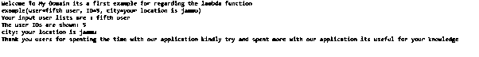
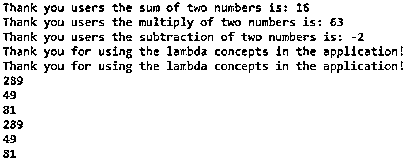

# Kotlin lambda

> 原文：<https://www.educba.com/kotlin-lambda/>


## 科特林拉姆达简介

kotlin lambda 定义为函数，它是表达式之一；它也被称为匿名函数。它可能被视为函数文字，这意味着它没有被声明，而是立即作为表达式传递。自定义操作也用于在后端逻辑上验证用户数据。lambda 表达式作为参数传递，它作为一个单独的变量存储，它返回值参数在箭头的左边传递，实际代码在箭头的右边传递。

**语法:**

<small>网页开发、编程语言、软件测试&其他</small>

kotlin 语言使用许多变量、关键字、操作符和方法来创建应用程序。就像 lambda 函数是匿名函数之一一样，它可以表示为->箭头符号。

```
fun main(args:Array<String>)
{
val eg -> body of function
method()
}
function method(eg: (data type casting if needed)-> variable name)
{
----some logic codes depends upon the requirement---
}
```

上面的代码是使用 lambda 函数的基本语法，比如 kotlin 函数上使用的 arrow ->运算符。它被用作代码冗余，具有更高的性能。

### Kotlin 中的 lambda 函数是如何工作的？

lambda 函数是匿名函数，所以它没有在 kotlin 语言中调用和利用该函数的名称。lambda 表达式是作为一个单独的变量生成和赋值的，而且该表达式没有参数，也不返回函数中的任何值。它还支持函数式编程概念，以便在传递给其他函数时，它们可以作为参数。同时，它可以从其他函数返回该函数，该函数称为高阶函数。

如果我们使用可以作为匿名函数传递并且没有任何特定参数的空括号，那么 lambda 表达式最有可能被称为高阶函数。此外，当我们处理集合时，经常使用 lambda，因为它有 n 个标准库格式的内置方法，所以 lambda 使我们的任务变得更容易。同时，lambdas 接受多个参数，因此基于 kotlin 语言上使用的默认方法，它使用其他库函数完成任务，并基于方法及其返回类型返回值。

### 科特林拉姆达的例子

下面给出了不同的例子:

#### 示例#1

```
package one;
import java.util.Arrays
data class example(val user: String, val ID: Int, val city: String)
fun main(<u>args</u>: Array<String>) {
println("Welcome To My Domain its a first example for regarding the lambda function")
val demo = listOf(
example("first user", 1,  "your location is chennai"),
example("second user", 2, "your location is tiruppur"),
example("third user", 3, "your location is mumbai"),
example("fourth user", 4, "your location is andhra"),
example("fifth user", 5, "your location is jammu"),
example("sixth user", 6, "your location is kahmir"),
example("seventh user", 7, "your location is madurai"),
example("eigth user",8, "your location is karnataka"),
example("ninth user", 9, "your location is delhi"),
example("tenth user", 10, "your location is west bengal"),
)
val demo1 = demo
.filter { it.user.startsWith("f") }
.<u>maxBy</u>{ it.ID }
println(demo1)
println("Your input user lists are : ${demo1?.user}" )
println("The user IDs are shown: ${demo1?.ID}" )
println("city: ${demo1?.city}" )
println("Thank you users for spenting the time with our application kindly try and spent more with our application its useful for your knowledge")
}
```

**输出:**




上面的例子使用了 lambda 表达式，其中包含一些基本的属性列，比如用户名、ID 和城市详细信息，以便进行存储和检索。我们还可以添加两个额外的方法，比如用于过滤掉特定数据的 filter 和用于获取用户 id 最大值的 maxBy()方法。

#### 实施例 2

```
package one;
import java.util.Arrays;
val eg = fun(a: Int, b: Int): Int = a + b
val eg1 = fun(a: Int, b: Int): Int {
val resultmul = a * b
return resultmul
}
val eg2 = fun(a: Int, b: Int): Int = a - b
fun main(args: Array<String>){
val demo: (Int) -> Unit= {s: Int -> println(s) }
val sum = eg(7,9)
val resultmul = eg1(7,9)
val minus = eg2(7,9)
println("Thank you users the sum of two numbers is: $sum")
println("Thank you users the multiply of two numbers is: $resultmul")
println("Thank you users the subtraction of two numbers is: $minus")
val new = { println("Thank you for using the lambda concepts in the application!")}
new()
new.invoke()
val new1 = arrayOf(17,7,9)
new1.forEach { unknown -> println(unknown * unknown) }
new1.forEach { println(it*it) }
}
fun demo1(a: Int, b: Int, demo: (Int) -> Unit ){
val add = a + b
demo(add)
}
fun demo2(a: Int, b: Int, demo: (Int) -> Unit ){
val sub = a - b
demo(sub)
}
```

**输出:**




在第二个例子中，我们可以使用 lambda 表达式执行算术运算。同样，我们使用 invoke()方法来调用和扩展任何类型的类。

#### 实施例 3

```
package one;
import java.util.Arrays;
import java.util.ArrayList;
fun main(<u>args</u>: Array<String>){
val Employees = ArrayList<String>()
Employees.add("Employee ID")
Employees.add("Employee Name")
Employees.add("Employee Designation")
Employees.add("Employee Department")
Employees.add("Employee Address")
Employees.add("Employee Mobile")
Employees.add("Employee Email")
Employees.forEach{ ex ->
println(ex + ", ")
}
val EmployeeDetails = arrayListOf("1","Siva", "Software Engineer", "IT-Software", "Flat1c, Sathyamoorthy street, srinivasa nagar, tambaram, chennai","8220244056","ramansiva57@gmail.com")
val EmployeeDetails1 = arrayListOf("2","Raman", "Software Support Engineer", "IT-Software", "flat43, aravind street, sathyamoorthy nagar, tambaram, chennai","7253287367","raman43@gmail.com")
println("Your Company Employee details are: " +EmployeeDetails +EmployeeDetails1)
}
```

**输出:**


在最后一个例子中，我们使用 lambda 表达式通过数组列表集合来获取雇员的详细信息。我们可以添加 n 条记录来存储和检索数据。

### 结论

我们可以看到 lambdas 用 n 个东西指定了代码，它实现了用其他语言不可能实现的东西。主要是在 Android 类型的应用程序中，这一概念将有助于减少代码行，并且与其他选项相比，调试起来更容易，占用的内存更少。

### 推荐文章

这是一个科特林拉姆达指南。在这里，我们讨论了 lambda 函数在 Kotlin 中是如何工作的，并给出了示例和输出。您也可以看看以下文章，了解更多信息–

1.  [科特林范围](https://www.educba.com/kotlin-range/)
2.  [科特林构造函数](https://www.educba.com/kotlin-constructors/)
3.  [科特林琴弦](https://www.educba.com/kotlin-string/)
4.  [科特林算子](https://www.educba.com/kotlin-operators/)


