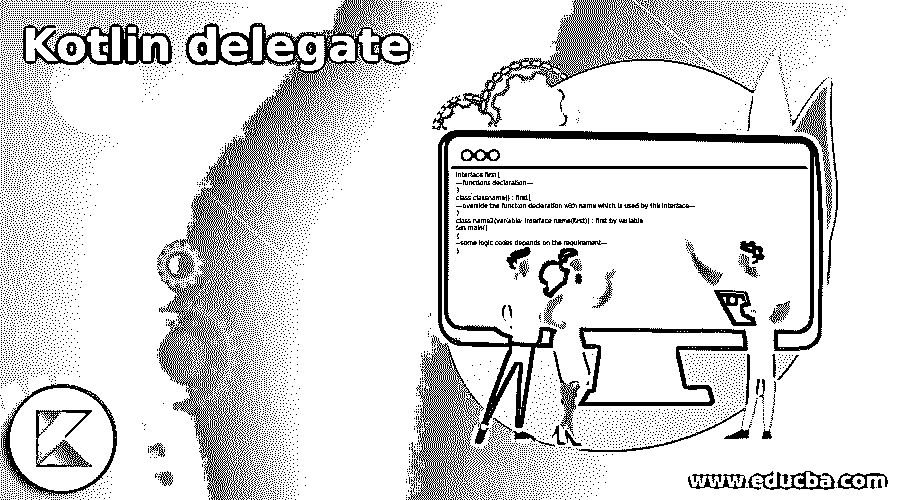
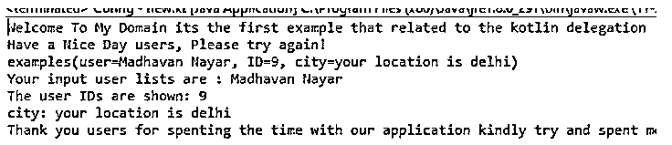
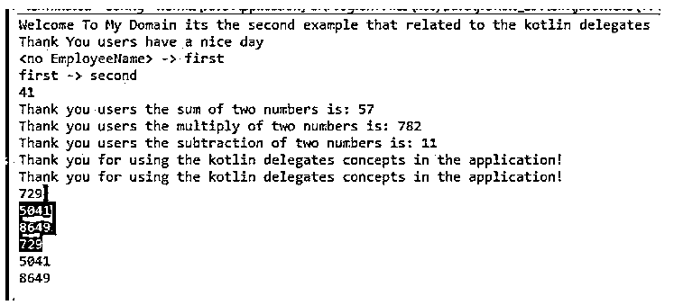

# 科特林代表

> 原文：<https://www.educba.com/kotlin-delegate/>




## Kotlin 代表简介

kotlin delegate 是一种设计模式，可用于实现应用程序概念，如借助关键字“by”或委托方法实现继承。它用于派生类以实现公共访问。它与其他概念一起实现，如允许调用特定对象的接口。委托使用其他关键字，如 public，default。惰性值仅在父类中计算。还创建匿名对象，而不使用接口、属性和其他默认标准库创建类。其他委托类型，如 explicit，它支持 oops 和其他委托对象。

### Kotlin 委托的语法

在 kotlin 语言中，我们使用了许多默认的关键字、变量和其他内置函数。就像委托是帮助实现应用程序的概念和设计模式之一。借助“By”关键字，我们可以实现 kotlin 语言中的委托。

<small>网页开发、编程语言、软件测试&其他</small>

```
interface first{
---functions declaration—
}
class classname() : first{
---override the function declaration with name which is used by the interface—
}
class name2(variable: interface name(first)) : first by variable
fun main()
{
--some logic codes depends on the requirement—
}
```

上面的代码是在应用程序中使用 kotlin 委托的基本语法。

### Kotlin 中的代表是如何工作的？

*   像 java 和其他语言一样，kotlin 语言有许多设计模式。每个设计模式都实现了自己的逻辑，降低了代码的复杂性，其他新用户可以轻松地跟踪代码。像这样的委托是设计模式之一，它用于替换或代表其他值，对象请求由一个变量接收，而不是该变量将使用另一个具有相同逻辑和输出结果的变量。
*   因此它是为类和其他属性提供支持的最简单的方法之一，这些属性可以委托给预建的类和方法。通常，kotlin 委托是通过使用“by”关键字实现的，该关键字通过其他方法从其他接口委托 kotlin 功能。每个方法都有单独的行为和属性。
*   在委托中，它特别用于从特定的类继承，该类可能是层次结构类，它将与接口共享，并修饰原始类型的内部和外部对象。这可以通过使用公共 API 来实现，这些 API 使用属性进行委托，这些属性通过使用对象来设置和获取调用处理。

### 科特林代表的例子

以下是 Kotlin 代表的示例。

#### 示例#1

**代码:**

```
interface first
{
fun demo()
fun demo1()
}
class example(val y: String) : first
{
override fun demo()
{
print(y)
}
override fun demo1()
{
println(y)
}
}
class example1(f: first) : first by f
{
override fun demo()
{
print("Welcome To My Domain its the first example that related to the kotlin delegation")
}
}
data class examples(val user: String, val ID: Int, val city: String)
fun main()
{
val b = example("\nHave a Nice Day users, Please try again!")
example1(b).demo()
example1(b).demo1()
val inp1 = listOf(
examples("Siva", 1, "your location is chennai"),
examples("Raman", 2, "your location is tiruppur"),
examples("Siva Raman", 3, "your location is mumbai"),
examples("Arun", 4, "your location is andhra"),
examples("Kumar", 5, "your location is jammu"),
examples("Arun Kumar", 6, "your location is kahmir"),
examples("Madhavan", 7, "your location is madurai"),
examples("Nayar",8, "your location is karnataka"),
examples("Madhavan Nayar", 9, "your location is delhi"),
examples("Rajan", 10, "your location is west bengal"),
)
val inp2 = inp1
.filter { it.user.startsWith("M") }
.maxByOrNull{ it.ID }
println(inp2)
println("Your input user lists are : ${inp2?.user}" )
println("The user IDs are shown: ${inp2?.ID}" )
println("city: ${inp2?.city}" )
println("Thank you users for spenting the time with our application kindly try and spent more with our application its useful for your knowledge, $inp1")
}
```

**输出:**




在第一个例子中，我们使用带有集合列表的委托设计模式来执行数组操作中的数据。

#### 实施例 2

**代码:**

```
import kotlin.properties.Delegates
class Employee {
var EmployeeName: String by Delegates.observable("<no EmployeeName>") {
prop, oldName, NewName ->
println("$oldName -> $NewName")
}
}
class EmployeeDetails {
var Id: Int = 0
var oldID: Int by this::Id
}
val eg = fun(a: Int, b: Int): Int = a + b
val eg1 = fun(a: Int, b: Int): Int {
val multipl = a * b
return multipl
}
val eg2 = fun(a: Int, b: Int): Int = a - b
fun demo1(a: Int, b: Int, demo: (Int) -> Unit ){
val addition = a + b
demo(addition)
}
fun demo2(a: Int, b: Int, demo: (Int) -> Unit ){
val subtraction = a - b
demo(subtraction)
}
fun main() {
println("Welcome To My Domain its the second example that related to the kotlin delegates")
println("Thank You users have a nice day")
val Employee = Employee()
Employee.EmployeeName = "first"
Employee.EmployeeName = "second"
val EmployeeDetails = EmployeeDetails()
EmployeeDetails.oldID = 41
println(EmployeeDetails.Id)
val demo1: (Int) -> Unit= {s: Int -> println(s) }
val sum = eg(23,34)
val multipl = eg1(34,23)
val minus = eg2(34,23)
println("Thank you users the sum of two numbers is: $sum")
println("Thank you users the multiply of two numbers is: $multipl")
println("Thank you users the subtraction of two numbers is: $minus")
val new = { println("Thank you for using the kotlin delegates concepts in the application!")}
new()
new.invoke()
val new1 = arrayOf(27,71,93)
new1.forEach { anoresult -> println(anoresult * anoresult) }
new1.forEach { println(it*it) }
}
```

**输出:**




在第二个例子中，我们使用了 delegates 模式，此外，我们还调用了一些带有算术运算的 lambda 表达式。

#### 实施例 3

**代码:**

```
class Third {
var var1: Int = 13
var var2: Int by this::var1
}
fun main() {
val Third = Third()
Third.var2 = 42
println("Welcome To My Domain its the third example taht related to the kotlin delegates")
println(Third.var1)
}
```

**输出:**


在最后一个例子中，我们在 by 关键字的帮助下使用了 delegates 模式。

### 结论

总之，kotlin 在委托模式中使用了很多概念，比如接口，类，匿名类，没有类我们也可以创建匿名对象。kotlin 接口委托必须知道何时使用，以及如何通过代码在应用程序逻辑上配置它，而不影响现有区域。

### 推荐文章

这是一个科特林代表指南。这里我们讨论一下介绍，delegate 在 kotlin 中是如何工作的？和示例。您也可以看看以下文章，了解更多信息–

1.  [科特林内嵌函数](https://www.educba.com/kotlin-inline-function/)
2.  [科特林收藏馆](https://www.educba.com/kotlin-collections/)
3.  [科特林元组](https://www.educba.com/kotlin-tuple/)
4.  [科特林循环](https://www.educba.com/kotlin-loops/)


