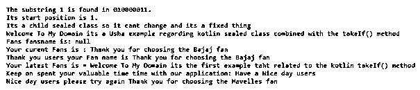
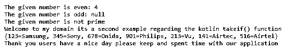
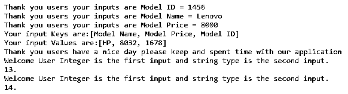

# 锅碗瓢盆

> 原文：<https://www.educba.com/kotlin-takeif/>


## Kotlin takeIf 简介

Kotlin takeif 是默认函数之一，可用于过滤单个对象的数据。如果不满足指定的条件，它将返回 null，这样就可以将其命名为安全调用或 null check，就像“T”或其他直接调用 takeif 的预定义对象一样。所以指定的 object 作为参数 arguments takeif()调用任何一个非空的 object，该 object 以某个谓词作为参数。如果满足谓词条件，则返回主语，否则返回空值。

**语法:**

<small>网页开发、编程语言、软件测试&其他</small>

在 kotlin 语言中，有许多默认的类、方法和关键字用于实现基于移动设备的应用程序。就像 takeif()是默认方法之一，它主要用于过滤数据。下面是它自己的语法。

```
fun functionName(parameters)
{
val varaiableName:datatype? = kotlinNullable.takeIf(predicate)
-----some logic codes---
}
```

以上代码是在 kotlin 代码中使用 teakeIf()方法的基本语法。可以根据谓词条件调用参数值及其方法。如果满足条件，则继续执行，否则返回空值。

### 在科特林工作怎么样？

在 kotlin 语言中，它有许多缺省值，标准库包含像 takeIf 这样的函数，这些函数可以组合使用，值嵌入在对象状态及其状态的检查中。对象状态非频繁调用使用提供的谓词条件链接被调用的对象，如果它与指定的条件匹配，则返回该对象。否则它将返回空值，以便 takeIf()方法作为每个对象的过滤函数。如果返回对象，并且如果它不匹配谓词条件，则返回空值，如果它不匹配，则对象也将被调用并作为 lambda 参数(it)可用。而链接其他函数(如 after takeIf)和其他默认函数(如 takeUnless)也要使用空检查条件和安全调用(如？.'运算符，因为返回值为空。takeIf()函数专门与 scope 函数一起使用，以便与它们一起检查链接，从而在与给定谓词条件匹配的指定对象上运行代码块。我们可以这样做并调用 takeIf()方法，它返回 null，并且不调用其他局部变量类型，如“var”和“let”。

#### 示例#1

```
abstract class Fans(fans:String){
abstract var fansname: String
abstract fun fandetails()
init {
println("Fans fansname is: $fansname")
}
fun demo(){
println("Thank you the Fans fansname is")
}
}
interface Crompton{
var vars: String
fun demo1():String
fun details2() {
println("Have a Nice day users")
}
}
class Havelles : Crompton {
override var vars: String = "Welcome To My Domain its the first example taht related to the kotlin takeIf() method"
override fun demo1() = "Thank you for choosing the Havelles fan"
}
class Bajaj(fans:String): Fans(fans) {
override var fansname: String = "Thank you for choosing the Bajaj fan"
override fun fandetails() {
println("Thank you users your Fan name is $fansname")
}
}
sealed class Usha {
class demo : Usha() {
fun show()
{
println("Welcome To My Domain its a Usha example regarding kotlin sealed class combined with the takeIf() method")
}
}
class demo1 : Usha() {
fun show()
{
println("Its a child sealed class so it cant change and its a fixed thing")
}
}
}
fun main() {
fun firstExample(strinp1: String, strinp2: String) {
strinp1.indexOf(strinp2).takeIf { it >= 0 }?.let {
println("The substring $strinp2 is found in $strinp1.")
println("Its start position is $it.")
}
}
firstExample("010000011", "1")
firstExample("110000011", "2")
firstExample("011000011", "3")
firstExample("110000011", "4")
val eg = Usha.demo1()
eg.show()
val eg1 = Usha.demo()
eg1.show()
val m2 = Bajaj("June Month")
println("Your curent Fans is : ${m2.fansname}")
m2.fandetails()
val j = Havelles()
println("Your latest Fans is = ${j.vars}")
print("Keep on spent your valuable time time with our application: ")
j.details2()
print("Nice day users please try again ")
println(j.demo1())
}
```

**输出:**




上面的例子是我们在 kotlin 类中使用 takeif()方法的基本例子。

#### 实施例 2

```
import kotlin.random.*
enum class TV(val exam: Boolean = true){
Samsung,
Sony,
Onida,
Philips,
Vu,
Airtec,
Airtel;
companion object{
fun TVDetails(obj: TV): Boolean {
return obj.name.compareTo("Sony") == 0 || obj.name.compareTo("Vu") == 0
}
}
}
fun details(tv: TV) {
when(tv) {
TV.Samsung -> println("Samsung")
TV.Sony->println("Sony")
TV.Onida ->println("Onida")
TV.Philips ->println("Philips")
TV.Vu -> println("Vu")
TV.Airtec -> println("Airtec")
TV.Airtel ->println("Airtel")
}
}
fun main() {
val num = Random.nextInt(5)
val evn = num.takeIf { it % 2 == 0 }
val odd = num.takeUnless { it % 2 == 0 }
println("The given number is even: $evn")
println("The given number is odd: $odd")
val i=2
var flag=false
while(i<=num/2){
val prm=num.takeIf{it % i == 0}
flag=true
break
++i
}
if(!flag)
{
println("The given number is prime number")
}
else
{
println("The given number is not prime")
}
println("Welcome to my domain its a second example regarding the kotlin takeif() function")
val out = mapOf(123 to "Samsung", 345 to "Sony", 678 to "Onida",901 to "Philips",213 to "Vu",141 to "Airtec",516 to "Airtel")
println(out)
println("Thank you users have a nice day please keep and spent time with our application")
}
```

**输出:**




在这里，我们使用 enum，伴随类和 takeif()方法让用户计算质数和奇数，7 个数。

#### 实施例 3

```
fun main() {
fun ThirdExample(num1: Int, str2: String) {
num1.takeIf{it >= 0 }?.let {
println("Welcome User Integer is the first input and string type is the second input.")
println("$it.")
}
}
val colmap = HashMap<String, String>()
colmap["Model Name"] = "Lenovo"
colmap["Model Price"] = "8000"
colmap["Model ID"] = "1456"
for ((k, v) in colmap) {
println("Thank you users your inputs are $k = $v")
}
val news = mapOf("Model Name" to "HP", "Model Price" to 8032, "Model ID" to 1678)
println("Your input Keys are:" + news.keys)
println("Your input Values are:" + news.values)
println("Thank you users have a nice day please keep and spent time with our application")
ThirdExample(13, "Siva")
ThirdExample(14, "Raman")
}
```

**输出:**




在最后一个例子中，我们使用了集合类和 takeif()类。

### 结论

在 kotlin 语言中，有许多默认的方法来实现用户所需的应用程序逻辑及其操作。takeif()方法是用于验证条件的内置方法之一，如 if 执行链式链接条件，如果条件为真，则返回对象，否则返回空值。

### 推荐文章

这是一份科特林·塔卡夫指南。在这里我们讨论介绍，语法，takeIf 如何在 Kotlin 中工作？，代码实现示例。您也可以看看以下文章，了解更多信息–

1.  [科特林 kclass](https://www.educba.com/kotlin-kclass/)
2.  [科特林内嵌函数](https://www.educba.com/kotlin-inline-function/)
3.  [科特林收藏馆](https://www.educba.com/kotlin-collections/)
4.  [釜用 JSON](https://www.educba.com/kotlin-json/)


